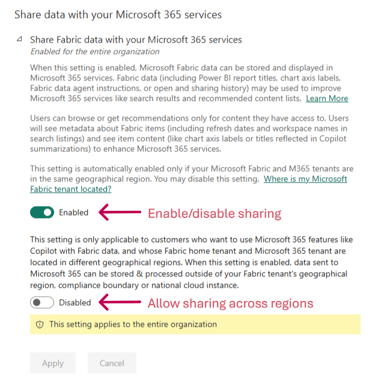

# Share data with your Microsoft 365 services

This article is aimed at Fabric administrators and decision makers who need to know how and where Fabric metadata is being used.

Fabric metadata sharing with Microsoft 365 services is a feature that allows metadata from Fabric to be shared with Microsoft 365 services (typically via [Microsoft Graph](/graph/overview)) and combined with data from across Microsoft 365, Windows, and Enterprise Mobility + Security (EMS) to build apps for organizations and consumers that interact with millions of users. The feature is enabled by default when your Fabric home tenant and Microsoft 365 tenant are in the same geographical region.

When shared with Microsoft 365 services, Fabric content will be listed in the Quick Access list on the Office.com home page. The Fabric content affected includes reports, dashboards, apps, workbooks, paginated reports, and workspaces. The information required by the Quick Access functionality includes:

* The display name of the content
* When the content was last accessed
* The type of content that was accessed (report, app, dashboard, scorecard, etc.)

See [more about the Fabric data that is shared with Microsoft 365 services](#data-that-is-shared-with-microsoft-365).

## Data residency

Fabric and Microsoft 365 are distinct and separately operated Microsoft cloud services, each deployed according to its own service-specific data center alignment rules, even when purchased together. As a result, it's possible that your Microsoft 365 Services and your Fabric service are not deployed in the same geographic region.

By default, Fabric metadata is available only in the region where the Fabric tenant is located. However, you can allow Fabric to share metadata across regions by turning on a toggle switch in the **Users can see Microsoft Fabric metadata in Microsoft 365** tenant setting. For more information, see [How to turn sharing with Microsoft 365 services on and off](#how-to-turn-sharing-with-microsoft-365-services-on-and-off).

### Where is Fabric data stored?

For more information about data storage locations, see [Find the default region for your organization](/power-bi/admin/service-admin-where-is-my-tenant-located) and [Product Availability by Geography](https://powerplatform.microsoft.com/availability-reports/).

### Where is Microsoft 365 data stored?

For more information about data storage for Microsoft 365, see [Where your Microsoft 365 customer data is stored](/microsoft-365/enterprise/o365-data-locations) and [Multi-Geo Capabilities in Microsoft 365](https://www.microsoft.com/microsoft-365/business/multi-geo-capabilities).

## How to turn sharing with Microsoft 365 services on and off

Sharing metadata with Microsoft 365 services is controlled by the **Share Fabric data with your Microsoft 365 services** tenant setting. The setting is **Enabled** by default. To turn off the feature, or to turn it on again after it's been turned off, go to **Admin portal** > **Tenant settings** > **Share Fabric data with your Microsoft 365 services** and set the toggle as appropriate. Once the setting is enabled or disabled, it may take up to 24 hours for you to see changes.

By default, Fabric data is available only in the region where the Fabric tenant is located. To allow Fabric to share metadata across regions, set the second toggle switch to **Enabled**. When you enable the second toggle, you acknowledge that Fabric data may flow outside the geographic region it's stored in.

> [!NOTE]
> The second toggle is visible only when the main sharing toggle is enabled.

## Data that is shared with Microsoft 365

The tables below lists examples of the data that is shared with Microsoft 365 services.

**Item metadata that is mainly used when using the "search" mechanism to look for Fabric content within your Microsoft 365 services**

|Property|What is Shared|Example|
|---------|---------|---------|---------|
|TenantID|Microsoft Entra tenant Identifier|aaaabbbb-0000-cccc-1111-dddd2222eeee|
|ItemType|Fabric category for the item |Report|
|DisplayName|Display name for the item |Retail Analysis Sample|
|Description|Content description in the servics (e.g. [Report settings](/power-bi/create-reports/power-bi-report-settings?tabs=powerbi-desktop))|Sample containing retail sales data|
|URL|Content Item URL for the item|https://powerbi-df.analysis-df.windows.net/groups/8b5ac04e-89c1-4fc6-a364-e8411dfd8d17/reports/aaaabbbb-0000-cccc-1111-dddd2222eeee/ReportSection2|
|ACL|Access Control List with permissions and Microsoft Entra user, Security Group and Distribution List Identifiers|{"accessType": "grant", "id" : "aaaaaaaa-bbbb-cccc-dddd-eeeeeeeeeeee", "type" : "read" }|
|WorkspaceName|Workspace name as per [Create a workspace](/power-bi/collaborate-share/service-create-the-new-workspaces) |Retail workspace|
|WorkspaceURL|Link to navigate to the Workspace in the service |https://powerbi-df.analysis-df.windows.net/groups/8b5ac04e-89c1-4fc6-a364-e8411dfd8d17|
|Creator|[Microsoft Entra user principal name](/entra/identity/hybrid/connect/plan-connect-userprincipalname) of the person that created the content|user1@fourthcoffee.com|
|CreatedDate|Date the content was created|2011-06-30T23:32:46Z|
|LastModifiedUser|Microsoft Entra user principal name for the last person who modified the content|user1@fourthcoffee.com|
|LastModifiedDate|Last modified date for the content|2011-06-30T23:32:46Z|
|PageNames|Display names for pages within the report |Sales Summary, Regional details, Returns|
|ChartTitles|Display names for visualizations in the report layout |Regional sales over time|  
|FieldNames|Names of columns and measures used in the report|revenue, date, product_category|

**User activity that is mainly leveraged for showing Fabric content within your "Recents" and "Recommended" sections at Office.com**

|Property|What is Shared|Example|
|---------|---------|---------|---------|
|LastRefreshDate|Last refresh date for the content|2011-06-30T23:32:46Z|
|UserID|Microsoft Entra user principal name for the user who acted on the item|user1@fourthcoffee.com|
|SignalType|The type of action the user took on the content|Viewed|
|ActorID|Microsoft Entra ID for the user who acted on the item|aaaaaaaa-bbbb-cccc-dddd-eeeeeeeeeeee|
|StartTime/EndTime|Date/Time the user performed the action on the content|2011-06-30T23:32:46Z|

## Related content

- [About tenant settings](tenant-settings-index.md)
