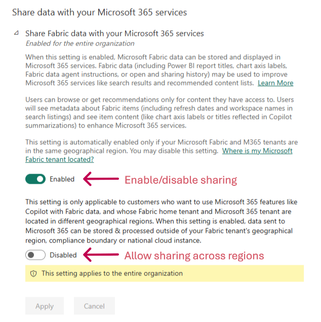

# Share data with your Microsoft 365 services

This article is aimed at Fabric administrators and decision makers who need to know how and where Fabric metadata is being used.

The **Share Fabric data with your Microsoft 365 services** tenant setting controls whether Power BI and Microsoft Fabric automatically send information about your organization's Fabric content to Microsoft 365 (M365). When this setting is turned on, Fabric sends details about your reports, dashboards, and other content to M365 in the background. No one needs to take action for this sharing to occur. M365 then uses this information to help users find and return to their Fabric content through search results, the Quick Access list on Office.com, and personalized recommendations.

This information flows through [Microsoft Graph](/graph/overview). The setting is turned on by default when your Fabric tenant and M365 tenant are in the same geographic region.

### What information is shared

When this setting is turned on, Fabric sends the following information to Microsoft 365:

| Content type | What's shared |
|---|---|
| Power BI reports | Broad item context including the report name, description, web address, who has access, workspace, who created and last modified the report, dates of creation and last update, page names, chart titles, and column or measure names |
| Power BI workspace apps | Basic details only (name, web address, who has access, workspace) |
| Power BI dashboards | Basic details only (name, web address, who has access, workspace) |
| Power BI paginated reports (RDL) | Basic details only (name, web address, who has access, workspace) |

Power BI also shares information about how users interact with content when this setting is turned on. For example, Fabric reports which reports a user viewed. M365 uses these signals to show recently accessed and recommended Fabric content on Office.com.

For the complete list of properties that are shared, see [Data that is shared with Microsoft 365](#data-that-is-shared-with-microsoft-365).

### What this setting doesn't control

Turning off this setting doesn't block Fabric content from appearing in M365. Users who have access to Fabric content can still take an explicit action to use Fabric content in M365 products. The following experiences continue to work even when this setting is turned off, because they depend on a user actively doing something:

- **Excel pivot tables connected to Power BI semantic models:** In Excel, users can discover all the Power BI models they have access to and explore that data using PivotTables and other Excel capabilities. This behavior is not affected by the Share Fabric data with M365 tenant setting. Access to connect Excel to Power BI models requires Fabric admin approval via a separate tenant setting. For more information, see [Power BI semantic model experience in Excel](/power-bi/collaborate-share/office-integration/service-connect-excel-power-bi-datasets).

- **Link previews in Teams and Outlook:** When a user pastes a link to a Power BI report in a Teams chat or Outlook email, people who have access to that report always see a preview with the report name and other metadata. This behavior is not affected by the Share Fabric data with M365 tenant setting. For more information, see [Power BI link previews in Teams](/power-bi/collaborate-share/office-integration/service-teams-link-preview).

- **Fabric data agents in the M365 Agent Store:** If your organization publishes Fabric data agents to the M365 Agent Store, users with access can chat with the agent in M365. This behavior is not affected by the Share Fabric data with M365 tenant setting. For more information, see [Use a Fabric data agent in Microsoft 365 Copilot](/fabric/data-science/data-agent-microsoft-365-copilot).

- **[Frontier only] Asking M365 Copilot about Power BI data:** M365 Copilot can answer questions using Power BI reports and semantic models that the user has permission to view, regardless of this setting. Access to this feature requires M365 admin approval. For more information, see [Fabric IQ in M365 Copilot (Frontier)](/fabric/iq/connectors/m365-copilot-overview).

- **[Frontier only] Asking M365 Cowork about Power BI data:** Power BI reports and semantic models that the user has permission to view can feed into Cowork workflows. Users can request emails or schedule meetings triggered by the latest metrics. Users can also produce deep analysis that combines Work IQ context like emails, Teams chats, and documents with insights from Power BI data. This behavior is not affected by the Share Fabric data with M365 tenant setting. M365 admins can disable access to the Cowork agent for their organization, and access to the Fabric IQ plugin requires M365 admin approval. For more information, see [Fabric IQ in Cowork (Frontier)](/fabric/iq/connectors/cowork-overview).

These experiences all rely on the user being signed in and having permission to the content. They don't rely on Fabric sending information to M365 in the background.

## Data residency

Fabric and Microsoft 365 are separate cloud services that might be hosted in different geographic regions, even if you purchased them together.

By default, Fabric only shares information within the geography where your Fabric tenant is located. If your M365 tenant is in a different geography, you need to allow cross-geography sharing for the integration to work. You can do this with a second toggle in the tenant setting. For more information, see [How to turn sharing with Microsoft 365 services on and off](#how-to-turn-sharing-with-microsoft-365-services-on-and-off).

### Where is Fabric data stored?

For more information about data storage locations, see [Find your Fabric home region](/power-bi/admin/service-admin-where-is-my-tenant-located) and [Product Availability by Geography](https://powerplatform.microsoft.com/availability-reports/).

### Where is Microsoft 365 data stored?

For more information about data storage for Microsoft 365, see [Where your Microsoft 365 customer data is stored](/microsoft-365/enterprise/o365-data-locations) and [Multi-Geo Capabilities in Microsoft 365](https://www.microsoft.com/microsoft-365/business/multi-geo-capabilities).

## How to turn sharing with Microsoft 365 services on and off

The **Share Fabric data with your Microsoft 365 services** tenant setting is turned on by default. To change it:

1. Go to **Admin portal** > **Tenant settings** > **Share Fabric data with your Microsoft 365 services**.
1. Set the toggle to **Enabled** or **Disabled** as needed.

Changes can take up to 24 hours to take effect.

To allow sharing across geographies when your Fabric and M365 tenants are in different regions, set the second toggle to **Enabled**. By turning on this toggle, you acknowledge that Fabric data might flow outside its current geographic region.

> [!NOTE]
> The second toggle is visible only when the main sharing toggle is enabled.

## Data that is shared with Microsoft 365

The tables below show what specific information Fabric sends to Microsoft 365 when sharing is turned on.

**Item details (used for search and discovery in Microsoft 365)**

|Property|What is shared|Example|
|---------|---------|---------|
|TenantID|Microsoft Entra tenant identifier|aaaabbbb-0000-cccc-1111-dddd2222eeee|
|ItemType|Fabric category for the item|Report|
|DisplayName|Display name for the item|Retail Analysis Sample|
|Description|Content description in the service. See [Report settings](/power-bi/create-reports/power-bi-report-settings?tabs=powerbi-desktop) for more detail.|Sample containing retail sales data|
|URL|Content item URL|`https://powerbi-df.analysis-df.windows.net/groups/8b5ac04e-89c1-4fc6-a364-e8411dfd8d17/reports/aaaabbbb-0000-cccc-1111-dddd2222eeee/ReportSection2`|
|ACL|Access Control List (ACL) with permissions and Microsoft Entra user, security group, and distribution list identifiers|`{"accessType": "grant", "id": "aaaaaaaa-bbbb-cccc-dddd-eeeeeeeeeeee", "type": "read"}`|
|WorkspaceName|Workspace name. See [Create a workspace](/power-bi/collaborate-share/service-create-the-new-workspaces).|Retail workspace|
|WorkspaceURL|Link to navigate to the workspace in the service|`https://powerbi-df.analysis-df.windows.net/groups/8b5ac04e-89c1-4fc6-a364-e8411dfd8d17`|
|Creator|[Microsoft Entra user principal name (UPN)](/entra/identity/hybrid/connect/plan-connect-userprincipalname) of the person who created the content|user1@fourthcoffee.com|
|CreatedDate|Date the content was created|2011-06-30T23:32:46Z|
|LastModifiedUser|Microsoft Entra UPN of the last person who modified the content|user1@fourthcoffee.com|
|LastModifiedDate|Last modified date for the content|2011-06-30T23:32:46Z|
|PageNames|Display names for pages within the report|Sales Summary, Regional details, Returns|
|ChartTitles|Display names for visualizations in the report layout|Regional sales over time|
|FieldNames|Names of columns and measures used in the report|revenue, date, product_category|

**User activity (used to show recently accessed and recommended content on Office.com)**

|Property|What is shared|Example|
|---------|---------|---------|
|LastRefreshDate|Last refresh date for the content|2011-06-30T23:32:46Z|
|UserID|Microsoft Entra UPN of the user who acted on the item|user1@fourthcoffee.com|
|SignalType|The type of action the user took on the content|Viewed|
|ActorID|Microsoft Entra ID of the user who acted on the item|aaaaaaaa-bbbb-cccc-dddd-eeeeeeeeeeee|
|StartTime/EndTime|Date and time the user performed the action|2011-06-30T23:32:46Z|

## Related content

- [About tenant settings](tenant-settings-index.md)
