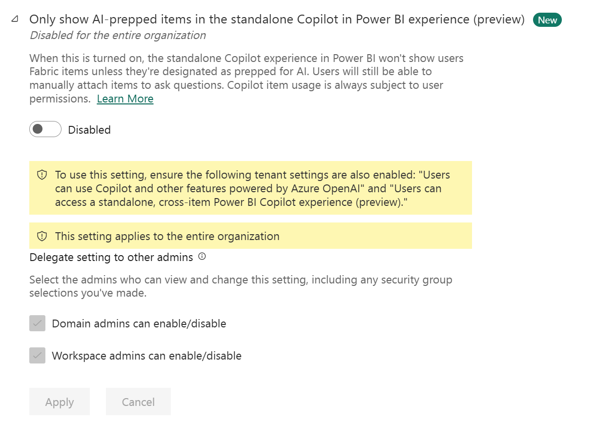

# Copilot tenant settings

Fabric Copilot settings are controlled by the **Copilot and Azure OpenAI Service** tenant settings group.​ There are multiple settings governing user access and data processing policies, and some of them are enabled by default whereas others require the Fabric administrator to enable them.

For information about how to get to the Fabric tenant settings, see [About tenant settings - How to get to the tenant settings](./about-tenant-settings.md#how-to-get-to-the-tenant-settings).

**Settings enabled by default**

* [Users can use Copilot and other features powered by Azure OpenAI](#copilot-with-openai)

**Settings disabled by default**

* [Capacities can be designated as Fabric Copilot capacities](#fabric-copilot-capacities)
* [Data sent to Azure OpenAI can be processed outside your capacity's geographic region, compliance boundary, or national cloud instance](#data-sent-to-azure-openai-can-be-processed-outside-your-capacitys-geographic-region-compliance-boundary-or-national-cloud-instance)
* [Data sent to Azure OpenAI can be stored outside your capacity's geographic region, compliance boundary, or national cloud instance](#data-sent-to-azure-openai-can-be-stored-outside-your-capacitys-geographic-region-compliance-boundary-or-national-cloud-instance)
* [Users can access a standalone, cross-item Power BI Copilot experience (preview)](#stand-alone-experience)
* [Only show AI-prepped items in the standalone Copilot in Power BI experience (preview)](#limit-to-prepped)

 
## Users can use Copilot and other features powered by Azure OpenAI

When this setting is enabled, users can access the features powered by Azure OpenAI, including Copilot, as shown in the following screenshot:

:::image type="content" source="./media/service-admin-portal-copilot/enable-copilot.png" alt-text="Screenshot showing the tenant setting where copilot can be enabled and disabled." lightbox="./media/service-admin-portal-copilot/enable-copilot.png":::

This setting can be managed at both the tenant and the capacity levels. When this setting is enabled, the service may execute background jobs at no charge to the tenant capacity to support end user experiences. For more information, see [Overview of Copilot in Fabric](../fundamentals/copilot-fabric-overview.md).

**Default:** Enabled

## Data sent to Azure OpenAI can be processed outside your capacity's geographic region, compliance boundary, or national cloud instance

This setting is only applicable for customers who want to use Copilot and AI features in Fabric powered by Azure OpenAI, and whose capacity's geographic region is outside of the EU data boundary and the US. When this setting is enabled, service background jobs may execute across geographic boundaries at no charge to the tenant capacity to support end user experiences.  
  
The following screenshot shows how to make this setting:

:::image type="content" source="./media/service-admin-portal-copilot/fabric-copilot-data-processed.png" alt-text="Screenshot showing the tenant setting for data processing outside the capacity's region." lightbox="./media/service-admin-portal-copilot/fabric-copilot-data-processed.png":::

For more information, visit the [Available regions](../fundamentals/copilot-fabric-overview.md#available-regions) resource.

**Default:** Disabled

## Data sent to Azure OpenAI can be stored outside your capacity's geographic region, compliance boundary, or national cloud instance

This setting is only applicable for customers who want to use Copilot in Notebooks and the Data agent Feature in Fabric powered by Azure OpenAI, and whose capacity's geographic region is outside of the EU data boundary and the US. The following screenshot shows how to make this setting:

:::image type="content" source="media/service-admin-portal-copilot/fabric-copilot-storage-tenant-setting.png" alt-text="Screenshot of Fabric Copilot Storage setting in the admin portal." lightbox="./media/service-admin-portal-copilot/fabric-copilot-storage-tenant-setting.png":::

For more information, visit the [Available regions](../fundamentals/copilot-fabric-overview.md#available-regions) resource.

**Default:** Disabled

## Conversation history stored outside your capacity's geographic region, compliance boundary, or national cloud instance

Note that this setting is **only** applicable for customers who want to use [Copilot in Notebooks](../data-engineering/copilot-notebooks-overview.md) and Fabric [data agents](../data-science/concept-data-agent.md) (formerly known as Data agent) powered by Azure OpenAI, and whose capacity's geographic region is outside of the EU data boundary and the US. 

In order to use fully conversational agentic AI experiences, the agent needs to store conversation history across user sessions. This ensures that the AI agent keeps context about what a user asked in previous sessions and is a desired behavior in many agentic experiences. Experiences such as Copilot in Notebooks and Fabric data agents are AI experiences that store conversation history across the user's sessions. **This history is stored inside the Azure security boundary, in the same region and in the same Azure OpenAI resources that process all your Fabric AI requests.** The difference in this case is that the conversation history is stored for as log as the user allows. For experiences that don't store conversation history across sessions, no data is stored. Prompts are only processed by Azure OpenAI resources that Fabric uses.

**Your users can delete their conversation history at any time, simply by clearing the chat. This option exists both for Copilot in Notebooks and data agents.** If the conversation history isn't manually removed, it is stored for 28 days.

The following screenshot shows how to enable this setting:

:::image type="content" source="media/service-admin-portal-copilot/fabric-copilot-storage-tenant-setting.png" alt-text="Screenshot of Fabric Copilot Storage setting in the admin portal." lightbox="./media/service-admin-portal-copilot/fabric-copilot-storage-tenant-setting.png":::

For more information, visit the [Available regions](../fundamentals/copilot-fabric-overview.md#available-regions) resource.

Default: Disabled

## Capacities can be designated as Fabric Copilot capacities

Copilot capacities enable users' usage and billing to be consolidated under a single capacity. Fabric administrators can assign specific groups or the entire organization to manage capacities as Fabric Copilot capacities. Capacity administrators must designate user access to each Copilot capacity and can view item names linked to users' Copilot activity in the Fabric capacity metrics app.

:::image type="content" source="./media/service-admin-portal-copilot/fabric-copilot-capacity-tenant-setting.png" alt-text="Screenshot showing the tenant setting for data storage outside the capacity's region." lightbox="./media/service-admin-portal-copilot/fabric-copilot-capacity-tenant-setting.png":::

**Default:** Disabled

## Users can access a standalone, cross-item Power BI Copilot experience (preview)

You can enable copilot as a standalone experience for Fabric. Enabling this setting allows users to access the standalone Copilot experience from the left navigation. The [Azure OpenAI setting](#copilot-with-openai) must be enabled at the tenant level to use the standalone experience. This setting also affects the Power BI agent. Turn on this setting to enable the Power BI agent in Microsoft 365. To learn more, see [standalone Copilot experience](/power-bi/create-reports/copilot-enable-power-bi).

:::image type="content" source="./media/service-admin-portal-copilot/copilot-standalone.png" alt-text="Screenshot showing the tenant setting for standalone Copilot." lightbox="./media/service-admin-portal-copilot/copilot-standalone.png":::

**Default:** Disabled

## Only show AI-prepped items in the standalone Copilot in Power BI experience (preview) 

Tenant admins can default Copilot search to be limited to items that have prepped for AI. This setting is delegated to workspace admins by default, allowing workspace admins to make broader content findable by Copilot search when appropriate. 

Note that this setting is applicable in the standalone Power BI Copilot as well as the Power BI agent. If this setting is turned on for standalone Copilot, it is also mandatory for the Power BI agent. To learn more, see [standalone Copilot experience](/power-bi/create-reports/copilot-enable-power-bi).

**Default:** Disabled

## Related content

- [Copilot in Fabric and Power BI overview](../fundamentals/copilot-fabric-overview.md)
- [About tenant settings](about-tenant-settings.md)
