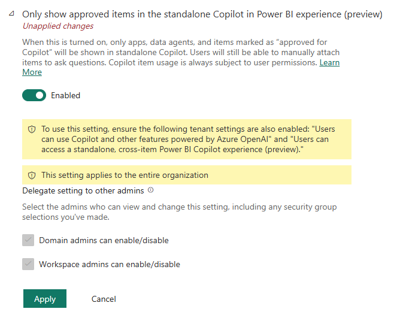

# Copilot tenant settings

Fabric Copilot settings are controlled by the **Copilot and Azure OpenAI Service** tenant settings group. These settings govern user access to Copilot and Fabric AI features, along with the related data-processing policies.

For information about how to get to the Fabric tenant settings, see [About tenant settings - How to get to the tenant settings](./about-tenant-settings.md#how-to-get-to-the-tenant-settings).

## Users can use Copilot and other features powered by Azure OpenAI

When this setting is on, users can access Fabric features powered by Azure OpenAI, including Copilot and Fabric AI agents.

Check the documentation for the most recent [list of these features](https://aka.ms/fabric/copilot-ai-feature-status). This setting can be managed at both the tenant and the capacity levels.

For customers in the EU Data Boundary, this setting adheres to Microsoft Fabric's EU Data Boundary commitments.

By turning on this setting, you agree to the [Preview Terms](https://go.microsoft.com/fwlink/?linkid=2262241) for any [AI features in preview](https://aka.ms/fabric/copilot-ai-feature-status).

The following screenshot shows this setting in the admin portal:

:::image type="content" source="./media/service-admin-portal-copilot/enable-copilot.png" alt-text="Screenshot showing the tenant setting where copilot can be enabled and disabled." lightbox="./media/service-admin-portal-copilot/enable-copilot.png":::

When this setting is enabled, the service may execute background jobs at no charge to the tenant capacity to support end-user experiences. For more information, see [Overview of Copilot in Fabric](../fundamentals/copilot-fabric-overview.md).

**Default:** Enabled

## Data sent to Azure OpenAI can be processed outside your capacity's geographic region, compliance boundary, or national cloud instance

This setting is only applicable for customers who want to use Copilot and AI features in Fabric powered by Azure OpenAI, and whose capacity's geographic region is outside of the EU Data Boundary or the United States.

When this setting is on, data sent to Copilot and other generative AI features can be processed outside your capacity's geographic region, compliance boundary, or national cloud instance. Check the [documentation](https://aka.ms/fabric-copilot-overview-data) for the types of data this might include.

This setting can be managed at both the tenant and the capacity levels. By turning on this setting, you agree to the [Preview Terms](https://go.microsoft.com/fwlink/?linkid=2262241) for any [AI features in preview](https://aka.ms/fabric/copilot-ai-feature-status).
  
The following screenshot shows this setting in the admin portal:

:::image type="content" source="./media/service-admin-portal-copilot/fabric-copilot-data-processed.png" alt-text="Screenshot showing the tenant setting for data processing outside the capacity's region." lightbox="./media/service-admin-portal-copilot/fabric-copilot-data-processed.png":::

For more information, visit [Available regions](../fundamentals/copilot-fabric-overview.md#available-regions).

**Default:** Disabled

## Data sent to Azure OpenAI can be stored outside your capacity's geographic region, compliance boundary, or national cloud instance

This setting is only applicable for customers who want to use Copilot and AI features in Fabric powered by Azure OpenAI, and whose capacity's geographic region is outside of the EU Data Boundary or the United States.

When this setting is turned on, data sent to Azure OpenAI can be stored outside your capacity's geographic region, compliance boundary, or national cloud instance. Check the [documentation](https://aka.ms/fabric-copilot-overview-data) for the types of experiences and data this might include.

By turning on this setting, you agree to the [Preview Terms](https://go.microsoft.com/fwlink/?linkid=2262241) for any [AI features in preview](https://aka.ms/fabric/copilot-ai-feature-status).

The following screenshot shows this setting in the admin portal:

:::image type="content" source="media/service-admin-portal-copilot/fabric-copilot-storage-tenant-setting.png" alt-text="Screenshot of Fabric Copilot Storage setting in the admin portal." lightbox="./media/service-admin-portal-copilot/fabric-copilot-storage-tenant-setting.png":::

For more information, visit [Available regions](../fundamentals/copilot-fabric-overview.md#available-regions).

Default: Disabled

## Capacities can be designated as Fabric Copilot capacities

With this setting on, capacity admins can designate capacities as Fabric Copilot capacities. Copilot capacities are special capacity types that allow your organization to consolidate users' Copilot usage and billing on a single capacity.

When users use Copilot features, capacity admins can see the names of the items associated with users' Copilot activity.

:::image type="content" source="./media/service-admin-portal-copilot/fabric-copilot-capacity-tenant-setting.png" alt-text="Screenshot showing the tenant setting for data storage outside the capacity's region." lightbox="./media/service-admin-portal-copilot/fabric-copilot-capacity-tenant-setting.png":::

**Default:** Enabled

## Users can access a standalone, cross-item Power BI Copilot experience (preview)

When this setting is turned on, users can access a Copilot experience that allows them to find, analyze, and discuss different Fabric items in a dedicated tab available from the Power BI navigation pane.

This setting requires **Users can use Copilot and other features powered by Azure OpenAI** to be enabled. This setting also affects the Power BI agent in Microsoft 365.

To learn more, see [standalone Copilot experience](/power-bi/create-reports/copilot-enable-power-bi).

:::image type="content" source="./media/service-admin-portal-copilot/copilot-standalone.png" alt-text="Screenshot showing the tenant setting for standalone Copilot." lightbox="./media/service-admin-portal-copilot/copilot-standalone.png":::

**Default:** Disabled

## Only show approved items in the standalone Copilot in Power BI experience (preview) 

When this setting is turned on, only apps, data agents, and items marked as approved for Copilot are shown in standalone Copilot. Users can still manually attach items to ask questions. Copilot item usage is always subject to user permissions.

This setting applies to the standalone Power BI Copilot experience and the Power BI agent.

> [!NOTE]
> This setting was previously called *Only show AI-prepped items in the standalone Copilot in Power BI experience (preview)*, but has been updated to reflect the new name of the [approved for Copilot setting](/power-bi/create-reports/copilot-prepare-data-ai#mark-your-model-as-approved-for-copilot).

To learn more, see [standalone Copilot experience](/power-bi/create-reports/copilot-enable-power-bi).

**Default:** Disabled

## Related content

- [Copilot in Fabric and Power BI overview](../fundamentals/copilot-fabric-overview.md)
- [About tenant settings](about-tenant-settings.md)
