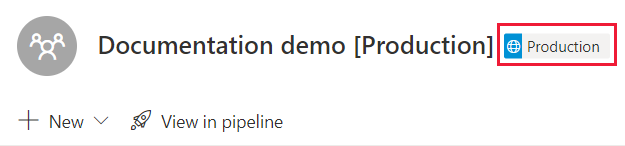

# Troubleshoot lifecycle management issues

Use this article to troubleshoot issues in the lifecycle management process.  

To understand the considerations and limitations of various lifecycle management issues, review the links in the following table:

| Topic | Git integration  | Deployment pipelines |
|--------|------------------|---------------------|
| **General limitations** | [general Git limitations](./git-integration/git-integration-process.md#considerations-and-limitations) | [deployment pipelines limitations](deployment-pipelines/understand-the-deployment-process.md#considerations-and-limitations) |
| **Permissions needed** | [permissions](./git-integration/git-integration-process.md#permissions) | [permissions](deployment-pipelines/understand-the-deployment-process.md#permissions) |
| **Workspace limitations** | [workspaces](./git-integration/git-integration-process.md#workspace-limitations) | [workspaces](deployment-pipelines/assign-pipeline.md#considerations-and-limitations) |
| **Supported Fabric items** | [supported items](./git-integration/intro-to-git-integration.md#supported-items) | [supported items](deployment-pipelines/understand-the-deployment-process.md#supported-items) |
| **Semantic model** |   | [Semantic model limitations](deployment-pipelines/understand-the-deployment-process.md#semantic-model-limitations)

* [Git integration](#git-integration)  

  * [Access](#access-issues)
  * [Connect](#connect-issues)
  * [Commit](#commit-issues)
  * [Update](#update-issues)
  * [Undo](#undo-issues)
  * [Resolve errors](#resolve-error-issues)
* [Deployment pipelines](#deployment-pipelines)  
  * [Paginated reports](#paginated-reports)  
  * [Dataflows](#dataflows)  
  * [Datamarts](#datamarts)  
  * [Permissions](#permissions)  
  * [Rules](#rules)

## Git integration

### Access issues

#### I can't access my Azure DevOps repository

**Description of problem**: When I go to the Git integration tab, I get an error message and can't access Azure DevOps.

<!--
:::image type="content" source="./media/troubleshoot-cicd/no-access.png" alt-text="Screenshot of error message when the user doesn't have access to Azure DevOps.":::
-->

**Cause**: If the authentication method in Power BI is weaker than the authentication method in Azure DevOps, the functionalities between them doesn't work.  
**Workaround**: The admin needs to align the authentication method in Power BI and Azure DevOps. The authentication policies for Microsoft Entra ID (formerly known as Azure Active Directory) are defined in [Manage authentication methods](/entra/identity/authentication/concept-authentication-methods-manage#authentication-methods-policy).

### Connect issues

#### Connect failure: Unable to connect to repository

**Description of problem**: When I try to connect to a Git repo I get a message that it can't connect because the workspace is in a different region.  
**Cause**: If the workspace and repo are located in different regions, the cross-region switch must be enabled.  
**Solution**: [Enable Git actions on workspaces residing in other geographical locations](../admin/git-integration-admin-settings.md#users-can-export-items-to-git-repositories-in-other-geographical-locations-preview).

#### Connect failure: It says something went wrong when I try to connect

**Description of problem**: After selecting **Connect** in the Git integration tab, the **Something went wrong** error dialog pops up. In addition, when you select the source control button, the pane indicates that you need to sync with the Git branch.

:::image type="content" source="./media/troubleshoot-cicd/something-went-wrong.png" alt-text="Screenshot of error message when the workspace can't connect.":::

:::image type="content" source="./media/troubleshoot-cicd/sync-direction-continue.png" alt-text="Screenshot of error message when the workspace isn't connected to a Git branch.":::

**Cause**: If the folder you're trying to connect to has subdirectories but no Fabric items, the connection fails.

**Solution**: Open the Git repository in Azure DevOps and navigate to the Git folder defined in the connection. If the Git folder contains subdirectories, check that at least one of them represents an item directory. If the directory contains item.config.json and item.metadata.json files, it's an item directory. If the directory doesn't contain these files, it's a subdirectory. If the Git folder doesn't contain any item directories, you can't connect to it. Either remove the subdirectories or connect to a different folder that doesn't contain subdirectories.

#### Connect failure: It's asking if I want to create a new folder when I try to connect to a Git branch

**Description of problem**: After selecting **Connect** in the Git integration tab, a dialog pops up indicating an invalid folder path.

:::image type="content" source="./media/troubleshoot-cicd/create-new-folder.png" alt-text="Screenshot of error message when the workspace can't connect to a folder.":::

**Cause**: The folder you're trying to connect doesn't exist, was deleted, or differs in case sensitivity from existing folders in the repository. This message can appear if you're connecting to a new branch, or if the folder was deleted from the branch.

**Solution**:

* To create a new folder and connect it to the workspace, select **Create and sync**.  
* To connect the workspace to a different folder, select **Cancel** and choose another folder in the workspace settings of the Git integration tab.

#### The Source control icon doesn't have a number

**Description of problem**: The number on the Source control icon indicates the number of changes that were made to the workspace since the last commit. If the icon doesn't have a number, there might have been a problem connecting to the branch.  
**Solution**: Disconnect and reconnect.

:::image type="content" source="./media/troubleshoot-cicd/no-source.png" alt-text="Screenshot of source control icon without a number.":::

#### Connect failure: It says I need a Premium license to connect to git

**Description of problem**: My workspace was previously connected to a Git repo, but now it says that I need a premium license to connect.  
**Cause**: You can only connect to Git repos if you have a valid Premium license. If your license expired or you change your license to a license that doesn't include Git integration, you won't be able to connect to that repo anymore. This applies to trial licenses as well.  
**Solution**: Disconnect from Git and work without source control, or purchase a Premium license.

### Commit issues

#### The Commit button is disabled

**Description of problem**: If there were updates made to the Git branch, commits are disabled until you update your workspace.  
**Solution**: To enable commits, update your workspace.

### Update issues

#### The Commit and Update buttons are both disabled

**Description of problem**: Changing the same item in the workspace and the Git branch can lead a possible conflict. If changes were made in the workspace and in the Git branch on the same item, updates are disabled until the conflict is resolved.  
**Solution**: [Resolve conflicts](./git-integration/conflict-resolution.md) and then try again.

#### Update failure: Update doesn't complete because it would break dependency links

**Description of problem**: After selecting **Update all** or **Undo**, a dialog pops up indicating failure because the action would break a dependency links.

:::image type="content" source="./media/troubleshoot-cicd/break-dependencies.png" alt-text="Screenshot of error message when the updating would break dependencies.":::

**Solution**: Open the Lineage view to find the item or items that would be deleted from the workspace in the update and are linked to items that won't be deleted from the workspace.

:::image type="content" source="./media/troubleshoot-cicd/lineage-view.png" alt-text="Screenshot of the lineage view.":::

To resolve the issue, delete the problematic item(s):

* If the item isn't [supported by Git](./git-integration/intro-to-git-integration.md#supported-items) (for example, Dashboards), delete it manually from the workspace.
* If the item is [supported by Git](./git-integration/intro-to-git-integration.md#supported-items) (for example, reports), delete it either from Git (if it exists) or from the workspace.

Select **Update All**.  
For more information, see [Manually Update from Git](./git-integration/partial-update.md).

#### Post update failure: Dependencies aren't pointing to the correct items

**Description of problem**: After updating from Git, when looking at the lineage view, the dependencies of some items aren't as expected. For example, the proxy model no longer points to the correct model.

Reason: Git Integration doesn't support Direct Query and proxy models at this time.

**Solution**: To fix the dependencies, do one of the following actions:

* Edit the *bim* file of the ProxyDataset in the Git repository so that it points to the correct dataset, and then, in the workspace, update from Git to receive the change.
* Use the [Update Datasource API](/rest/api/power-bi/datasets/update-datasources-in-group) to update the connection details of the proxy model in the workspace.

### Resolve error issues

### Undo issues

#### Undo failure: After selecting "Undo" a dialog pops up indicating failure because dependency can't be found

**Description of problem**: The following error appears after an undo action if there's an uncommitted dependency in the **Changes** tab that wasn't selected in the "Undo" action.

:::image type="content" source="./media/troubleshoot-cicd/dependency-not-found.png" alt-text="Screenshot of error message when undo fails because dependency isn't found.":::

**Solution**: Select the all the dependencies of the selected database and try again.

#### Dependency error: After selecting "Undo", "Update", or "Switch branch" a dialog pops up indicating failure because the action would break a dependency link

**Description of problem**: The following error appears after an undo, update, or switch branch action:

:::image type="content" source="./media/troubleshoot-cicd/break-dependencies.png" alt-text="Screenshot of error message when undo fails because the action would break a dependency link.":::

**Cause**: There's an unsupported item in the workspace that depends on an item that's no longer in the workspace causing a dependency problem.

**Solution**: Open the [Lineage view](../governance/lineage.md) to find the item or items that were selected to be "undone" and are linked to items that aren't selected.

:::image type="content" source="./media/troubleshoot-cicd/lineage-view.png" alt-text="Screenshot of the lineage view.":::

To resolve the issue, delete the problematic item(s):

* If the item that's not selected is supported by Git (for example, reports), select it to be deleted as well.
* If the item that's not selected isn't supported by Git (for example, Dashboards), [delete it manually](git-integration/partial-update.md) from the workspace.

To read more about dependencies, see [Understand dependencies](./git-integration/dependency-errors.md).

## Deployment pipelines

### I can't see the deployment pipelines button

If the following conditions aren't met, you can't see the deployment pipelines button.

* You have a [Fabric license](../enterprise/licenses.md).

* You're an admin of a [workspace](../get-started/create-workspaces.md).

### I can't see the pipeline stage tag in my workspace

Deployment pipelines display a pipeline stage tag in workspaces that are assigned to a pipeline. To see these tags, you need to be a [pipeline admin](deployment-pipelines/understand-the-deployment-process.md#permissions). Tags for the *Development* and *Test* stages are always visible. However, you only see the *Production* tag if you have [access to the pipeline](deployment-pipelines/understand-the-deployment-process.md#permissions).

> [!div class="mx-imgBorder"]
> 

### Lost connections after deployment

**Description of problem**: In a full pipeline, after you unassign a workspace from a stage and then deploy to it, deployment pipelines reestablishes the connections between items in the source stage you deployed from and the target stage. However, sometimes deployment pipelines can't reestablish the connections between items in the source and target stages. This can happen, for example, when you accidentally delete an item.  
**Solution**: To reestablish these connections, unassign and reassign the same workspace in the target stage.

### I can't assign a workspace to a stage

**Cause**: When you assign a workspace to a deployment pipelines stage, deployment pipelines checks the items (such as reports and dashboards) in the workspace. If there are two items of the same type with the same name in an adjacent stage, deployment pipelines can't determine which one of them should match the one in the assigned workspace, and the **Can't assign the workspace** error message appears. For example, if you're trying to assign a workspace to the *test stage*, and one of your reports is called "regional sales", if there's more than one report with the same name in either the *development* or *production* stages, the assignment fails. Assigning your workspace will also fail if the workspace you're assigning has two semantic models titled "regional sales semantic model", and there's a semantic model with the same name in either the *development* or *production* stages.  
**Solution**: To resolve this error, change the name of the item that doesn't match the item in the stage you're trying to assign. You can select the links in the error message to open the items in Fabric.

:::image type="content" source="media/troubleshoot-cicd/cannot-assign-error.png" alt-text="A screenshot of the *Can't assign the workspace* error message in deployment pipelines.":::

### I see the 'different' symbol after I assigned a workspace with semantic models that are similar to the semantic models in adjacent stages

**Cause**: Most semantic models use the [enhanced semantic model metadata](/power-bi/connect-data/desktop-enhanced-dataset-metadata) feature, also known as *model v3*. However, older reports might be using the old type of semantic model metadata, sometimes referred to as *model v1*. If you're assigning a workspace that uses the old semantic model metadata model (v1), deployment pipelines can't evaluate whether the semantic model is similar in adjacent stages. In such cases, the *different* UI symbol is displayed, even when the semantic models are identical.  
**Solution**: To resolve this issue, deploy the semantic models that are showing the *different* symbol.

### I can't see all my workspaces when I try to assign a workspace to a pipeline

**Cause**: There can be several reasons why you can't see a workspace in the list of workspaces you can assign to a pipeline.

**Solution**: To assign a workspace to a pipeline, the following conditions must be met:

* You're an admin of the workspace

* The workspace isn't assigned to any other pipeline

* The workspace resides on a [Fabric capacity](../enterprise/licenses.md#capacity-license)

Workspaces that don't meet these conditions, aren't displayed in the list of workspaces you can select from.

### My first deployment failed

**Cause**: Your first deployment might have failed for any of several reasons.  
**Solution**: Some possible reasons for failure with their solutions are listed in the following table.

|Error  |Action  |
|---------|---------|
|You don't have [capacity permissions](deployment-pipelines/understand-the-deployment-process.md#create-a-workspace).     |If you work in an organization that has a Fabric capacity, ask a capacity admin to add your workspace to a capacity, or ask for assignment permissions for the capacity. After the workspace is in a capacity, redeploy.  If you don't work in an organization with a Fabric capacity, consider purchasing [Premium Per User (PPU)](/power-bi/enterprise/service-premium-per-user-faq).        |
|You don't have workspace permissions.     |To deploy, you need to be a workspace member. Ask your workspace admin to grant you the appropriate permissions.         |
|Your Fabric admin disabled the creation of workspaces.     |Contact your Fabric admin for support.         |
|You're using [selective deployment](deployment-pipelines/deploy-content.md#selective-deployment) and aren't selecting all the linked items.     |Do one of the following:   Unselect the content that is linked to your semantic model or dataflow. Your unselected content (such as semantic models, reports, or dashboards) won't be copied to the next stage.   Select the semantic model or the dataflow that's linked to the selected items. Your selected items will be copied to the next stage.         |

### I have 'unsupported items' in my workspace when I'm trying to deploy

**Cause**: Deployment pipelines doesn't support all items.  
**Solution**: For a comprehensive list of items that aren't supported in deployment pipelines, see the following sections:

* [Unsupported items](deployment-pipelines/understand-the-deployment-process.md#unsupported-items)

* [Item properties that aren't copied](deployment-pipelines/understand-the-deployment-process.md#item-properties-that-are-not-copied)

### I want to change the data source in the pipeline stages

**Cause**: You can’t change the data source connection in Power BI service.

**Solution**: If you want to change the data source in the test or production stages, you can use [deployment rules](deployment-pipelines/create-rules.md) or [APIs](/rest/api/power-bi/datasets/updateparametersingroup). Deployment rules will only come into effect after the next deployment.

### I fixed a bug in production, but now the 'deploy to previous stage' button is disabled

**Cause**: You can only deploy backwards to an empty stage. If you have content in the test stage, you can't deploy backwards from production.

**Solution**: After creating the pipeline, use the development stage to develop your content, and the test stages to review and test it. You can fix bugs in these stages, and then deploy the fixed environment to the production stage.

>[!NOTE]
>Backwards deployment only supports [full deployment](deployment-pipelines/deploy-content.md#deploy-all-content). It doesn't support [selective deployment](deployment-pipelines/deploy-content.md#selective-deployment)

### Error message: 'continue the deployment'

**Cause**: Source stage schema breaking changes, such as replacing a column type from an integer to a string, cause data loss in the target semantic model after deployment.

During deployment, the metadata in the source semantic model is checked against the target metadata. Schema breaking changes cause the deployment to stop. When this happens, you receive the *continue the deployment* message.

:::image type="content" source="media/troubleshoot-cicd/deployment-was-stopped-error.png" alt-text="A screenshot of the continue the deployment message in deployment pipelines.":::

**Solution**: If you continue with the deployment, you lose the data in the target stage. You can use this option if the changes you made to the semantic model were intentional. After the deployment completes, you'll need to refresh the target semantic model.

If the changes weren't intentional, close the message window, upload a fixed *.pbix* file to the source workspace and redeploy.

After a deployment fails due to schema changes, the target stage displays the *Deployment failed* message, followed by the *Show details* link. The link opens the same *continue the deployment* message that was displayed during the failed deployment.

### Error message: 'can't start the deployment'

**Cause**: When you're using [incremental refresh](deployment-pipelines/understand-the-deployment-process.md#incremental-refresh), only certain [changes to the semantic model](deployment-pipelines/understand-the-deployment-process.md#considerations-and-limitations) you're deploying are allowed. If you made semantic model changes that aren't allowed, your deployment fails and you receive this message:

:::image type="content" source="media/troubleshoot-cicd/cannot-start-deployment-error.png" alt-text="A screenshot of the Can't start the deployment error message in deployment pipelines.":::
  
**Solution**: If you made changes to your semantic model intentionally, use one of the following workarounds:

* **Using** *.pbix* - Publish your changes directly to the target semantic model. All partitions and data are lost, so you need to refresh the semantic model.

* **Using XMLA tools** - Make your changes directly on the semantic model in the target stage.

### My visual broke after deploying a semantic model or a dataflow

**Cause**: Semantic model and dataflows are Fabric items that store data and contain both data and metadata. During deployment, only the metadata is copied while the data isn't. As a result, after deployment the semantic model or dataflow might not have any data and a report visual that's relying on this data, will appear broken.  
**Solution**: To solve this problem, refresh the dataflow and then refresh the semantic model in the target stage.

### How can I delete a pipeline that doesn't have an owner (an orphaned pipeline)?

**Cause**: When working with deployment pipelines, you might end up with a pipeline that doesn't have an owner. For example, a pipeline can be left without an owner when a user that owned it leaves the company without transferring ownership. When a pipeline doesn't have an owner, other users can't access it. As a workspace can only be assigned to one pipeline, if it's assigned to a pipeline without an owner, nobody is able to unassign it, and you can't use the workspace in another pipeline.  

**Solution**: When a pipeline is left without an owner, a Fabric administrator can add a new owner to the pipeline, or delete it. To add an owner to the pipeline, use the [Admin - Pipelines UpdateUserAsAdmin](/rest/api/power-bi/admin/pipelines-update-user-as-admin) API.

You can also review our PowerShell script, [AddUserToWorkspacePipeline](https://github.com/microsoft/PowerBI-Developer-Samples/blob/master/PowerShell%20Scripts/Admin-DeploymentPipelines-AddUserToWorkspacePipeline) (available from the [PowerBI-Developer-Samples](https://github.com/microsoft/PowerBI-Developer-Samples) GitHub repository), which lets you do the following:

* *Manage pipeline access* - Add any user to a workspace in a pipeline.

* *Reclaim workspace ownership* - Add any user to a workspace in a pipeline that doesn't have an owner, allowing you to unblock it.

To use this script, you need to provide a *workspace name* and a *user principal name (UPN)*. The script finds the pipeline that the workspace is assigned to, and add admin permissions to the user you specified.

### Mismatch error: Source and target semantic model format version mismatch error

**Description of problem**: The *Can’t start deployment* error that states that *the source and target semantic models have different data modeling formats*, occurs when the semantic models in the target stage have a higher model version than the semantic models in the source stage. In such cases, deployment pipelines aren’t able to deploy from the source stage to the target stage. To avoid this error, use a semantic model that has the same (or higher) model version in the source stage.

**Solution**: Upgrade the semantic model in the source stage using an [XMLA read-write endpoint](/power-bi/enterprise/service-premium-connect-tools#enable-xmla-read-write) or Power BI Desktop. After upgrading the semantic model, republish it to the source stage.

### Mismatch error: Data source connectivity mode mismatch error

**Description of problem**: During deployment, if deployment pipelines discovers that the connectivity mode of a data source in the target stage isn't the same as the data source in the source stage, it attempts to convert the connectivity mode of the data source in the target stage. If you're using a data source with the [live connection](/power-bi/connect-data/desktop-report-lifecycle-datasets) or [real time](/power-bi/connect-data/service-real-time-streaming) connectivity modes, deployment pipelines can't convert the target's data source connectivity mode.  
**Solution**: Either use an [XMLA read-write endpoint](/power-bi/enterprise/service-premium-connect-tools#enable-xmla-read-write) or Power BI Desktop to change the connection mode of the data source in the source stage, or delete the data source in the target stage so that the deployment overwrites it.

### My semantic model deployment failed

**Cause**: There could be a few possible reasons for your semantic model deployment to fail. The following are possible reasons for failure:

* A large semantic model isn't configured with the [large semantic model format](/power-bi/enterprise/service-premium-large-models).
* The semantic model contains a circular or self dependency (for example, item A references item B and item B references item A). In this case you'll see the following error message: *One or more items failed to deploy because it will result in a two way dependency between items*.

**Solution**:

* If your semantic model is larger than 4 GB and isn't using the large semantic model format, it might fail to be deployed. Try setting your semantic model to use the large semantic model format, and redeploy.
* If your semantic model contains a circular or self dependency, remove the dependency and redeploy.

### I have a semantic model with DirectQuery or Composite connectivity mode, that uses variation or auto date/time tables

**Cause**: Semantic models that use DirectQuery or Composite connectivity mode and have variation or [auto date/time](/power-bi/transform-model/desktop-auto-date-time) tables aren't supported in deployment pipelines.  
**Solution**: If your deployment fails and you think it's because you have a semantic model with a variation table, you can look for the [variations](/dotnet/api/microsoft.analysisservices.tabular.column.variations) property in your table's columns. You can use one of the following methods to edit your semantic model so that it works in deployment pipelines.

* Use [import](/power-bi/connect-data/service-dataset-modes-understand#import-mode) mode instead of *DirectQuery* or *Composite* mode in your semantic model.

* Remove the [auto date/time](/power-bi/transform-model/desktop-auto-date-time) tables from your semantic model. If necessary, delete any remaining variations from all the columns in your tables. Deleting a variation might invalidate user authored measures, calculated columns, and calculated tables. Use this method only if you understand how your semantic model model works as it could result in data corruption in your visuals.

### Paginated reports

#### I can't deploy a paginated report

**Solution**: To deploy a paginated report, you need to be a workspace member in the workspace you're deploying from (the source stage workspace). If you're not a workspace member in the source stage, you can't deploy the paginated report.

#### Data source mismatch: Target stage paginated report displays data from a Fabric semantic model in the source stage

**Description of problem**: Currently, semantic models are treated as an external Analysis Services data source, and connections to semantic models aren't switched automatically after deployment.

When you deploy a paginated report that's connected to a Fabric semantic model, it continues to point to the semantic model it was originally connected to. Use [deployment rules](deployment-pipelines/create-rules.md) to point your paginated report to any semantic model you want, including, for example,  the target stage semantic model.

**Solution**: If you're using a paginated report with a Fabric semantic model, see [How do I create a deployment rule for a paginated report with a Fabric semantic model?](./faq.md#how-do-i-create-a-deployment-rule-for-a-paginated-report-with-a-fabric-semantic-model)

#### Deployment failure: Large number of paginated reports fails

**Description of problem**: A deployment of a large number of paginated reports with rules might fail due to an overload on the capacity.  
**Solution**: Either purchase a higher [SKU](../enterprise/licenses.md#capacity-license), or use selective deployment.

### Dataflows

#### Lineage view: I deleted a data source that belonged to a dataflow, but I can still see it in the lineage view

**Cause**: In dataflows, old data sources aren't removed from the dataflow data source page. To support the dataflows lineage view, connected items aren't deleted.

**Solution**: This behavior doesn't affect deployment pipelines. You can still refresh, edit, and deploy dataflows in a pipeline.

#### I see two data sources connected to my dataflow after using dataflow rules

**Description of problem**: After changing a dataflow's data source using a rule, the dataflow's lineage view displays a connection between the dataflow's source data source, and the data source configured in the rule.

**Solution**: This behavior doesn't affect deployment pipelines.

### Datamarts

#### Deployment problem: I can't deploy a datamart in the pipeline

**Solution**: To deploy a datamart, you must be the owner of the datamart.

#### Deployment problem: My datamart deployment failed because of a circular dependency

:::image type="content" source="./media/troubleshoot-cicd/circular-dependency.png" alt-text="Screenshot of error message about circular or self dependencies.":::

**Solution**: There is either an item that references itself, or more than one item involved in a circular chain of references (for example, item A references item B and item B references item A). To deploy the datamart, remove the circular dependency and redeploy.

### Permissions

#### Who can deploy content between stages?

Content can be deployed to an empty stage or to a stage that contains content. The content must reside on a [Fabric capacity](../enterprise/licenses.md#capacity-license).

* **Deploying to an empty stage** - Any [licensed Fabric](../enterprise/licenses.md#per-user-licenses) user who's a member or admin in the source workspace.

* **Deploying to a stage with content** - Any [licensed Fabric](../enterprise/licenses.md#capacity-license) user who's a member or admin of both workspaces in the source and target deployment stages.

* **Overwriting a semantic model** - Deployment overwrites each semantic model that is included in the target stage, even if the semantic model wasn't changed. Any user who's a member or admin of both workspaces, but the tenant admin can restrict this to target semantic model owners only.

#### I can't see a workspace in the pipeline

**Cause**: Pipeline and workspace permissions are managed separately. You might have pipeline permissions, but not workspace permissions.  
**Solution**: For more information, review the [permissions](deployment-pipelines/understand-the-deployment-process.md#permissions) section.

#### Error message: 'workspace member permissions needed'

**Solution**: To assign a workspace, you need at least [workspace member](deployment-pipelines/understand-the-deployment-process.md#permissions-table) permissions for the workspaces in its adjacent stages. Workspace member (or higher) permissions in the adjacent stages are required to enable deployment pipelines to establish connections between items in neighboring pipeline stages.

:::image type="content" source="media/troubleshoot-cicd/workspace-permission-needed.png" alt-text="A screenshot of the workspace member permission needed message in the test stage of a deployment pipeline.":::

### Rules

#### Deployment failure due to broken rules

**Solution**: If you have problems configuring deployment rules, visit [deployment rules](deployment-pipelines/create-rules.md), and make sure you follow the [deployment rules limitations](deployment-pipelines/create-rules.md#considerations-and-limitations).

If your deployment was previously successful, and is suddenly failing with broken rules, it could be due to a semantic model being republished. The following changes to the source semantic model result in a failed deployment:

##### **Parameter rules**

* A removed parameter

* A changed parameter name

##### **Data source rules**

Your deployment rules are missing values. This might have happened if your semantic model changed.

When a previously successful deployment fails due to broken links, a warning is displayed. You can select **Configure rules** to navigate to the deployment rules pane, where the failed semantic model is marked. When you select the semantic model, the broken rules are marked.

To deploy successfully, fix or remove the broken rules, and redeploy.

#### Deployment problem: I configured rules, but it did't deploy

**Cause**: Deployment rules aren't applied immediately after they're configured.

**Solution**: To apply deployment rules, you have to deploy the semantic models from the source stage to the target stage which includes the created deployment rules. After configuring deployment rules, and before you deploy, the *different* indicator is shown next to the semantic model with the configured rules. This indicates that you need to deploy that semantic model from the source stage to the target stage. Once you deploy, if no other changes were made, the *different* indicator disappears signifying that the rules were applied successfully.

#### Deployment rules are greyed out

**Solution**: To create a [deployment rule](deployment-pipelines/create-rules.md), you must be the owner of the item you're creating a deployment rule for. If you're not the owner of the item, deployment rules are greyed out.

>[!div class="mx-imgBorder"]
>

If one of the rule options is greyed out, it could be because of the following reasons:

* **Data source rules** - There are no data sources that a rule can be configured on.

* **Parameters rules** - There are no parameters a rule can be configured for.

#### My data source rule for a semantic model failed

**Solution**: Saving data source rules might fail due to one of these reasons:

* Your semantic model contains a function connected to a data source. In such cases, data source rules aren't supported.

* Your data source is using parameters. You can't create a data source rule for a semantic model that uses parameters. Create a parameter rule instead.

#### I can't connect to a semantic model when creating a new semantic model rule

**Cause**: When constructing a semantic model using Power BI Desktop, the connection string can be configured. Later, the semantic model can be published and used by deployment pipelines in Power BI service. When creating the connection in Power BI Desktop, you can specify additional parameters. When specifying the parameters, the semantic model source must be the first parameter listed. If you list any other parameters before the semantic model source, you run into errors in Power BI service. In such cases, when configuring a new semantic model rule, if you point to a semantic model that wasn't configured properly in Power BI Desktop, deployment pipelines can't create the rule.

**Solution**: Format the semantic model connection in Power BI Desktop so that the semantic model source appears in the first row. Then, republish the semantic model.

## Troubleshooting errors

Use this section to troubleshoot pipeline [rules](deployment-pipelines/create-rules.md) you created. If you don't see a rule error message name, review the [deployment rule limitations](deployment-pipelines/create-rules.md#considerations-and-limitations) and the [supported data sources for dataflow and semantic model rules](deployment-pipelines/create-rules.md#supported-data-sources-for-dataflow-and-semantic-model-rules), and try to reconfigure the rule.

|Error message |Solution |
|--------------|---------|
|Data source rule can't contain a parameter |Your rule can't be applied because the server name or database name referenced in the rule is controlled by a parameter. To change the server or database name, use a parameter rule or remove the controlling parameter from configured item. |
|Data source execution failure |A rule can't be applied due to a problem retrieving data from the data source. Remove the rule and make sure the semantic model has valid queries. Then try creating the rule again. |
|Rule property no longer exists |Some of the rule properties configured in the rule no longer exist. Refresh the page and configure the rule again.  |
|Illegal value |A value used in the configured rule isn't valid. Validate the rule's values and try configuring the rule again. |
|Multiple data sources aren't supported |A semantic model rule can't be applied due to its data source configuration. Either remove the rule, or rewrite the semantic model queries using standard Power BI Desktop tools. |
|Target semantic model can only be changed by its owner |Your rule will overwrite some semantic models in the destination workspace. You must be the owner of any semantic model that will be overwritten. |  

## Related content

* [Get started with deployment pipelines](deployment-pipelines/get-started-with-deployment-pipelines.md)
* [Assign a workspace to a pipeline stage](deployment-pipelines/assign-pipeline.md)
* [Deployment history](deployment-pipelines/deployment-history.md)
