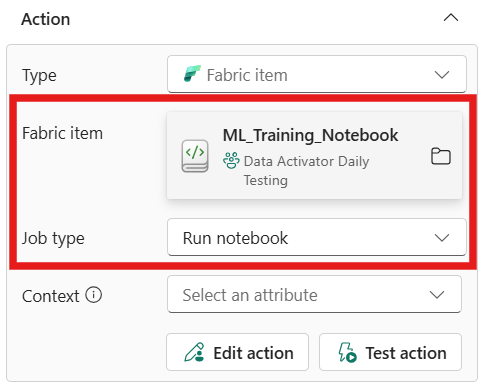

# Trigger Fabric items

Fabric data pipelines and notebooks can be used to load or transform data in Microsoft Fabric. Data Activator triggers can take an action that starts jobs on other Fabric items, which can be used in the following scenarios:

* Start data pipelines when new files are loaded to Azure storage accounts, to load files into OneLake. 

* Start Fabric notebooks when issues with data quality are found using Power BI reports.

> [!IMPORTANT]
> Data Activator is currently in preview.

## Open a Fabric item rule

Start by opening a Data Activator rule in Fabric. 
1. Open Data Activator and create a rule
2. On the rule page in **Design** view, scroll down to the **Act** section. 

## Trigger a Fabric item

In the **Act** card for the trigger that's monitoring your chosen condition, select **Fabric item** from the [OneLake Data Hub](/fabric/get-started/onelake-data-hub) pop-up window.

:::image type="content" source="media/data-activator-trigger-fabric-items/data-activator-fabric-item.png" alt-text="Screenshot showing Fabric item selected from the Type dropdown.":::

Once you select **Fabric item**, the **Act** card allows you to choose a workspace and an item to activate. Select a workspace where you have **Execute** permissions. If you aren't able to select an item, check with your Fabric administrator or the workspace owner. In the **Item** dropdown, select a notebook or a pipeline.

**Job type** autofills with either **Run pipeline** or **Run notebook**.   

### Trigger a pipeline

In **Additional information**, select up to five fields to monitor. Azure Storage events can be used to start data pipelines. When Data Activator starts a job, parameters are passed to the pipeline. The *Subject* field in the event contains the path of the file that caused the event, which is passed to the pipeline. You can then use that value in the pipeline to get the contents of the file.

You can also learn more about [Azure Storage events](/azure/storage/blobs/storage-blob-event-overview).

### Trigger a notebook

In "Additional information**, select up to five fields to monitor. 

## Test, start, or stop a Data Activator trigger

Once you enter all of the required information, select **Save** to save the Data Activator trigger.  To test the trigger, select **Send me a test alert** from the top menu bar. To start the trigger, select **Start** and to stop the trigger, select **Stop.** **Stop** only appears while a trigger is active.  

## Related content

* [Get started with Data Activator](data-activator-get-started.md)
* [Data Activator tutorial using sample data](data-activator-tutorial.md)

You can also learn more about Microsoft Fabric:

* [What is Microsoft Fabric?](../get-started/microsoft-fabric-overview.md)

