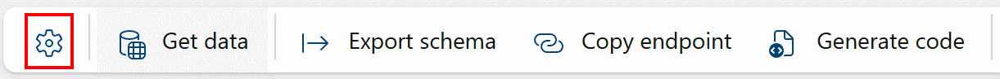
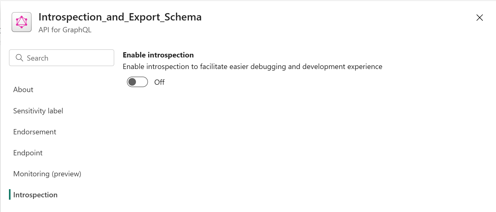
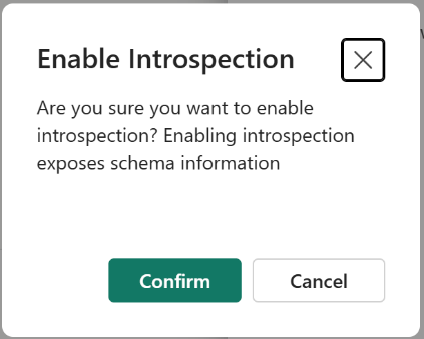
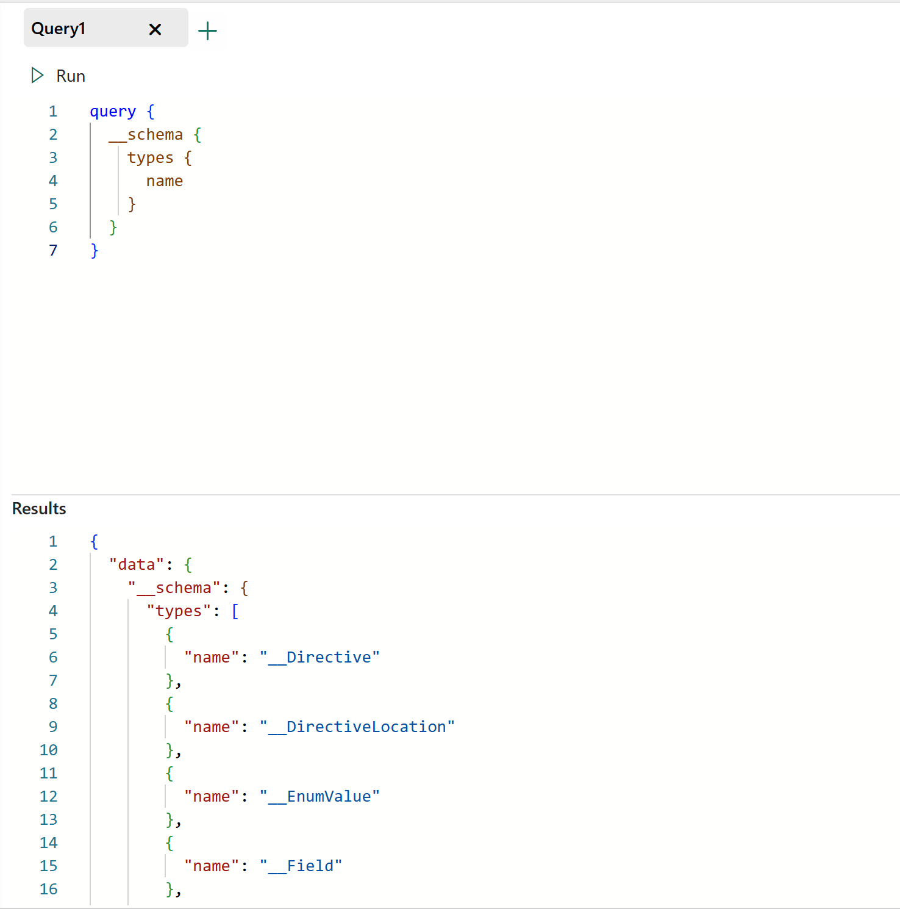
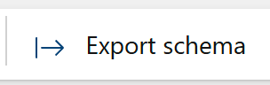

# Fabric API for GraphQL Introspection and Schema Export

The Fabric API for GraphQL provides two mechanisms to retrieve information about your schema. The first is introspection, which is part of the GraphQL standard and enables programmatic querying of the schema. Introspection queries are special kinds of queries that allow you to learn about a GraphQL API’s schema, and they also help power GraphQL development tools. The second is schema export, which allows you to obtain an SDL (GraphQL Schema Definition Language) file that contains your complete schema for external use.

# Introspection

By default, introspection is disabled on your API for GraphQL items. This setting can only be toggled by Workspace Admins. All other users will see a disabled slider. To enable it, simply click on the API **Settings** gear button in the ribbon:

Once you click on the **Settings** button, go to the "Introspection" section in the available settings. You will then see the slider to enable or disable introspection:

If you choose to enable introspection, the following confirmation dialog is displayed:

Press the confirm button to enable introspection. If you choose to cancel, introspection will remain disabled.

# Introspection Query Example

Here's a quick example of an introspection query to retrieve available types from the schema:

The information retrieved by introspection queries can be verbose. You can use query filters to narrow the scope of the query.

If you would like to learn more about introspection, we recommend you take a look at the [GraphQL Foundation's official documentation on introspection](https://graphql.org/learn/introspection/).

# Schema Export

Another way to simplify the retrieval of schema information is the GraphQL schema export. It works directly from your API's Fabric portal bar. Simply click on the "Export schema" button:

And your browser will immediately start downloading an SDL (Schema Definition Language) file containing your entire schema. You can then use this SDL file in any development tool or service that can take advantage of it.

## Related content

- [Fabric API for GraphQL Editor](api-graphql-editor.md)
- [Fabric API for GraphQL schema view and Schema explorer](graphql-schema-view.md)