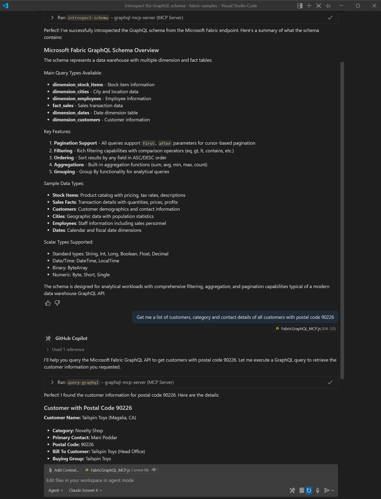

# Connect AI Agents to Fabric API for GraphQL with a local Model Context Protocol (MCP) server


In this tutorial, you learn how to connect AI agents to Microsoft Fabric using GraphQL and the Model Context Protocol (MCP). By the end of this tutorial, you'll have a working local MCP server for development purposes that enables AI assistants like GitHub Copilot, Claude, and other AI agents to naturally query your Fabric data using conversational language.

## What is the Model Context Protocol (MCP)?

The Model Context Protocol (MCP) is a new standard for connecting AI assistants to the systems where data lives, including content repositories, business tools, and development environments. Its aim is to help frontier models produce better, more relevant responses. Think of MCP like a USB-C port for AI applications. Just as USB-C provides a standardized way to connect your devices to various peripherals and accessories, MCP provides a standardized way to connect AI models to external data sources and tools.

Major AI platforms including OpenAI, Microsoft Copilot Studio, and Azure AI Foundry have adopted MCP as a standard way to integrate AI agents with external systems. This makes MCP an ideal choice for connecting AI agents to your Microsoft Fabric data.

## Why GraphQL is perfect for MCP

GraphQL is particularly well-suited for MCP integrations because:

- **Schema introspection**: AI agents can automatically discover available data structures and relationships directly from the GraphQL schema
- **Flexible queries**: Agents can request exactly the data they need in a single request
- **Type safety**: Strong typing helps AI agents understand data formats and constraints
- **Efficient data fetching**: Reduces over-fetching and under-fetching of data

Microsoft Fabric's API for GraphQL makes it easy to expose your Fabric LakeHouses, Data Warehouses, and databases to AI agents through a standardized GraphQL interface. While API for GraphQL already provides powerful querying capabilities, setting up a connection for AI agents might not be as straightforward as it could be. With this simple local MCP server, developers can leverage AI agents to discover their Fabric data structure, understand what’s available, and query it by using natural language – all through the standardized MCP interface. Best of all, there is no need to define a separate MCP tool in the server for each GraphQL type, query or mutation. The MCP server introspects the GraphQL schema empowering AI agents to understand all available types and operations from the get-go.

## Prerequisites

Before you begin this tutorial, make sure you have:

- A Microsoft Fabric workspace with appropriate permissions
- An API for GraphQL item created and configured (see [Create and add data to an API for GraphQL](get-started-api-graphql.md) or [Create GraphQL API from your SQL database in the Fabric portal](../database/sql/graphql-api.md))
- Node.js installed on your development machine
- An Azure App Registration configured for service principal access

## Step 1: Configure service principal access

To authenticate your local MCP server with Microsoft Fabric, you'll need to set up service principal access. Follow the complete guide at [Use Service Principals with Fabric API for GraphQL](api-graphql-service-principal.md) to:

- Create an Azure App Registration
- Configure client credentials
- Set up workspace permissions
- Enable service principals in your tenant

Make sure to note down your **Tenant ID**, **Client ID**, and **Client Secret** as you'll need these for the MCP server configuration.

## Step 2: Enable GraphQL introspection

The MCP server requires schema introspection to automatically discover your GraphQL schema. Follow the instructions at [Microsoft Fabric API for GraphQL Introspection and Schema Export](api-graphql-introspection-schema-export.md) to enable introspection on your GraphQL API.

> [!IMPORTANT]
> Introspection must be enabled for the MCP server to discover your GraphQL schema automatically.


## Step 3: Set up the MCP server

### Clone the sample repository

```bash
git clone https://github.com/microsoft/fabric-samples.git
cd fabric-samples/docs-samples/data-engineering/GraphQL/MCP
```

### Install dependencies

```bash
npm install
```

### Configure environment variables

Create a `.env` file in the project root with your configuration:

```env
MICROSOFT_FABRIC_API_URL=https://your-fabric-endpoint/graphql
MICROSOFT_FABRIC_TENANT_ID=your_tenant_id_here
MICROSOFT_FABRIC_CLIENT_ID=your_client_id_here
MICROSOFT_FABRIC_CLIENT_SECRET=your_client_secret_here
SCOPE=https://api.fabric.microsoft.com/.default
```

Replace the placeholder values with:
- **MICROSOFT_FABRIC_API_URL**: Your GraphQL endpoint from the Fabric portal
- **MICROSOFT_FABRIC_TENANT_ID**: Your Azure tenant ID
- **MICROSOFT_FABRIC_CLIENT_ID**: Your app registration client ID
- **MICROSOFT_FABRIC_CLIENT_SECRET**: Your app registration client secret

### Start the MCP server

```bash
node FabricGraphQL_MCP.js
```

The server will start on `http://localhost:3000` and display:
```
Microsoft Fabric GraphQL MCP server listening on port 3000
API URL: https://your-fabric-endpoint/graphql
Scope: https://api.fabric.microsoft.com/.default
```

### Available MCP tools

The MCP server provides two main tools:

#### `introspect-schema`
- **Purpose**: Retrieves the complete GraphQL schema
- **Parameters**: None
- **Usage**: Must be called first before making queries

#### `query-graphql`
- **Purpose**: Executes GraphQL queries against your Fabric data
- **Parameters**: 
  - `query` (required): The GraphQL query string
  - `variables` (optional): GraphQL variables object
- **Usage**: For all data retrieval and manipulation operations

## Understanding the workflow

The typical MCP workflow follows this pattern:

1. **Schema Discovery**: AI agent must first call `introspect-schema` to understand the schema and available data
2. **Query Planning**: Agent analyzes your natural language request and the schema
3. **Query Generation**: Agent creates appropriate GraphQL queries
4. **Execution**: Agent calls `query-graphql` with the generated queries
5. **Response Processing**: Agent formats and presents the results

## Step 4: Test the MCP server

### Verify server health

* PowerShell

```powershell
Invoke-RestMethod -Uri "http://localhost:3000/health" -Method Get
```

* cURL

```bash
curl http://localhost:3000/health
```

You should receive a response indicating the server is running, similar to:

```json
{"status":"healthy","server":"Microsoft Fabric GraphQL MCP Server","hasToken":true,"tokenExpiry":"2025-06-30T23:11:36.339Z"}
```


### Test schema introspection

* PowerShell

```powershell
$headers = @{
    "Content-Type" = "application/json"
    "Accept" = "application/json, text/event-stream"
}

$body = @{
    jsonrpc = "2.0"
    id = 1
    method = "tools/call"
    params = @{
        name = "introspect-schema"
        arguments = @{}
    }
} | ConvertTo-Json -Depth 3

Invoke-RestMethod -Uri "http://localhost:3000/mcp" -Method Post -Body $body -Headers $headers
```

* cURL

```bash
curl -X POST http://localhost:3000/mcp \
  -H "Content-Type: application/json" \
  -H "Accept: application/json, text/event-stream" \
  -d '{
    "jsonrpc": "2.0",
    "id": 1,
    "method": "tools/call",
    "params": {
      "name": "introspect-schema",
      "arguments": {}
    }
  }'
```

This should return your GraphQL schema definition.

### Test a GraphQL query

* PowerShell

```powershell
$headers = @{
    "Content-Type" = "application/json"
    "Accept" = "application/json, text/event-stream"
}

$body = @{
    jsonrpc = "2.0"
    id = 2
    method = "tools/call"
    params = @{
        name = "query-graphql"
        arguments = @{
            query = "query { __schema { types { name } } }"
        }
    }
} | ConvertTo-Json -Depth 4

Invoke-RestMethod -Uri "http://localhost:3000/mcp" -Method Post -Body $body -Headers $headers
```

* cURL

```bash
curl -X POST http://localhost:3000/mcp \
  -H "Content-Type: application/json" \
  -H "Accept: application/json, text/event-stream" \
  -d '{
    "jsonrpc": "2.0",
    "id": 2,
    "method": "tools/call",
    "params": {
      "name": "query-graphql",
      "arguments": {
        "query": "query { __schema { types { name } } }"
      }
    }
  }'
```

This will return a list of all types in your GraphQL schema.

## Step 5: Connect AI agents

### GitHub Copilot in Visual Studio Code

1. Install the [GitHub Copilot extension](https://marketplace.visualstudio.com/items?itemName=GitHub.copilot) in VS Code
2. Configure the MCP server in your Copilot settings:
   ```json
   {
     "fabric-graphql": {
       "type": "http",
       "url": "http://localhost:3000/mcp"
     }
   }
   ```
3. In Copilot chat, first ask to introspect the schema then try asking a pertinent question related to the introspected data in natural language, for example:

[](media/api-graphql-local-model-context-protocol/api-graphql-local-model-context-protocol.png)

### Cursor IDE

1. Open Cursor settings
2. Add the MCP server configuration:
   ```json
   {
     "fabric-graphql": {
       "type": "http",
       "url": "http://localhost:3000/mcp"
     }
   }
   ```
3. In the chat, first ask to introspect the schema then try asking a pertinent question related to the introspected data in natural language.


## Security considerations

While the local MCP server should be implemented for development purposes only as described in this tutorial, it's implemented with HTTP transport, making it easier to use it as a starting point for more complex client-server or web based integrations. If you're deploying MCP servers in production:

- Use Azure Key Vault for storing secrets instead of `.env` files
- Implement proper authorization, network security and firewall rules
- Enable audit logging for all GraphQL queries
- Use Azure App Service or Container Instances for hosting
- Implement rate limiting and authentication for the MCP endpoints
- Regularly rotate client secrets and certificates

## Troubleshooting

### Common issues and solutions

**Authentication errors**
- Verify your Azure App Registration has the correct permissions
- Check that service principals are enabled in your Fabric tenant
- Ensure your client secret hasn't expired

**Schema introspection fails**
- Confirm introspection is enabled in your GraphQL API settings
- Check that your GraphQL endpoint URL is correct
- Verify network connectivity to your Fabric workspace

**AI agent doesn't recognize tools**
- Restart your AI client after configuration changes
- Verify the MCP server URL is accessible
- Check server logs for any error messages

**Query execution errors**
- Review the server console for logged queries and errors
- Ensure your queries match the available schema
- Check that you have appropriate permissions for the requested data


## Related content

- [Model Context Protocol documentation](https://modelcontextprotocol.io/introduction)
- [GitHub repository with complete code samples](https://github.com/microsoft/fabric-samples/tree/main/docs-samples/data-engineering/GraphQL/MCP)
- [Microsoft Fabric API for GraphQL overview](api-graphql-overview.md)
- [Connect applications to Fabric API for GraphQL](connect-apps-api-graphql.md)
- [Create and add data to an API for GraphQL](get-started-api-graphql.md)
- [Microsoft Fabric API for GraphQL FAQ](graphql-faq.yml)
- [Integrate Azure API Management with Fabric API for GraphQL](api-graphql-azure-api-management.md)