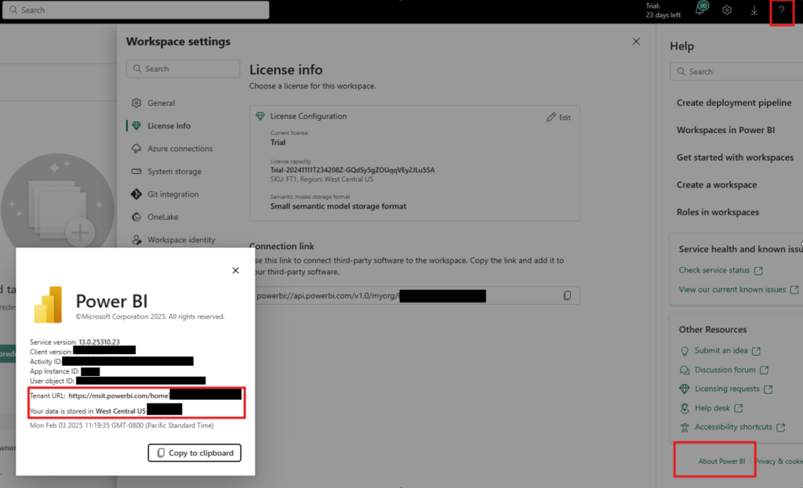
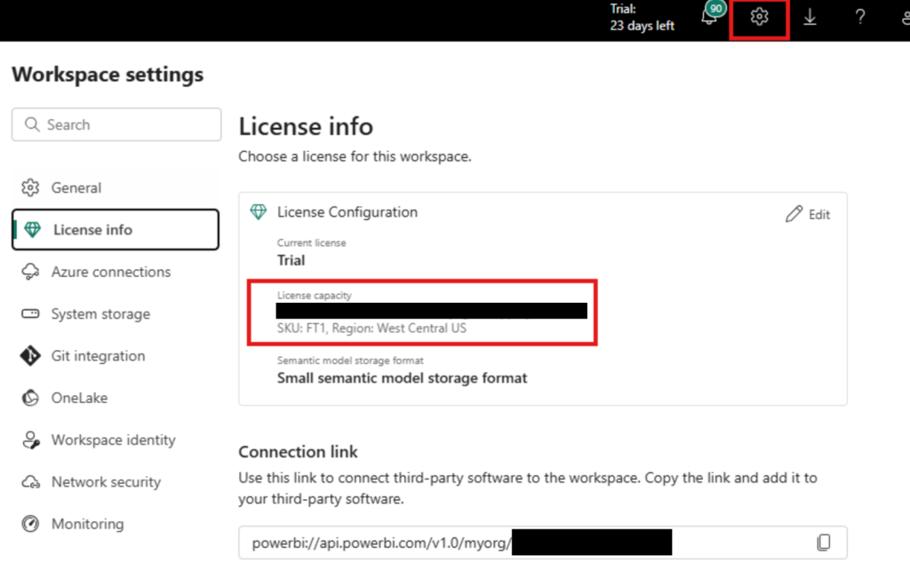

# Fabric API for GraphQL Performance Best Practices 

Microsoft Fabric’s API for GraphQL offers a powerful way to query data efficiently, but performance optimization is key to ensuring smooth and scalable performance. Whether you’re handling complex queries or optimizing response times, the following best practices will help you get the best performance out of your GraphQL implementation and maximize your API efficiency in Fabric. 

## Regions
Cross-region calls can generally be the cause higher latency. In order to achieve the best performance, it is recommended to have clients connecting to APIs in the same tenant and capacity region.

### Tenant region

1.  Go to the Microsoft Fabric portal with an admin account and click on the highlighted icons to retrieve the tenant region information.

In this example the tenant region is West Central US.

### Capacity region

1.  Go to Microsoft Fabric portal, open the workspace which hosts your Fabric’s API for GraphQL.
2.  Go to license information.

In this example the capacity region is also West Central US. 

### Data source region

1.  If your data source is hosted in the Fabric platform, the workspace’s capacity region would be the data source region.
2.  If your data source is outside the Fabric platform, for example an Azure SQL database, you should be able to find the regional information in the Azure Portal.

## Performance testing

For customers evaluating their API performance, we recommend adhering to the following guidelines to ensure consistent and reliable results.

## Client-side tools

To emulate the closet behavior to your application, it is recommended to use scripts or a demo web applications to perform the testing to measure the performance. In addition to that, using HTTP connection pooling can greatly reduce the latencies especially for cross-region scenarios.

You can use this [sample performance test script](https://github.com/microsoft/fabric-samples/blob/main/docs-samples/data-engineering/GraphQL/benchmarking/graphql_performance_test_notebook.ipynb) that can help you get started.

Related topics:

*   [Advanced Usage — Requests 2.32.3 documentation](https://docs.python-requests.org/en/latest/user/advanced/#session-objects)
*   [HttpClient guidelines for .NET](dotnet/fundamentals/networking/http/httpclient-guidelines#recommended-use)

## Data Collection & Evaluation

It is advisable to automate the request execution over a well defined time period leveraging scripts or performance testing tools. Analyzing the average or percentile-based results will help ensure more accurate and unbiased performance measurements.

## Common issues

Here is list of common issues that can impact API latency and performance.

1.  Your client geo-location is different from your tenant and capacity region:
    *   If you intend to achieve the best performance for your application, having clients and API resources in the same region will help achieve the goal.
2.  Query the API for GraphQL a couple of times before testing:
    *   API for GraphQL doesn't use or consume capacity (CUs) when it's idle. Which means the API environment needs be initialized internally during the first call which takes a couple of extra seconds. API for GraphQL has internal caching mechanisms to help reduce latencies for continuous calls, however you might face latency spikes for the initial calls.
    *   Other than the API itself, certain data sources are known to undergo a warm-up phase, which will result in higher latencies for initial requests.  If the API is accessing a data source that is also idle and happens to need to be initialized during the first execution as well, the latency will be higher because it needs to wait the initialization of both the data source and the API.
    *   Subsequent calls will be faster because the environment initialization only happens once.

3.  Data source and Fabric capacity related setup.
    *   You can think of API for GraphQL as a wrapper on top of your data sources. If your data source itself has performance issues due to the nature of its complexity, it is expected that API latencies can be high. When such cases happen, it is recommended to test querying your data sources directly for a more effective performance comparison with that of API for GraphQL.
        *   Follow this guide regarding how to choose a suitable data store for your business needs: [Fabric decision guide – choose a data store](fabric/fundamentals/decision-guide-data-store#data-store-properties)
    *   When accessing API for GraphQL, performance is going to be bound by the Fabric capacity SKU you have selected.
        *   Refer to this general guidance about Fabric capacity SKU and its compute power: [Microsoft Fabric concepts](fabric/enterprise/licenses#capacity)

* * *

Several factors can impact API performance. Understanding your data source setup, selecting the right regions, and effectively measuring performance are crucial for optimization. 

**Related content**

- [Fabric API for GraphQL overview](get-started-api-graphql.md)
- [Fabric API for GraphQL editor](api-graphql-editor.md)