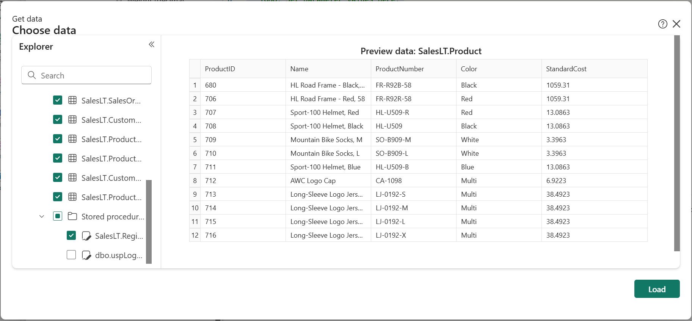
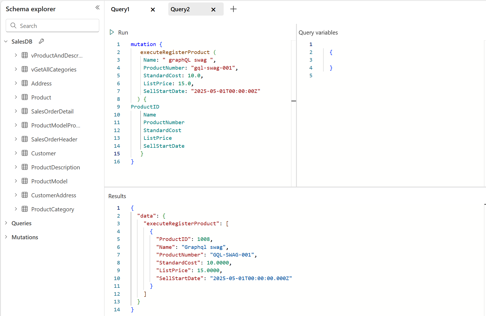

# Use stored procedures with Fabric API for GraphQL

Microsoft Fabric API for GraphQL makes it easy to query and mutate data from a Fabric SQL database and other Fabric data sources such as Data Warehouse and Lakehouse, with strongly typed schemas and a rich query language allowing developers to create an intuitive API without writing custom server code. You can use stored procedures to encapsulate and reuse complex business logic, including input validation and data transformation.

In this example we learn how to use a stored procedure to register new products, with server-side logic for validation, formatting, and ID generation, all exposed through a GraphQL mutation in Fabric.

## Get started

We get started by creating an SQL database in Fabric:

1.  In your Fabric workspace, select **New Item** then **SQL database (preview).**
2.  Give your database a name, then select **Sample data** to quickly create all the required tables and data in your database.

## Scenario: register a new product

Suppose you want to create a new product with:

*   Validation of pricing logic (for example,. ListPrice > StandardCost)
*   Transformation (for example,. capitalize the first letter of product name, trim  then uppercase product number)
*   ProductID generation (by incrementing the latest ProductID)

### Step 1: Create the Stored Procedure

Here’s a T-SQL stored procedure that encapsulates all the business logic we need. In your SQL database, click on **New Query** and use the following statement:

```sql
CREATE PROCEDURE SalesLT.RegisterProduct
  @Name nvarchar(50),
  @ProductNumber nvarchar(25),
  @StandardCost money,
  @ListPrice money,
  @SellStartDate datetime
AS
BEGIN
  SET NOCOUNT ON;
  SET IDENTITY\_INSERT SalesLT.Product ON;

  -- Validate pricing logic
  IF @ListPrice <= @StandardCost
    THROW 50005, 'ListPrice must be greater than StandardCost.', 1;

-- Transform product name: capitalize first letter only
  DECLARE @CleanName nvarchar(50);
  SET @CleanName = UPPER(LEFT(LTRIM(RTRIM(@Name)), 1)) + LOWER(SUBSTRING(LTRIM(RTRIM(@Name)), 2, 49));

  -- Trim and uppercase product number
  DECLARE @CleanProductNumber nvarchar(25);
  SET @CleanProductNumber = UPPER(LTRIM(RTRIM(@ProductNumber)));

  -- Generate ProductID by incrementing the latest existing ID
  DECLARE @ProductID int;
  SELECT @ProductID = ISNULL(MAX(ProductID), 0) + 1 FROM SalesLT.Product;

  INSERT INTO SalesLT.Product (
    ProductID,
    Name,
    ProductNumber,
    StandardCost,
    ListPrice,
    SellStartDate
  )
  OUTPUT 
    inserted.ProductID,
    inserted.Name,
    inserted.ProductNumber,
    inserted.StandardCost,
    inserted.ListPrice,
    inserted.SellStartDate
  VALUES (
    @ProductID,
    @CleanName,
    @CleanProductNumber,
    @StandardCost,
    @ListPrice,
    @SellStartDate
  );
END;
```

Click **Run** to test the execution. You notice a new stored procedure **RegisterProduct** under the **Stored Procedures** folder in the **SalesLT** database. Use the following query to test the procedure logic:

```sql
DECLARE @RC int
DECLARE @Name nvarchar(50)
DECLARE @ProductNumber nvarchar(25)
DECLARE @StandardCost money
DECLARE @ListPrice money
DECLARE @SellStartDate datetime

-- TODO: Set parameter values here.
Set @Name = 'test product'       
Set @ProductNumber = 'tst-0012'
Set @StandardCost = '10.00'
Set @ListPrice = '9.00'
Set @SellStartDate = '2025-05-01T00:00:00Z'

EXECUTE @RC = \[SalesLT\].\[RegisterProduct\] 
   @Name
  ,@ProductNumber
  ,@StandardCost
  ,@ListPrice
  ,@SellStartDate
GO
```

### Step 2: Create a GraphQL API

Creating an API from your SQL table is fast, easy, and straightforward. You just need to click the **New API for GraphQL** button in the SQL database ribbon and give your API a name.

Next select the **SalesLT** tables in your database and the stored procedure we just created, then click **Load**:



The GraphQL API, schema, and all resolvers are automatically generated in seconds based on the SQL tables and stored procedure.

### Step 3: Call the procedure from GraphQL

Once the API is ready, the stored procedure becomes available as a mutation in the Fabric GraphQL schema. Go to the query editor and execute the following mutation:

```graphql
mutation {
   executeRegisterProduct (
    Name: " graphQL swag ",
    ProductNumber: "gql-swag-001",
    StandardCost: 10.0,
    ListPrice: 15.0,
    SellStartDate: "2025-05-01T00:00:00Z"
  ) {
ProductID
    Name
    ProductNumber
    StandardCost
    ListPrice
    SellStartDate
   }
}
```



**Tips**

*   Fabric GraphQL automatically generates mutation fields for stored procedures that return a result set defined in the output of the procedure.
*   Business logic lives inside the procedure, not the client.
*   Use deterministic ID generation only if you don’t rely on identity columns.

Exposing stored procedures via Fabric APIs gives you the power to define robust, consistent rules in SQL for your data, and access it cleanly via GraphQL.

## Related content

- [Fabric API for GraphQL Editor](api-graphql-editor.md)
- [SQL database in Microsoft Fabric](../database/sql/overview.md)

