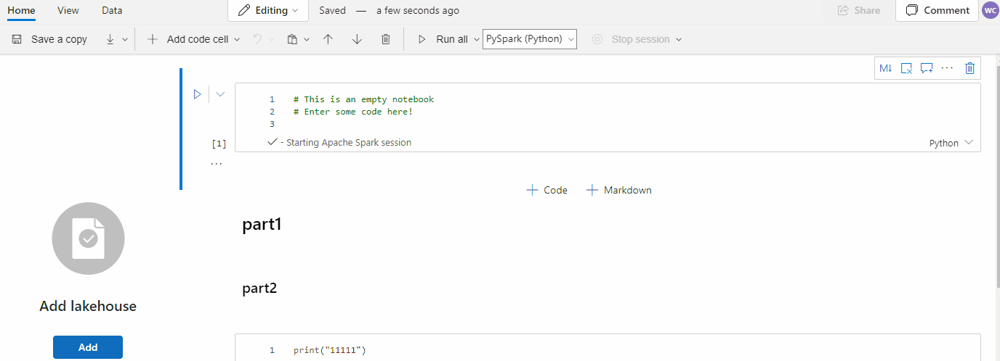
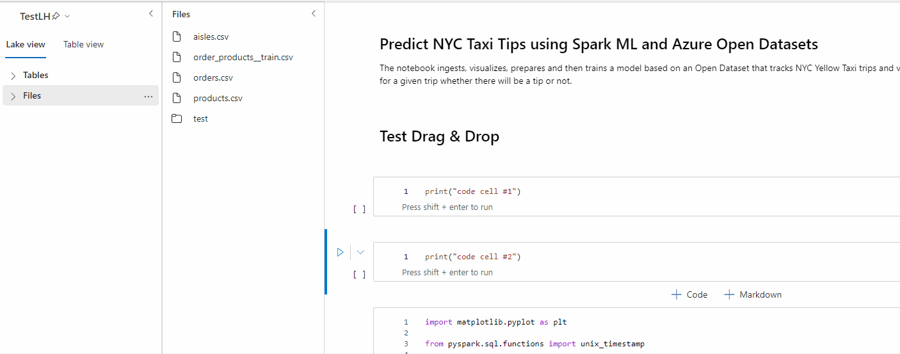
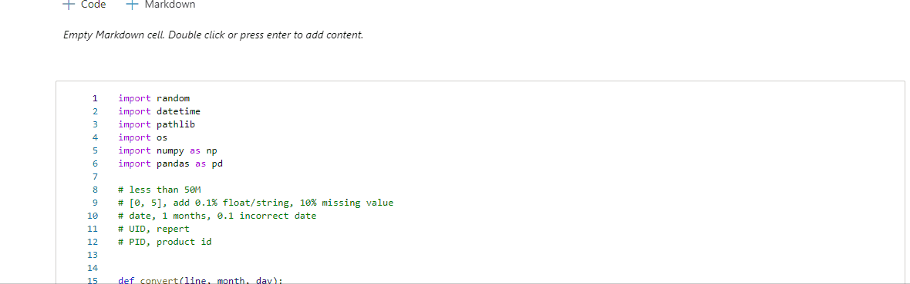
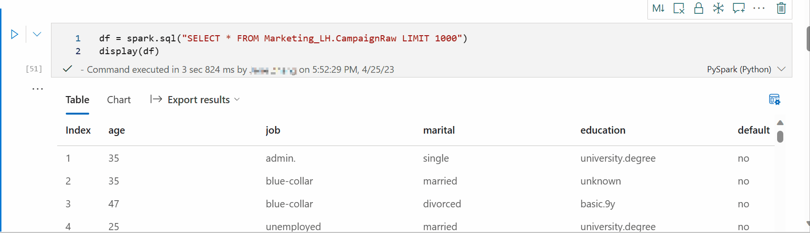
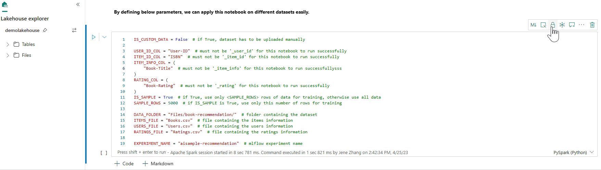
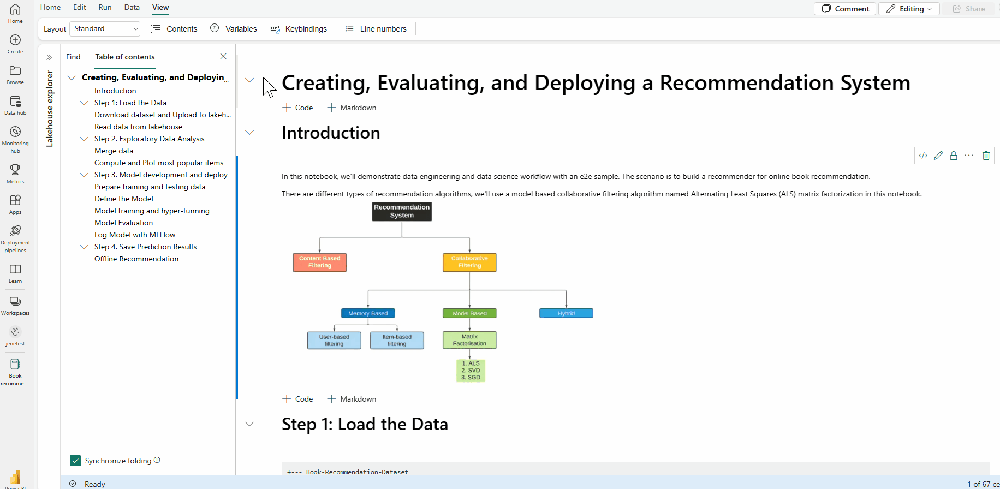

# Develop, execute, and manage Microsoft Fabric notebooks

A Microsoft Fabric notebook is a primary code item for developing Apache Spark jobs and machine learning experiments. It's a web-based interactive surface used by data scientists and data engineers to write code benefiting from rich visualizations and Markdown text. This article explains how to develop notebooks with code cell operations and run them.

## Develop notebooks

Notebooks consist of cells, which are individual blocks of code or text that can be run independently or as a group.

We provide rich operations to develop notebooks:

- [Add a cell](#add-a-cell)
- [Set a primary language](#set-a-primary-language)
- [Use multiple languages](#use-multiple-languages)
- [IDE-style IntelliSense](#ide-style-intellisense)
- [Code snippets](#code-snippets)
- [Drag and drop to insert snippets](#drag-and-drop-to-insert-snippets)
- [Drag and drop to insert images](#drag-and-drop-to-insert-images)
- [Format text cell with toolbar buttons](#format-text-cell-with-toolbar-buttons)
- [Undo or redo cell operation](#undo-or-redo-cell-operations)
- [Move a cell](#move-a-cell)
- [Delete a cell](#delete-a-cell)
- [Collapse a cell input](#collapse-a-cell-input)
- [Collapse a cell output](#collapse-a-cell-output)
- [Cell output security](#cell-output-security)
- [Lock or freeze a cell](#lock-or-freeze-a-cell)
- [Notebook contents](#notebook-contents)
- [Markdown folding](#markdown-folding)
- [Find and replace](#find-and-replace)

### Add a cell

There are multiple ways to add a new cell to your notebook.

1. Hover over the space between two cells and select **Code** or **Markdown**.

1. Use [Shortcut keys in command mode](#shortcut-keys-in-command-mode). Press **A** to insert a cell above the current cell. Press **B** to insert a cell below the current cell.

#### Set a primary language

Fabric notebooks currently support four Apache Spark languages:

- PySpark (Python)
- Spark (Scala)
- Spark SQL
- SparkR

You can set the primary language for new added cells from the drop-down list in the top command bar.

### Use multiple languages

You can use multiple languages in a notebook by specifying the language magic command at the beginning of a cell. You can also switch the cell language from the language picker. The following table lists the magic commands for switching cell languages.

:::image type="content" source="media\author-execute-notebook\language-command-in-cell.png" alt-text="Screenshot showing an example of the language magic command entered at the beginning of a cell." lightbox="media\author-execute-notebook\language-command-in-cell.png":::

| **Magic command** | **Language** | **Description** |
|---|---|---|
| %%pyspark | Python | Execute a **Python** query against Spark Context. |
| %%spark | Scala | Execute a **Scala** query against Spark Context. |
| %%sql | SparkSQL | Execute a **SparkSQL** query against Spark Context. |
| %%html | Html | Execute a **HTML** query against Spark Context. |
| %%sparkr | R | Execute a **R** query against Spark Context. |

### IDE-style IntelliSense

Fabric notebooks are integrated with the Monaco editor to bring IDE-style IntelliSense to the cell editor. Syntax highlight, error marker, and automatic code completions help you to quickly write code and identify issues.

The IntelliSense features are at different levels of maturity for different languages. The following table shows what Fabric supports:

| **Languages** | **Syntax highlight** | **Syntax error marker** | **Syntax code completion** | **Variable code completion** | **System function code completion** | **User function code completion** | **Smart indent** | **Code folding** |
|---|---|---|---|---|---|---|---|---|
| PySpark (Python) | Yes | Yes | Yes | Yes | Yes | Yes | Yes | Yes |
| Spark (Scala) | Yes | Yes | Yes | Yes | Yes | Yes | Yes | Yes |
| SparkSQL | Yes | Yes | Yes | Yes | Yes | No | Yes | Yes |
| SparkR | Yes | Yes | Yes | Yes | Yes | Yes | Yes | Yes |

> [!NOTE]
> You must have an active Spark session to use IntelliSense code completion.

### Code snippets

Fabric notebooks provide code snippets that help you easily write commonly used code patterns, like:

- Reading data as a Spark DataFrame
- Drawing charts with Matplotlib

Snippets appear in [Shortcut keys of IDE style IntelliSense](#ide-style-intellisense) mixed with other suggestions. The code snippet contents align with the code cell language. You can see available snippets by typing **Snippet**. You can also type any keyword to see a list of relevant snippets. For example, if you type **read**, you see the list of snippets to read data from various data sources.



### Drag and drop to insert snippets

Use drag and drop to read data from Lakehouse explorer conveniently. Multiple file types are supported here; you can operate on text files, tables, images, etc. You can either drop to an existing cell or to a new cell. The notebook generates the code snippet accordingly to preview the data.



### Drag and drop to insert images

Use drag and drop to easily insert images from your browser or local computer to a markdown cell.



### Format text cell with toolbar buttons

To complete common markdown actions, use the format buttons in the text cell toolbar.

:::image type="content" source="media\author-execute-notebook\format-text-toolbar.png" alt-text="Screenshot of the text formatting toolbar." lightbox="media\author-execute-notebook\format-text-toolbar.png":::

### Undo or redo cell operations

Select **Undo** or **Redo**, or press **Z** or **Shift+Z** to revoke the most recent cell operations. You can undo or redo up to 10 of the latest historical cell operations.

:::image type="content" source="media\author-execute-notebook\undo-redo.png" alt-text="Screenshot showing the undo and redo menu options." lightbox="media\author-execute-notebook\undo-redo.png":::

Supported undo cell operations:

- Insert or delete cell. You can revoke the delete operations by selecting **Undo** (the text content is kept along with the cell).
- Reorder cell.
- Toggle parameter.
- Convert between code cell and Markdown cell.

> [!NOTE]
> In-cell text operations and code cell commenting operations can't be undone. You can undo or redo up to 10 of the latest historical cell operations.

### Move a cell

You can drag from the empty part of a cell and drop it to the desired position.

<!--  -->

You can also move the selected cell using **Move up** and **Move down** on the ribbon.

:::image type="content" source="media\author-execute-notebook\move-cell-options.png" alt-text="Screenshot showing the options for moving a cell." lightbox="media\author-execute-notebook\move-cell-options.png":::

### Delete a cell

To delete a cell, select the delete button at the right side of the cell.

You can also use [shortcut keys in command mode](#shortcut-keys-in-command-mode). Press **Shift+D** to delete the current cell.

### Collapse a cell input

Select the **More commands** ellipses (...) on the cell toolbar and **Hide input** to collapse the current cell's input. To expand it again, select **Show input** when the cell is collapsed.

<!--  -->

### Collapse a cell output

Select the **More commands** ellipses (...) on the cell toolbar and **Hide output** to collapse the current cell's output. To expand it again, select **Show output** when the cell output is collapsed.

### Cell output security

Using [OneLake data access roles (preview)](../onelake/security/get-started-data-access-roles.md), users can configure access to only specific folders in a lakehouse during notebook queries. Users without access to a folder or table will see an unauthorized error during query execution.

> [!IMPORTANT]
> Security only applies during query execution and any notebook cells containing query results can be viewed by users that are not authorized to run queries against the data directly.

### Lock or freeze a cell

The lock and freeze cell operations allow you to make cells read-only or stop code cells from being run on an individual basis.



### Merge and split cells

You can use **Merge with previous cell** or **Merge with next cell** to merge related cells conveniently.

Selecting **Split cell** helps you split irrelevant statements to multiple cells. The operation splits the code according to your cursor's line position.

:::image type="content" source="media\author-execute-notebook\merge-split-cell.png" alt-text="Screenshot showing the entry of merge split cells." lightbox="media\author-execute-notebook\merge-split-cell.png":::

### Notebook contents

Selecting Outlines or Table of Contents presents the first markdown header of any markdown cell in a sidebar window for quick navigation. The Outlines sidebar is resizable and collapsible to fit the screen in the best way possible. Select the **Contents** button on the notebook command bar to open or hide the sidebar.

:::image type="content" source="media\author-execute-notebook\outline-option.png" alt-text="Screenshot showing where to select the Contents option." lightbox="media\author-execute-notebook\outline-option.png":::

### Markdown folding

The markdown folding option allows you to hide cells under a markdown cell that contains a heading. The markdown cell and its hidden cells are treated the same as a set of contiguous multi-selected cells when performing cell operations.



### Find and replace

The find and replace option can help you match and locate the keywords or expression within your notebook content. You can also easily replace the target string with a new string.

:::image type="content" source="media\author-execute-notebook\find-replace.png" alt-text="Screenshot showing find and replace pane." lightbox="media\author-execute-notebook\find-replace.png":::

## Run notebooks

You can run the code cells in your notebook individually or all at once. The status and progress of each cell is displayed in the notebook.

### Run a cell

There are several ways to run the code in a cell.

- Hover on the cell you want to run and select the **Run cell** button or press **Ctrl+Enter**.

- Use [Shortcut keys in command mode](#shortcut-keys-in-command-mode). Press **Shift+Enter** to run the current cell and select the next cell. Press **Alt+Enter** to run the current cell and insert a new cell.

### Run all cells

Select the **Run all** button to run all the cells in the current notebook in sequence.

### Run all cells above or below

Expand the drop-down list from **Run all**, then select **Run cells above** to run all the cells above the current in sequence. Select **Run cells below** to run the current cell and all the cells below the current in sequence.

:::image type="content" source="media\author-execute-notebook\run-cells-menu.png" alt-text="Screenshot showing the Run all menu options." lightbox="media\author-execute-notebook\run-cells-menu.png":::

### Cancel all running cells

Select **Cancel all** to cancel the running cells or cells waiting in the queue.

### Stop session

**Stop session** cancels the running and waiting cells and stops the current session. You can restart a brand new session by selecting the run option again.

:::image type="content" source="media\author-execute-notebook\cancel-all-stop-session.png" alt-text="Screenshot showing where to select Cancel all runs and stop a session." lightbox="media\author-execute-notebook\cancel-all-stop-session.png":::


### Reference run

#### Reference run a Notebook

In addition to [mssparkutils reference run API](microsoft-spark-utilities.md), you can also use the ```%run <notebook name>``` magic command to reference another notebook within current notebook's context. All the variables defined in the reference notebook are available in the current notebook. The ```%run``` magic command supports nested calls but doesn't support recursive calls. You receive an exception if the statement depth is larger than **five**.

Example:
``` %run Notebook1 { "parameterInt": 1, "parameterFloat": 2.5, "parameterBool": true,  "parameterString": "abc" } ```.

Notebook reference works in both interactive mode and pipeline.

> [!NOTE]
>
> - The ```%run``` command currently only supports reference notebooks in the same workspace with the current notebook.
> - The ```%run``` command currently only supports up to four parameter value types: `int`, `float`, `bool`, and `string`. Variable replacement operation is not supported.
> - The ```%run``` command doesn't support nested reference with a depth larger than **five**.

#### Reference run a script

The ```%run``` command also allows you to run Python or SQL files that are stored in the notebook’s built-in resources, so you can execute your source code files in notebook conveniently.

``` %run [-b/--builtin -c/--current] [script_file.py/.sql] [variables ...] ```

For options:
- **-b/--builtin**: This option indicates that the command will find and run the specified script file from the notebook’s built-in resources.
- **-c/--current**: This option ensures that the command always uses the current notebook’s built-in resources, even if the current notebook is referenced by other notebooks.

Examples:

- To run *script_file.py* from the built-in resources: ``` %run -b script_file.py ```

- To run *script_file.sql* from the built-in resources: ``` %run -b script_file.sql ```

- To run *script_file.py* from the built-in resources with specific variables: ``` %run -b script_file.py { "parameterInt": 1, "parameterFloat": 2.5, "parameterBool": true, "parameterString": "abc" } ```

> [!NOTE] 
> If the command does not contain **-b/--builtin**, it will attempt to find and execute notebook item inside the same workspace rather than the built-in resources.

Examples for nested run case:

1. Suppose we have two notebooks.
    - **Notebook1**: Contains *script_file1.py* in its built-in resources
    - **Notebook2**: Contains *script_file2.py* in its built-in resources
1. Let's use **Notebook1** work as a root notebook with the content: ``` %run Notebook2 ```.
1. Then in the **Notebook2** the usage instruction is:
    - To run *script_file1.py* in **Notebook1**(the root Notebook) the code would be: ``` %run -b script_file1.py ```
    - To run *script_file2.py* in **Notebook2**(the current Notebook) the code would be: ``` %run -b -c script_file2.py ```

### Variable explorer

Fabric notebooks provide a built-in variables explorer that displays the list of the variables name, type, length, and value in the current Spark session for PySpark (Python) cells. More variables show up automatically as they're defined in the code cells. Clicking on each column header sorts the variables in the table.

To open or hide the variable explorer, select **Variables** on the notebook ribbon **View**.

:::image type="content" source="media\author-execute-notebook\variables.png" alt-text="Screenshot showing where to open variables." lightbox="media\author-execute-notebook\variables.png":::

> [!NOTE]
> The variable explorer only supports Python.

### Cell status indicator

A step-by-step cell execution status is displayed beneath the cell to help you see its current progress. Once the cell run is complete, an execution summary with the total duration and end time appears and is stored there for future reference.

:::image type="content" source="media\author-execute-notebook\cell-run-status.png" alt-text="Screenshot showing an example of cell run status details." lightbox="media\author-execute-notebook\cell-run-status.png":::

### Inline Spark job indicator

The Fabric notebook is Spark based. Code cells are executed on the Spark cluster remotely. A Spark job progress indicator is provided with a real-time progress bar that appears to help you understand the job execution status. The number of tasks per each job or stage helps you to identify the parallel level of your Spark job. You can also drill deeper to the Spark UI of a specific job (or stage) via selecting the link on the job (or stage) name.

You can also find the **Cell level real-time log** next to the progress indicator, and **Diagnostics** can provide you with useful suggestions to help refine and debug the code.

:::image type="content" source="media\author-execute-notebook\spark-progress-details.png" alt-text="Screenshot of details of Spark jobs progress." lightbox="media\author-execute-notebook\spark-progress-details.png":::

In **More actions**, you can easily navigate to the **Spark application details** page and **Spark web UI** page.

:::image type="content" source="media\author-execute-notebook\inline-monitor-more-actions.png" alt-text="Screenshot of details of more actions." lightbox="media\author-execute-notebook\inline-monitor-more-actions.png":::

### Secret redaction

To prevent credentials being accidentally leaked when running notebooks, Fabric notebooks support **Secret redaction** to replace the secret values that are displayed in cell output with ```[REDACTED]```. Secret redaction is applicable for **Python**, **Scala**, and **R**.

:::image type="content" source="media\author-execute-notebook\secret-redaction.png" alt-text="Screenshot of secret redaction." lightbox="media\author-execute-notebook\secret-redaction.png":::

## Magic commands in a notebook

### Built-in magic commands

You can use familiar Ipython magic commands in Fabric notebooks. Review the following list of currently available magic commands.

> [!NOTE]
> These are the only magic commands supported in Fabric pipeline: %%pyspark, %%spark, %%csharp, %%sql, %%configure.

Available line magic commands:
[%lsmagic](https://ipython.readthedocs.io/en/stable/interactive/magics.html#magic-lsmagic), [%time](https://ipython.readthedocs.io/en/stable/interactive/magics.html#magic-time), [%timeit](https://ipython.readthedocs.io/en/stable/interactive/magics.html#magic-timeit), [%history](https://ipython.readthedocs.io/en/stable/interactive/magics.html#magic-history), [%run](#reference-run), [%load](https://ipython.readthedocs.io/en/stable/interactive/magics.html#magic-load), %alias, %alias_magic, %autoawait, %autocall, %automagic, %bookmark, %cd, %colors, %dhist, %dirs, %doctest_mode, %killbgscripts, %load_ext, %logoff, %logon, %logstart, %logstate, %logstop, %magic, %matplotlib, %page, %pastebin, %pdef, %pfile, %pinfo, %pinfo2, %popd, %pprint, %precision, %prun, %psearch, %psource, %pushd, %pwd, %pycat, %quickref, %rehashx, %reload_ext, %reset, %reset_selective, %sx, %system, %tb, %unalias, %unload_ext, %who, %who_ls, %whos, %xdel, %xmode.

Fabric notebook also supports the improved library management commands **%pip** and **%conda**. For more information about usage, see [Manage Apache Spark libraries in Microsoft Fabric](library-management.md).

Available cell magic commands:
[%%time](https://ipython.readthedocs.io/en/stable/interactive/magics.html#magic-time), [%%timeit](https://ipython.readthedocs.io/en/stable/interactive/magics.html#magic-timeit), [%%capture](https://ipython.readthedocs.io/en/stable/interactive/magics.html#cellmagic-capture), [%%writefile](https://ipython.readthedocs.io/en/stable/interactive/magics.html#cellmagic-writefile), [%%sql](#use-multiple-languages), [%%pyspark](#use-multiple-languages), [%%spark](#use-multiple-languages), [%%csharp](#use-multiple-languages), [%%configure](#spark-session-configuration-magic-command), [%%html](https://ipython.readthedocs.io/en/stable/interactive/magics.html#cellmagic-html), [%%bash](https://ipython.readthedocs.io/en/stable/interactive/magics.html#cellmagic-bash), [%%markdown](https://ipython.readthedocs.io/en/stable/interactive/magics.html#cellmagic-markdown), [%%perl](https://ipython.readthedocs.io/en/stable/interactive/magics.html#cellmagic-perl), [%%script](https://ipython.readthedocs.io/en/stable/interactive/magics.html#cellmagic-script), [%%sh](https://ipython.readthedocs.io/en/stable/interactive/magics.html#cellmagic-sh).

### Custom magic commands

You can also build out more custom magic commands to meet your specific needs. Here's an example:

1. Create a notebook with name *"MyLakehouseModule"*.

   :::image type="content" source="media\author-execute-notebook\custom-magic-define.png" alt-text="Screenshot of define a custom magic." lightbox="media\author-execute-notebook\custom-magic-define.png":::

1. In another notebook, reference the *"MyLakehouseModule"* and its magic commands. This process is how you can conveniently organize your project with notebooks that use different languages.

   :::image type="content" source="media\author-execute-notebook\consume-custom-magic.png" alt-text="Screenshot of use custom magic." lightbox="media\author-execute-notebook\consume-custom-magic.png":::

## IPython Widgets

IPython Widgets are eventful Python objects that have a representation in the browser. You can use IPython Widgets as low-code controls (for example, slider or text box) in your notebook, just like the Jupyter notebook. Currently it only works in a Python context.

### To use IPython Widgets

1. Import the *ipywidgets* module first to use the Jupyter Widget framework.

   ```python
   import ipywidgets as widgets
   ```

1. Use the top-level *display* function to render a widget, or leave an expression of *widget* type at the last line of the code cell.

   ```python
   slider = widgets.IntSlider()
   display(slider)
   ```

1. Run the cell. The widget displays in the output area.

   ```python
   slider = widgets.IntSlider()
   display(slider)
   ```

   :::image type="content" source="media\author-execute-notebook\widget-in-output.png" alt-text="Screenshot of widget displayed in the output area." lightbox="media\author-execute-notebook\widget-in-output.png":::

1. Use multiple *display()* calls to render the same widget instance multiple times. They remain in sync with each other.

   ```python
   slider = widgets.IntSlider()
   display(slider)
   display(slider)
   ```

   :::image type="content" source="media\author-execute-notebook\multiple-time-widget.png" alt-text="Screenshot showing multiple times of one widget." lightbox="media\author-execute-notebook\multiple-time-widget.png":::

1. To render two widgets independent of each other, create two widget instances:

   ```python
   slider1 = widgets.IntSlider()
   slider2 = widgets.IntSlider()
   display(slider1)
   display(slider2)
   ```

   :::image type="content" source="media\author-execute-notebook\multiple-widget-instances.png" alt-text="Screenshot showing multiple instances of widgets." lightbox="media\author-execute-notebook\multiple-widget-instances.png":::

### Supported widgets

| **Widgets type** | **Widgets** |
|---|---|
| Numeric widgets | IntSlider, FloatSlider, FloatLogSlider, IntRangeSlider, FloatRangeSlider, IntProgress, FloatProgress, BoundedIntText, BoundedFloatText, IntText, FloatText |
| Boolean widgets | ToggleButton, Checkbox, Valid |
| Selection widgets | Dropdown, RadioButtons, Select, SelectionSlider, SelectionRangeSlider, ToggleButtons, SelectMultiple |
| String widgets | Text, Text area, Combobox, Password, Label, HTML, HTML Math, Image, Button |
| Play (animation) widgets | Date picker, Color picker, Controller |
| Container or layout widgets | Box, HBox, VBox, GridBox, Accordion, Tabs, Stacked |

### Known limitations

- The following widgets aren't supported yet. The following workarounds are available:

   | **Functionality** | **Workaround** |
   |---|---|
   | *Output* widget | You can use *print()* function instead to write text into stdout. |
   | *widgets.jslink()* | You can use *widgets.link()* function to link two similar widgets.
   | *FileUpload* widget | Not supported yet. |

- The Fabric global *display* function doesn't support displaying multiple widgets in one call (for example, *display(a, b)*). This behavior is different from the IPython *display* function.

- If you close a notebook that contains an IPython widget, you can't see or interact with it until you execute the corresponding cell again.

## Integrate a notebook

### Designate a parameters cell

To parameterize your notebook, select the ellipses (...) to access the **More** commands at the cell toolbar. Then select **Toggle parameter cell** to designate the cell as the parameters cell.

:::image type="content" source="media\author-execute-notebook\toggle-parameter-cell.png" alt-text="Screenshot showing where to select the Toggle parameter cell option." lightbox="media\author-execute-notebook\toggle-parameter-cell.png":::

The parameter cell is useful for integrating a notebook in a pipeline. Pipeline activity looks for the parameters cell and treats this cell as the default for the parameters passed in at execution time. The execution engine adds a new cell beneath the parameters cell with input parameters in order to overwrite the default values.

### Assign parameters values from a pipeline

After you create a notebook with parameters, you can execute it from a pipeline with the Fabric notebook activity. After you add the activity to your pipeline canvas, you can set the parameters values under the **Base parameters** section of the **Settings** tab.

:::image type="content" source="media\author-execute-notebook\assign-parameter.png" alt-text="Screenshot showing where to assign parameters values from a pipeline." lightbox="media\author-execute-notebook\assign-parameter.png":::

When assigning parameter values, you can use the [pipeline expression language](..\data-factory\expression-language.md) or [functions and variables](..\data-factory\parameters.md).

## Spark session configuration magic command

You can personalize your Spark session with the magic command **%%configure**. Fabric notebook supports customized vCores, Memory of the Driver and Executor, Spark properties, mount points, pool, and the default lakehouse of the notebook session. They can be used in both interactive notebook and pipeline notebook activities. We recommend that you run the **%%configure** command at the beginning of your notebook, or you must restart the Spark session to make the settings take effect.

```json
%%configure
{
    // You can get a list of valid parameters to config the session from  https://github.com/cloudera/livy#request-body.
    "driverMemory": "28g", // Recommended values: ["28g", "56g", "112g", "224g", "400g", "472g"]
    "driverCores": 4, // Recommended values: [4, 8, 16, 32, 64, 80]
    "executorMemory": "28g",
    "executorCores": 4,
    "jars": ["abfs[s]: //<file_system>@<account_name>.dfs.core.windows.net/<path>/myjar.jar", "wasb[s]: //<containername>@<accountname>.blob.core.windows.net/<path>/myjar1.jar"],
    "conf": {
        // Example of customized property, you can specify count of lines that Spark SQL returns by configuring "livy.rsc.sql.num-rows".
        "livy.rsc.sql.num-rows": "3000",
        "spark.log.level": "ALL"
    }
    "defaultLakehouse": {  // This overwrites the default lakehouse for current session
        "name": "<lakehouse-name>",
        "id": "<lakehouse-id>",
        "workspaceId": "<(optional) workspace-id-that-contains-the-lakehouse>" // Add workspace ID if it's from another workspace
    },
    "mountPoints": [
        {
            "mountPoint": "/myMountPoint",
            "source": "abfs[s]://<file_system>@<account_name>.dfs.core.windows.net/<path>"
        },
        {
            "mountPoint": "/myMountPoint1",
            "source": "abfs[s]://<file_system>@<account_name>.dfs.core.windows.net/<path1>"
        },
    ],
    "useStarterPool": false,  // Set to true to force using starter pool
    "useWorkspacePool": "<workspace-pool-name>"
}
```

> [!NOTE]
>
> - We recommend that you set the same value for "DriverMemory" and "ExecutorMemory" in %%configure. The "driverCores" and "executorCores" values should also be the same.
> - The "defaultLakehouse" will overwrite your pinned lakehouse in Lakehouse explorer, but that only works in your current notebook session.
> - You can use %%configure in Fabric pipelines, but if it's not set in the first code cell, the pipeline run will fail due to cannot restart session.
> - The %%configure used in mssparkutils.notebook.run will be ignored but used in %run notebook will continue executing.
> - The standard Spark configuration properties must be used in the "conf" body. Fabric does not support first level reference for the Spark configuration properties.
> - Some special Spark properties, including "spark.driver.cores", "spark.executor.cores", "spark.driver.memory", "spark.executor.memory", and "spark.executor.instances" don't take effect in "conf" body.

## Parameterized session configuration from a pipeline

Parameterized session configuration allows you to replace the value in %%configure magic with the pipeline run notebook activity parameters. When preparing %%configure code cell, you can override default values (also configurable, 4 and "2000" in the below example) with an object like this:

```
{
      "parameterName": "paramterNameInPipelineNotebookActivity",
      "defaultValue": "defaultValueIfNoParamterFromPipelineNotebookActivity"
} 
```

```python
%%configure  

{ 
    "driverCores": 
    { 
        "parameterName": "driverCoresFromNotebookActivity", 
        "defaultValue": 4 
    }, 
    "conf": 
    { 
        "livy.rsc.sql.num-rows": 
        { 
            "parameterName": "rows", 
            "defaultValue": "2000" 
        } 
    } 
} 
```

A notebook uses the default value if you run a notebook in interactive mode directly or if the pipeline notebook activity gives no parameter that matches "activityParameterName."

During a pipeline run, you can configure pipeline notebook activity settings as follows:

:::image type="content" source="media\author-execute-notebook\parameterized-session-config.png" alt-text="Screenshot showing where to configure parameterized session." lightbox="media\author-execute-notebook\parameterized-session-config.png":::

If you want to change the session configuration, pipeline notebook activity parameters name should be same as `parameterName` in the notebook. In this example of running a pipeline, `driverCores` in %%configure are replaced by 8, and `livy.rsc.sql.num-rows` are replaced by 4000.

> [!NOTE]
>
> - If a pipeline run fails because you used the %%configure magic command, find more error information by running the %%configure magic cell in the interactive mode of the notebook.
> - Notebook scheduled runs don't support parameterized session configuration.

## Python logging in a notebook

You can find Python logs and set different log levels and format like the sample code shown here:

```python
import logging

# Customize the logging format for all loggers
FORMAT = "%(asctime)s - %(name)s - %(levelname)s - %(message)s"
formatter = logging.Formatter(fmt=FORMAT)
for handler in logging.getLogger().handlers:
    handler.setFormatter(formatter)

# Customize log level for all loggers
logging.getLogger().setLevel(logging.INFO)

# Customize the log level for a specific logger
customizedLogger = logging.getLogger('customized')
customizedLogger.setLevel(logging.WARNING)

# logger that use the default global log level
defaultLogger = logging.getLogger('default')
defaultLogger.debug("default debug message")
defaultLogger.info("default info message")
defaultLogger.warning("default warning message")
defaultLogger.error("default error message")
defaultLogger.critical("default critical message")

# logger that use the customized log level
customizedLogger.debug("customized debug message")
customizedLogger.info("customized info message")
customizedLogger.warning("customized warning message")
customizedLogger.error("customized error message")
customizedLogger.critical("customized critical message")
```

## Shortcut keys

Similar to Jupyter Notebooks, Fabric notebooks have a modal user interface. The keyboard does different things depending on which mode the notebook cell is in. Fabric notebooks support the following two modes for a given code cell: Command mode and Edit mode.

- A cell is in Command mode when there's no text cursor prompting you to type. When a cell is in Command mode, you can edit the notebook as a whole but not type into individual cells. Enter Command mode by pressing ESC or using the mouse to select outside of a cell's editor area.

   :::image type="content" source="media\author-execute-notebook\cell-command-mode.png" alt-text="Screenshot of a cell in Command mode." lightbox="media\author-execute-notebook\cell-command-mode.png":::

- Edit mode can be indicated from a text cursor that prompting you to type in the editor area. When a cell is in Edit mode, you can type into the cell. Enter Edit mode by pressing Enter or using the mouse to select a cell's editor area.

   :::image type="content" source="media\author-execute-notebook\cell-edit-mode.png" alt-text="Screenshot of a cell in Edit mode." lightbox="media\author-execute-notebook\cell-edit-mode.png":::

### Shortcut keys in command mode

| **Action** | **Notebook shortcuts** |
|---|---|
| Run the current cell and select below | Shift+Enter |
| Run the current cell and insert below | Alt+Enter |
| Run current cell | Ctrl+Enter |
| Select cell above | Up |
| Select cell below | Down |
| Select previous cell | K |
| Select next cell | J |
| Insert cell above | A |
| Insert cell below | B |
| Delete selected cells | Shift + D |
| Switch to edit mode | Enter |

### Shortcut keys in edit mode

Using the following keystroke shortcuts, you can easily navigate and run code in Fabric notebooks when in Edit mode.

| **Action** | **Notebook shortcuts** |
|---|---|
| Move cursor up | Up |
| Move cursor down | Down |
| Undo | Ctrl + Z |
| Redo | Ctrl + Y |
| Comment or Uncomment | Ctrl + / <br/> Comment: Ctrl + K + C <br/> Uncomment: Ctrl + K + U |
| Delete word before | Ctrl + Backspace |
| Delete word after | Ctrl + Delete |
| Go to cell start | Ctrl + Home |
| Go to cell end | Ctrl + End |
| Go one word left | Ctrl + Left |
| Go one word right | Ctrl + Right |
| Select all | Ctrl + A |
| Indent | Ctrl + ] |
| Dedent | Ctrl + [ |
| Switch to command mode | Esc |

To find all shortcut keys, select **View** on the notebook ribbon, and then select **Keybindings**.

## Related content

- [Notebook visualization](notebook-visualization.md)
- [Introduction of Fabric MSSparkUtils](microsoft-spark-utilities.md)
