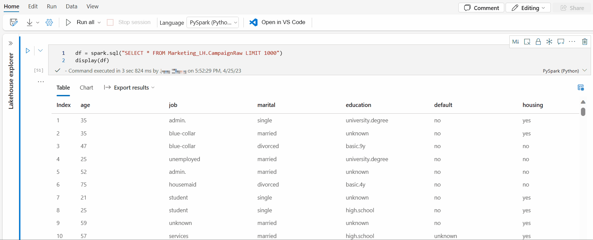

# Author and execute the notebook

> [!IMPORTANT]
> [!INCLUDE [product-name](../includes/product-name.md)] is currently in PREVIEW. This information relates to a prerelease product that may be substantially modified before it's released. Microsoft makes no warranties, expressed or implied, with respect to the information provided here.

[!INCLUDE [product-name](../includes/product-name.md)] notebook is a primary code artifact for developing Apache Spark jobs and machine learning experiments. It's a web-based interactive surface used by data scientists and data engineers to write code benefiting from rich visualizations and Markdown text. This article explains how to develop notebooks with code cell operations and run them.

## Develop notebooks

Notebooks consist of cells, which are individual blocks of code or text that can be run independently or as a group.

We provide rich operations to develop notebooks:

- [Add a cell](#add-a-cell)
- [Set a primary language](#set-a-primary-language)
- [Use multiple languages](#use-multiple-languages)
- [IDE-style IntelliSense](#ide-style-intellisense)
- [Code snippets](#code-snippets)
- [Drag and drop to insert snippets](#drag-and-drop-to-insert-snippets)
- [Format text cell with toolbar buttons](#format-text-cell-with-toolbar-buttons)
- [Undo or redo cell operation](#undo-or-redo-cell-operation)
- Code cell commenting
- [Move a cell](#move-a-cell)
- [Delete a cell](#delete-a-cell)
- [Collapse a cell input](#collapse-a-cell-input)
- [Collapse a cell output](#collapse-a-cell-output)
- [Notebook outline](#notebook-outline)

### Add a cell

There are multiple ways to add a new cell to your notebook.

1. Hover over the space between two cells and select **Code** or **Markdown**.

1. Use [Shortcut keys under command mode](#shortcut-keys-under-command-mode). Press **A** to insert a cell above the current cell. Press **B** to insert a cell below the current cell.

#### Set a primary language

[!INCLUDE [product-name](../includes/product-name.md)] notebooks currently support four Apache Spark languages:

- PySpark (Python)
- Spark (Scala)
- Spark SQL
- SparkR

You can set the primary language for new added cells from the dropdown list in the top command bar.

### Use multiple languages

You can use multiple languages in one notebook by specifying the correct language magic command at the beginning of a cell, or switch the cell language from the language picker of a cell. The following table lists the magic commands to switch cell languages.

:::image type="content" source="media\author-execute-notebook\language-command-in-cell.png" alt-text="Screenshot showing an example of the language magic command entered at the beginning of a cell." lightbox="media\author-execute-notebook\language-command-in-cell.png":::

| **Magic command** | **Language** | **Description** |
|---|---|---|
| %%pyspark | Python | Execute a **Python** query against Spark Context. |
| %%spark | Scala | Execute a **Scala** query against Spark Context. |
| %%sql | SparkSQL | Execute a **SparkSQL** query against Spark Context. |
| %%html | Html | Execute a **HTML** query against Spark Context. |
| %%sparkr | R | Execute a **R** query against Spark Context. |

The following image is an example of how you can write a PySpark query using the **%%pyspark** magic command in a **Spark(Scala)** notebook. Notice that the primary language for the notebook is set to PySpark.

### IDE-style IntelliSense

[!INCLUDE [product-name](../includes/product-name.md)] notebooks are integrated with the Monaco editor to bring IDE-style IntelliSense to the cell editor. Syntax highlight, error marker, and automatic code completions help you to write code and identify issues quicker.

The IntelliSense features are at different levels of maturity for different languages. The following table shows what's supported:

| **Languages** | **Syntax Highlight** | **Syntax Error Marker** | **Syntax Code Completion** | **Variable Code Completion** | **System Function Code Completion** | **User Function Code Completion** | **Smart Indent** | **Code Folding** |
|---|---|---|---|---|---|---|---|---|
| PySpark (Python) | Yes | Yes | Yes | Yes | Yes | Yes | Yes | Yes |
| Spark (Scala) | Yes | Yes | Yes | Yes | Yes | Yes | Yes | Yes |
| SparkSQL | Yes | Yes | Yes | Yes | Yes | No | Yes | Yes |
| SparkR | Yes | Yes | Yes | Yes | Yes | Yes | Yes | Yes |

> [!NOTE]
> An active Spark session is required to make use of the IntelliSense code completion.

### Code snippets

[!INCLUDE [product-name](../includes/product-name.md)] notebooks provide code snippets that make it easier to enter commonly used code patterns like code for the following:

- Configuring your Spark session
- Reading data as a Spark DataFrame, or
- Drawing charts with Matplotlib.

Snippets appear in [Shortcut keys of IDE style IntelliSense](#ide-style-intellisense) mixed with other suggestions. The code snippets contents align with the code cell language. You can see available snippets by typing **Snippet** or any keywords appear in the snippet title in the code cell editor. For example, by typing **read** you can see the list of snippets to read data from various data sources.

:::image type="content" source="media\author-execute-notebook\cell-editor.png" alt-text="Screenshot showing a cell editing screen at the beginning of an Apache Spark session." lightbox="media\author-execute-notebook\cell-editor.png":::


### Drag and drop to insert snippets

You can use drag and drop to read data from Lakehouse explorer conveniently. Multiple file types are supported here, you can operate on text files, tables, images, etc. You can either drop to an existing cell or to a new cell. The notebook generates the code snippet accordingly to preview the data.

:::image type="content" source="media\author-execute-notebook\test-drag-and-drop.png" alt-text="Screenshot showing an empty cell." lightbox="media\author-execute-notebook\test-drag-and-drop.png":::


### Drag and drop to insert images

You can use drag and drop to insert images from your browser or local computer to a markdown cell conveniently.

:::image type="content" source="media\author-execute-notebook\drag-and-drop-image.png" alt-text="Screenshot showing a markdown cell." lightbox="media\author-execute-notebook\drag-and-drop-image.png":::


### Format text cell with toolbar buttons

You can use the format buttons in the text cells toolbar to do common markdown actions. It includes bolding text, italicizing text, paragraph/headers through a dropdown, inserting code, inserting unordered list, inserting ordered list, inserting hyperlink, and inserting image from URL.

:::image type="content" source="media\author-execute-notebook\format-text-toolbar.png" alt-text="Screenshot of the text formatting toolbar." lightbox="media\author-execute-notebook\format-text-toolbar.png":::

### Undo or redo cell operation

Select the **Undo** or **Redo** button, or press **Z** or **Shift+Z** to revoke the most recent cell operations. You can undo or redo up to the latest 10 historical cell operations.

:::image type="content" source="media\author-execute-notebook\undo-redo.png" alt-text="Screenshot showing the undo and redo menu options." lightbox="media\author-execute-notebook\undo-redo.png":::

Supported undo cell operations:

- Insert or delete cell: You could revoke the delete operations by selecting **Undo**, the text content is kept along with the cell.
- Reorder cell.
- Toggle parameter.
- Convert between code cell and Markdown cell.

> [!NOTE]
> In-cell text operations and code cell commenting operations can't be undone. You can undo or redo up to the latest 10 historical cell operations.

### Move a cell

You can drag from the empty part of a cell and drop it to the desired position, you can also move the selected cell using **Move up** and **Move down** on the ribbon.

:::image type="content" source="media\author-execute-notebook\move-cell-options.png" alt-text="Screenshot showing the options for moving a cell." lightbox="media\author-execute-notebook\move-cell-options.png":::


### Delete a cell

To delete a cell, select the delete button at the right hand of the cell.

You can also use [shortcut keys under command mode](#shortcut-keys-under-command-mode). Press **Shift+D** to delete the current cell.

### Collapse a cell input

Select the **More commands** ellipses (...) on the cell toolbar and **Hide input** to collapse current cell's input. To expand it, Select the **Show input** while the cell is collapsed.

:::image type="content" source="media\author-execute-notebook\show-hide-input.png" alt-text="Screenshot showing where to find the show and hide input options." lightbox="media\author-execute-notebook\show-hide-input.png":::


### Collapse a cell output

Select the **More commands** ellipses (...) on the cell toolbar and **Hide output** to collapse current cell's output. To expand it, select the **Show output** while the cell's output is hidden.

:::image type="content" source="media\author-execute-notebook\show-hide-output.png" alt-text="Screenshot showing where to find the show and hide output options." lightbox="media\author-execute-notebook\show-hide-output.png":::



### Notebook outline

The Outlines or Table of Contents presents the first markdown header of any markdown cell in a sidebar window for quick navigation. The Outlines sidebar is resizable and collapsible to fit the screen in the best ways possible. You can select the **Outline** button on the notebook command bar to open or hide the sidebar.

:::image type="content" source="media\author-execute-notebook\outline-option.png" alt-text="Screenshot showing where to select the Contents option." lightbox="media\author-execute-notebook\outline-option.png":::

## Run notebooks

You can run the code cells in your notebook individually or all at once. The status and progress of each cell is represented in the notebook.

### Run a cell

There are several ways to run the code in a cell.

1. Hover on the cell you want to run and select the **Run Cell** button or press **Ctrl+Enter**.

1. Use [Shortcut keys under command mode](#shortcut-keys-under-command-mode). Press **Shift+Enter** to run the current cell and select the cell below. Press **Alt+Enter** to run the current cell and insert a new cell below.

### Run all cells

Select the **Run All** button to run all the cells in the current notebook in sequence.

### Run all cells above or below

Expand the dropdown list from **Run all** button, then select **Run cells above** to run all the cells above the current in sequence. Select **Run cells below** to run all the cells below the current in sequence.

:::image type="content" source="media\author-execute-notebook\run-cells-menu.png" alt-text="Screenshot showing the Run all menu options." lightbox="media\author-execute-notebook\run-cells-menu.png":::

### Cancel all running cells

Select the **Cancel All** button to cancel the running cells or cells waiting in the queue.

:::image type="content" source="media\author-execute-notebook\cancel-all-runs.png" alt-text="Screenshot showing where to select Cancel all runs." lightbox="media\author-execute-notebook\cancel-all-runs.png":::

### Variable explorer

[!INCLUDE [product-name](../includes/product-name.md)] notebook provides a built-in variables explorer for you to see the list of the variables name, type, length, and value in the current Spark session for PySpark (Python) cells. More variables show up automatically as they're defined in the code cells. Clicking on each column header sorts the variables in the table.

You can select the **Variables** button on the notebook ribbon “View” tab to open or hide the variable explorer.

> [!NOTE]
> Variable explorer only supports python.

### Cell status indicator

A step-by-step cell execution status is displayed beneath the cell to help you see its current progress. Once the cell run is complete, an execution summary with the total duration and end time is shown and stored there for future reference.

:::image type="content" source="media\author-execute-notebook\cell-run-status.png" alt-text="Screenshot showing an example of cell run status details." lightbox="media\author-execute-notebook\cell-run-status.png":::

### Spark progress indicator

The [!INCLUDE [product-name](../includes/product-name.md)] notebook is purely Spark based. Code cells are executed on the serverless Apache Spark pool remotely. A Spark job progress indicator is provided with a real-time progress bar appears to help you understand the job execution status. The number of tasks per each job or stage help you to identify the parallel level of your spark job. You can also drill deeper to the Spark UI of a specific job (or stage) via selecting the link on the job (or stage) name.

:::image type="content" source="media\author-execute-notebook\spark-progress-details.png" alt-text="Screenshot of details of Spark jobs progress." lightbox="media\author-execute-notebook\spark-progress-details.png":::

## IPython Widgets

Widgets are eventful python objects that have a representation in the browser, often as a control like a slider, textbox etc. IPython Widgets only works in Python environment, it's not supported in other languages (e.g. Scala, SQL, C#) yet.

### To use IPython Widget

1. You need to import *ipywidgets* module first to use the Jupyter Widget framework.

   ```python
   import ipywidgets as widgets
   ```

1. You can use top-level *display* function to render a widget, or leave an expression of *widget* type at the last line of code cell.

   ```python
   slider = widgets.IntSlider()
   display(slider)
   ```

   ```python
   slider = widgets.IntSlider()
   slider
   ```

1. Run the cell, the widget displays in the output area.

   :::image type="content" source="media\author-execute-notebook\widget-in-output.png" alt-text="Screenshot of widget displayed in the output area." lightbox="media\author-execute-notebook\widget-in-output.png":::

1. You can use multiple *display()* calls to render the same widget instance multiple times, but they remain in sync with each other.

   ```python
   slider = widgets.IntSlider()
   display(slider)
   display(slider)
   ```

   :::image type="content" source="media\author-execute-notebook\multiple-widget-instances.png" alt-text="Screenshot showing multiple instances of one widget." lightbox="media\author-execute-notebook\multiple-widget-instances.png":::

1. To render two widgets independent of each other, create two widget instances:

   ```python
   slider1 = widgets.IntSlider()
   slider2 = widgets.IntSlider()
   display(slider1)
   display(slider2)
   ```

### Supported widgets

| **Widgets type** | **Widgets** |
|---|---|
| Numeric widgets | IntSlider, FloatSlider, FloatLogSlider, IntRangeSlider, FloatRangeSlider, IntProgress, FloatProgress, BoundedIntText, BoundedFloatText, IntText, FloatText |
| Boolean widgets | ToggleButton, Checkbox, Valid |
| Selection widgets | Dropdown, RadioButtons, Select, SelectionSlider, SelectionRangeSlider, ToggleButtons, SelectMultiple |
| String Widgets | Text, Text area, Combobox, Password, Label, HTML, HTML Math, Image, Button |
| Play (Animation) widgets | Date picker, Color picker, Controller |
| Container or Layout widgets | Box, HBox, VBox, GridBox, Accordion, Tabs, Stacked |

### Known limitations

1. The following widgets aren't supported yet, you could follow the corresponding workaround as follows:

   | **Functionality** | **Workaround** |
   |---|---|
   | *Output* widget | You can use *print()* function instead to write text into stdout. |
   | *widgets.jslink()* | You can use *widgets.link()* function to link two similar widgets.
   | *FileUpload* widget | Not supported yet. |

1. Global *display* function provided by [!INCLUDE [product-name](../includes/product-name.md)] doesn't support displaying multiple widgets in one call (i.e. *display(a, b)*), which is different from IPython *display* function.
1. If you close a notebook that contains IPython Widget, you can't see or interact with it until you execute the corresponding cell again.

## Python logging in Notebook

You can find Python logs and set different log levels and format like the sample code shown here:

```python
import logging

# Customize the logging format for all loggers
FORMAT = "%(asctime)s - %(name)s - %(levelname)s - %(message)s"
formatter = logging.Formatter(fmt=FORMAT)
for handler in logging.getLogger().handlers:
    handler.setFormatter(formatter)

# Customize log level for all loggers
logging.getLogger().setLevel(logging.INFO)

# Customize the log level for a specific logger
customizedLogger = logging.getLogger('customized')
customizedLogger.setLevel(logging.WARNING)

# logger that use the default global log level
defaultLogger = logging.getLogger('default')
defaultLogger.debug("default debug message")
defaultLogger.info("default info message")
defaultLogger.warning("default warning message")
defaultLogger.error("default error message")
defaultLogger.critical("default critical message")

# logger that use the customized log level
customizedLogger.debug("customized debug message")
customizedLogger.info("customized info message")
customizedLogger.warning("customized warning message")
customizedLogger.error("customized error message")
customizedLogger.critical("customized critical message")
```

## Integrate a notebook

### Designate a parameters cell

To parameterize your notebook, select the ellipses (...) to access the **more commands** at the cell toolbar. Then select **Toggle parameter cell** to designate the cell as the parameters cell.

:::image type="content" source="media\author-execute-notebook\toggle-parameter-cell.png" alt-text="Screenshot showing where to select the Toggle parameter cell option." lightbox="media\author-execute-notebook\toggle-parameter-cell.png":::

The parameter cell is useful for integrating notebook in pipeline, pipeline activity looks for the parameters cell and treats this cell as defaults for the parameters passed in at execution time. The execution engine adds a new cell beneath the parameters cell with input parameters in order to overwrite the default values.

## Shortcut keys

Similar to Jupyter Notebooks, [!INCLUDE [product-name](../includes/product-name.md)] notebooks have a modal user interface. The keyboard does different things depending on which mode the notebook cell is in. [!INCLUDE [product-name](../includes/product-name.md)] notebooks support the following two modes for a given code cell: command mode and edit mode.

1. A cell is in command mode when there's no text cursor prompting you to type. When a cell is in Command mode, you can edit the notebook as a whole but not type into individual cells. Enter command mode by pressing ESC or using the mouse to select outside of a cell's editor area.

   :::image type="content" source="media\author-execute-notebook\cell-command-mode.png" alt-text="Screenshot of a cell in command mode." lightbox="media\author-execute-notebook\cell-command-mode.png":::

1. Edit mode is indicated by a text cursor prompting you to type in the editor area. When a cell is in edit mode, you can type into the cell. Enter edit mode by pressing Enter or using the mouse to select on a cell's editor area.

   :::image type="content" source="media\author-execute-notebook\cell-edit-mode.png" alt-text="Screenshot of a cell in edit mode." lightbox="media\author-execute-notebook\cell-edit-mode.png":::

### Shortcut keys under command mode

| **Action** | **Notebook shortcuts** |
|---|---|
| Run the current cell and select below | Shift+Enter |
| Run the current cell and insert below | Alt+Enter |
| Run current cell | Ctrl+Enter |
| Select cell above | Up |
| Select cell below | Down |
| Select previous cell | K |
| Select next cell | J |
| Insert cell above | A |
| Insert cell below | B |
| Delete selected cells | Shift + D |
| Switch to edit mode | Enter |

### Shortcut keys under edit mode

Using the following keystroke shortcuts, you can more easily navigate and run code in [!INCLUDE [product-name](../includes/product-name.md)] notebooks when in Edit mode.

| **Action** | **Notebook shortcuts** |
|---|---|
| Move cursor up | Up |
| Move cursor down | Down |
| Undo | Ctrl + Z |
| Redo | Ctrl + Y |
| Comment or Uncomment | Ctrl + / |
| Delete word before | Ctrl + Backspace |
| Delete word after | Ctrl + Delete |
| Go to cell start | Ctrl + Home |
| Go to cell end | Ctrl + End |
| Go one word left | Ctrl + Left |
| Go one word right | Ctrl + Right |
| Select all | Ctrl + A |
| Indent | Ctrl + ] |
| Dedent | Ctrl + [ |
| Switch to command mode | Esc |

## Next steps

- [Notebook visualization](notebook-visualization.md)
