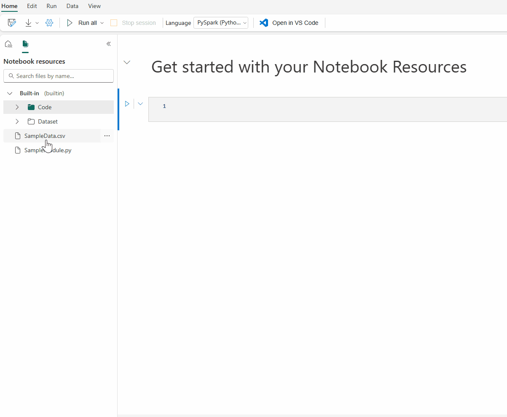
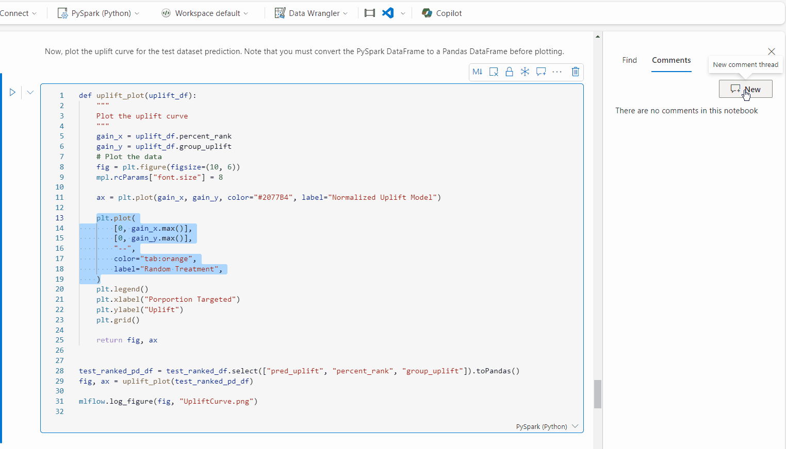

# How to use Microsoft Fabric notebooks

The Microsoft Fabric notebook is a primary code item for developing Apache Spark jobs and machine learning experiments. It's a web-based interactive surface used by data scientists and data engineers to write code benefiting from rich visualizations and Markdown text. Data engineers write code for data ingestion, data preparation, and data transformation. Data scientists also use notebooks to build machine learning solutions, including creating experiments and models, model tracking, and deployment.

With a Fabric notebook, you can:

- Get started with zero set-up effort.
- Easily explore and process data with intuitive low-code experience.
- Keep data secure with built-in enterprise security features.
- Analyze data across raw formats (CSV, txt, JSON, etc.), processed file formats (parquet, Delta Lake, etc.), using powerful Spark capabilities.
- Be productive with enhanced authoring capabilities and built-in data visualization.

This article describes how to use notebooks in data science and data engineering experiences.

## Create notebooks

You can either create a new notebook or import an existing notebook.

### Create a new notebook

Like other standard Fabric item creation processes, you can easily create a new notebook from the Fabric **Data Engineering** homepage, the workspace **New** option, or the **Create Hub**.

### Import existing notebooks

You can import one or more existing notebooks from your local computer to a Fabric workspace from the **Data Engineering or the Data Science** homepage. Fabric notebooks recognize the standard Jupyter Notebook .ipynb files, and source files like .py, .scala, and .sql, and create new notebook items accordingly.

:::image type="content" source="media\how-to-use-notebook\new-menu-notebook-options.png" alt-text="Screenshot showing where to find notebook options on the New menu.":::

## Export a notebook

You can export your notebook to other standard formats. Synapse notebook can be exported into:

- The standard notebook file (.ipynb) that is used for Jupyter notebooks.
- An HTML file (.html) that can be opened from a browser directly.  
- A Python file (.py).  
- A Latex file (.tex).

:::image type="content" source="media\how-to-use-notebook\export-notebook.png" alt-text="Screenshot showing where to export notebook.":::

## Save a notebook

In Fabric, a notebook will by default save automatically after you open and edit it; you don't need to worry about losing code changes. You can also use **Save a copy** to clone another copy in the current workspace or to another workspace.

:::image type="content" source="media\how-to-use-notebook\save-copy.png" alt-text="Screenshot showing where to save a copy.":::

If you prefer to save a notebook manually, you can switch to the **Manual** save option to have a local branch of your notebook item, and then use **Save** or **CTRL+s** to save your changes.

:::image type="content" source="media\how-to-use-notebook\manual-save.png" alt-text="Screenshot showing where to switch manual save.":::

You can also switch to manual save mode by selecting **Edit** -> **Save options** -> **Manual**. To turn on a local branch of your notebook then save it manually, select **Save** or use the **Ctrl+s** keyboard shortcut.

## Connect lakehouses and notebooks

Fabric notebooks now support close interactions with lakehouses; you can easily add a new or existing lakehouse from the Lakehouse explorer.

You can navigate to different lakehouses in the Lakehouse explorer and set one lakehouse as the default by pinning it. Your default is then mounted to the runtime working directory, and you can read or write to the default lakehouse using a local path.

:::image type="content" source="media\how-to-use-notebook\pin-default-lakehouse.png" alt-text="Screenshot showing where to pin a default lakehouse.":::

> [!NOTE]
> You must restart the session after pinning a new lakehouse or renaming the default lakehouse.

### Add or remove a lakehouse

Selecting the **X** icon beside a lakehouse name removes it from the notebook tab, but the lakehouse item still exists in the workspace.

Select **Add lakehouse** to add more lakehouses to the notebook, either by adding an existing one or creating a new lakehouse.

### Explore a lakehouse file

The subfolder and files under the **Tables** and **Files** section of the **Lake** view appear in a content area between the lakehouse list and the notebook content. Select different folders in the **Tables** and **Files** section to refresh the content area.

### Folder and file operations

If you select a file (.csv, .parquet, .txt, .jpg, .png, etc.) with a right mouse click, you can use the Spark or Pandas API to load the data. A new code cell is generated and inserted beneath the focus cell.

You can easily copy a path with a different format from the select file or folder and use the corresponding path in your code.

:::image type="content" source="media\how-to-use-notebook\lakehouse-file-operation.png" alt-text="Screenshot showing context menu of files in lakehouse.":::

## Notebook resources

The notebook resource explorer provides a Unix-like file system to help you manage your folders and files. It offers a writeable file system space where you can store small-sized files, such as code modules, semantic models, and images. You can easily access them with code in the notebook as if you were working with your local file system.



This built-in folder is a system predefined folder for each notebook instance. It preserves up to **500MB** storage to store the dependencies of the current notebook. These are the key capabilities of notebook resources:

- You can use common operations such as create/delete, upload/download, drag/drop, rename, duplicate, and search through the UI.
- You can use relative paths like `builtin/YourData.txt` for quick exploration. The `mssparkutils.nbResPath` method helps you compose the full path.
- You can easily move your validated data to a lakehouse via the **Write to lakehouse** option. Fabric has embedded rich code snippets for common file types to help you quickly get started.
- These resources are also available for use in the [Reference notebook run](author-execute-notebook.md) case via ```mssparkutils.notebook.run()```.

> [!NOTE]
>
> - Currently, Fabric supports uploading certain file types through the UI, including, *.py*, *.whl*, *.jar*, *.txt*, *.json*, *.yml*, *.xml*, *.csv*, *.html*, *.png*, *.jpg*, and *.xlsx* files. You can write to the built-in folder with file types that are not in the list via code, however, Fabric notebooks don't support generating code snippets on unsupported file types.
> - Each file size needs to be less than 50MB, and the built-in folder allows up to 100 file/folder instances in total.
> - When using `mssparkutils.notebook.run()`, use the `mssparkutils.nbResPath` command to access the target notebook resource. The relative path “builtin/” will always point to the root notebook’s built-in folder.

## Collaborate in a notebook

The Fabric notebook is a collaborative item that supports multiple users editing the same notebook.

When you open a notebook, you enter the co-editing mode by default, and every notebook edit is automatically saved. If your colleagues open the same notebook at the same time, you see their profile, run output, cursor indicator, selection indicator, and editing trace. By using the collaboration features, you can easily accomplish pair programming, remote debugging, and tutoring scenarios.

:::image type="content" source="media\how-to-use-notebook\collaboration.png" alt-text="Screenshot showing a code cell with another user editing.":::

### Share a notebook

Sharing a notebook is a convenient way for you to collaborate with team members. Authorized workspace roles can view or edit/run notebooks by default. You can share a notebook with specified permissions granted.

1. Select **Share** on the notebook toolbar.

   :::image type="content" source="media\how-to-use-notebook\open-share-notebook-popup.png" alt-text="Screenshot showing where to select Share.":::

1. Select the corresponding category of **people who can view this notebook**. You can choose **Share**, **Edit**, or **Run** permissions for the recipients.

   :::image type="content" source="media\how-to-use-notebook\select-permissions.png" alt-text="Screenshot showing where to select permissions.":::

1. After you select **Apply**, you can either send the notebook directly or copy the link to others. Recipients can then open the notebook with the corresponding view granted by their permission level.

   :::image type="content" source="media\how-to-use-notebook\create-and-send-link.png" alt-text="Screenshot showing where to create and send link.":::

1. To further manage your notebook permissions, select **Workspace item list** > **More options**, and then select **Manage permissions**. From that screen, you can update the existing notebook access and permissions.

   :::image type="content" source="media\how-to-use-notebook\manage-permissions-in-workspace.png" alt-text="Screenshot showing where to manage permissions in workspace.":::

### Comment a code cell

Commenting is another useful feature for collaborative scenarios. Currently, Fabric supports adding cell-level comments.

1. Select the **Comments** button on the notebook toolbar or cell comment indicator to open the **Comments** pane.

   :::image type="content" source="media\how-to-use-notebook\open-comment-pane.png" alt-text="Screenshot showing where to select Comment.":::

1. Select code in the code cell, select **New** in the **Comments** pane, add comments, and then select **Post comment** to save.

   :::image type="content" source="media\how-to-use-notebook\new-comment.png" alt-text="Screenshot showing where to select New.":::

1. If you need them, find the **Edit comment**, **Resolve thread**, and **Delete thread** options by selecting the More option next to your comment.

### Tagging others in a comment
 
"Tagging" refers to mentioning and notifying a user in a comment thread, enhancing collaboration efficiently on the specifics.
 
1. Select a section of code in a cell and new a comment thread.
 
1. Input user name and choose the correct one on the suggestion list if you want to mention someone for discussion about a certain section.
 
1. Share your insights and **Post** them.
 
1. An Email notification will be triggered, and user clicks on **Open Comments** link to quickly locate this cell.
 
1. Moreover, authorize and configure the permissions for users when tagging someone who doesn’t have access, ensuring that your code assets are well managed.

   


> [!NOTE] 
> For a comment item, the tagged user will not receive an Email notification anymore if you updates the comment within one hour. But it will send Email notification to the new tagged user.

## Switch notebook mode

Fabric notebooks support two modes that you can easily switch between: **Editing** mode and **Viewing** mode.

:::image type="content" source="media\how-to-use-notebook\switch-mode.png" alt-text="Screenshot showing where switch modes.":::

- **Editing mode**: You can edit and run the cells and collaborate with others on the notebook.
- **Viewing mode**: You can only view the cell content, output, and comments of the notebook. All the operations that make changes to the notebook are disabled.

## Related content

- [Author and execute notebooks](author-execute-notebook.md)
