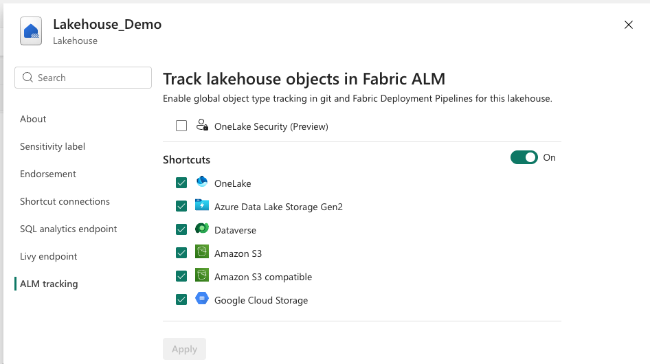

# Lakehouse deployment pipelines and git integration

The [Lakehouse](lakehouse-overview.md) integrates with the lifecycle management capabilities in Microsoft Fabric, providing a standardized collaboration between all development team members throughout the product's life. Lifecycle management facilitates an effective product versioning and release process by continuously delivering features and bug fixes into multiple environments. To learn more, see [What is lifecycle management in Microsoft Fabric?](../cicd/cicd-overview.md).

## What is tracked in git and deployment pipelines?

The following table summarizes the Lakehouse item and sub-items and their support in git-connected workspaces and deployment pipelines.

| Item/Sub-item | Git | Deployment Pipelines | Release Status | Notes |
|---------------|-----|---------------------|----------------|-------|
| Lakehouse metadata (display name, description, logical GUID) | ✅ Tracked | ✅ Tracked | GA | Cross-workspace identifier for source control |
| OneLake Shortcuts metadata | ✅ Tracked | ✅ Tracked | GA | Stored in shortcuts.metadata.json file |
| External shortcuts: ADLS Gen2, S3, and Google Cloud Storage | ✅ Tracked | ✅ Synced across stages | GA | Same targets across all stages, unless remapped using Variable Library |
| External shortcuts: Sharepoint, Azure blob storage, OneDrive, Dataverse | ❌ Not tracked | ❌ Not overwritten | Not supported | Data always preserved during operations |
| Internal OneLake Shortcuts | ✅ Tracked | ✅ Auto-remapped across stages | GA | Requires valid targets in workspace to become usable |
| OneLake Security Data Access Roles metadata | ✅ Tracked | ✅ Tracked | Preview | Stored in dar.metadata.json file |
| SQL Analytics endpoint metadata | ✅ Tracked | ✅ Provisioned on deployment | GA | Managed by git update process |
| Tables (Delta and non-Delta) | ❌ Not tracked | ❌ Not overwritten | Not supported | Data always preserved during operations |
| Spark Views | ❌ Not tracked | ❌ Not overwritten | Not supported | Data always preserved during operations |
| Folders in Files section | ❌ Not tracked | ❌ Not overwritten | Not supported | Data always preserved during operations |

## Opt-In experience for object types

Lakehouse offers an opt-in experience that enables or disables the tracking object types in git and deployment pipelines. To enable the experience, go to Lakehouse settings and enable the desired object types to be tracked.

This feature provides the following benefits for two reasons:
1. Provide flexibility to development teams to choose which object types are tracked in git and deployment pipelines based on their specific needs and workflows. Teams might want to orchestrate object types via external tools or scripts. Also, some object types might not be relevant for all stages in a deployment pipeline.
2. Gradually introduce new object types for tracking, allowing teams to adapt existing workflows and automations before opting in to additional object types. This safeguards against potential disruptions to existing workflows and automations.



The following behaviors are applied when opting in or out of object types tracking:
1. After opting in to track an object type that was not tracked before and syncing changes to git, the current metadata state of that object type is serialized and stored in git. Future changes to that object type will be tracked and synchronized across workspaces in deployment pipelines.
1. After opting out of tracking an object type that was tracked before, the object type metadata is no longer serialized or stored in git. Future changes to that object type will not be tracked or synchronized across workspaces in deployment pipelines. The existing metadata in git is removed.
1. New lakehouses are created with all object types opted in by default, except the ones that in Preview state.
1. Existing lakehouses retain their current object types tracking state unless changed by the user.

## Lakehouse git integration

The Lakehouse is an item that contains both metadata and data that is referenced in multiple objects in the workspace. Lakehouse contains references to tables, folders, and shortcuts as primary manageable data container items. From a development workflow perspective, the following dependent objects might reference a Lakehouse:

* [Dataflows](../data-factory/create-first-dataflow-gen2.md) and [Pipelines](../data-factory/create-first-pipeline-with-sample-data.md)
* [Spark Job Definitions](spark-job-definition.md)
* [Notebooks](how-to-use-notebook.md)
* Semantic models and Power BI

The default semantic model and SQL analytics endpoint metadata are related to a Lakehouse and managed by the git update process by default. As a principle __data is not tracked in git__, only metadata is tracked.

### Git representation

The following lakehouse information is serialized and tracked in a git connected workspace:

* Display name
* Description
* Logical guid

> [!NOTE]
> The tracked logical guid is an automatically generated cross-workspace identifier representing an item and its source control representation.

> [!IMPORTANT]
> Only the Lakehouse container artifact is tracked in git in the current experience. __Tables (Delta and non-Delta) and Folders in the Files section aren't tracked and versioned in git__.

### Lakehouse git integration capabilities

The following capabilities are available:

* Serialization of the Lakehouse object metadata to a git JSON representation.
* Apply changes directly or use pull request to control changes to upstream or downstream workspaces and branches.
* Renaming lakehouses are tracked in git. Updating a renamed lakehouse also renames the default semantic data model and SQL Analytics endpoint.
* __No action is applied to tables and folders metadata__, and data of those items is always preserved.
* __OneLake Shortcuts metadata__ is preserved in git. 

### OneLake Shortcuts git integration capabilities

* Shortcuts definitions in both the Tables and Files section are stored in a file named ```shortcuts.metadata.json``` under the lakehouse folder in git.
* The following operations are supported and tracked automatically: __addition, deletion and updates__ of Shortcuts. 
* The operations can be performed directly in the Fabric user interface or in the git repository by changing the ```shortcuts.metadata.json``` file.
* Shortcuts with internal targets (OneLake Shortcuts) are automatically updated during git syncronization. In order for the Shortcut to be valid, those references need to be valid targets in the workspace. If the targets are invalid for Shortcuts defined in the lakehouse tables section, those Shortcuts are moved to the ```Unidentified``` section until references are resolved.

> [!IMPORTANT]
> Use caution when changing OneLake Shortcut properties directly in the ```shortcuts.metadata.json``` file. Incorrect changes to the properties, specially GUIDs, can render the OneLake Shortcut invalid when updates are applied back to the workspace.

> [!IMPORTANT]
> An update from git __will override the state of shortcuts in the workspace__. All the Shortcuts in the workspace are created, updated or deleted based on the incoming state from git.

## Lakehouse in deployment pipelines

The Lakehouse is supported in Microsoft Fabric lifecycle management deployment pipelines. It enables environment segmentation [best-practices](../cicd/best-practices-cicd.md).

Lakehouse deployment pipelines integration capabilities:

* Deployment across dev, test, and production workspaces.

* Lakehouse can be removed as a dependent object upon deployment. Mapping different Lakehouses within the deployment pipeline context is also supported.
  * If nothing is specified during deployment pipeline configuration, a new empty Lakehouse object with same name is created in the target workspace. Notebook and Spark Job Definitions are remapped to reference the new Lakehouse object in the new workspace.

  * If the Lakehouse dependency is configured to reference a different Lakehouse during deployment pipeline configuration time, such as the upstream Lakehouse, a new empty Lakehouse object with same name still is created in the target workspace, __but Notebooks and Spark Job Definitions references are preserved to a different Lakehouse as requested__.

  * SQL Analytics endpoints and semantic models are provisioned as part of the Lakehouse deployment.

* No object inside the Lakehouse is overwritten.

* Updates to Lakehouse name can be synchronized across workspaces in a deployment pipeline context.

### OneLake Shortcuts in deployment pipelines

* Shortcuts definitions are synced across stages in the deployment pipelines.
* Shortcuts with external targets (ADLS Gen2, S3, etc) are the same across all stages after deployment.
* Shortcuts with internal targets (OneLake Shortcuts) in the same workspace are automatically remapped across stages. Shortcuts that target Data Warehouse and Semantic Models are not remapped during deployment. Tables, Folders and Files are not created in the target workspace. In order for the Shortcut to be valid, those references need to be created in the target workspace after deployment.
* On the scenario that the same Shortcut needs to target different locations on different stages. For example, in Development point to a specific Folder in Amazon S3, and in Production a different folder in ADLS Gen2. The recommended approach is to use variables in the Shortcut definition. To learn more about variable library and how to effectivel use it in Microsoft Fabric, read the [What is a Variable library? (preview)](../cicd/variable-library/variable-library-overview.md) article. Another option is; after the deployment, manually update the OneLake Shortcut definition in Lakehouse or directly using OneLake APIs.

> [!IMPORTANT]
> A deployment __will override the state of shortcuts in the target workspace__. All the Shortcuts in the target lakehouse are updated or deleted based on the state in the source lakehouse. New shortcuts are created in the target lakehouse. Always click on "review changes" to understand the changes that will be deployed between source and target workspaces.

## Related content

- [What is lifecycle management in Microsoft Fabric?](../cicd/cicd-overview.md)
- [Tutorial: Lifecycle management in Fabric](../cicd/cicd-tutorial.md)
- [Introduction to Git integration](../cicd/git-integration/intro-to-git-integration.md)
- [Introduction to deployment pipelines](../cicd/deployment-pipelines/intro-to-deployment-pipelines.md)
