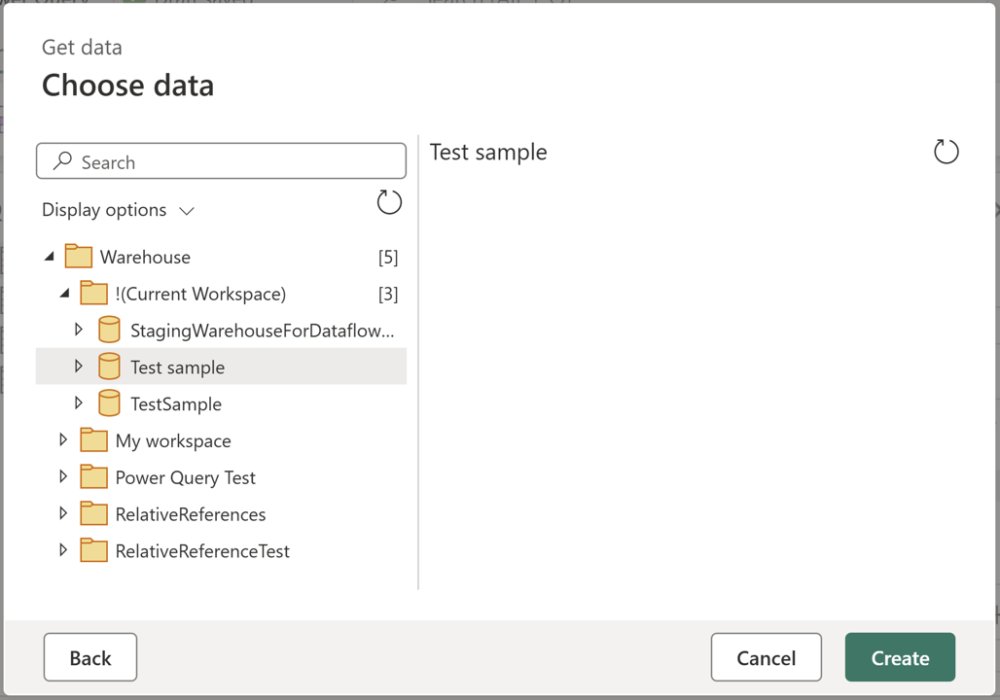

# Set up your Data Warehouse connection

This article outlines the steps to create a Data Warehouse connection.

## Supported authentication types

The Data Warehouse connector supports the following authentication types for copy and Dataflow Gen2 respectively.  

|Authentication type |Copy |Dataflow Gen2 |
|:---|:---|:---|
|Organizational account| √ | √ |

## Set up your connection for Dataflow Gen2
You can connect Dataflow Gen2 to a Data Warehouse in Microsoft Fabric using Power Query connectors. Follow these steps to create your connection:

1. Check [capabilities](#capabilities) to make sure your scenario is supported.
1. [Complete prerequisites for Data Warehouse](#prerequisites).
1. [Get data in Fabric](#get-data).
1. [Connect to a Warehouse](#connect-to-a-warehouse).

### Capabilities

[!INCLUDE [warehouse-ccapabilities-supported](~/../powerquery-repo/powerquery-docs/connectors/includes/warehouse/warehouse-capabilities-supported.md)]

### Prerequisites

[!INCLUDE [warehouse-prerequisites](~/../powerquery-repo/powerquery-docs/connectors/includes/warehouse/warehouse-prerequisites.md)]

### Get data

[!INCLUDE [get-data-data-factory-microsoft-fabric](~/../powerquery-repo/powerquery-docs/includes/get-data-data-factory-microsoft-fabric.md)]

### Connect to a Warehouse

[!INCLUDE [warehouse-connect-to-power-query-online](~/../powerquery-repo/powerquery-docs/connectors/includes/warehouse/warehouse-connect-to-power-query-online.md)]

### Using relative references

Inside the navigator, a special node with the name **!(Current Workspace)** is located. This node displays the available Fabric Data Warehouses in the same workspace where the Dataflow Gen2 is located.



When using any items within this node, the M script emitted uses workspace or warehouse identifiers and instead uses relative references such as the ```"."``` handler to denote the current workspace and the name of the warehouse as in the example M code.

```M-code
let
  Source = Fabric.Warehouse([HierarchicalNavigation = null]),
  #"Navigation 1" = Source{[workspaceId = "."]}[Data],
  #"Navigation 2" = #"Navigation 1"{[displayName = "Test sample"]}[Data],
  #"Navigation 3" = #"Navigation 2"{[Schema = "dbo", Item = "Date"]}[Data]
in
  #"Navigation 3"
  ```

## Set up your connection in a pipeline

You can set up a Data Warehouse connection in the **Get Data** page or in the **Manage connections and gateways** page. Connections established through **Manage connections and gateways** page are currently in preview. The sections below describe how to configure the connection through each option.

- In **Get Data** page:

    1. Go to **Get Data** page and navigate to **OneLake catalog** through the following ways:
    
       - In copy assistant, go to **OneLake catalog** section.
       - In a pipeline, select Browse all under **Connection**, and go to **OneLake catalog** section.
    
    1. Select an existing Data Warehouse to connect to it.

        :::image type="content" source="media/connector-data-warehouse/select-data-warehouse-in-onelake.png" alt-text="Screenshot of selecting Data Warehouse in OneLake section.":::
    
    You can also select a Data Warehouse by choosing **none** in the pipeline **Connection** drop‑down list. When **none** is selected, the **Item** field becomes available, and you can pick the Data Warehouse you need.

- (Preview) In **Manage connections and gateways** page:

    1. On this page, select **+ New**, choose Warehouse as the connection type, and enter a connection name. Then complete the organizational account authentication by selecting **Edit credentials**.
    
        :::image type="content" source="media/connector-data-warehouse/manage-connection-gateways-new-connection.png" alt-text="Screenshot creating new Lakehouse connection in Manage connection gateways.":::
    
    1. After the connection is created, go to the pipeline and select it in the connection drop‑down list. 

        :::image type="content" source="media/connector-data-warehouse/select-data-warehouse-connection.png" alt-text="Screenshot of selecting a Data Warehouse connection in pipelines.":::

    >[!NOTE]
    >If you create the connection through **Manage connections and gateways** page:
    >- To allow multiple users to collaborate in one pipeline, please ensure the connection is shared with them.
    >- If you choose to use an existing Data Warehouse connection within the tenant, ensure it has at least Viewer permission to access the workspace and Data Warehouse. For more information about the permission, see this [article](../data-warehouse/workspace-roles.md).

## Related content

- [For more information about this connector, see the Data Warehouse connector documentation.](/power-query/connectors/warehouse)
