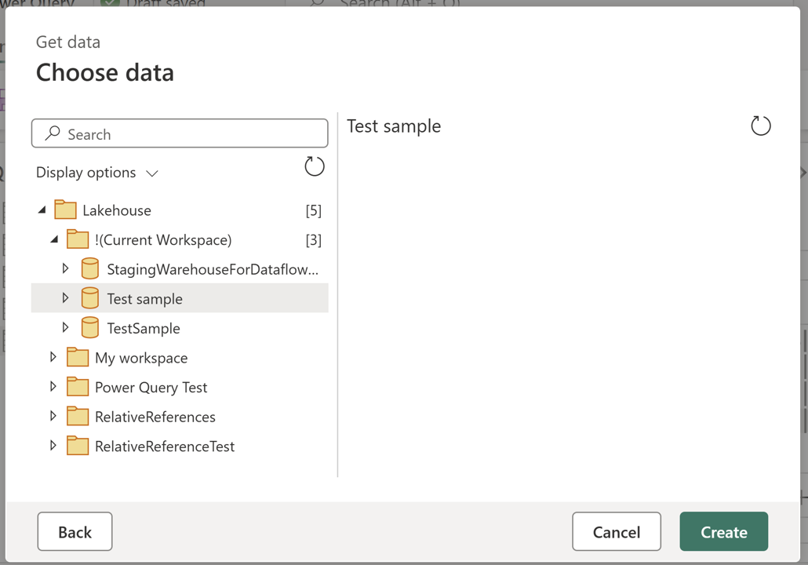

# Set up your Lakehouse connection

You can connect to a Lakehouse data lake in Dataflow Gen2 and a pipeline using the Lakehouse connector provided by Data Factory in Microsoft Fabric.

## Supported authentication types

The Lakehouse connector supports the following authentication types for copy and Dataflow Gen2 respectively.

| Authentication type | Copy | Dataflow Gen2 |
| --- | :---: | :---: |
| Organizational account | √ | √ |

## Set up your connection for Dataflow Gen2
You can connect Dataflow Gen2 in Microsoft Fabric to Lakehouse using Power Query connectors. Follow these steps to create your connection:

1. Check [capabilities](#capabilities) to make sure your scenario is supported.
1. [Complete prerequisites for Lakehouse](#prerequisites).
1. [Get data in Fabric](#get-data).
1. [Connect to a Lakehouse](#connect-to-a-lakehouse).

### Capabilities

[!INCLUDE [lakehouse-capabilities-supported](~/../powerquery-repo/powerquery-docs/connectors/includes/lakehouse/lakehouse-capabilities-supported.md)]

### Prerequisites

[!INCLUDE [lakehouse-prerequisites](~/../powerquery-repo/powerquery-docs/connectors/includes/lakehouse/lakehouse-prerequisites.md)]

### Get data

[!INCLUDE [get-data-data-factory-microsoft-fabric](~/../powerquery-repo/powerquery-docs/includes/get-data-data-factory-microsoft-fabric.md)]

### Connect to a Lakehouse

[!INCLUDE [lakehouse-connect-to-power-query-online](~/../powerquery-repo/powerquery-docs/connectors/includes/lakehouse/lakehouse-connect-to-power-query-online.md)]

### Using relative references

Inside the navigator, a special node with the name **!(Current Workspace)** is located. This node displays the available Fabric Lakehouses in the same workspace where the Dataflow Gen2 is located.



When using any items within this node, the M script emitted uses workspace or lakehouse identifiers and instead uses relative references such as the ```"."``` handler to denote the current workspace and the name of the lakehouse as in the example M code.

```M code
let
  Source = Lakehouse.Contents([HierarchicalNavigation = null]),
  #"Navigation 1" = Source{[workspaceId = "."]}[Data],
  #"Navigation 2" = #"Navigation 1"{[lakehouseName = "My Lakehouse"]}[Data],
  #"Navigation 3" = #"Navigation 2"{[Id = "Date", ItemKind = "Table"]}[Data]
in
  #"Navigation 3"
```

## Set up your connection in a pipeline

You can set up a Lakehouse connection in the **Get Data** page or in the **Manage connections and gateways** page. Connections established through **Manage connections and gateways** page are currently in preview. The sections below describe how to configure the connection through each option.

- In **Get Data** page:

    1. Go to **Get Data** page and navigate to **OneLake catalog** through the following ways:
    
       - In copy assistant, go to **OneLake catalog** section.
       - In a pipeline, select Browse all under **Connection**, and go to **OneLake catalog** section.
    
    1. Select an existing Lakehouse to connect to it.
    
        :::image type="content" source="media/connector-lakehouse/select-lakehouse-in-onelake.png" alt-text="Screenshot of selecting Lakehouse in OneLake section.":::
    
    You can also select a Lakehouse by choosing **none** in the pipeline **Connection** drop‑down list. When **none** is selected, the **Item** field becomes available, and you can pick the Lakehouse you need.
    
- (Preview) In **Manage connections and gateways** page:

    1. On this page, select **+ New**, choose Lakehouse as the connection type, and enter a connection name. Then complete the organizational account authentication by selecting **Edit credentials**.
    
        :::image type="content" source="media/connector-lakehouse/manage-connection-gateways-new-connection.png" alt-text="Screenshot creating new Lakehouse connection in Manage connection gateways.":::
    
    1. After the connection is created, go to the pipeline and select it in the connection drop‑down list.

        :::image type="content" source="media/connector-lakehouse/select-lakehouse-connection.png" alt-text="Screenshot of selecting a Lakehouse connection in pipelines.":::

    >[!NOTE]
    >If you create the connection through **Manage connections and gateways** page:
    >- To allow multiple users to collaborate in one pipeline, please ensure the connection is shared with them.
    >- If you choose to use an existing Lakehouse connection within the tenant, ensure it has at least Viewer permission to access the workspace and Lakehouse. For more information about the permission, see this [article](../data-engineering/workspace-roles-lakehouse.md).
    

## Related content

- [For more information about this connector, see the Lakehouse connector documentation.](/power-query/connectors/lakehouse)
* [Configure Lakehouse in a copy activity](connector-lakehouse-copy-activity.md)
