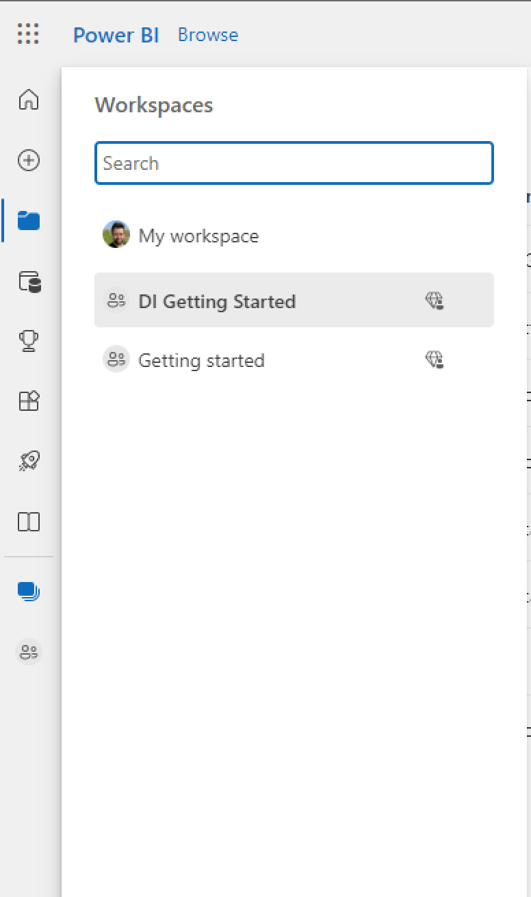
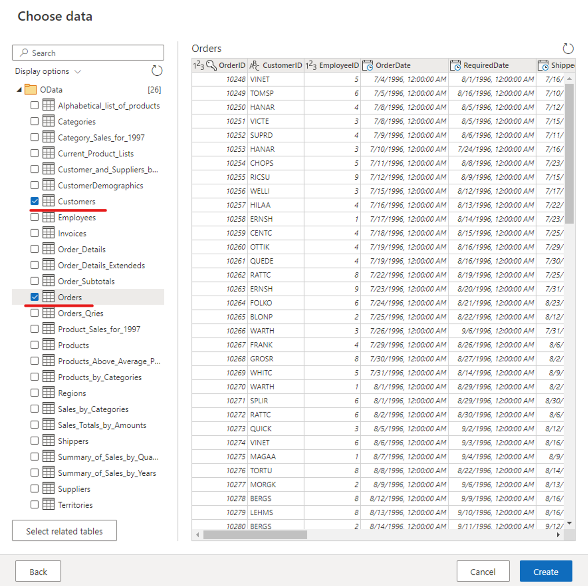
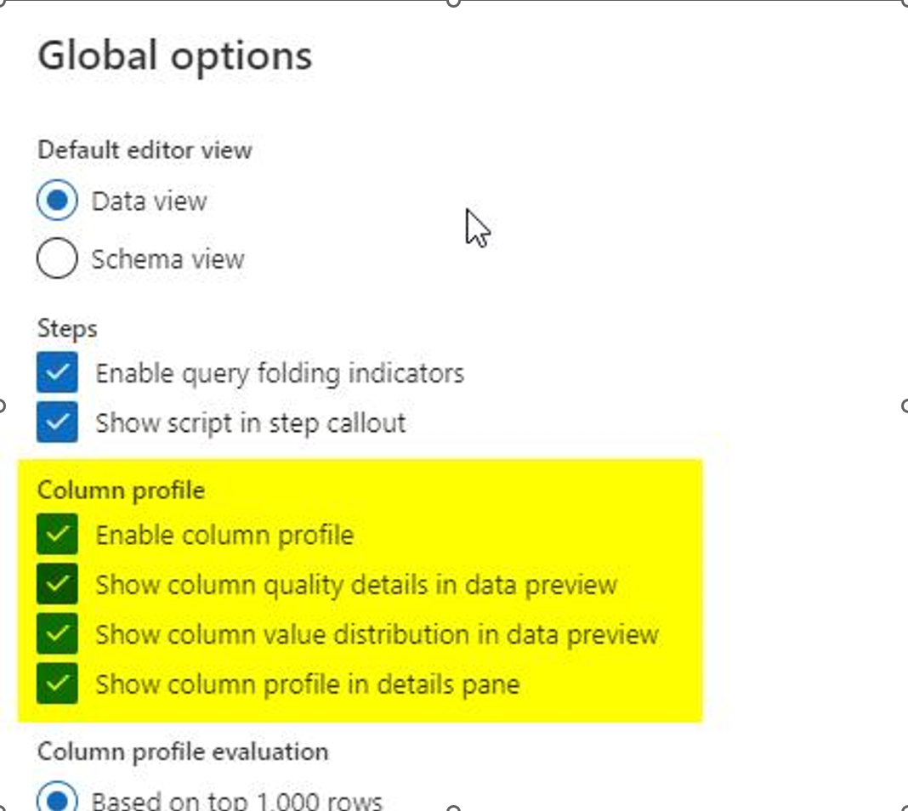
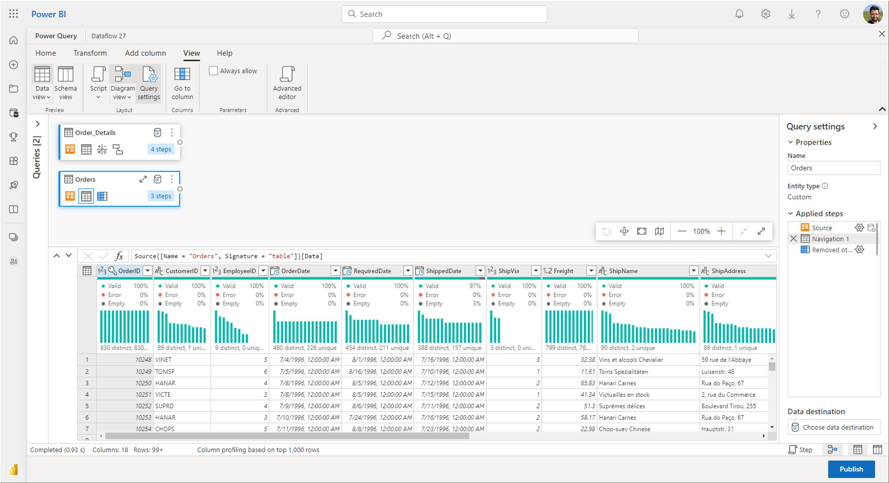
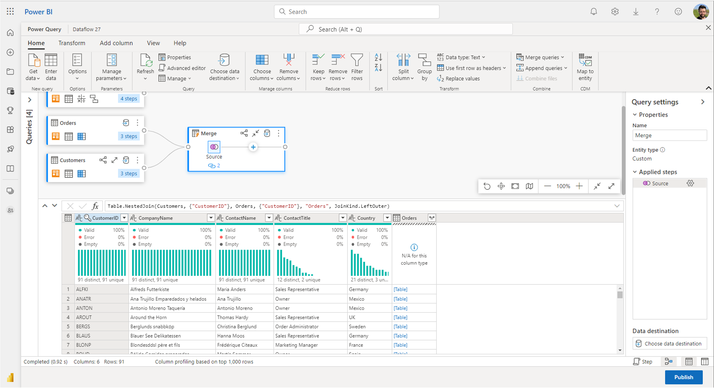
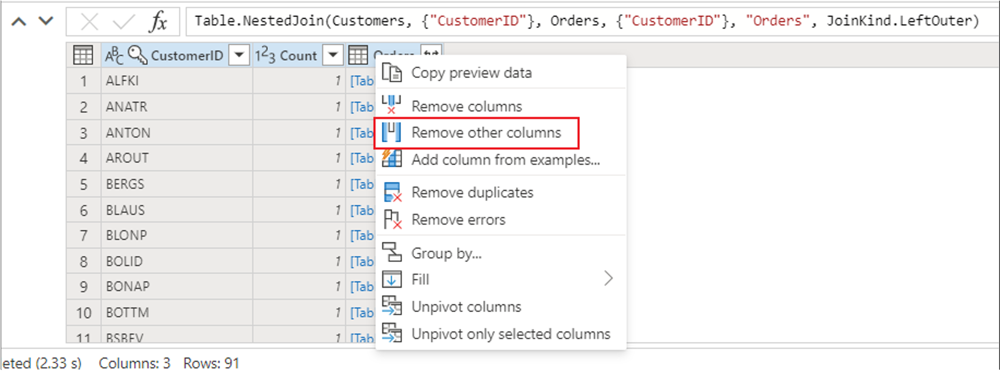
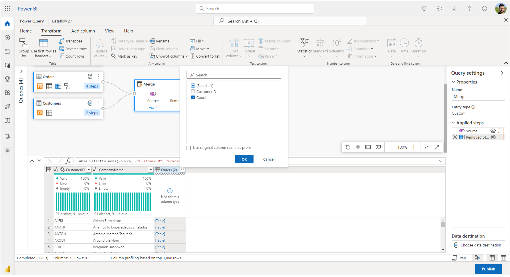
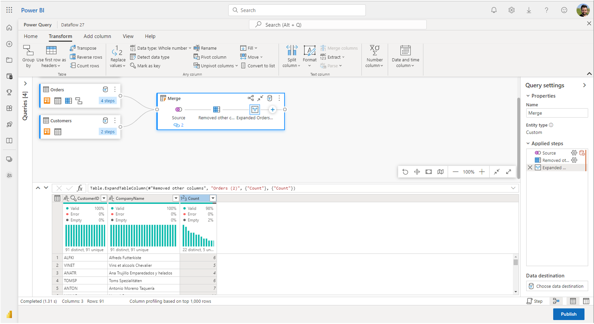
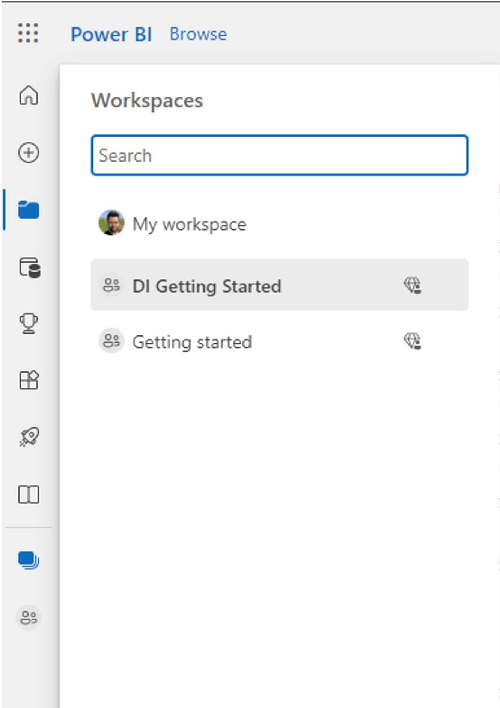
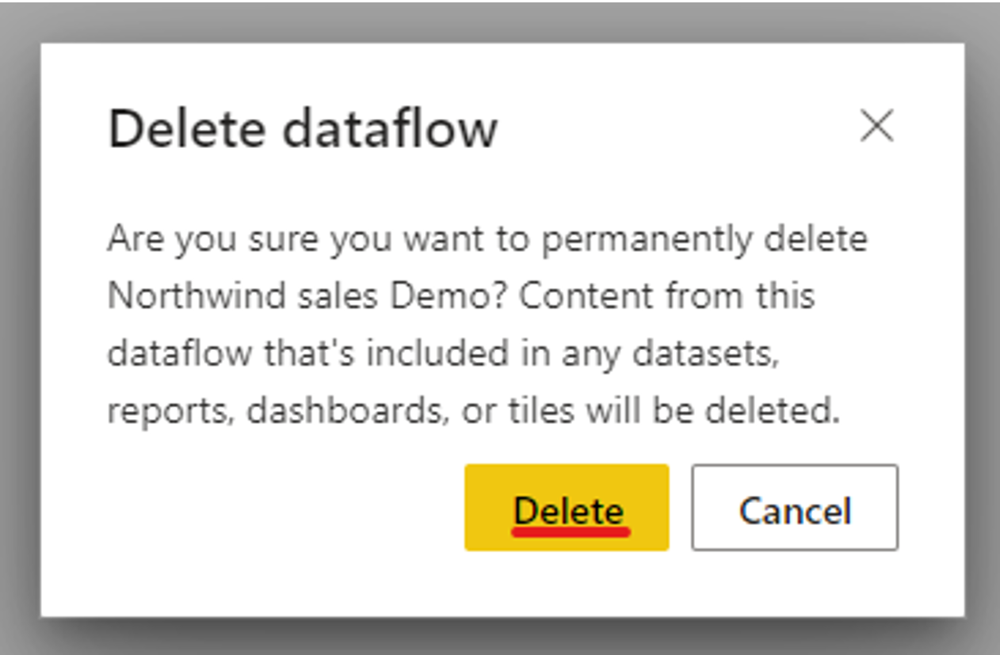

# Quickstart: Create your first Dataflows Gen2 to get and transform data (Preview)

## Prerequisites

To get started, you must complete the following prerequisites:

- A [!INCLUDE [product-name](../includes/product-name.md)] tenant account with an active subscription. Create an account for free.
- Make sure you have a [!INCLUDE [product-name](../includes/product-name.md)] enabled Workspace: [Create a Project Trident enabled Workspace.pdf (sharepoint.com)](https://microsofteur.sharepoint.com/teams/TridentPrivatePreview/Shared%20Documents/Documentation/Private%20Preview%20Documentation/Enabling%20Trident/Create%20a%20Project%20Trident%20enabled%20Workspace.pdf).

## Create a dataflow

In this section we will be creating our dataflow.

1. Switch to the **Data factory** or **Power BI** workload.

   

2. Navigate to your [!INCLUDE [product-name](../includes/product-name.md)] workspace

   

3. Click on **+ New** and select Dataflow Gen2 (Preview)

   

## Get data

Let's get some data! We will be getting data from an OData service, follow steps below to get data in your dataflow.

1. In the Dataflow editor, click on **Get data** and select **More**

   

2. Select **OData** as data source

   

3. Enter the URL: [https://services.odata.org/v2/northwind/northwind.svc/](https://services.odata.org/v2/northwind/northwind.svc/) and click **Next**

   

4. Select the **Orders** and **Customers** tables and click **Create**

   

You can learn more about the Get Data experience and functionality at [Getting data overview - Power Query | Microsoft Docs](https://docs.microsoft.com/en-us/power-query/get-data-experience)

## Apply transformations and publish

You have now loaded your data into your first dataflow, congratulations! Now it is time to apply a couple of transformations in order to bring this data into the desired shape.

We will be doing this task from the Power Query Editor. You can find a detailed overview of the Power Query Editor at [The Power Query user interface - Power Query | Microsoft Docs](https://docs.microsoft.com/en-us/power-query/power-query-ui)

Follow these steps to continue this tutorial:

1. Make sure you have enabled the [Diagram View](https://docs.microsoft.com/en-us/power-query/diagram-view) using the options under the View tab in the ribbon and [Data Profiling tools](https://docs.microsoft.com/en-us/power-query/data-profiling-tools) by navigating to Home->Options->Global Options

   

   

2. Within the Orders table, we would like to calculate the total number of orders per customer. To achieve this, select the CustomerID column in the data preview and click **Group By** under the Transform tab in the ribbon.

   

3. We will perform a Count of rows as the aggregation within Group By. You can learn more about Group By capabilities at [Grouping or summarizing rows - Power Query | Microsoft Docs](https://docs.microsoft.com/en-us/power-query/group-by)

   

4. After grouping data in the Orders table, we will obtain a two-column table with CustomerID and Count as the columns.

   

5. Next, we want to combine data from the Customers table with the Count of Orders per customer. To do this, select the Customers query in the Diagram View and use the “...” menu to access the **Merge queries as new** transformation.

   

6. Configure the [Merge operation](https://docs.microsoft.com/en-us/power-query/merge-queries-overview) as shown in the screenshot below by selecting "CustomerID" as the matching column in both tables and click **Ok**

   

7. Upon performing the **Merge as new** operation, we will obtain a new query with all columns from the Customers table and one column with nested data from the Orders table.

   

8. We are only interested in a subset of columns within the Customers table and will select those by leveraging the Schema View. Let’s enable the Schema View within the toggle button on the bottom-right corner of the Dataflows Editor.

    

9. The Schema View provides a focused view into a table’s schema information, including column names and data types. The Schema View provides a set of Schema Tools available via a contextual ribbon tab. In this scenario we will **select the columns** **CustomerID**, **CompanyName and Orders (2)**, then click the **Remove other columns** button in the Schema Tools tab.

   

   

10. The Orders (2) column contains nested information resulting from the Merge operation we performed a few steps ago. We will now **switch back to the Data view** (by using the view toggle button next to the Schema view in the bottom-right corner of the UI) and use the **Expand Column** transformation in the Orders (2) column header to select the Count column.

    

11. As the final operation, we want to rank our customers based on their number of orders. We will select the Count column and click the [Rank Column](https://docs.microsoft.com/en-us/power-query/rank-column) button under the Add Column tab in the ribbon.

    

12. We will keep the default settings in the Rank Column dialog and click Ok to apply this transformation.

    

13. We will then rename the resulting query as “Ranked Customers” using the Query settings pane on the right side of the screen.

    

14. We have finished transforming and combining our data, and we will now configure its output destination settings. Let’s click the Choose data destination button at the bottom of the Query settings pane.

    

15. At the moment, Azure SQL Database is available as an output destination. We will be expanding the list of available destinations over the next few months. For this step, you can configure an output to your Azure SQL Database if you have one available or skip this step if you don’t. Within this experience, you’re able to configure the destination server, database, and table for your query results, as well as the update method (Append or Replace).

    

    

16. Your dataflow is now ready to be published, review the queries in the Diagram View and click **Publish**

    

17. In your workspace click on the **Schedule Refresh** icon.

    

18. Turn on the Scheduled Refresh, click **"Add another time"** and configure the refresh as shown below.

    

## Clean up resources

If you're not going to continue to use this dataflow, delete the dataflow with the following steps:

1. Navigate to your [!INCLUDE [product-name](../includes/product-name.md)] workspace

   

2. Click on the 3 dots next to the name of your dataflow and click **Delete**

   

3. Confirm the deletion of your dataflow

   

## Next steps

Advance to the next article to learn how to create your first pipeline: Quickstart: Create your first pipeline to copy data (Preview)
