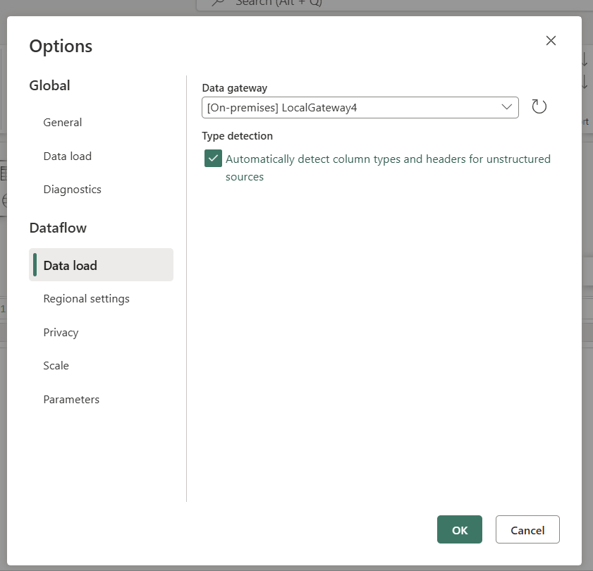

# Using cloud connections through gateways

When creating a shareable cloud connection through Dataflow Gen2 with CI/CD or the [manage and connections portal](data-source-management.md), the setting with the label ***This connection can be used with on-premise data gateways, and VNet data gateways*** is a security feature that allows you to determine if your shareable cloud connection can be used on a gateway (on-premises or virtual network).

When your Dataflow Gen2 with CI/CD uses a Gateway (on-premises or virtual network), shareable cloud connections referenced by your Dataflow Gen2 that don't have this setting enabled results in a query execution error.

>[!IMPORTANT]
>The *allow connection usage on gateway* setting is present when creating cloud connections through Dataflow Gen2, but not currently enforced. This means that all shareable cloud connections will be used through a gateway if a gateway is present. The product group is aware of this behavior and will be introducing enforcement of this security boundary in the coming months with leading communication to provide users time to mitigate potential impact beforehand.
>Read more about connections from the article on [data source management](data-source-management.md).

## Frequently asked questions

### Which dataflows does this apply to?

This security feature only applies to Dataflow Gen2 with CI/CD support, which can reference shareable cloud connections.

### What type of connections can have this new `allowConnectionUsageInGateway` setting?
  Only shareable cloud connections can have this new setting.

### How can I check what connections have the `allowConnectionUsageInGateway` enabled?
  When using the Fabric portal, you can review all your connections through the [Manage Connections and Gateways portal](data-source-management.md) or review the connections used in your Dataflow Gen2 with CI/CD through the [manage connections dialog](/power-query/manage-connections).

  Alternatively you can use the [List connections endpoint of the Fabric REST API](/rest/api/fabric/core/connections/list-connections) and look for the field with the name `allowConnectionUsageInGateway`.

### How can I tell if my Dataflow Gen2 with CI/CD would be impacted by the enforcement of this security feature?

This enforcement and security feature only applies to Dataflow Gen2 with CI/CD that use a Gateway (on-premises or virtual network) and have at least one shareable cloud connection.

Using the Fabric portal, you can open a Dataflow to check if it uses a Gateway by selecting the *Options* button from the Home tab of the ribbon. Once the *Options* dialog opens, you can select the *Data Load* section inside the Dataflow category. In this section, you can see what gateway is selecting. If no gateway is selected, it appears as (none).

Using the Fabric REST API, you can:
* [GET the Dataflow item definition](/rest/api/fabric/dataflow/items/get-dataflow-definition)
* Extract the connection information from the `queryMetadata.json` and confirm that a gateway is referenced in the file
* Compare the connection information from the Dataflow against the list of shareable cloud connections from the [List connections endpoint of the Fabric REST API](/rest/api/fabric/core/connections/list-connections) where the `allowConnectionUsageInGateway` setting isn't Enabled

If you determine that your Dataflow Gen2 with CI/CD uses gateway and a gateway-disallowed cloud connection, you can take either of the following steps: 
* **Replace the connection in your dataflow with a gateway connection**: this requires no other changes to the dataflow, but does require you to have access to the data source credentials.
* **Modify the connection so that it can be used in gateways**: this requires you to be an owner of the connection and be aware of the security considerations of enabling this feature.
* **Remove the gateway from your dataflow**: this only works if the dataflow doesn't use any other connections on that gateway.

