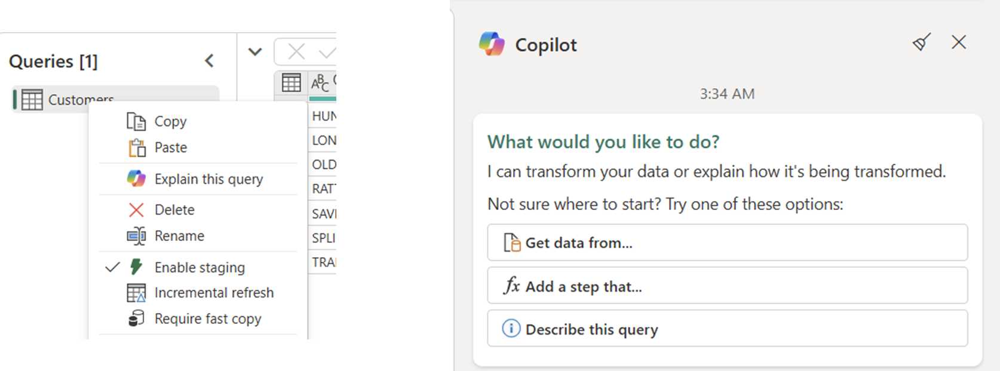
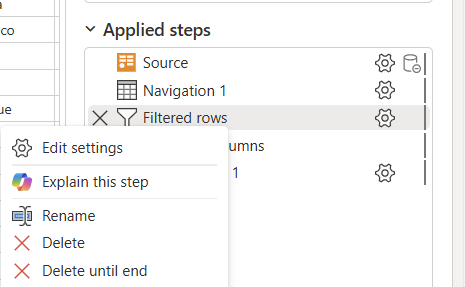

# Copilot explainer skill in Dataflow Gen2

>[!NOTE]
>This capability is part of the Fabric Data Factory Copilot experience. Find more information about this capability and how to enable it from the article [What is Copilot in Fabric in the Data Factory workload](copilot-fabric-data-factory.md).

The Copilot explainer skill in Dataflow Gen2 is an AI-powered assistant within Microsoft Fabric's Data Factory workload that helps you interpret Mashup (Power Query M) code in natural language.

The experience allows you to explain the full query or a particular step of a query:

* **Explain this query**: you can trigger this experience via the Copilot pane or via right-clicking your queries through the Queries pane and selecting the option to *Explain* or *Describe*.

* **Explain this step**: when only selecting a step inside a query through the applied steps section, you can right-click the step and select the option to *explain* from the list. 

