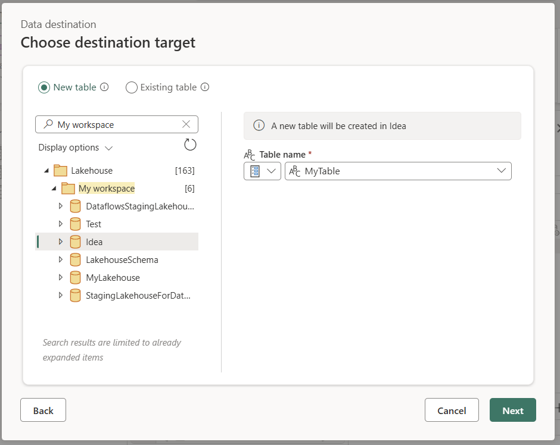

# Dataflow Gen2 data destinations and managed settings

After you clean and prepare your data with Dataflow Gen2, you'll want to save it somewhere useful. Dataflow Gen2 lets you choose from several destinations, like Azure SQL, Fabric Lakehouse, and others. Once you pick a destination, Dataflow Gen2 writes your data there, and you can use it for analysis and reporting.

The following list contains the supported data destinations:

[!INCLUDE [dataflow-gen2-data-destinations](includes/dataflow-gen2-data-destinations.md)]

> [!NOTE]
>To load your data to the Fabric Warehouse, you can use the Azure Synapse Analytics (SQL DW) connector by getting the SQL connection string. More information: [Connectivity to data warehousing in Microsoft Fabric](../data-warehouse/connectivity.md)

## Entry points

Every data query in your Dataflow Gen2 can have a data destination. You can only apply destinations to tabular queries—functions and lists aren't supported. You can set the data destination for each query individually, and you can use different destinations within the same dataflow.

There are three ways to set up the data destination:

* Through the top ribbon.

  :::image type="content" source="media/dataflow-gen2-data-destinations-and-managed-settings/top-ribbon-destination.png" alt-text="Screenshot of the Power Query Home tab ribbon with Add data destination emphasized.":::

* Through query settings.

  :::image type="content" source="media/dataflow-gen2-data-destinations-and-managed-settings/query-settings-destination.png" alt-text="Screenshot of the Query settings pane with the Data destination button emphasized and the list of destinations displayed.":::

* Through the diagram view.

  :::image type="content" source="media/dataflow-gen2-data-destinations-and-managed-settings/diagram-view-destination.png" alt-text="Screenshot of a query in diagram view with the add destinations icon emphasized and the list of destinations displayed.":::

## Connect to the data destination

Connecting to the data destination works like connecting to a data source. You can use connections for both reading and writing your data, as long as you have the right permissions on the data source. You'll need to create a new connection or pick an existing one, then select **Next**.

:::image type="content" source="media/dataflow-gen2-data-destinations-and-managed-settings/connect-to-data-destination.png" alt-text="Screenshot of the Connect to data destination window for a Lakehouse destination.":::

## Set up file-based destinations

When you choose a file-based destination (for example, SharePoint), you'll need to configure a few settings. Here's what you need to set:

* **File name**: The name of the file that gets created in the destination. By default, the file name matches your query name.
* **File format**: The format of the file that gets created in the destination.
* **File origin**: The encoding that's used to create the file in the destination. By default, this is set to **UTF-8**.
* **File delimiter**: The delimiter that gets used to create the file in the destination. By default, this is set to **Comma**.

:::image type="content" source="media/dataflow-gen2-data-destinations-and-managed-settings/file-destinations-settings.png" alt-text="Screenshot of the File destination settings window with the file name, file format, file origin, and file delimiter settings displayed.":::

## Create a new table or pick an existing table

When loading into your data destination, you can either create a new table or pick an existing one.

### Create a new table

When you choose to create a new table, Dataflow Gen2 creates a new table in your data destination during refresh. If the table gets deleted later (if you manually go into the destination and delete it), the dataflow recreates the table during the next refresh.

By default, your table name matches your query name. If your table name has any characters that the destination doesn't support, the table name gets adjusted automatically. For example, many destinations don't support spaces or special characters.

:::image type="content" source="media/dataflow-gen2-data-destinations-and-managed-settings/new-table.png" alt-text="Screenshot of the Choose destination target window with the New table button selected.":::

Next, you need to select the destination container. If you chose any of the Fabric data destinations, you can use the navigator to select the Fabric artifact where you want to load your data. For Azure destinations, you can either specify the database during connection creation, or select the database from the navigator experience.

### Use an existing table

To choose an existing table, use the toggle at the top of the navigator. When choosing an existing table, you need to pick both the Fabric artifact/database and table using the navigator.

When you use an existing table, the table can't be recreated in any scenario. If you delete the table manually from the data destination, Dataflow Gen2 won't recreate the table on the next refresh.

:::image type="content" source="media/dataflow-gen2-data-destinations-and-managed-settings/existing-table.png" alt-text="Screenshot of the Choose destination target window with the Existing table button selected.":::

## Managed settings for new tables

When you're loading into a new table, automatic settings are turned on by default. If you use automatic settings, Dataflow Gen2 manages the mapping for you. Here's what automatic settings do:

* **Update method replace**: Data gets replaced at every dataflow refresh. Any data in the destination is removed. The data in the destination gets replaced with the output data of the dataflow.

* **Managed mapping**: Mapping gets managed for you. When you need to make changes to your data/query to add another column or change a data type, mapping gets adjusted automatically for this change when you republish your dataflow. You don't have to go into the data destination experience every time you make changes to your dataflow, which makes schema changes easy when you republish the dataflow.

* **Drop and recreate table**: To allow for these schema changes, the table gets dropped and recreated on every dataflow refresh. Your dataflow refresh might cause the removal of relationships or measures that were added previously to your table.

> [!NOTE]
> Currently, automatic settings are only supported for Lakehouse and Azure SQL database as data destination.  

:::image type="content" source="media/dataflow-gen2-data-destinations-and-managed-settings/use-automatic-settings.png" alt-text="Screenshot of the Choose destination settings window with the Use automatic settings option selected.":::

## Manual settings

By turning off **Use automatic settings**, you get full control over how to load your data into the data destination. You can make any changes to the column mapping by changing the source type or excluding any column that you don't need in your data destination.

:::image type="content" source="media/dataflow-gen2-data-destinations-and-managed-settings/use-manual-settings.png" alt-text="Screenshot of the Choose destination settings window with the Use automatic settings options unselected and the various manual settings displayed.":::

### Update methods

Most destinations support both append and replace as update methods. However, Fabric KQL databases and Azure Data Explorer don't support replace as an update method.

* **Replace**: On every dataflow refresh, your data gets dropped from the destination and replaced by the output data of the dataflow.

* **Append**: On every dataflow refresh, the output data from the dataflow gets appended to the existing data in the data destination table.

### Schema options on publish

Schema options on publish only apply when the update method is replace. When you append data, changes to the schema aren't possible.

* **Dynamic schema**: When choosing dynamic schema, you allow for schema changes in the data destination when you republish the dataflow. Because you aren't using managed mapping, you'll still need to update the column mapping in the dataflow destination wizard when you make any changes to your query. When a refresh detects a difference between the destination schema and the expected schema, the table gets dropped and then recreated to align with the expected schema. Your dataflow refresh might cause the removal of relationships or measures that were added previously to your table.

* **Fixed schema**: When you choose fixed schema, schema changes aren't possible. When the dataflow gets refreshed, only the rows in the table get dropped and replaced with the output data from the dataflow. Any relationships or measures on the table stay intact. If you make any changes to your query in the dataflow, the dataflow publish fails if it detects that the query schema doesn't match the data destination schema. Use this setting when you don't plan to change the schema and have relationships or measures added to your destination table.

> [!NOTE]
> When loading data into the warehouse, only fixed schema is supported.

:::image type="content" source="media/dataflow-gen2-data-destinations-and-managed-settings/fixed-schema.png" alt-text="Screenshot of the Schema options on publish option, with Fixed schema selected.":::

## Parameterization

[Parameters](/power-query/power-query-query-parameters) are a core feature within Dataflow Gen2. Once a parameter gets created or you use the **Always allow** setting, an input widget becomes available to define the table or file name for your destination.



> [!NOTE]
> Parameters in the data destination can also be applied directly through the M script created for the queries related to it. You can manually alter the script of your data destination queries to apply the parameters to meet your requirements.
> However, the user interface currently only supports parameterization for the table or file name field.


## Supported data source types per destination

| Supported data types per storage location | DataflowStagingLakehouse | Azure DB (SQL) Output | Azure Data Explorer Output | Fabric Lakehouse (LH) Output | Fabric Warehouse (WH) Output | Fabric SQL Database (SQL) Output |
| --- | --- | --- | --- | --- | --- |--- |
| Action                           | No  | No  | No  | No  | No  | No  |
| Any                              | No  | No  | No  | No  | No  | No  |
| Binary                           | No  | No  | No  | No  | No  | No  |
| Currency                         | Yes | Yes | Yes | Yes | No  | Yes |
| DateTimeZone                     | Yes | Yes | Yes | No  | No  | Yes |
| Duration                         | No  | No  | Yes | No  | No  | No  |
| Function                         | No  | No  | No  | No  | No  | No  |
| None                             | No  | No  | No  | No  | No  | No  |
| Null                             | No  | No  | No  | No  | No  | No  |
| Time                             | Yes | Yes | No  | No | No   | Yes |
| Type                             | No  | No  | No  | No  | No  | No  |
| Structured (List, Record, Table) | No  | No  | No  | No  | No  | No  |

When working with data types such as currency or percentage, we typically convert them to their decimal equivalents for most destinations. However, when reconnecting to these destinations and following the existing table path, you might encounter difficulties mapping, for example, currency to a decimal column. In such cases, try changing the data type in the editor to decimal, as this will facilitate easier mapping to the existing table and column.

## Advanced topics

### Using staging before loading to a destination

To improve performance of query processing, staging can be used within Dataflows Gen2 to use Fabric compute to execute your queries.

When staging gets enabled on your queries (the default behavior), your data gets loaded into the staging location, which is an internal Lakehouse only accessible by dataflows itself.

Using staging locations can improve performance in some cases where folding the query to the SQL analytics endpoint is faster than in-memory processing.

When you're loading data into the Lakehouse or other non-warehouse destinations, we disable the staging feature by default to improve performance. When you load data into the data destination, the data gets written directly to the data destination without using staging. If you want to use staging for your query, you can enable it again.

To enable staging, right-click on the query and enable staging by selecting the **Enable staging** button. Your query then turns blue.

:::image type="content" source="media/dataflow-gen2-data-destinations-and-managed-settings/disable-staging.png" alt-text="Screenshot of the query drop-down menu with Enable staging emphasized.":::

#### Loading data into the Warehouse

When you load data into the Warehouse, staging is required before the write operation to the data destination. This requirement improves performance. Currently, only loading into the same workspace as the dataflow is supported. Ensure staging is enabled for all queries that load into the warehouse.  

When staging is disabled, and you choose Warehouse as the output destination, you get a warning to enable staging first before you can configure the data destination.

:::image type="content" source="media/dataflow-gen2-data-destinations-and-managed-settings/add-data-destination.png" alt-text="Screenshot of the Add data destination warning.":::

If you already have a warehouse as a destination and try to disable staging, a warning is displayed. You can either remove the warehouse as the destination or dismiss the staging action.

:::image type="content" source="media/dataflow-gen2-data-destinations-and-managed-settings/enable-staging.png" alt-text="Screenshot of the Enable staging warning.":::

### Vacuuming your Lakehouse data destination

When using Lakehouse as a destination for Dataflow Gen2 in Microsoft Fabric, it's important to perform regular maintenance to keep optimal performance and efficient storage management. One essential maintenance task is vacuuming your data destination. This process helps to remove old files that are no longer referenced by the Delta table log, which optimizes storage costs and maintains the integrity of your data.

#### Why vacuuming is important

1. **Storage Optimization**: Over time, Delta tables accumulate old files that are no longer needed. Vacuuming helps to clean up these files, freeing up storage space and reducing costs.
2. **Performance Improvement**: Removing unnecessary files can enhance query performance by reducing the number of files that need to be scanned during read operations.
3. **Data Integrity**: Ensuring that only relevant files are retained helps maintain the integrity of your data, preventing potential issues with uncommitted files that could lead to reader failures or table corruption.

#### How to vacuum your data destination

To vacuum your Delta tables in Lakehouse, follow these steps:

1. **Navigate to your Lakehouse**: From your Microsoft Fabric account, go to the desired Lakehouse.
2. **Access table maintenance**: In the Lakehouse explorer, right-click on the table you want to maintain or use the ellipsis to access the contextual menu.
3. **Select maintenance options**: Choose the **Maintenance** menu entry and select the **Vacuum** option.
4. **Run the vacuum command**: Set the retention threshold (default is seven days) and execute the vacuum command by selecting **Run now**.

#### Best practices

* **Retention period**: Set a retention interval of at least seven days to make sure that old snapshots and uncommitted files aren't prematurely removed, which could disrupt concurrent table readers and writers.
* **Regular maintenance**: Schedule regular vacuuming as part of your data maintenance routine to keep your Delta tables optimized and ready for analytics.

By incorporating vacuuming into your data maintenance strategy, you can make sure that your Lakehouse destination remains efficient, cost-effective, and reliable for your dataflow operations.

For more detailed information on table maintenance in Lakehouse, refer to the [Delta table maintenance documentation](/fabric/data-engineering/lakehouse-table-maintenance).

### Nullable

In some cases when you have a nullable column, it gets detected by Power Query as non-nullable and when writing to the data destination, the column type is non-nullable. During refresh, the following error occurs:

`E104100 Couldn't refresh entity because of an issue with the mashup document MashupException.Error: DataFormat.Error: Error in replacing table's content with new data in a version: #{0}., InnerException: We can't insert null data into a non-nullable column., Underlying error: We can't insert null data into a non-nullable column. Details: Reason = DataFormat.Error;Message = We can't insert null data into a non-nullable column.; Message.Format = we can't insert null data into a non-nullable column.`

To force nullable columns, you can try the following steps:

1. Delete the table from the data destination.

2. Remove the data destination from the dataflow.

3. Go into the dataflow and update the data types by using the following Power Query code:

   ```powerquery-m
   Table.TransformColumnTypes(
      #"PREVIOUS STEP", {
         {"COLLUMNNAME1", type nullable text}, 
         {"COLLUMNNAME2", type nullable Int64.Type}
      }
   ) 
   ```

4. Add the data destination.

### Data types conversion and upscaling

In some cases, the data type within the dataflow differs from what's supported in the data destination. Below are some default conversions we put in place to make sure you can still get your data in the data destination:

| Destination | Dataflow Datatype | Destination Datatype |
|-------------|--------------------|-----------------------|
| Fabric Warehouse   | Int8.Type          | Int16.Type            |
