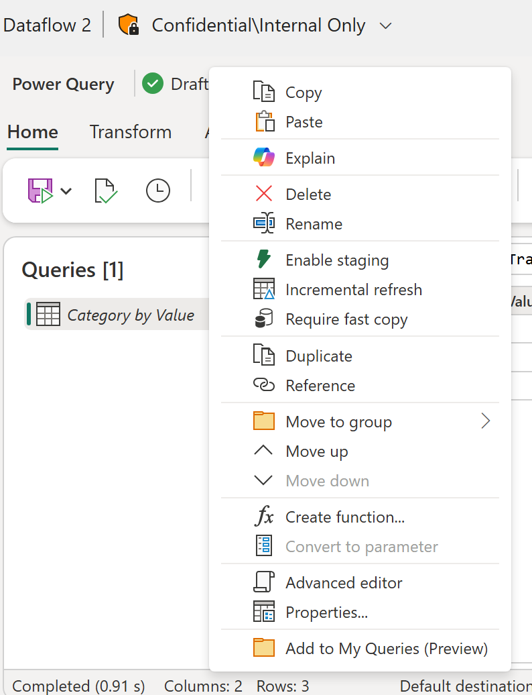
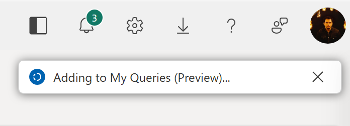
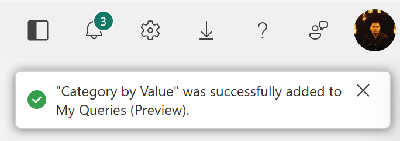
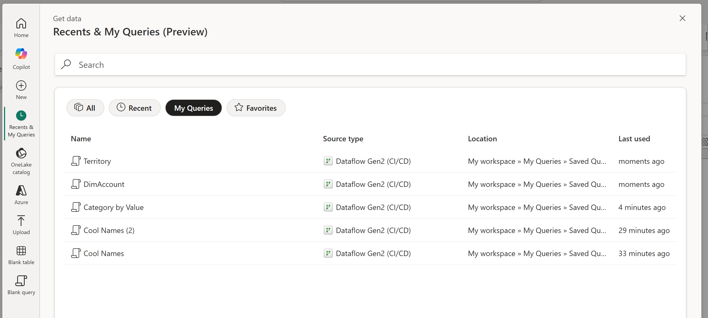

# My queries (Preview)

> [!NOTE]
> This feature is currently in preview for Dataflow Gen2 (CI/CD) in Microsoft Fabric.

My queries lets you save and reuse queries across Dataflow Gen2 dataflows. Instead of rebuilding the same transformations in every dataflow, you can save common queries once and import them wherever you need them. This helps you standardize logic, reduce repetitive work, and speed up dataflow authoring across projects.

The feature provides two core experiences:

- **Add to My Queries (Preview)** &ndash; Save queries from any dataflow you're part of into your personal My queries storage.
- **Import** &ndash; Copy saved queries from My queries into your current dataflow to speed up authoring.

## Add a query to My queries

1. Right-click the query in the **Queries** pane.
1. Select **Add to My Queries (Preview)**.

   

A notification confirms your request.

After the query is saved, a second notification shows the query name used in My queries.

## Import a query from My queries

1. Open the [**Recents & My Queries** module in the modern **Get data** experience](get-data-dataflow-gen2.md#recent-data-preview).
1. Select the **My queries** filter pill.

   

This view lists all the queries that you've saved to My queries. Select any query to import its script as-is.

## Considerations and limitations

- **Query limit**: The My queries dialog shows only the latest 50 queries.
- **No delete support**: You can't delete queries from the My queries dialog.
- **Recents list**: Any query saved to My queries is also added to the **Recents** list.
- **Saved contents**: Only the M code of a query is saved. Query attributes, credentials, and data destination metadata aren't stored.
- **Deduplication**: If you save a query with a name that already exists in My queries, the feature appends a numeric value to create a unique name.
- **List order**: The list is sorted by last-used timestamp, from newest to oldest.
- **Storage**: The first time you save a query, a folder named *My queries* is created in your personal workspace (*My Workspace*). This folder contains Dataflow Gen2 items that store your saved queries.