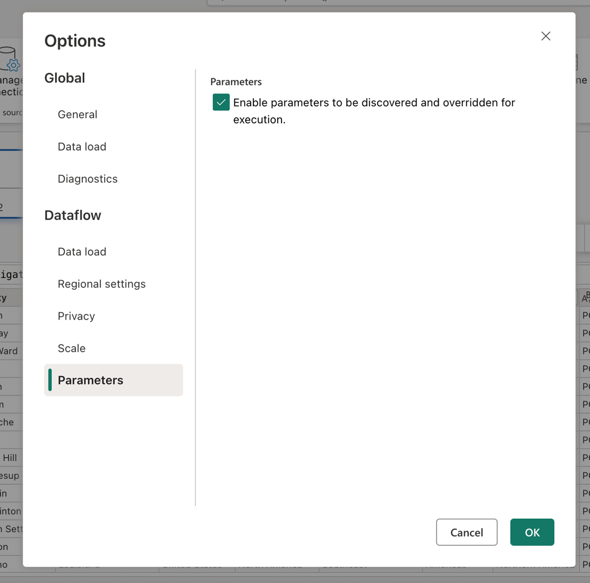
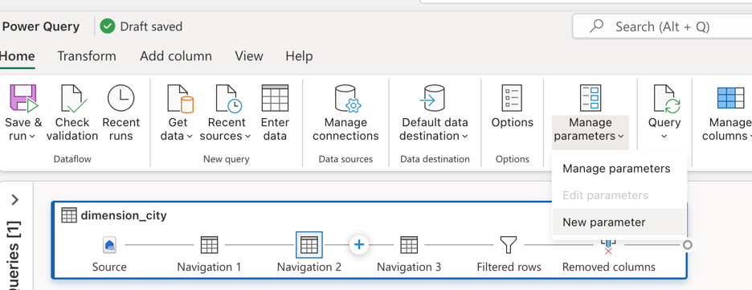
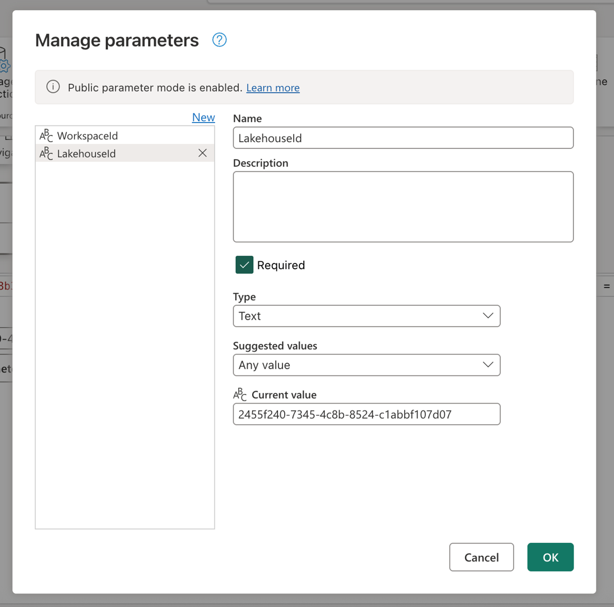
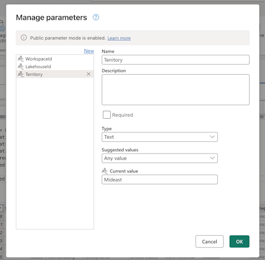
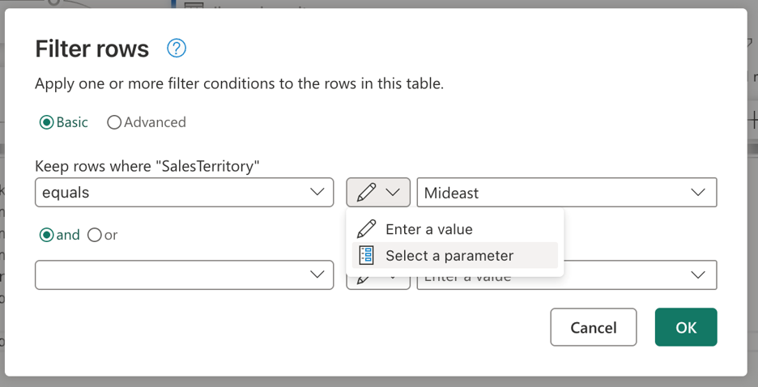
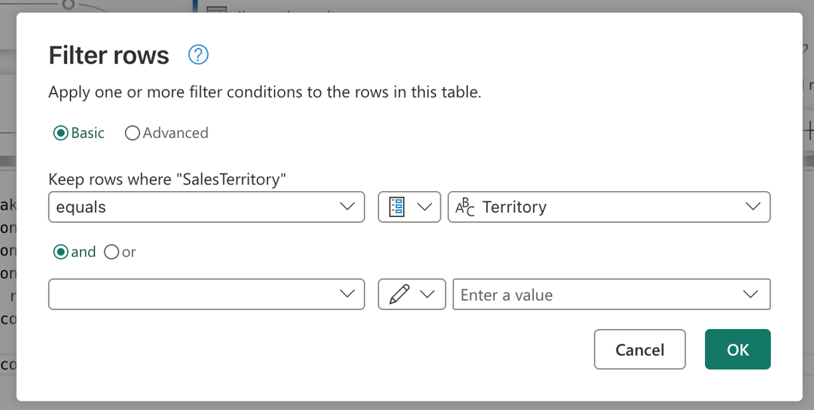
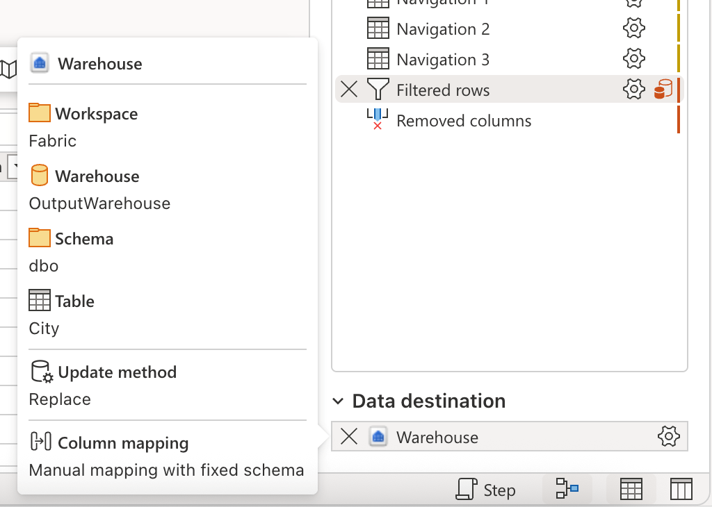
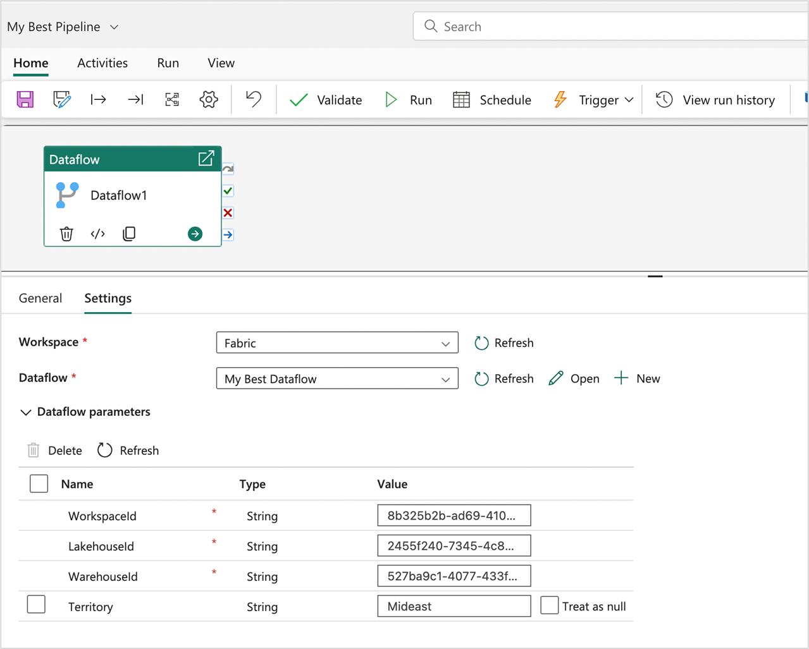

# Parameterized Dataflow Gen2

>[!NOTE]
>This article focuses on a solution architecture from [CI/CD and ALM (Application Lifecycle Management) solution architectures for Dataflow Gen2](dataflow-gen2-cicd-alm-solution-architecture.md) that relies on the [public parameters mode feature](dataflow-parameters.md) and is only applicable to Dataflow Gen2 with CI/CD support.

Parameters in Fabric Dataflow Gen2 let you define reusable inputs that shape how a dataflow is designed, and with **public parameters mode** those inputs can be set at runtime through pipelines or APIs. It makes a single dataflow highly flexible and versatile, since you can reuse the same logic across many scenarios simply by passing different values, enabling dynamic, automated workflows without ever needing to rewrite or duplicate the transformations.

This tutorial walks you through an example that shows you how to:
* **Parameterize a source**: Using a Lakehouse with the WideWorldImpoters sample dataset as the source
* **Parameterize logic**: Using the input widgets available throughout the Dataflow experience
* **Parameterize destination**: Using a Warehouse as a destination 
* **Submit a run request with parameter values**: passing parameter values through the Dataflow activity experience inside of a Fabric pipeline

:::image type="content" source="media/dataflow-gen2-parameterized-dataflow/parameterized-dataflow-detailed-architecture.png" alt-text="Diagram of a parameterized dataflow solution architecture in Dataflow Gen2." lightbox="media/dataflow-gen2-parameterized-dataflow/parameterized-dataflow-detailed-architecture.png":::

>[!NOTE]
> The concepts showcased in this article are universal to Dataflow Gen2 and are applicable to other sources and destinations beyond the ones shown here.

## The scenario

:::image type="content" source="media/dataflow-gen2-parameterized-dataflow/query-scenario-diagram.png" alt-text="Screenshot of the query with the name dimension_city for the scenario inside of Dataflow Gen2." lightbox="media/dataflow-gen2-parameterized-dataflow/query-scenario-diagram.png":::

The dataflow used in this scenario is simple, but the core principles described apply to all types of dataflows. It connects to the table named dimension_city from the Wide World Importers sample dataset stored in a Lakehouse. It filters rows where the SalesTerritory column equals Southeast, and loads the result into a new table called City in a Warehouse. All components—the Lakehouse, Warehouse, and Dataflow—are located in the same Workspace.
To make the dataflow dynamic, you parameterize the source table, the filter value, and the destination table. These changes allow the dataflow to run with specific values instead of hardcoded ones. 

Before continuing, enable public parameters mode by going to the *Home* tab, selecting *Options*, and in the *Parameters* section, checking the box labeled **Enable parameters to be discovered and overridden for execution** and allow your dataflow to accept parameters during execution.



## Parameterize source

When using any of the Fabric connectors—such as Lakehouse, Warehouse, or Fabric SQL—they all follow the same navigation structure and use the same input format. In this scenario, none of the connectors require manual input to establish a connection. However, each one shows which workspace and item it connects to through the navigation steps in your query.
For example, the first navigation step includes the workspaceId that the query connects to.

:::image type="content" source="media/dataflow-gen2-parameterized-dataflow/navigation-workspaceid-reference.png" alt-text="Screenshot of the Navigation 1 step with the workspaceId value in the formula bar for the dimension_city query." lightbox="media/dataflow-gen2-parameterized-dataflow/navigation-workspaceid-reference.png":::

The goal is to replace the hardcoded values in the formula bar with parameters. Specifically, you need to create one parameter for the **WorkspaceId** and another for the **LakehouseId**.
To create parameters, go to the *Home* tab in the ribbon, select *Manage parameters*, and then choose *New parameter* from the dropdown menu.



As you create the parameters, make sure both are marked as **required** and set to the **text** type. For their current values, use the ones that match the corresponding values from your specific environment.



Once both parameters are created, you can update the query script to use them instead of hardcoded values. This involves manually replacing the original values in the formula bar with references to the Workspace ID and Lakehouse ID parameters.
The original query script looks like this:

```M code 
let
  Source = Lakehouse.Contents([]),
  #"Navigation 1" = Source{[workspaceId = "8b325b2b-ad69-4103-93ae-d6880d9f87c6"]}[Data],
  #"Navigation 2" = #"Navigation 1"{[lakehouseId = "2455f240-7345-4c8b-8524-c1abbf107d07"]}[Data],
  #"Navigation 3" = #"Navigation 2"{[Id = "dimension_city", ItemKind = "Table"]}[Data],
  #"Filtered rows" = Table.SelectRows(#"Navigation 3", each ([SalesTerritory] = "Southeast")),
  #"Removed columns" = Table.RemoveColumns(#"Filtered rows", {"ValidFrom", "ValidTo", "LineageKey"})
in
  #"Removed columns"
```
Once you update the references in the navigation steps, your new updated script might look like this:

```M code 
let
  Source = Lakehouse.Contents([]),
  #"Navigation 1" = Source{[workspaceId = WorkspaceId]}[Data],
  #"Navigation 2" = #"Navigation 1"{[lakehouseId = LakehouseId]}[Data],
  #"Navigation 3" = #"Navigation 2"{[Id = "dimension_city", ItemKind = "Table"]}[Data],
  #"Filtered rows" = Table.SelectRows(#"Navigation 3", each ([SalesTerritory] = "Southeast")),
  #"Removed columns" = Table.RemoveColumns(#"Filtered rows", {"ValidFrom", "ValidTo", "LineageKey"})
in
  #"Removed columns"
```

And you notice that it still correctly evaluates the data preview in the Dataflow editor.

## Parameterize logic

Now that the source is using parameters, you can focus on parameterizing the transformation logic of the dataflow. In this scenario, the filter step is where the logic is applied, and the value being filtered, currently hardcoded as *Southeast*, should be replaced with a parameter.
To do this, create a new parameter named **Territory**, set its data type to *text*, mark it as not *required*, and set its current value to **Mideast**.



Given that your filter step was created using the user interface, you can head over to the Filtered rows step, double select it and get the settings dialog for the filter step. This dialog allows you to select, through the input widget, if you wish to use a parameter instead of a static value:



After selecting the option to *Select a parameter*, a dropdown will appear to show all available parameters that match the required data type. From this list, you can select the newly created Territory parameter.



Once you select OK, notice that the diagram view has already created the link between the newly created parameter and the query in use. Not only that, but the data preview now shows you information for the **Mideast** territory.

:::image type="content" source="media/dataflow-gen2-parameterized-dataflow/mideast-territory-data-preview.png" alt-text="Screenshot of the Diagram view, Query settings, and Data preview for the dimension_city query showing data for the Mideast SalesTerritory." lightbox="media/dataflow-gen2-parameterized-dataflow/mideast-territory-data-preview.png":::

## Parameterize destination
>[!NOTE]
>It's recommended that you get acquainted with the concept of data destinations in Dataflow Gen2 and how its mashup script gets created from the article on [data destinations and managed settings](dataflow-gen2-data-destinations-and-managed-settings.md#mashup-script-for-data-destination-queries) 

The last component to parameterize in this scenario is the destination. To do this, you use the [advanced edit for data destination queries](dataflow-gen2-advanced-edit-data-destinations.md) feature, which lets you modify the destination query script directly in the Dataflow editor using Power Query M code.



Before you begin, create a parameter with the name **WarehouseId**. Make sure to use the corresponding ID of your Warehouse as the current value, set it as required, and set it to the text data type.

### Enable advanced edit for data destination queries

To modify the destination query directly in the Dataflow editor, you first need to enable the advanced edit feature:

1. Select **Options** from the **Home** tab in the ribbon.

1. In the **Options** dialog, scroll down to the **Data destinations** section.

1. Select the checkbox for **Enable advanced edit for data destination queries**.

1. A warning dialog appears explaining that modifying destination queries can cause unexpected behavior or break the dataflow. Read the warning carefully and select **OK** to confirm.

1. Select **OK** to close the Options dialog.

### Modify the destination query

After you enable advanced edit, you can access and modify the destination query for your data destination:

1. In the **Queries** pane, locate the data destination section that shows your configured destinations.

1. Right-click on the destination query named **dimension_city**.

1. From the context menu, select **Advanced editor**.

The destination query looks as follows:

```M code    
let
  Pattern = Fabric.Warehouse([HierarchicalNavigation = null, CreateNavigationProperties = false]),
  Navigation_1 = Pattern{[workspaceId = "8b325b2b-ad69-4103-93ae-d6880d9f87c6"]}[Data],
  Navigation_2 = Navigation_1{[warehouseId = "527ba9c1-4077-433f-a491-9ef370e9230a"]}[Data],
  TableNavigation = Navigation_2{[Item = "City", Schema = "dbo"]}?[Data]?
in
  TableNavigation
```

Similarly to the script of the source for the Lakehouse, this script for the destination has a similar pattern where it hardcodes the workspaceId and warehouseId. Replace those fixed values with the identifiers of the parameters and your script looks as follows:

```M code 
let
  Pattern = Fabric.Warehouse([HierarchicalNavigation = null, CreateNavigationProperties = false]),
  Navigation_1 = Pattern{[workspaceId = WorkspaceId]}[Data],
  Navigation_2 = Navigation_1{[warehouseId = WarehouseId]}[Data],
  TableNavigation = Navigation_2{[Item = "City", Schema = "dbo"]}?[Data]?
in
  TableNavigation
```

Select **OK** to save your changes in the advanced editor.

> [!IMPORTANT]
> After you modify a destination query using advanced edit, the standard UI for changing that destination no longer works. You must continue to use the advanced editor for any further modifications to that destination. For more information, see [Advanced edit for data destination queries](dataflow-gen2-advanced-edit-data-destinations.md).

You can verify that all changes are in place by reviewing the data destination and any previous parameter references that were added.
This finalizes all the parameterization of your Dataflow and you can now move on to run your Dataflow by passing parameter values for execution.

## Run request with parameter values

You can use the [Fabric REST API](/rest/api/fabric/dataflow/background-jobs/run-on-demand-execute) to send a run request with a custom payload that contains   your parameter values for that specific run operation and you can also use the [REST API to discover dataflow parameters](/rest/api/fabric/dataflow/items/discover-dataflow-parameters?tabs=HTTP) and understand what the Dataflow expects so it can trigger a run.
In this tutorial, you'll use the experience found within the Dataflow activity for Fabric pipelines.
Start by creating a Pipeline and add a new [dataflow activity](dataflow-activity.md) to the canvas. In the settings of the activity, find the workspace where your Dataflow is located and then select the Dataflow from the dropdown.



A Dataflow parameters section can be expanded to show you all the available parameters in the Dataflow and their default values. You can replace any values in here and the values passed will be used to define what sources, logic and destination should be used to evaluate your dataflow run.
You can also give new scenarios a try by creating a new Warehouse and changing the WarehouseId for the evaluation or using this pattern in a deployment pipeline where the WorkspaceId and other parameters need to be passed to point to the correct items in the corresponding environment.