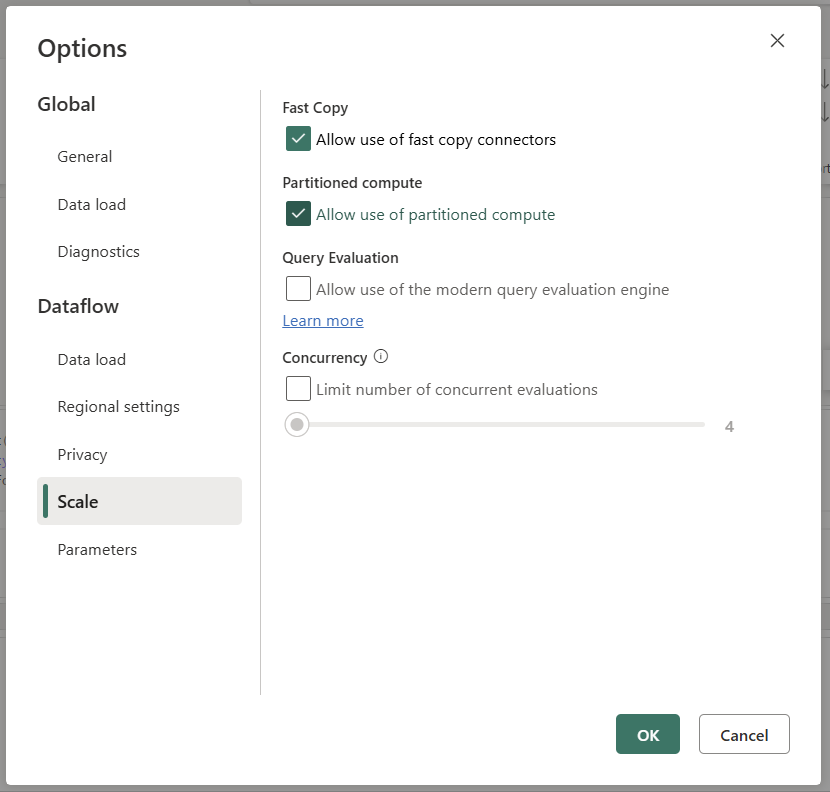

# Use partitioned compute in Dataflow Gen2 (Preview)

>[!NOTE]
>Preview only step is currently in preview and only available in Dataflow Gen2 with CI/CD.
>Before proceeding with this article, it is recommended that you become acquainted with the 

Partitioned compute is a capability of the Dataflow Gen2 engine that allows parts of your dataflow logic to run in parallel that can in turn reduce the time that it completes its evaluations.

Partitioned compute targets scenarios where the Dataflow engine can efficiently fold operations that can partition the data source and process each partition in parallel. For example, in a scenario where you're connecting to multiple files stored in an Azure Data Lake Storage Gen2, you can partition the list of files from your source, efficiently retrieve the partitioned list of files using [query folding](/power-query/query-folding-basics), use the [combine files experience](/power-query/combine-files-overview) and process all files in parallel.

## How to set partitioned compute

In order to use this capability, you'll need to:

* Enable Dataflow settings
* Query with partition keys 

### Enable Dataflow settings

Inside the Home tab of the ribbon, select the Options button to display its dialog. Navigate to the Scale section and enable the setting that reads *Allow use of partitioned compute*.



Enabling this option has two purposes:
* Allows your Dataflow to leverage partitioned compute if discovered through your query scripts
* Experiences like the combine files will now automatically create partition keys that can be used for partitioned computed 

Beyond this setting, it is also required that you enable the seting found within the privacy section to *Allow combining data from multiple sources*. 

### Query with partition key
>[!NOTE]
>To leverage partitioned compute, make sure that your query is set to be staged.

After enabling the setting, you can use the combine files experience for a data source that uses the file system view such as Azure Data Lake Storage Gen2. When the combine files experience finalizes, you'll notice that your query will now have an **Added custom** step which will have a script similar to the one below:

```M code 
let
    rootPath = Text.TrimEnd(Value.Metadata(Value.Type(#"Filtered hidden files"))[FileSystemTable.RootPath]?, "\"),
    combinePaths = (path1, path2) => Text.Combine({Text.TrimEnd(path1, "\"), path2}, "\"),
    getRelativePath = (path, relativeTo) => Text.Middle(path, Text.Length(relativeTo) + 1),
    withRelativePath = Table.AddColumn(#"Filtered hidden files", "Relative Path", each getRelativePath(combinePaths([Folder Path], [Name]), rootPath), type text),
    withPartitionKey = Table.ReplacePartitionKey(withRelativePath, {"Relative Path"})
in
    withPartitionKey
```
This script, and specifically the ``withPartitionKey`` component, is the one that drives the logic on how your Dataflow will try to partition your data and how it will try to evalute things in parallel.

You can use the [Table.PartitionKey](/powerquery-m/table-partitionkey) function against the **Added custom** step. This function returns the partition key of the specified table. For the case above, it'll be the column "RelativePath". You can get a distinct list of the values in that column to understand all the partitions that will be used during the dataflow run.

>[!IMPORTANT]
>It is important that the partition key columns remains in the query in order for partitioned compute to be applied.


