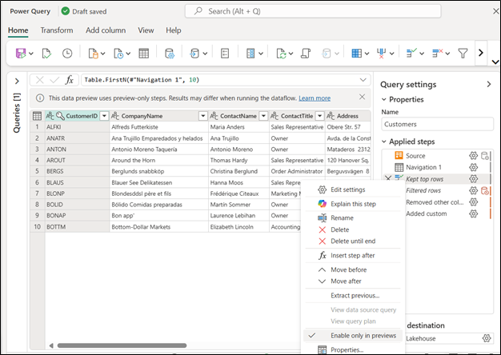

# Preview only step in Dataflow Gen2 (Preview)

>[!NOTE]
>Preview only step is currently in preview. 

Preview only steps are transformation steps in Dataflow Gen2 that are executed only during the authoring phase for the data preview. They're excluded from run operations, ensuring they don't affect runtime behavior or production logic. 

They're designed to accelerate the authoring experience by reducing evaluation time in the data preview pane. They allow you to iterate and validate transformations more quickly without impacting the final execution of the dataflow.

Some of the scenarios where preview only steps can help are:

* Filtering or isolating subsets of data for faster previews.
* Testing logic without waiting for full dataset evaluation.
* Exploring new data sources without impacting run integrity.

## Set a preview only step

To set a preview-only step in Dataflow Gen2, follow these steps:

1. Open your dataflow in the Power Query editor within Microsoft Fabric.
2. Right-click on the transformation step you want to designate as preview-only.
3. Select **Enable only in previews** from the context menu.

Once the option is selected, the step name is shown in italic style. To remove this option, you can right-click the step again and disable the option.

## Common transforms used as preview only steps

## Presence in dialogs

### File system view connectors 

### Combine files experience
