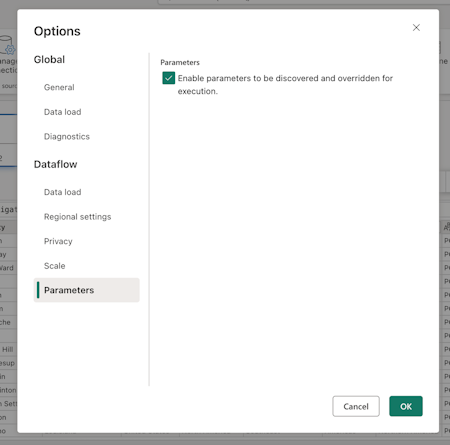

# Tutorial: Parameterized Dataflow Gen2

>[!NOTE]
>This article focuses on a solution architecture from [CI/CD and ALM (Application Lifecycle Management) solution architectures for Dataflow Gen2](dataflow-gen2-cicd-alm-solution-architecture.md) that relies on the [public parameters mode feature](dataflow-parameters.md) and is only applicable to Dataflow Gen2 with CI/CD support.

Parameters in Fabric Dataflow Gen2 let you define reusable inputs that shape how a dataflow is designed, and with **public parameters mode** those inputs can be set at runtime through pipelines or APIs. It makes a single dataflow highly flexible and versatile, since you can reuse the same logic across many scenarios simply by passing different values, enabling dynamic, automated workflows without ever needing to rewrite or duplicate the transformations.

This tutorial walks you through an example that shows you how to:
* **Parameterize a source**: Using a Lakehouse with the WideWorldImpoters sample dataset as the source
* **Parameterize logic**: Using the input widgets available throughout the Dataflow experience
* **Parameterize destination**: Using a Warehouse as a destination 
* **Submit a run request with parameter values**: passing parameter values through the Dataflow activity experience inside of a Fabric pipeline

:::image type="content" source="media/dataflow-gen2-tutorial-parameterized-dataflow/parameterized-dataflow-detailed-architecture.png" alt-text="Diagram of a parameterized dataflow solution architecture in Dataflow Gen2." lightbox="media/dataflow-gen2-tutorial-parameterized-dataflow/parameterized-dataflow-detailed-architecture.png":::

>[!NOTE]
> The concepts showcased in this article are universal to Dataflow Gen2 and are applicable to other sources and destinations beyond the ones shown here.

## The scenario

:::image type="content" source="media/dataflow-gen2-tutorial-parameterized-dataflow/query-scenario-diagram.png" alt-text="Diagram representation of the query for the scenario inside of Dataflow Gen2." lightbox="media/dataflow-gen2-tutorial-parameterized-dataflow/query-scenario-diagram.png":::

The dataflow used in this scenario is simple, but the core principles described apply to all types of dataflows. It connects to the table named dimension_city from the Wide World Importers sample dataset stored in a Lakehouse. It filters rows where the SalesTerritory column equals Southeast, and loads the result into a new table called City in a Warehouse. All components—the Lakehouse, Warehouse, and Dataflow—are located in the same Workspace.
To make the dataflow dynamic, you parameterize the source table, the filter value, and the destination table. These changes allow the dataflow to run with specific values instead of hardcoded ones. 

Before continuing, enable public parameters mode by going to the *Home* tab, selecting *Options*, and in the *Parameters* section, checking the box labeled **Enable parameters to be discovered and overridden for execution** and allow your dataflow to accept parameters during execution.

