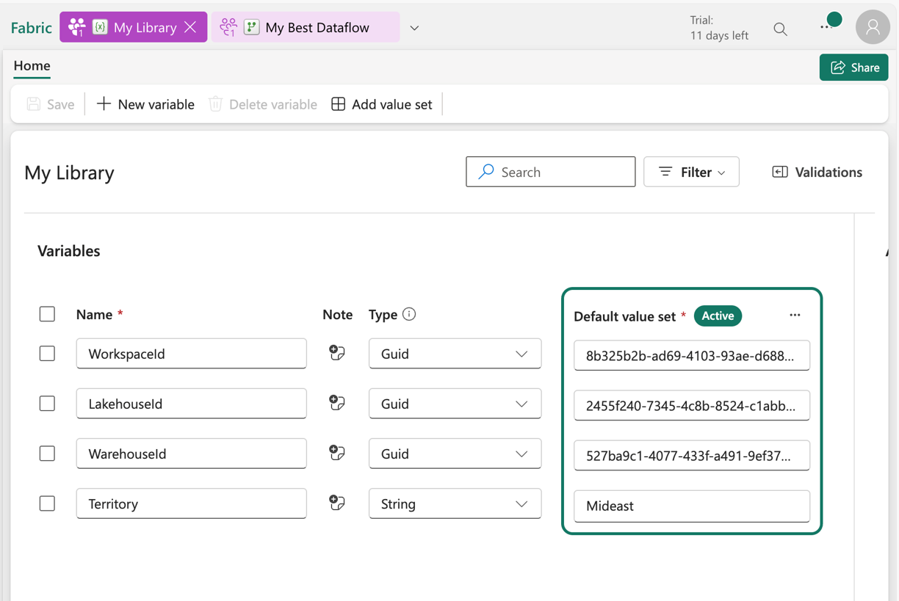
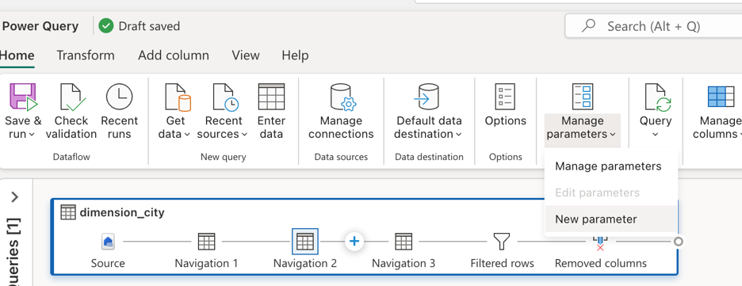
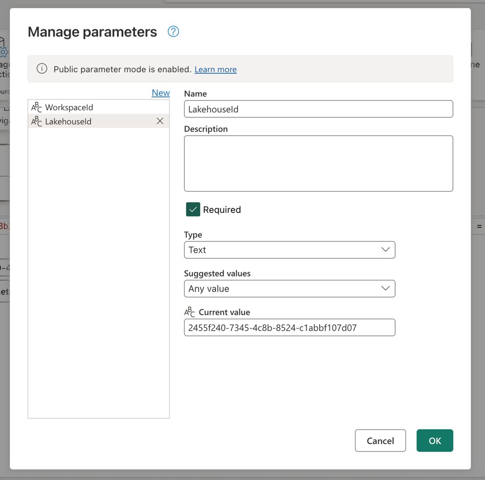
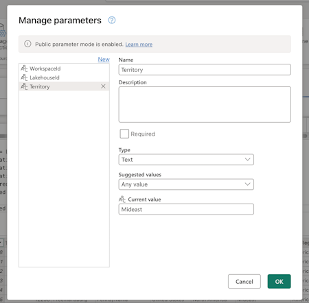
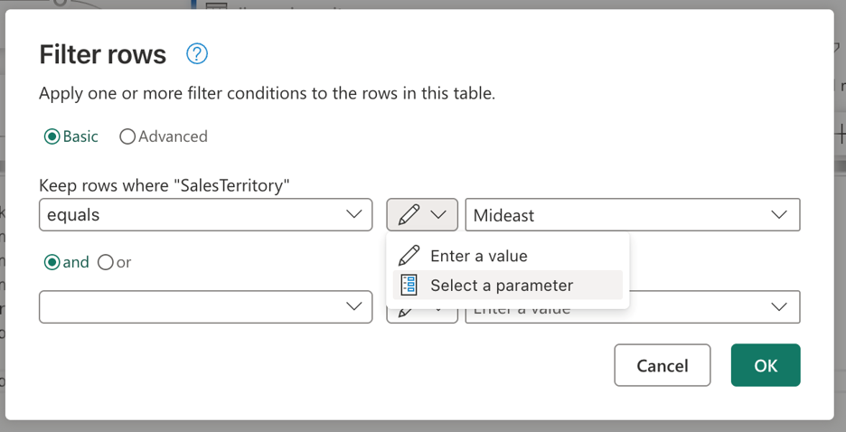
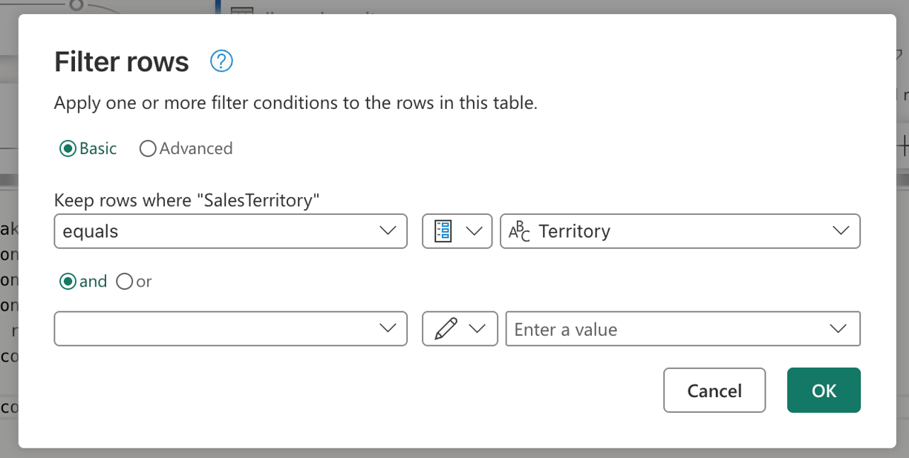
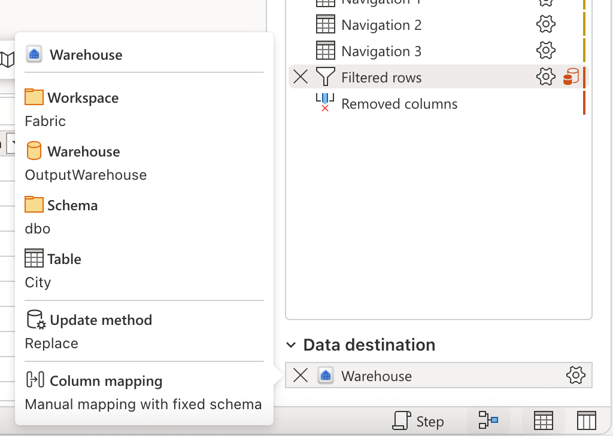
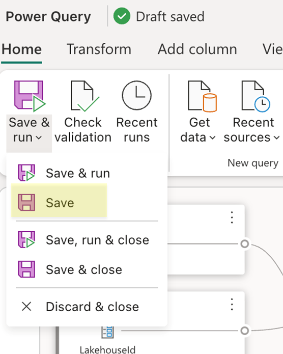

# Variable references in a Dataflow

>[!NOTE]
>This article focuses on a solution architecture from [CI/CD and ALM (Application Lifecycle Management) solution architectures for Dataflow Gen2](dataflow-gen2-cicd-alm-solution-architecture.md) that relies on the [variable libraries integration](dataflow-gen2-variable-library-integration.md) and is only applicable to Dataflow Gen2 with CI/CD support.

Fabric variable libraries in Dataflow Gen2 enable centralized, reusable configuration management across environments. By referencing variables directly in your dataflow scripts, you can dynamically adjust behavior without hardcoding values, which is ideal for CI/CD workflows. This integration simplifies deployment across stages by allowing workspace-specific values (like Lakehouse or Workspace IDs) to be injected at runtime, making your dataflows more adaptable and maintainable.

This tutorial walks you through an example solution that uses variable references in a Dataflow and shows you how to:
* **Set variables**: Using the Fabric variable libraries and their distinct data types
* **Parameterize a source**: Using a Lakehouse with the WideWorldImpoters sample dataset as the source
* **Parameterize logic**: Using the input widgets available throughout the Dataflow experience
* **Parameterize destination**: Using a Warehouse as a destination 

:::image type="content" source="media/dataflow-gen2-variable-references/diagram-dataflow-gen2-variable-references.png" alt-text="Diagram of a solution architecture that uses variable references in Dataflow Gen2." lightbox="media/dataflow-gen2-variable-references/diagram-dataflow-gen2-variable-references.png":::

>[!NOTE]
> The concepts showcased in this article are universal to Dataflow Gen2 and are applicable to other sources and destinations beyond the ones shown here.

## The scenario

:::image type="content" source="media/dataflow-gen2-parameterized-dataflow/query-scenario-diagram.png" alt-text="Screenshot of the query with the name dimension_city for the scenario inside of Dataflow Gen2." lightbox="media/dataflow-gen2-parameterized-dataflow/query-scenario-diagram.png":::

The dataflow used in this scenario is simple, but the core principles described apply to all types of dataflows. It connects to the table named dimension_city from the Wide World Importers sample dataset stored in a Lakehouse. It filters rows where the SalesTerritory column equals Southeast, and loads the result into a new table called City in a Warehouse. All components—the Lakehouse, Warehouse, and Dataflow—are located in the same Workspace. To make the dataflow dynamic, you use variables to drive the source table, the filter value, and the destination table. These changes allow the dataflow to run with values stored in Fabric variable libraries instead of hardcoded ones. 

## Set variables

>[!NOTE]
> Make sure to have Fabric variable libraries enabled for your organization or security group. Learn more on [how to get started with variable libraries](/fabric/cicd/variable-library/get-started-variable-libraries).

As a best practice, it's always recommended to have a design in mind before creating a solution and what components from your Dataflow are dynamically sourced from a variable library. While you can create multiple libraries within a workspace, this example uses a single library named **My Library** that holds the variables that the Dataflow Gen2 uses:

|Variable name|Type|Purpose|
|----|---|---|
|**WorkspaceId**|Guid|Used for the data source and destination scripts in the Dataflow|
|**LakehouseId**|Guid|Determines the ID of the Lakehouse being used as the source|
|**WarehouseId**|Guid| Determines the ID of the Warehouse being used as the destination|
|**Territory**|String|Sets what value should be used to drive the filter logic in the Dataflow|

Make sure to set the default values that correspond to your own environment and then save the variable library.



## Parameterize source

When using any of the Fabric connectors—such as Lakehouse, Warehouse, or Fabric SQL—they all follow the same navigation structure and use the same input format. In this scenario, none of the connectors require manual input to establish a connection. However, each one shows which workspace and item it connects to through the navigation steps in your query.
For example, the first navigation step includes the workspaceId that the query connects to.

:::image type="content" source="media/dataflow-gen2-parameterized-dataflow/navigation-workspaceid-reference.png" alt-text="Screenshot of the Navigation 1 step with the workspaceId value in the formula bar for the dimension_city query." lightbox="media/dataflow-gen2-parameterized-dataflow/navigation-workspaceid-reference.png":::

The goal is to replace the hardcoded values in the formula bar with parameters. Specifically, you need to create one parameter for the **WorkspaceId** and another for the **LakehouseId**.
To create parameters, go to the *Home* tab in the ribbon, select *Manage parameters*, and then choose *New parameter* from the dropdown menu.



As you create the parameters, make sure both are marked as **required** and set to the **text** type. For their current values, use the ones that match the corresponding values from your specific environment.



Once both parameters are created, you can update the query script to use them instead of hardcoded values. This involves manually replacing the original values in the formula bar with references to the Workspace ID and Lakehouse ID parameters.
The original query script looks like this:

```M code 
let
  Source = Lakehouse.Contents([]),
  #"Navigation 1" = Source{[workspaceId = "8b325b2b-ad69-4103-93ae-d6880d9f87c6"]}[Data],
  #"Navigation 2" = #"Navigation 1"{[lakehouseId = "2455f240-7345-4c8b-8524-c1abbf107d07"]}[Data],
  #"Navigation 3" = #"Navigation 2"{[Id = "dimension_city", ItemKind = "Table"]}[Data],
  #"Filtered rows" = Table.SelectRows(#"Navigation 3", each ([SalesTerritory] = "Southeast")),
  #"Removed columns" = Table.RemoveColumns(#"Filtered rows", {"ValidFrom", "ValidTo", "LineageKey"})
in
  #"Removed columns"
```
Once you update the references in the navigation steps, your new updated script might look like this:

```M code 
let
  Source = Lakehouse.Contents([]),
  #"Navigation 1" = Source{[workspaceId = WorkspaceId]}[Data],
  #"Navigation 2" = #"Navigation 1"{[lakehouseId = LakehouseId]}[Data],
  #"Navigation 3" = #"Navigation 2"{[Id = "dimension_city", ItemKind = "Table"]}[Data],
  #"Filtered rows" = Table.SelectRows(#"Navigation 3", each ([SalesTerritory] = "Southeast")),
  #"Removed columns" = Table.RemoveColumns(#"Filtered rows", {"ValidFrom", "ValidTo", "LineageKey"})
in
  #"Removed columns"
```

And you notice that it still correctly evaluates the data preview in the Dataflow editor.

## Parameterize logic

Now that the source is using parameters, you can focus on parameterizing the transformation logic of the dataflow. In this scenario, the filter step is where the logic is applied, and the value being filtered, currently hardcoded as *Southeast*, should be replaced with a parameter.
To do this, create a new parameter named **Territory**, set its data type to *text*, mark it as not *required*, and set its current value to **Mideast**.



Given that your filter step was created using the user interface, you can head over to the Filtered rows step, double select it and get the settings dialog for the filter step. This dialog allows you to select, through the input widget, if you wish to use a parameter instead of a static value:



After selecting the option to *Select a parameter*, a dropdown will appear to show all available parameters that match the required data type. From this list, you can select the newly created Territory parameter.



Once you select OK, notice that the diagram view has already created the link between the newly created parameter and the query in use. Not only that, but the data preview now shows you information for the **Mideast** territory.

:::image type="content" source="media/dataflow-gen2-parameterized-dataflow/mideast-territory-data-preview.png" alt-text="Screenshot of the Diagram view, Query settings, and Data preview for the dimension_city query showing data for the Mideast SalesTerritory." lightbox="media/dataflow-gen2-parameterized-dataflow/mideast-territory-data-preview.png":::

## Parameterize destination
>[!NOTE]
>It's recommended that you get acquainted with the concept of data destinations in Dataflow Gen2 and how its mashup script gets created from the article on [data destinations and managed settings](dataflow-gen2-data-destinations-and-managed-settings.md#mashup-script-for-data-destination-queries) 

The last component to parameterize in this scenario is the destination. While the information about what the data destination is can be found in the Dataflow editor, to parameterize this part of the dataflow you need to use Git or the REST API.



This tutorial shows you how to make the changes through Git. Before you can make changes through git make sure to:
* **Create a parameter with the name WarehouseId**: make sure to use the corresponding ID of your Warehouse as the current value, set it as required and of the text data type.
* **Save the Dataflow**: use the Save button in the home tab of the ribbon.



Once your Dataflow is saved, make sure to commit the changes to your Git repository and head over to your repository to see the *mashup.pq* file of your Dataflow.
When looking at the *mashup.pq* file, look for the query that you associated the data destination with. In this scenario, the name of that query is dimension_city. You see a record attribute above this query name:

```M code 
[DataDestinations = {[Definition = [Kind = "Reference", QueryName = "dimension_city_DataDestination", IsNewTarget = true], Settings = [Kind = "Manual", AllowCreation = true, ColumnSettings = [Mappings = {[SourceColumnName = "CityKey", DestinationColumnName = "CityKey"], [SourceColumnName = "WWICityID", DestinationColumnName = "WWICityID"], [SourceColumnName = "City", DestinationColumnName = "City"], [SourceColumnName = "StateProvince", DestinationColumnName = "StateProvince"], [SourceColumnName = "Country", DestinationColumnName = "Country"], [SourceColumnName = "Continent", DestinationColumnName = "Continent"], [SourceColumnName = "SalesTerritory", DestinationColumnName = "SalesTerritory"], [SourceColumnName = "Region", DestinationColumnName = "Region"], [SourceColumnName = "Subregion", DestinationColumnName = "Subregion"], [SourceColumnName = "Location", DestinationColumnName = "Location"], [SourceColumnName = "LatestRecordedPopulation", DestinationColumnName = "LatestRecordedPopulation"]}], DynamicSchema = false, UpdateMethod = [Kind = "Replace"], TypeSettings = [Kind = "Table"]]]}]
shared dimension_city = let
```
This attribute record has a field with the name QueryName, which holds the name of the query that has all the data destination logic associated for this query. This query looks as follows:

```M code    
shared dimension_city_DataDestination = let
  Pattern = Fabric.Warehouse([HierarchicalNavigation = null, CreateNavigationProperties = false]),
  Navigation_1 = Pattern{[workspaceId = "8b325b2b-ad69-4103-93ae-d6880d9f87c6"]}[Data],
  Navigation_2 = Navigation_1{[warehouseId = "527ba9c1-4077-433f-a491-9ef370e9230a"]}[Data],
  TableNavigation = Navigation_2{[Item = "City", Schema = "dbo"]}?[Data]?
in
  TableNavigation
```

You notice that, similarly to the script of the source for the Lakehouse, this script for the destination has a similar pattern where it hardcodes the workspaceid that needs to be used and also the warehouseId. Replace those fixed values with the identifiers of the parameters and your script shall look as follows:

```M code 
shared dimension_city_DataDestination = let
  Pattern = Fabric.Warehouse([HierarchicalNavigation = null, CreateNavigationProperties = false]),
  Navigation_1 = Pattern{[workspaceId = WorkspaceId]}[Data],
  Navigation_2 = Navigation_1{[warehouseId = WarehouseId]}[Data],
  TableNavigation = Navigation_2{[Item = "City", Schema = "dbo"]}?[Data]?
in
  TableNavigation
```

You can now commit this change and update your dataflow using the changes from your Dataflow through the source control feature in your workspace.
You can verify that all changes are in place by opening your Dataflow and reviewing the data destination and any previous parameter references that were added.
This finalizes all the parameterization of your Dataflow and you can now move on to run your Dataflow by passing parameter values for execution.
