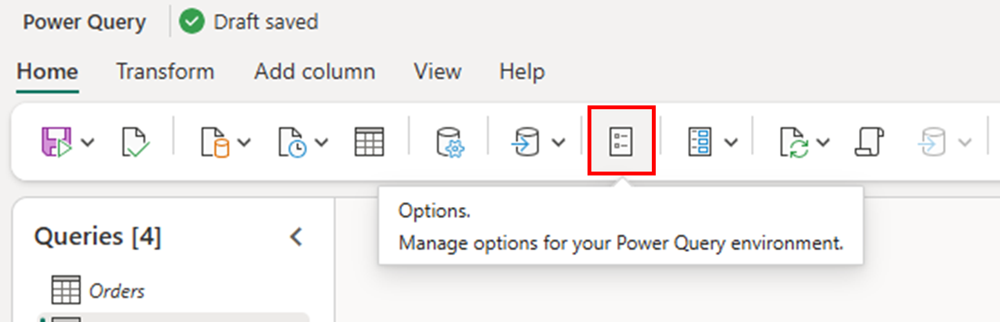
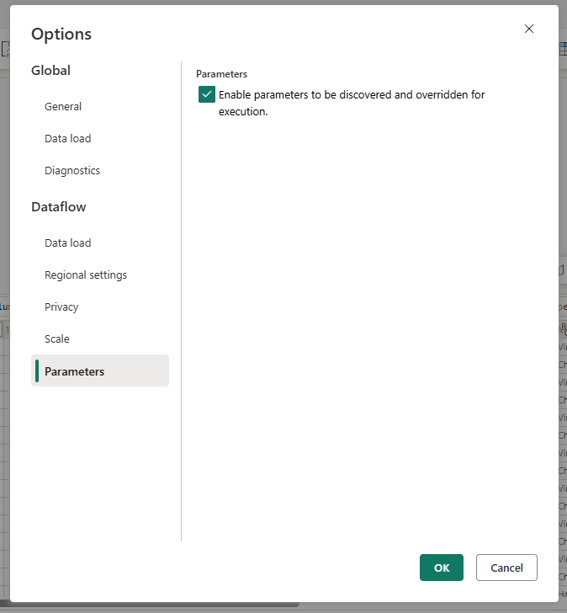
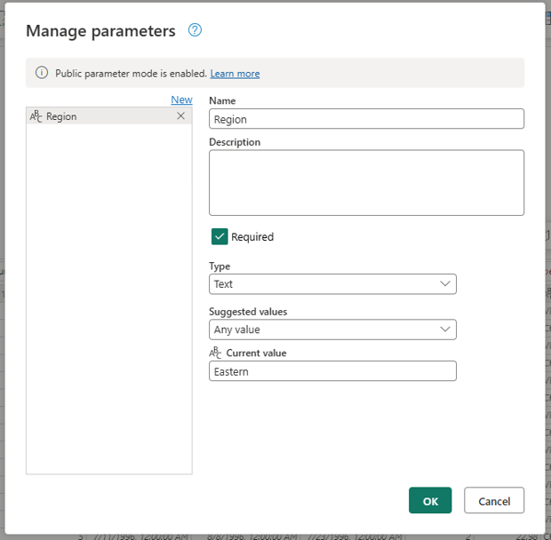
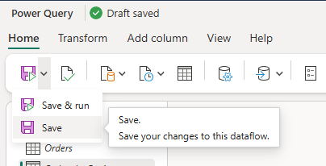
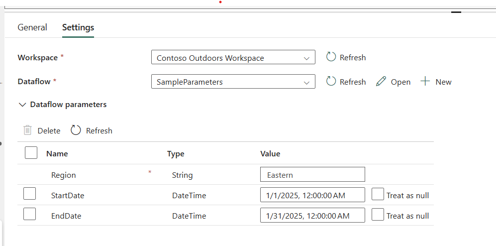

# Use public parameters in Dataflow Gen2

>[!TIP]
>For more information on how to leverage this capability in continous integration / continous deployment (CI/CD) scenarios, read the article on [CI/CD and ALM solution architectures for Dataflow Gen2](dataflow-gen2-cicd-alm-solution-architecture.md) and the end-to-end tutorial on [Parameterized Dataflow Gen2](dataflow-gen2-parameterized-dataflow.md).

Parameters in Dataflow Gen2 allow you to dynamically control and customize dataflows, making them more flexible and reusable by enabling different inputs and scenarios without modifying the dataflow itself. It helps keep things organized by reducing the need for multiple dataflows and centralizing control within a single, parameterized dataflow.

**Public parameters** in Dataflow Gen2 is a new mode where you can allow your Dataflow to be run by passing parameter values outside of the Power Query editor through the Fabric REST API or through native Fabric experiences. It allows you to have a more dynamic experience with your Dataflow where each run can be invoked with different parameters that affect how your Dataflow runs.

## Prerequisites

* **A Dataflow Gen2 with CI/CD support**
* **Parameters must be set within your Dataflow.** [Learn more on how to set query parameters in Dataflow](/power-query/power-query-query-parameters).

## Enable the public parameter mode

As the owner of the dataflow, open the Dataflow. Inside the Home tab of the ribbon, select the **Options** button.

Selecting the button opens a new **Options** dialog. In the vertical menu, select the option with the label *Parameters* inside of the *dataflow* group. Within the Parameters section you can enable the option that reads ***"Enable parameters to be discovered and override for execution"*** to enable the public parameters mode.

Select the **OK** button to commit these changes.

When this mode is enabled, you get a notification in the **Manage parameters** dialog that reads "Public parameter mode is enabled" at the top of the dialog.

Once the public parameter mode has been enabled, you can save your dataflow.

## Pass custom parameter values for Dataflow runs

The public parameter mode follows the definition of the parameters inside the dataflow where there's a distinction between required and nonrequired parameters.

* **Required parameters**: if a parameter is set as required, in order to run the dataflow a value needs to be passed to the run job. The run fails if no value is passed for a parameter that is set to required.
* **Non-required parameters**: these are also called ***optional*** parameters and no value is required to be passed for a run to be triggered. If no value is passed, the **Current value** defined within your parameter is used for run.

### Use the Dataflow activity within Pipelines

>[!NOTE]
>We recommend reading more about the [dataflow activity from Fabric pipelines](dataflow-activity.md) to understand all its capabilities. 

When you create a pipeline in Fabric, you can use the dataflow activity to trigger the run of a Dataflow Gen2 with CI/CD support that has the public parameters mode enabled. 

You can select the dataflow that you want to use and set the parameters that you want to use in the **Dataflow parameters** section.

In the **Dataflow parameters** section, you're able to see all parameters available in your Dataflow and the default value from each inside the value section.

Required parameters have an asterisk next to their name, while optional parameters don't. At the same time, optional parameters can be removed from the grid, whereas required parameters can't be deleted and a value must be passed for the dataflow to run.

You can select the refresh button to request the latest parameter information from your dataflow.

## Supported parameter types

>[!TIP]
>Read and use the [discover Dataflow parameter REST API](/rest/api/fabric/dataflow/items/discover-dataflow-parameters). The documentation provides all available parameter types and their expected values, and the REST API provides a way to get the parameter information from your dataflow.

The following table showcases the currently supported parameter types and the link to the REST API definition for it to understand what are the values expected by the REST API. 

|Dataflow parameter type| REST API definition|
|----|---|
|Text|[DataflowStringParameter](/rest/api/fabric/dataflow/items/discover-dataflow-parameters#dataflowstringparameter)|
|Integer (int64)|[DataflowIntegerParameter](/rest/api/fabric/dataflow/items/discover-dataflow-parameters#dataflowintegerparameter)|
|Decimal number|[DataflowNumberParameter](/rest/api/fabric/dataflow/items/discover-dataflow-parameters#dataflownumberparameter)|
|Date|[DataflowDateParameter](/rest/api/fabric/dataflow/items/discover-dataflow-parameters#dataflowdateparameter)|
|DateTime|[DataflowDateTimeParameter](/rest/api/fabric/dataflow/items/discover-dataflow-parameters#dataflowdatetimeparameter)|
|Time|[DataflowTimeParameter](/rest/api/fabric/dataflow/items/discover-dataflow-parameters#dataflowtimeparameter)|
|DateTimeZone|[DataflowDateTimeZoneParameter](/rest/api/fabric/dataflow/items/discover-dataflow-parameters#dataflowdatetimezoneparameter)|
|Duration|[DataflowDurationParameter](/rest/api/fabric/dataflow/items/discover-dataflow-parameters#dataflowdurationparameter)|
|True/False|[DataflowBooleanParameter](/rest/api/fabric/dataflow/items/discover-dataflow-parameters#dataflowbooleanparameter)|

 
## Considerations and limitations
The following is a list of all considerations and limitations when using the public parameters mode in Dataflow Gen2 with CI/CD:

* **Scheduling & manual triggering**: Dataflows with public parameters can't be scheduled or manually triggered via Fabric, unless no required parameters are set.
* **Unsupported parameterization**: Parameters that alter resource paths for sources or destinations aren't supported. Connections are fixed to the authored path.
* **Incremental refresh**: Not compatible with public parameters mode.
* **Logic Modification**: Public parameters allow users with access to override values, potentially changing the dataflow output.
* **Monitoring Hub**: The Monitoring Hub doesn't show parameter values used during execution.
* **Staging behavior**: Only the latest run is stored in the Dataflow Staging Lakehouse and retuned by the Dataflow Connector. Consider using  a data destination to retain data for each run.
* **Duplicate Requests**: If the same parameter values are submitted multiple times, only the first request is accepted until it completes.
* **Schema Mapping**: Parameters can't modify destination schema mappings. All mappings follow the authored configuration. Check out the article for more information on [data destinations and managed settings in Dataflow Gen2](dataflow-gen2-data-destinations-and-managed-settings.md).
