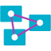
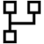

# Dataflow Gen2 connectors in Microsoft Fabric

The following table contains a list of all the connectors currently available for Data Factory Dataflow Gen2 in Microsoft Fabric. For those connectors that have a reference page, a link is provided under the connector icon and name.

The connectors are listed in alphabetical order in separate tables for each letter in the alphabet. Use the **In this article** list at the top of this article to go to any of the alphabetized tables.

## A

| &nbsp; | &nbsp; | Connectors | &nbsp; | &nbsp; |
| --- | --- | --- | --- | --- |
| [ **Access Database**](/power-query/connectors/access-database) By Microsoft |  **Acterys (Beta)** By Acterys |  **Actian (Beta)** By Actian | [ **Adobe Analytics**](/power-query/connectors/adobe-analytics) By Microsoft | [ **Amazon Athena**](/power-query/connectors/amazon-athena) By Amazon |
| [ **Amazon OpenSearch  Service (Beta)**](/power-query/connectors/amazon-opensearch-service) By Amazon | [ **Amazon Redshift**](/power-query/connectors/amazon-redshift) By Microsoft | [ **Anaplan**](/power-query/connectors/anaplan) By Anaplan |  **Asana (Beta)** By Asana | [ **Assemble Views**](media/dataflow-support/assembleviews-64.png) By Autodesk |
|  **AtScale cubes** By Microsoft | [ **Autodesk Construction Cloud**](/power-query/connectors/autodesk-construction-cloud) By Autodesk |  **Automation Anywhere** By Automation   Anywhere | [ **Automy Data Analytics (Beta)**](/power-query/connectors/automy-data-analytics) By ACEROYALTY | [ **Azure Analysis Services database**](/power-query/connectors/azure-analysis-services) By Microsoft |
| [ **Azure Blob Storage**](/power-query/connectors/azure-blob-storage) By Microsoft | [ **Azure Cosmos DB v2 (Beta)**](/power-query/connectors/azure-cosmos-db-v2) By Microsoft | [ **Azure Cost Management**](/power-query/connectors/azure-cost-management) By Microsoft | [ **Azure   Databricks**](/power-query/connectors/databricks-azure) By Databricks | [ **Azure Data Explorer (Kusto)**](/power-query/connectors/azure-data-explorer) By Microsoft |
| [ **Azure Data Lake Storage Gen2**](/power-query/connectors/data-lake-storage) By Microsoft |  **Azure HDInsight (HDFS)** By Microsoft |  **Azure HDInsight Spark** By Microsoft | [ **Azure Synapse Analytics (SQL DW)**](/power-query/connectors/azure-sql-data-warehouse) By Microsoft | [ **Azure Synapse Analytics workspace (Beta)**](/power-query/connectors/synapse) By Microsoft |
| [ **Azure SQL database**](/power-query/connectors/azure-sql-database) By Microsoft | [ **Azure Table Storage**](/power-query/connectors/azure-table-storage) By Microsoft |  **Azure Time Series Insights  (Beta)** By Microsoft | | |

## B

| &nbsp; | &nbsp; | Connectors | &nbsp; | &nbsp; |
| --- | --- | --- | --- | --- |
|  **BI Connector** By Guidanz | [ **BitSight Security Ratings**](/power-query/connectors/bitsight-security-ratings) By BitSight | [ **Bloomberg Data  and Analytics**](/power-query/connectors/bloomberg-data-and-analytics) By Bloomberg | [ **BQE Core**](/power-query/connectors/bqecore) By BQE | |

## C

| &nbsp; | &nbsp; | Connectors | &nbsp; | &nbsp; |
| --- | --- | --- | --- | --- |
| [ **CData Connect Cloud**](/power-query/connectors/cdata-connect-cloud) By CData | [ **Celonis EMS (Beta)**](/power-query/connectors/celonis-ems) By Celonis |  **Cherwell (Beta)** By Cherwell | [ **CloudBluePSA (Beta)**](/power-query/connectors/cloudbluepsa) By CloudBluePSA |  **Cognite Data Fusion** By Cognite |
| [ **Common Data Service (legacy)**](/power-query/connectors/common-data-service-legacy) By Microsoft | | | | |

## D

| &nbsp; | &nbsp; | Connectors | &nbsp; | &nbsp; |
| --- | --- | --- | --- | --- |
|  **Data Virtuality LDW** By Data Virtuality | [ **Databricks **](/power-query/connectors/databricks) By Databricks | [ **Dataflows**](/power-query/connectors/dataflows) By Microsoft | [ **Dataverse**](/power-query/connectors/dataverse) By Microsoft | [ **Delta Sharing**](/power-query/connectors/delta-sharing) By Databricks |
| [ **Denodo**](/power-query/connectors/denodo) By Denodo | [ **Digital Construction Works Insights**](/power-query/connectors/digital-construction-works-insights) By Digital Construction  Works |  **Dremio Cloud** By Dremio |  **Dremio Software** By Dremio |  **Dynamics 365 Business Central** By Microsoft |
|  **Dynamics 365 Customer Insights (Beta)** By Microsoft | | | | |

## E

| &nbsp; | &nbsp; | Connectors | &nbsp; | &nbsp; |
| --- | --- | --- | --- | --- |
|  **eWay-CRM** By eWay-CRM | [ **Eduframe Reporting (Beta)**](/power-query/connectors/eduframe) By Drieam |  **Emigo Data Source** By Sagra |  **Entersoft Business Suite (Beta)** By Entersoft | [ **EQuIS**](/power-query/connectors/equis) By EarthSoft |
|  **Exasol** By Exasol | [ **Excel**](/power-query/connectors/excel) By Microsoft | | | |

## F

| &nbsp; | &nbsp; | Connectors | &nbsp; | &nbsp; |
| --- | --- | --- | --- | --- |
|  **FactSet Analytics** By FactSet | [ **FactSet RMS (Beta)**](/power-query/connectors/factset-rms) By FactSet | [ **FHIR**](/power-query/connectors/fhir/fhir) By Microsoft | [ **Folder**](/power-query/connectors/folder) By Microsoft | [ **Funnel**](/power-query/connectors/funnel) By Funnel |

## G

| &nbsp; | &nbsp; | Connectors | &nbsp; | &nbsp; |
| --- | --- | --- | --- | --- |
| [ **Google Analytics**](/power-query/connectors/google-analytics) By Microsoft | [ **Google BigQuery**](/power-query/connectors/google-bigquery) By Microsoft | [ **Google BigQuery (Azure AD) (Beta)**](/power-query/connectors/google-bigquery-aad) By Microsoft | [ **Google Sheets**](/power-query/connectors/google-sheets) By Microsoft | |

## H

| &nbsp; | Connectors | &nbsp; | &nbsp; | &nbsp; |
| --- | --- | --- | --- | --- |
|  **HDInsight Interactive Query** By Microsoft |  **Hexagon PPM   Smart API** By Hexagon PPM | [ **Hive LLAP**](/power-query/connectors/hive-llap) By Microsoft | | |

## I

| &nbsp; | &nbsp; | Connectors | &nbsp; | &nbsp; |
| --- | --- | --- | --- | --- |
| [ **IBM DB2 database**](/power-query/connectors/ibm-db2-database) By Microsoft | [ **Impala**](/power-query/connectors/impala-database) By Microsoft |  **Indexima** By Indexima |  **Industrial App Store** By Intelligent Plant |  **Information Grid (Beta)** By Luminis |
|  **InterSystems IRIS (Beta)** By Intersystems |  **Intune Data Warehouse (Beta)** By Microsoft | | | |

## J

| &nbsp; | Connectors | &nbsp; | &nbsp; | &nbsp; |
| --- | --- | --- | --- | --- |
|  **Jamf Pro (Beta)** By Jamf |  **Jethro (Beta)** By JethroData | [ **JSON**](/power-query/connectors/json) By Microsoft | | |

## K

| &nbsp; | Connectors | &nbsp; | &nbsp; | &nbsp; |
| --- | --- | --- | --- | --- |
|  **Kognitwin** By Kongsberg | [ **KQL Database**](/power-query/connectors/kql-database) By Microsoft |  **Kyligence** By Kyligence | | |

## L

| &nbsp; | Connectors | &nbsp; | &nbsp; | &nbsp; |
| --- | --- | --- | --- | --- |
|  **Lakehouse (Beta)** By Microsoft |  **Linkar PICK Style/MultiValue Databases (Beta)** By Kosday Solutions | | | |

## M

| &nbsp; | &nbsp; | Connectors | &nbsp; | &nbsp; |
| --- | --- | --- | --- | --- |
|  **MarkLogic** By MarkLogic | [ **Microsoft Exchange Online**](/power-query/connectors/microsoft-exchange-online) By Microsoft |  **Microsoft Teams Personal Analytics (Beta)** By Microsoft | [ **MicroStrategy for Power BI**](/power-query/connectors/microstrategy-for-power-bi) By MicroStrategy | [ **MongoDB Atlas SQL interface (Beta)**](/power-query/connectors/mongodb-atlas-sql-interface) By MongoDB |
| [ **MySQL database**](/power-query/connectors/mysql-database) By Microsoft | | | | |

## O

| &nbsp; | Connectors | &nbsp; | &nbsp; | &nbsp; |
| --- | --- | --- | --- | --- |
| [ **OData**](/power-query/connectors/odata-feed) By Microsoft | [ **ODBC**](/power-query/connectors/odbc) By Microsoft | [ **OpenSearch Project** **(Beta)**](/power-query/connectors/opensearch-project) By OpenSearch | | |

## P

| &nbsp; | &nbsp; | Connectors | &nbsp; | &nbsp; |
| --- | --- | --- | --- | --- |
| [ **Parquet**](/power-query/connectors/parquet) By Microsoft | [ **Palantir Foundry**](/power-query/connectors/palantir-foundry-datasets) By Palantir |  **Paxata** By Paxata | [ **PDF**](/power-query/connectors/pdf) By Microsoft |  **Planview Enterprise Architecture** By Planview |
|  **Planview IdeaPlace** By Planview |  **Planview Portfolios** By Planview |  **Planview Projectplace** By Planview | [ **PostgreSQL database**](/power-query/connectors/postgresql) By Microsoft |  **Product Insights (Beta)** By Microsoft |
| [ **Profisee**](/power-query/connectors/profisee) By Profisee | | | | |

## Q

| &nbsp; | Connectors | &nbsp; | &nbsp; | &nbsp; |
| --- | --- | --- | --- | --- |
|  **QubolePresto (Beta)** By Qubole |  **Quickbase** By Quick Base | | | |

## R

| &nbsp; | Connectors | &nbsp; | &nbsp; | &nbsp; |
| --- | --- | --- | --- | --- |
|  **Roamler (Beta)** By Roamler | | | | |

## S

| &nbsp; | &nbsp; | Connectors | &nbsp; | &nbsp; |
| --- | --- | --- | --- | --- |
| [ **Salesforce Objects**](/power-query/connectors/salesforce-objects) By Microsoft | [ **Salesforce Reports**](/power-query/connectors/salesforce-reports) By Microsoft | [ **SAP Business Warehouse Application Server**](/power-query/connectors/sap-bw/application-setup-and-connect) By Microsoft | [ **SAP Business Warehouse Message Server**](/power-query/connectors/sap-bw/message-setup-and-connect) By Microsoft | [ **SAP HANA database**](/power-query/connectors/sap-hana/overview) By Microsoft |
| [ **SharePoint folder**](/power-query/connectors/sharepoint-folder) By Microsoft | [ **SharePoint list**](/power-query/connectors/sharepoint-list) By Microsoft | [ **SharePoint Online list**](/power-query/connectors/sharepoint-online-list) By Microsoft |  **Shortcuts Business Insights (Beta)** By Shortcuts  | [ **SingleStore (Beta)**](/power-query/connectors/singlestore) By SingleStore |
| [ **SIS-CC SDMX (Beta)](/power-query/connectors/sis-cc-sdmx)** By SIS-CC |  **SiteImprove** By SiteImprove | [ **Smartsheet**](/power-query/connectors/smartsheet) By Microsoft | [ **Snowflake**](/power-query/connectors/snowflake) By Microsoft | [ **Socialbakers Metrics (Beta)**](/power-query/connectors/socialbakers) By Emplifi |
| [ **SoftOneBI (Beta)**](/power-query/connectors/softone-bi) By SoftOne | [ **SolarWinds Service Desk (Beta)**](/power-query/connectors/solarwinds-service-desk) By SolarWinds |  **Solver** By BI360 |  **Spark** By Microsoft | [ **SQL Server Analysis Services database**](/power-query/connectors/sql-server-analysis-services) By Microsoft |
| [ **SQL Server database**](/power-query/connectors/sql-server) By Microsoft |  **Starburst   Enterprise** By Starburst Data | [ **SumTotal**](/power-query/connectors/sumtotal) By SumTotal |  **SurveyMonkey** By SurveyMonkey | |

## T

| &nbsp; | &nbsp; | Connectors | &nbsp; | &nbsp; |
| --- | --- | --- | --- | --- |
|  **TeamDesk (Beta)** By ForeSoft |  **Tenforce (Smart)List** By Tenforce | [ **Teradata database**](/power-query/connectors/teradata) By Microsoft | [ **Text/CSV**](/power-query/connectors/text-csv) By Microsoft | [ **TIBCO(R) Data Virtualization**](/power-query/connectors/tibco) By TIBCO |

## U

| &nbsp; | Connectors | &nbsp; | &nbsp; | &nbsp; |
| --- | --- | --- | --- | --- |
| [ **Usercube (Beta)](/power-query/connectors/usercube)** By Usercube | | | | |

## V

| &nbsp; | &nbsp; | Connectors | &nbsp; | &nbsp; |
| --- | --- | --- | --- | --- |
|  **Vena** By Vena |  **Vertica** By Microsoft | [ **Vessel Insight**](/power-query/connectors/vessel-insight) By Kongsberg |  **Viva Insights** By Microsoft | |

## W

| &nbsp; | Connectors | &nbsp; | &nbsp; | &nbsp; |
| --- | --- | --- | --- | --- |
| [ **Web**](/power-query/connectors/web/web) By Microsoft |  **Webtrends Analytics (Beta)** By Microsoft |  **Witivio (Beta)** By Witivio | | |

## X

| &nbsp; | Connectors | &nbsp; | &nbsp; | &nbsp; |
| --- | --- | --- | --- | --- |
| [ **XML**](/power-query/connectors/xml) By Microsoft | | | | |

## Z

| &nbsp; | Connectors | &nbsp; | &nbsp; | &nbsp; |
| --- | --- | --- | --- | --- |
|  **Zoho Creator** By Zoho |  **Zucchetti HR Infinity (Beta)** By Zucchetti | | | |
