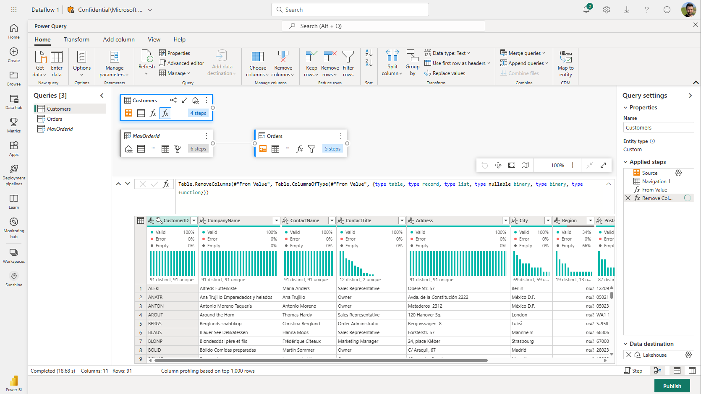

# Dataflows Gen2

Dataflows Gen2 is the new generation of dataflows. The new generation of dataflows will replace the current Dataflow Gen1 (Power BI Dataflows) and bring new features and other improvements. Below we will provide you an overview of all the new features that are introduced in Gen2 and some that are still work in progress and are expected to be available by GA timeline.

## Feature overview

| Feature |   Dataflows Gen2 |  Dataflows Gen1 |
|--------|---|---|
| Same authoring experience | X | X |
| Output Destinations  | X  |   |
| Improved monitoring and Refresh History       |  X |   |
| Integration with Data Pipelines     | X  |   |
| Save as draft       | X  |   |
| Fast copy       | X  |   |
| High Scale Compute using lakehouse     |  X |   |
| Enhanced Compute using Premium SQL engine |  |  X|
| Incremental refresh       | *Coming soon  | X  |
| AI Insights support | *Coming soon | X |

### Authoring Experience

Working with Dataflows Gen2 feels like coming home. We kept the full experience you are used to in Power BI Dataflows. When you enter the experience you are guided step-by-step for getting the data into your dataflow.

### Output destinations

Dataflows Gen2 allows your data destination to be more flexible and you can choose your own destination. Using this feature you can now do a full separation between your ETL logic and storage. In Dataflows Gen2 we added support for the following destinations and many more are coming soon:

- Lakehouse
- Azure Data Explorer (Kusto)
- Azure Synapse Analytics (SQL DW)
- Azure SQL Database

Learn more about this feature [here](./docsforoutputdestination).

### Improved refresh history and monitoring

With Dataflows Gen2 we introduce a new way for you to monitor your refreshes of your dataflows. We integrated support for [Monitor Hub](/monitorhuburl) as well as given our [Refresh History](./dataflows-refresh-history.md) experience a major upgrade.

### Integration with Data Pipelines

Data pipelines allows you to group activities that together perform a task. An activity is a unit of work that can be executed. For example, an activity can copy data from one location to another, run a SQL query, execute a stored procedure, or run a Python notebook.

A pipeline can contain one or more activities that are connected by dependencies. For example, you can use a pipeline to ingest and clean data from an Azure blob, and then kick off a Dataflow Gen2 to analyze the log data. You can also use a pipeline to copy data from an Azure blob to an Azure SQL database, and then run a stored procedure on the database.

### Save as draft

With Dataflows Gen2 we introduce a worry free experience by removing the need for publishing to save your changes. With save as draft functionality we store a draft version of your dataflow every time you make a change. Did you loose internet connectivity? did you accidentally close your browser? No worries we got your back and once you return to your dataflow your changes will still be there and you can continue where you left off. This is a seamless experience and does not require any input from you. Learn more about this feature [here](./dataflows-save-as-draft.md).

### Fast copy

### High scale compute

With Dataflows Gen2 we introduce a new feature that is leveraging the Lakehouse compute to improve performance for all your dataflows. Below is an architecture overview how this works.

## Architecture changes from Gen1 to Gen2

## Migration from Gen1 to Gen2

### Copy past your PowerQuery in the browser

### Create a duplicate of your dataflow (coming soon)

### Auto migrate (coming soon)
