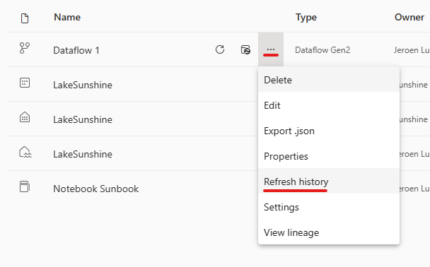
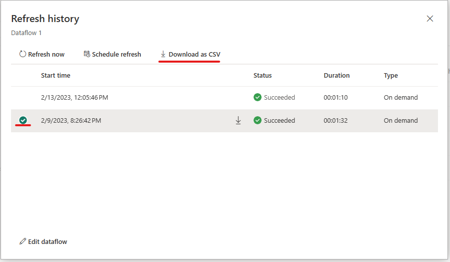

# Dataflows Refresh history and monitoring

Monitoring your dataflow refreshes is key in ensuring that your Dataflows are running as expected. Refresh history and monitoring hub allows you to evaluate in detail what happened during the refresh of your dataflow.

## Refresh History

Refresh history is available via the drop-down menu in your workspace.
    

When you open the refresh history of your dataflow you first will see a list of all the refreshes of your data. This first screen will provide you information about:

- Start time
- Status
- Duration
- Type

You can take some actions right away from this page like start a new refresh, schedule a refresh, or edit the dataflow.

### Download a CSV file of the refresh

Some times you are in need of getting a CSV file of your refresh. To get this you take the following steps:

1. Open the refresh history of the dataflow
1. Select the run you want to get a CSV file from
1. Download the CSV

    

### Reviewing your dataflow refresh from the UI

Once you have determined which one you want to investigate you can drill down into one of the refreshes by clicking on the **Start time** field. This screen will provide you with more information about the refresh that was performed. This includes general information about the refresh as well as a list of Tables and Activities.

In short, this overview provides you:

- Status of the dataflow
- Type of refresh
- Start and End time
- Duration
- Request ID
- Session ID
- Dataflow ID

The Tables section reflects all the entities you have enabled load for in your dataflow. Meaning that those tables shown here are being loaded into the staging area of your workspace. These are also the tables you can access via the Power Query Dataflow connector in Power BI, Excel or Dataflows. You can click on any of the table names listed to view the details of this specific table. Once you do that you arrive on this screen:

The Activities section reflects all the actions that have taken place during the refresh, for example loading data to your output destination. This table also allows you to dive deeper into the details of the specific activity. By clicking on the name of the activity you will arrive on this screen:

This screen gives you more clarity in what happened during the activity. For Output destinations we provide you:

- Status of the Activity
- Start and End time
- Duration
- Activity statistics:
  - Output destinations:
    - Endpoints contacted
    - Volume processed by the connector

To investigate what happened you can drill down into an activity or table. The following screen provides you with general information about the refresh as well as errors. If you are drilling into an activity you will be presented with how much data got processed and sent to your output destination.

## Monitor Hub

TO BE WRITTEN.
