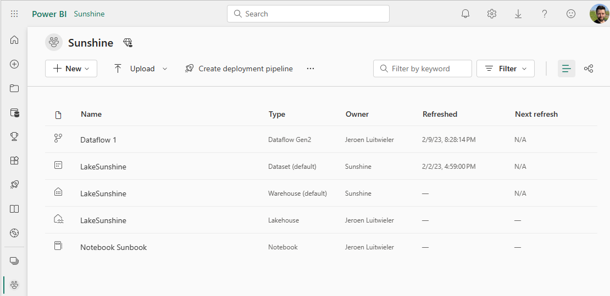

# Dataflows save as draft

This powerful feature allows you to make changes to your dataflow without immediately publishing them to your workspace. Instead, you can save your changes as a draft, review them at a later time, and then publish when you're ready. With this feature, you can streamline your dataflow development process, and reduce the risk of data errors. In this documentation, you'll learn how to use the 'Save as Draft' feature and how it can benefit your dataflow development and management.

## How to save a draft version of your dataflow?

Saving a draft of your dataflow is as easy as just closing your browser, close the Dataflows editors, or navigate to another workspace. Any time you add a new Power Query step to your dataflow we will save a draft of your changes to the workspace.

## How to publish your draft dataflow?

To publish your changes you made in your draft you take the following steps:

1. Navigate to your workspace

    

1. Open the dataflow that you recently saved changes as a draft
1. Review all the changes you made last time
1. Publish the dataflow with the button on the bottom of the page

    
