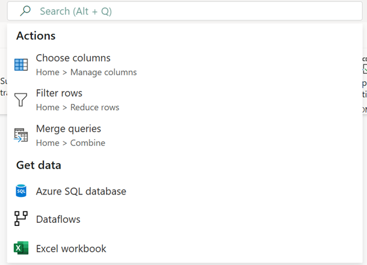

# A guide to Fabric Dataflows for Azure Data Factory Mapping Data Flow users

Microsoft Fabric’s Data Factory experience provides an intuitive and user-friendly interface using Power Query Online that can help you streamline your data transformation workflows when authoring Dataflow Gen2. If you’re a developer with a background in Azure Data Factory's Mapping Data Flows, you’ll find this guide helpful in mapping your existing Mapping Data Flow transformations to the Dataflow Gen2 Power Query user interface.

## Global search box
When first starting to author Dataflows, you can also leverage the Global search box (shortcut: **Alt + Q**) found in the middle of the editor to search for connectors, transformations (actions), queries, and more while you learn your way around the Power Query Online interface.

>[!NOTE]
>Learn more about [Global search box](/power-query/search-box).

## Transformations

When authoring Dataflow Gen2 using the Power Query Online interface, you can use the following table to understand how the current Mapping Data Flows capabilities translate and their equivalent toolbar navigation location in Dataflow Gen2 where applicable.

### Multiple inputs/outputs
| Mapping Data Flow | Dataflow Gen2 |
| :---- | :---- |
| **New branch** | **Reference** |
| :::image type="content" source="media/guide-to-dataflows-for-mapping-data-flow-users/new-branch.svg" alt-text="Screenshot of the New branch transformation icon." ::: | :::image type="content" source="media/guide-to-dataflows-for-mapping-data-flow-users/reference.png" alt-text="Screenshot of the Reference transformation icon in Power Query.":::  **Important:** Right click a query and select Reference. |
| **Join** | **Merge queries** |
| :::image type="content" source="media/guide-to-dataflows-for-mapping-data-flow-users/join.svg" alt-text="Screenshot of the Join transformation icon.":::  | :::image type="content" source="media/guide-to-dataflows-for-mapping-data-flow-users/merge-queries.png" alt-text="Screenshot of the Merge queries transformation icon.":::    **Navigation:**  Home > Merge queries  **Important:** Merge queries – Merge this query into another query in this project. Merge queries as new – Merge this query into another query in this project to create a new query. |
| **Conditional Split** | **Reference** |
| :::image type="content" source="media/guide-to-dataflows-for-mapping-data-flow-users/conditional-split.svg" alt-text="Screenshot of the Conditional Split transformation icon."::: | :::image type="content" source="media/guide-to-dataflows-for-mapping-data-flow-users/Reference.png" alt-text="Screenshot of the Reference transformation icon.":::    **Important:** Right click a query and select Reference, you can then apply additional transformation logic to limit specific rows manually. |
| **Union** | **Append queries** |
| :::image type="content" source="media/guide-to-dataflows-for-mapping-data-flow-users/Union.svg" alt-text="Screenshot of the Union transformation icon."::: | :::image type="content" source="media/guide-to-dataflows-for-mapping-data-flow-users/append-queries.png" alt-text="Screenshot of the Append queries transformation icon.":::    **Navigation:** Home > Append queries  **Important:** Append queries – Append this query into another query in this project. Append queries as new – Append this query into another query in this project to create a new query. |
| **Lookup** | **Merge queries** |
| :::image type="content" source="media/guide-to-dataflows-for-mapping-data-flow-users/look-up.svg" alt-text="Screenshot of the Lookup transformation icon."::: | :::image type="content" source="media/guide-to-dataflows-for-mapping-data-flow-users/merge-queries.png" alt-text="Screenshot of the Merge queries transformation icon."::: :::image type="content" source="media/guide-to-dataflows-for-mapping-data-flow-users/left-outer.png" alt-text="Screenshot of the Join kinds.":::    **Navigation:**  Home > Merge queries  **Important:** Select Left outer from the Join kind options. |

#### Schema modifier
| Mapping Data Flow | Dataflow Gen2 |
| :---- | :---- |
| **Derived Column** | **Custom column** |
| :::image type="content" source="media/guide-to-dataflows-for-mapping-data-flow-users/derived-column.svg" alt-text="Screenshot of the Derived Column transformation icon."::: | :::image type="content" source="media/guide-to-dataflows-for-mapping-data-flow-users/custom-column-options.png" alt-text="Screenshot of the Custom Column options transformation icons.":::    **Navigation:**  Add column > Custom column  **Important:** Column from examples - Use examples to create a new column in this table. (Ctrl + E) Custom column - Create a new column based on other columns, or a custom expression. Invoke custom function - Invoke a custom function for each row of this table. Conditional column - Create a new column that conditionally adds the values in the currently selected column. |
||**Replace values** |
| | :::image type="content" source="media/guide-to-dataflows-for-mapping-data-flow-users/replace-values.png" alt-text="Screenshot of the Replace values transformation icon.":::    **Navigation:** Transform > Replace values |
| **Select** | **Choose columns** |
| :::image type="content" source="media/guide-to-dataflows-for-mapping-data-flow-users/select.svg" alt-text="Screenshot of the Select transformation icon."::: **Note:** Includes the ability to select, drop and rename (Name as) columns and whether to drop or pass on duplicate columns | :::image type="content" source="media/guide-to-dataflows-for-mapping-data-flow-users/choose-columns.png" alt-text="Screenshot of the Choose columns transformation icon.":::    **Navigation:** Home > Choose columns |
| **(Remove Mapping)** | **Remove columns** |
| | :::image type="content" source="media/guide-to-dataflows-for-mapping-data-flow-users/remove-columns.png" alt-text="Screenshot of the Remove columns transformation icon."::: |
| | **Navigation:** Home > Remove columns |
| **(Name as)** | **Rename** |
|  | :::image type="content" source="media/guide-to-dataflows-for-mapping-data-flow-users/rename-columns.png" alt-text="Screenshot of the Rename columns transformation icon."::: |
| | **Navigation:** Transform > Rename |
| **Aggregate** | **Group by** |
| :::image type="content" source="media/guide-to-dataflows-for-mapping-data-flow-users/aggregate.svg" alt-text="Screenshot of the Aggregate transformation icon."::: | :::image type="content" source="media/guide-to-dataflows-for-mapping-data-flow-users/group-by.png" alt-text="Screenshot of the Group by transformation icon."::: |
| | **Navigation:** Transform > Group by |
| **Surrogate Key** | **Index column** |
| :::image type="content" source="media/guide-to-dataflows-for-mapping-data-flow-users/surrogate-key.svg" alt-text="Screenshot of the Surrogate Key transformation icon."::: | :::image type="content" source="media/guide-to-dataflows-for-mapping-data-flow-users/index-column.png" alt-text="Screenshot of the Index column transformation icon."::: |
| | **Navigation:** Add column > Index column  **Important:** From 0 - Create a new column with an index starting at 0. From 1 - Create a new column with an index starting at 1. Custom... - Create a new column with an index starting at a specified value and a specified increment. |
| **Pivot** | **Pivot column** |
| :::image type="content" source="media/guide-to-dataflows-for-mapping-data-flow-users/pivot.svg" alt-text="Screenshot of the Pivot transformation icon."::: | :::image type="content" source="media/guide-to-dataflows-for-mapping-data-flow-users/pivot-column.png" alt-text="Screenshot of the Pivot column transformation icon."::: |
| | **Navigation:** Transform > Pivot column |
| **Unpivot** | **Unpivot columns** | 
| :::image type="content" source="media/guide-to-dataflows-for-mapping-data-flow-users/Unpivot.svg" alt-text="Screenshot of the Unpivot transformation icon."::: | :::image type="content" source="media/guide-to-dataflows-for-mapping-data-flow-users/unpivot-columns.png" alt-text="Screenshot of the Unpivot columns transformation icon."::: |
| | **Navigation:** Transform > Unpivot columns  **Important:** Unpivot columns - Translate all but the currently unselected columns into attribute-value pairs. Unpivot other columns - Select all but the currently selected columns into attribute-value pairs. Unpivot only selected columns - Translate only the currently selected columns into attribute-value pairs. |
| **Rank** | **Rank column** | 
| :::image type="content" source="media/guide-to-dataflows-for-mapping-data-flow-users/rank.svg" alt-text="Screenshot of the Rank transformation icon."::: | :::image type="content" source="media/guide-to-dataflows-for-mapping-data-flow-users/rank-column.png" alt-text="Screenshot of the Rank column transformation icon."::: |
| | **Navigation:**  Add column > Rank column |
| **External Call** | **Custom column** |
:::image type="content" source="media/guide-to-dataflows-for-mapping-data-flow-users/external-call.svg" alt-text="Screenshot of the External Call transformation icon."::: | :::image type="content" source="media/guide-to-dataflows-for-mapping-data-flow-users/custom-column.png" alt-text="Screenshot of the Custom column transformation icon.":::    **Navigation:** Add column > Custom column  **Expression:** [Web.Contents](/powerquery-m/web-contents) |
| **Cast** | **Data type** |
| :::image type="content" source="media/guide-to-dataflows-for-mapping-data-flow-users/cast.svg" alt-text="Screenshot of the Cast transformation icon."::: | :::image type="content" source="media/guide-to-dataflows-for-mapping-data-flow-users/data-type.png" alt-text="Screenshot of the Data type transformation icon.":::    **Navigation:** Transform > Data type |

#### Formatters
| Mapping Data Flow | Dataflow Gen2 |
| :---- | :---- |
| **Flatten** | **(Expand column)** |
| :::image type="content" source="media/guide-to-dataflows-for-mapping-data-flow-users/flatten.svg" alt-text="Screenshot of the Flatten transformation icon."::: | :::image type="content" source="media/guide-to-dataflows-for-mapping-data-flow-users/expand.png" alt-text="Screenshot of the Expand column icon."::: |
| | **Important:** The expand option is available when structured data types exist in your column. |
| **Parse** | **Parse** |
| :::image type="content" source="media/guide-to-dataflows-for-mapping-data-flow-users/parse.svg" alt-text="Screenshot of the Parse transformation icon."::: | :::image type="content" source="media/guide-to-dataflows-for-mapping-data-flow-users/parse.png" alt-text="Screenshot of the various File connector icons.":::    **Navigation:** Transform > Text column > Parse |

#### Row modifier
| Mapping Data Flow | Dataflow Gen2 |
| :---- | :---- |
| **Filter** | **Filter rows** |
| :::image type="content" source="media/guide-to-dataflows-for-mapping-data-flow-users/filter.svg" alt-text="Screenshot of the Filter transformation icon."::: | :::image type="content" source="media/guide-to-dataflows-for-mapping-data-flow-users/filter-rows.png" alt-text="Screenshot of the Filter rows transformation icon.":::    **Navigation:** Home > Filter rows |
| **Sort** | **Sort** |
| :::image type="content" source="media/guide-to-dataflows-for-mapping-data-flow-users/sort.svg" alt-text="Screenshot of the Sort transformation icon."::: | :::image type="content" source="media/guide-to-dataflows-for-mapping-data-flow-users/sort.png" alt-text="Screenshot of the Power Query Sort transformation icon.":::    **Navigation:** Home > Sort |

#### Flowlets
| Mapping Data Flow | Dataflow Gen2 |
| :---- | :---- |
| **Flowlet** | **(Custom functions)** |
| :::image type="content" source="media/guide-to-dataflows-for-mapping-data-flow-users/flowlet.svg" alt-text="Screenshot of the Flowlet transformation icon."::: | Learn more about how to [Create a custom function](/power-query/custom-function) |

#### Destination
| Mapping Data Flow | Dataflow Gen2 |
| :---- | :---- |
| **Sink** | **Add data destination** |
| :::image type="content" source="media/guide-to-dataflows-for-mapping-data-flow-users/sink.svg" alt-text="Screenshot of the Sink transformation icon."::: | :::image type="content" source="media/guide-to-dataflows-for-mapping-data-flow-users/add-data-destination.png" alt-text="Screenshot of the Add data destination icon.":::    **Navigation:** Home > Add data destination |

### Considerations and limitations
The following mapping data flow transformations are not supported in Dataflow Gen2. To vote for support of these operations, please visit [Fabric ideas](https://aka.ms/fabricideas).

- Assert
- Alter Row
- Stringify
- Window
