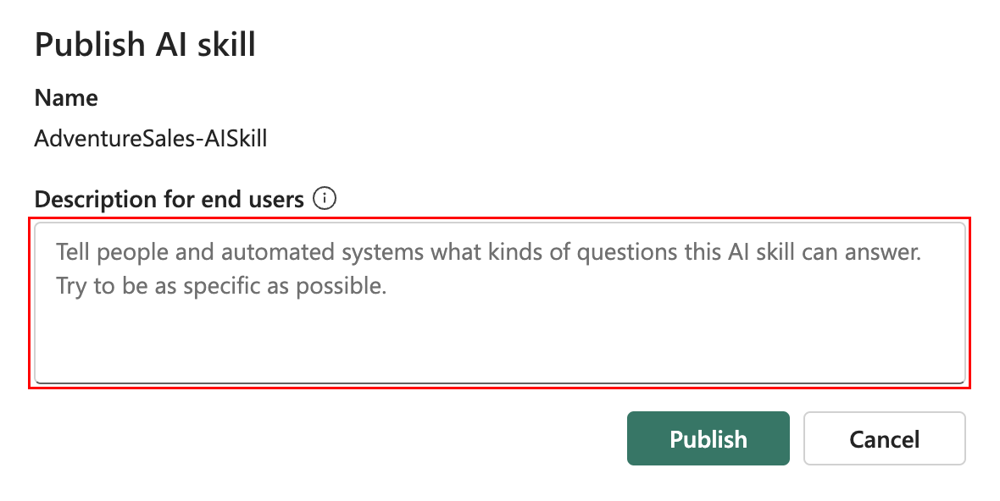
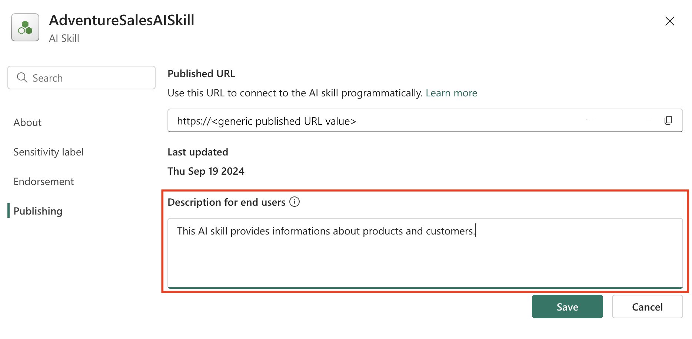
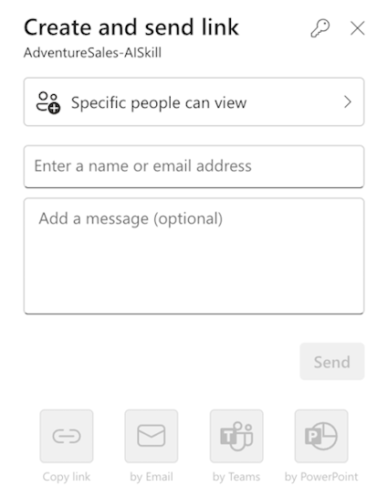
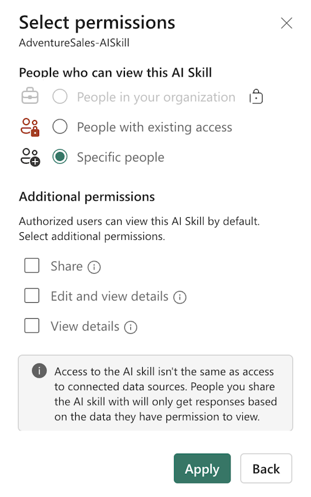
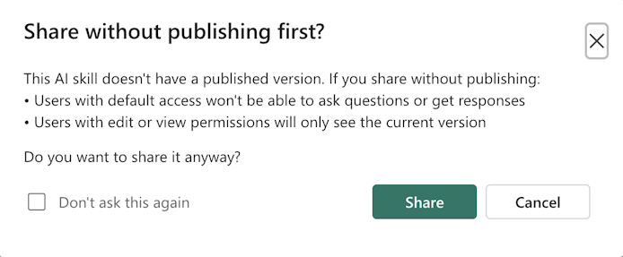

# AI skill sharing and permission management (preview)

[!INCLUDE [feature-preview](../includes/feature-preview-note.md)]

## Prerequisites

- [A paid F64 or higher Fabric capacity resource](../fundamentals/copilot-fabric-overview.md#available-regions-for-azure-openai-service)
- [AI skill tenant switch](./ai-skill-tenant-switch.md) is enabled.
- [Copilot tenant switch](../admin/service-admin-portal-copilot.md#users-can-use-copilot-and-other-features-powered-by-azure-openai) is enabled.
- [Cross-geo processing for AI](../admin/service-admin-portal-copilot.md#data-sent-to-azure-openai-can-be-processed-outside-your-capacitys-geographic-region-compliance-boundary-or-national-cloud-instance) is enabled.
- [Cross-geo storing for AI](../admin/service-admin-portal-copilot.md#data-sent-to-azure-openai-can-be-stored-outside-your-capacitys-geographic-region-compliance-boundary-or-national-cloud-instance) is enabled.
- A warehouse, lakehouse, Power BI semantic models, and KQL databases with data.
- [Power BI semantic models via XMLA endpoints tenant switch](./ai-skill-tenant-switch.md) is enabled for Power BI semantic model data sources.

## Publishing and versioning

Creation of an AI skill is an iterative process. It involves refinement of various configurations, for example

- selection of relevant tables
- AI instruction definition
- production of example queries for each data source

As you make adjustments to enhance the performance of the AI skill performance, you can eventually publish that AI skill. Once published, a read-only version is generated, which you can share with others.

When you try to publish the AI skill, you can include a description that explains what the AI skill does. The description is available to consumers of the AI skill, to help them understand its purpose and functionality. Other automated systems and orchestrators can also use the description, to invoke AI skill outside of Microsoft Fabric.

> [!NOTE]
> You can ask AI skill to describe what it does. You can then refine and summarize the response to use as its description when publishing.

:::image type="content" source="./media/ai-skill-sharing/publish-ai-skill-description.png" alt-text="Screenshot showing creation of an AI skill description." lightbox="./media/ai-skill-sharing/publish-ai-skill-description.png":::

<!--  -->

After you publish your AI skill, you can continue to refine its current draft version, to enhance its performance, without affecting the published version that other people use. This way, you can iterate with confidence, knowing that your changes remain isolated from the published version. You can seamlessly switch between the published and draft versions, testing the same set of queries on both to compare their performance. This helps you assess the effects of your changes, and you can gain valuable insights into how they improve your AI skill's effectiveness. The following screenshot shows how to switch between published and developed AI skill versions:

:::image type="content" source="./media/ai-skill-sharing/published-switch.png" alt-text="Screenshot showing how to switch between published and development AI skill versions." lightbox="./media/ai-skill-sharing/published-switch.png":::

To update the AI skill description without making any other changes, navigate to **Settings**, select **Publishing**, and then update the description, as show in this screenshot:

:::image type="content" source="./media/ai-skill-sharing/update-description.png" alt-text="Screenshot showing how to update the AI skill description." lightbox="./media/ai-skill-sharing/update-description.png":::

<!--  -->

## Permission models for sharing the AI skill

The **Fabric AI skill sharing** feature allows you to share your AI skills with others, with a range of permission models, as shown in this screenshot:

<!--  -->

:::image type="content" source="./media/ai-skill-sharing/sharing-main.png" alt-text="Screenshot showing how to share an AI skill link." lightbox="./media/ai-skill-sharing/sharing-main.png":::

You have complete control over access to your AI skill, and complete control of its use. Additionally, when you share the AI skill, you must also share access to the underlying data it uses. The AI Skill honors all user permissions to the data, including Row-Level Security (RLS) and Column-Level Security (CLS).

<!--  -->

- **No permission selected**: If you don't select any other permission, users can only query the **published** version of the AI skill. They have no access to edit or even view any configurations or details. This maintains the integrity of your AI skill set-up.
- **View details**: Users can view the details and configurations of both the published and draft versions of the AI skill, but they can't make any changes to it. However, they can still query the AI skill, and build informative insights without risk of unintended modifications.
- **Edit and view details**: Users have full access to view and edit all the details and configurations of both the published and draft versions of the AI skill. They can also query the AI skill, which makes it ideal for collaborative work.

The following screenshot shows the actual permissions that you can select:

:::image type="content" source="./media/ai-skill-sharing/permission-models.png" alt-text="Screenshot showing selection of actual AI skill sharing permissions." lightbox="./media/ai-skill-sharing/permission-models.png":::

<!--  -->

If you share an AI Skill before you publish it, users with default permissions (without any other permissions) can't query it. It works this way because the default permission allows users to query only the published version—if a published version doesn't yet exist, users can't query the AI skill. Users with other permissions (**View details**, or **Edit and view details**) can only access the draft version. The following screenshot shows the option to share an AI skill without publishing it:

:::image type="content" source="./media/ai-skill-sharing/share-without-publish.png" alt-text="Screenshot showing the option to share an AI skill without publishing." lightbox="./media/ai-skill-sharing/share-without-publish.png":::

<!--  -->

## Related content

- [AI skill concept](./concept-ai-skill.md)
- [AI skill tenant sharing](./ai-skill-tenant-switch.md)
- [Create an AI skill](./how-to-create-ai-skill.md)