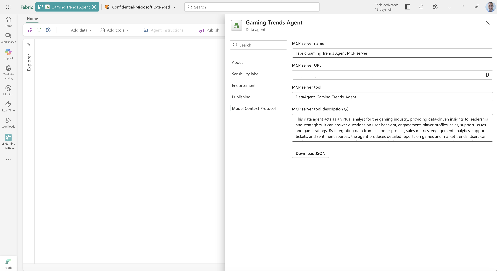
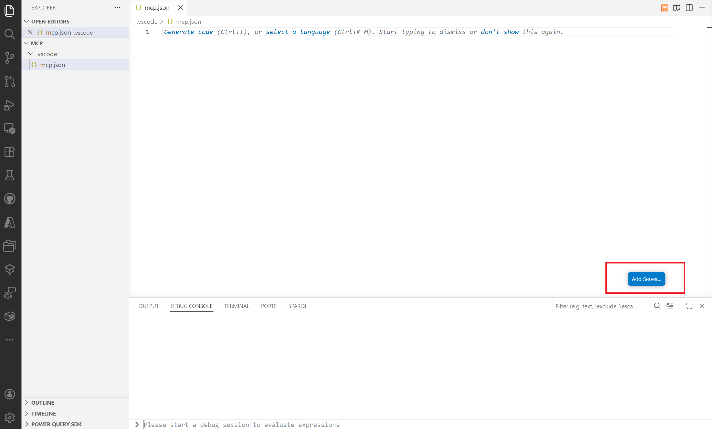
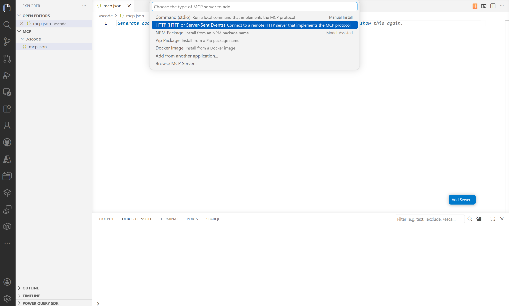
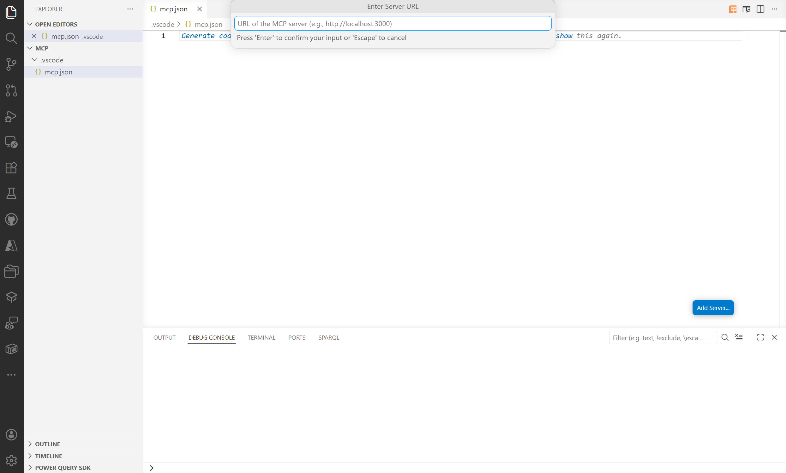
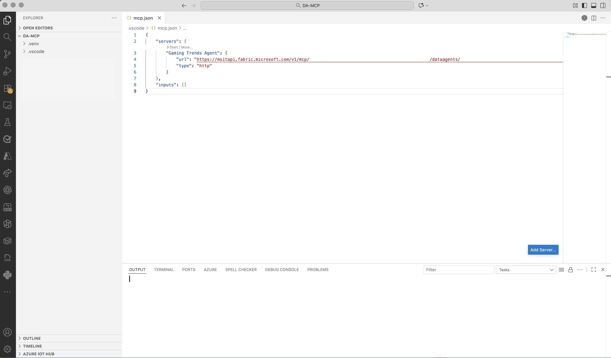
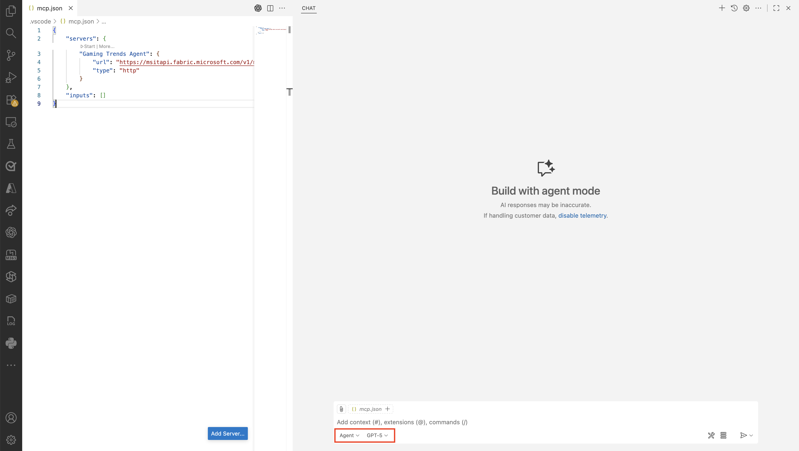

# Data agent as Model Context Protocol server (preview)

The Model Context Protocol (MCP) is an emerging standard in the AI landscape that allows AI systems to connect with tools and data outside of themselves. It defines how an AI model can discover what's available and interact with it in a consistent way. Instead of building one-off integrations, MCP offers a standard way to plug things in that works across different apps and services. This approach makes it much easier for AI systems to go beyond their built-in knowledge while keeping things consistent. It also helps teams move faster, since they don't have to reinvent the same connections every time.

MCP has two main parts: the client and the server.

An MCP client is the app or experience the user interacts with. It's where you ask questions or trigger actions. The client reaches out to MCP servers to find tools and use them. For example, Visual Studio Code can act as an MCP client when it connects to external tools to retrieve data, or help you write and run code.

An MCP server exposes tools, data, or services so clients can use them. It tells the client what's available and how to use it. For example, a Fabric data agent can act as an MCP server by exposing enterprise data and queries that an AI system can use.

Together, the client and server make it easy to connect AI systems with real data and actions, without building custom integrations every time.

> [!IMPORTANT]
> This feature is in [preview](../fundamentals/preview.md).

> [!IMPORTANT]
> When you consume a Fabric data agent as an MCP server, responses returned by the data agent might be sent outside of Fabric's compliance boundary or geographic region, and processed or stored according to the terms and data handling policies of the MCP client that you use.

## Prerequisites

- [A paid F2 or higher Fabric capacity](../enterprise/fabric-features.md#feature-parity-list), or a [Power BI Premium per capacity (P1 or higher)](../enterprise/licenses.md#workspace) capacity with [Microsoft Fabric enabled](../admin/fabric-switch.md).
- [Cross-geo processing and cross-geo storing for AI](data-agent-tenant-settings.md) enabled, based on the requirements in [Fabric data agent tenant settings](data-agent-tenant-settings.md).
- At least one data source that has data: a warehouse, a lakehouse, a Power BI semantic model, a KQL database, a mirrored database, or an ontology. You must have read access to the data source.
- A published data agent. The MCP server works only after you publish the data agent. For more information, see [Create a Fabric data agent](how-to-create-data-agent.md).

## How it works

A published Fabric data agent exposes a single MCP tool. That tool represents the data agent itself, so an MCP client sends a question to the tool and gets back an answer that's grounded in the data the data agent has access to in Fabric OneLake.

Because the client decides when to call the tool, the data agent description matters. When you publish a data agent, its description becomes the tool description that the MCP server advertises. Clients and orchestrators read that description to decide when and how to call the data agent, so write a clear and specific description that explains what the agent knows and the kinds of questions it can answer.

You can consume the data agent MCP server from any MCP client, not just one tool or editor. As long as your client speaks MCP over streamable HTTP and can attach a valid Fabric bearer token to its requests, it can connect. The sections that follow show two clients: a Python script and Visual Studio Code. The same endpoint and the same token work for any other MCP client you build or adopt.

Anything that talks to the MCP server has to speak MCP, so by definition it acts as an MCP client. The term "MCP client" doesn't mean a specific product or SDK. It means any code that follows the protocol. The endpoint isn't a plain REST API that you can send an arbitrary request to. A connection follows the MCP message flow: an `initialize` handshake, a `tools/list` call to discover the tool, and a `tools/call` request to ask a question. An SDK such as the [MCP Python SDK](https://pypi.org/project/mcp/) handles that flow for you, but you can also implement it yourself over plain HTTP as long as your requests follow the protocol. A generic HTTP client that skips the handshake and message format won't work.

> [!NOTE]
> The data agent MCP server doesn't support dynamic client registration. Your client can't register itself and obtain credentials automatically through the protocol. Instead, you acquire a Fabric token through your own authentication flow and attach it to each request, as shown in the examples in this article.

## Get the MCP server details

After you publish the data agent, open its **Settings** and go to the **Model Context Protocol** tab. This tab shows:

- **Data agent MCP server name**
- **MCP server URL** (copy this value; you use it in every client)
- **Data agent MCP tool name**
- **MCP server tool description**

You can also download the **mcp.json** file from this tab to configure clients that read that format, such as Visual Studio Code.

[](media/data-agent-mcp-server/data-agent-mcp-server-published.png#lightbox)

You can also build the URL yourself from your workspace ID and data agent ID:

```http
https://api.fabric.microsoft.com/v1/mcp/workspaces/{WorkspaceId}/dataagents/{DataAgentId}/agent
```

| Placeholder     | Description                                                  |
| --------------- | ----------------------------------------------------------- |
| `{WorkspaceId}` | The ID of the Fabric workspace that contains the data agent. |
| `{DataAgentId}` | The ID of the published data agent.                          |

A manually built URL works only after you publish the data agent. If the agent isn't published, the endpoint returns an error even when the URL is correct.

## Authentication

Every request to the MCP endpoint must be authenticated against Fabric. Your client attaches a bearer token in the `Authorization` header, and the token must have permission to access the target workspace and data agent. The token can represent either a user identity or a service principal.

How you obtain the token depends on your client. Visual Studio Code prompts you to sign in interactively. In a Python script, you acquire the token through a library such as [`azure-identity`](https://pypi.org/project/azure-identity/) and add it to the request headers yourself. Whatever the client, request the token for the `https://api.fabric.microsoft.com/.default` scope.

## Connect from Python

This example connects to the data agent MCP endpoint from a standalone Python script, discovers the tool, sends a question, and prints the answer. It uses the [MCP Python SDK](https://pypi.org/project/mcp/) and the [`azure-identity`](https://pypi.org/project/azure-identity/) library.

### Prerequisites for the Python client

- Python 3.10 or later.
- The `mcp` and `azure-identity` packages.
- A way to sign in to Fabric. This example uses the Azure CLI. Install the [Azure CLI](/cli/azure/install-azure-cli), then run `az login` and sign in with an account that has access to the workspace and data agent.

Install the packages:

```bash
pip install mcp azure-identity
```

### Build the client step by step

The following sections build the script one piece at a time. Each block continues the same file, so you can paste them in order into a single `.py` file and run it.

**Import the libraries and set your values.** Replace the workspace ID, data agent ID, and question with your own values. The `mcp_url` follows the endpoint format described earlier.

```python
import asyncio

from azure.identity import AzureCliCredential
from mcp import ClientSession
from mcp.client.streamable_http import streamablehttp_client

workspace_id = "<your-workspace-id>"
data_agent_id = "<your-data-agent-id>"
question = "<your question>"

mcp_url = (
    f"https://api.fabric.microsoft.com/v1/mcp/workspaces/{workspace_id}"
    f"/dataagents/{data_agent_id}/agent"
)
```

**Acquire a token and build the auth header.** `AzureCliCredential` reuses the sign-in from `az login`. The helper requests a token for the Fabric scope and returns it as an `Authorization` header that every request carries.

```python
credential = AzureCliCredential()


def get_auth_headers():
    token = credential.get_token("https://api.fabric.microsoft.com/.default")
    return {"Authorization": f"Bearer {token.token}"}
```

**Open the connection, discover the tool, and ask the question.** This function opens a streamable HTTP connection with the auth header, runs the MCP handshake with `initialize`, lists the tools, and reads the single tool the data agent exposes. It finds the name of the question argument from the tool's input schema, so you don't hard-code it, then calls the tool and collects the text from the response.

```python
async def query_data_agent(question):
    headers = get_auth_headers()

    async with streamablehttp_client(mcp_url, headers=headers) as (read, write, _):
        async with ClientSession(read, write) as session:
            await session.initialize()

            # The data agent exposes a single tool. Discover it, then call it.
            tools = await session.list_tools()
            tool = tools.tools[0]
            question_arg = next(iter(tool.inputSchema["properties"]))

            result = await session.call_tool(tool.name, {question_arg: question})

            answers = [block.text for block in result.content if block.type == "text"]
            return "\n".join(answers)
```

**Run it and print the answer.** `query_data_agent` is a coroutine, so `asyncio.run` drives it to completion and returns the result.

```python
answer = asyncio.run(query_data_agent(question))
print(answer)
```

Because the script reads the first tool the server advertises and finds the question argument from the tool's input schema, it keeps working even if the tool name or argument name changes. You don't need to hard-code either value.

> [!TIP]
> `AzureCliCredential` reads the sign-in you created with `az login`. To run unattended, such as in a service or a job, use a service principal credential instead, for example [`ClientSecretCredential`](/python/api/azure-identity/azure.identity.clientsecretcredential) or [`DefaultAzureCredential`](/python/api/azure-identity/azure.identity.defaultazurecredential). The rest of the code stays the same.

## Connect from Visual Studio Code

Visual Studio Code can act as an MCP client. The following steps add the data agent MCP server and ask questions from the editor. These steps are one example; the endpoint and token are the same ones any other MCP client uses.

### Add the MCP server

1. Open Visual Studio Code and select a folder to work in.
1. Create a **.vscode** folder in the selected folder.
1. Inside **.vscode**, create a file named `mcp.json`.
1. Visual Studio Code shows a blue **Add Server** button at the bottom right of the window.

    [](media/data-agent-mcp-server/include-mcp-json-vscode.png#lightbox)
1. Select **Add Server**, and then select **HTTP**. When prompted for a URL, paste the **MCP server URL** you copied earlier.

    [](media/data-agent-mcp-server/include-mcp-server-select-http.png#lightbox)

    [](media/data-agent-mcp-server/include-mcp-server-url.png#lightbox)
1. Press **Enter** and provide a name for the server. Visual Studio Code uses this name to display the server.
1. Visual Studio Code attempts to authenticate. Select **Allow** and sign in with your credentials.

The server is created.

[](media/data-agent-mcp-server/data-agent-mcp-json.png#lightbox)

### Enable agent mode

After you add the server, enable agent mode so Visual Studio Code can route your questions to the data agent:

1. Open the **Command Palette** (Ctrl+Shift+P or Cmd+Shift+P).
1. Search for **Enable Agent Mode** and select it.
1. Confirm any prompts to activate the mode.

    [](media/data-agent-mcp-server/data-agent-vs-code-agent-mode.png#lightbox)

When agent mode is active, select an orchestrator to handle your questions. The orchestrator manages the flow between your questions in the editor and the data agent MCP server. Available orchestrators in preview include GPT-5, GPT-4.1, Claude Sonnet 4.5, Gemini 2.5 Pro, and others.

### Ask questions

With agent mode on and an orchestrator selected, ask questions directly from the editor. The orchestrator routes each question to the data agent MCP server, and the agent returns an answer grounded in the data it has access to in OneLake. You stay in the editor while you bring organizational knowledge into your AI workflows.

## Related content

- [Create a Fabric data agent](how-to-create-data-agent.md)
- [Fabric data agent Python SDK](fabric-data-agent-sdk.md)
- [Fabric data agent tenant settings](data-agent-tenant-settings.md)
