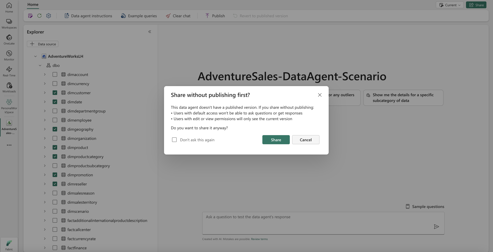

# Fabric data agent sharing and permission management (preview)

[!INCLUDE [feature-preview](../includes/feature-preview-note.md)]

[!INCLUDE [data-agent-prerequisites](./includes/data-agent-prerequisites.md)]

## Publishing and versioning

Creation of a data agent in Microsoft Fabric is an iterative process. It involves refinement of various configurations, for example:

- Selecting relevant tables
- Defining Fabric data agent instructions
- Creating example queries for each data source

As you make adjustments to enhance the performance of the Fabric data agent, you can eventually publish that Fabric data agent. Once published, a read-only version is generated, which you can share with others.

When you try to publish the Fabric data agent, you can include a description that explains what the Fabric data agent does. The description is available to consumers of the Fabric data agent, to help them understand its purpose and functionality. Other automated systems and orchestrators can also use the description, to invoke the Fabric data agent outside of Microsoft Fabric.

> [!NOTE]
> You can ask the Fabric data agent to describe what it does. You can then refine and summarize the response to use as its description when publishing.

:::image type="content" source="./media/data-agent-sharing/publish-data-agent-description.png" alt-text="Screenshot showing creation of a Fabric data agent description." lightbox="./media/data-agent-sharing/publish-data-agent-description.png":::

<!--  -->

After you publish your Fabric data agent, you can continue to refine its current draft version to enhance its performance, without affecting the published version that other people use. This way, you can iterate with confidence, knowing that your changes remain isolated from the published version. You can seamlessly switch between the published and draft versions, testing the same set of queries on both to compare their performance. This helps you assess the effects of your changes, and you can gain valuable insights into how they improve the effectiveness of your Fabric data agent. The following screenshot shows how to switch between published and developed Fabric data agent versions:

:::image type="content" source="./media/data-agent-sharing/published-switch.png" alt-text="Screenshot showing how to switch between published and development Fabric data agent versions." lightbox="./media/data-agent-sharing/published-switch.png":::

To update the Fabric data agent description without making any other changes, navigate to **Settings**, select **Publishing**, and then update the description, as show in this screenshot:

:::image type="content" source="./media/data-agent-sharing/update-description.png" alt-text="Screenshot showing how to update the Fabric data agent description." lightbox="./media/data-agent-sharing/update-description.png":::

<!--  -->

## Sharing permission models and required source access

The **Fabric data agent sharing** feature allows you to share your Fabric data agents with others, with a range of permission models, as shown in this screenshot:

<!--  -->

:::image type="content" source="./media/data-agent-sharing/sharing-main.png" alt-text="Screenshot showing how to share a Fabric data agent link." lightbox="./media/data-agent-sharing/sharing-main.png":::

You have complete control over access to your Fabric data agent, and complete control of its use. Additionally, when you share the Fabric data agent, you must also share access to the underlying data it uses. The Fabric data agent honors all user permissions to the data, including Row-Level Security (RLS) and Column-Level Security (CLS).

### Underlying data source permissions

For a user to successfully query through a Fabric data agent, they need the minimum effective permissions shown below for each connected data source type. If they have less than the listed permission, queries fail or return empty results.

| Data source type | Minimum permission to query via data agent | Notes |
| ---------------- | ------------------------------------------- | ----- |
| Power BI semantic model | Build (includes Read) | Read alone is not sufficient because the agent generates model queries that require Build. |
| Lakehouse | Read on the lakehouse item (and table access if enforced) | Write not required unless modifying data. |
| Warehouse | Read (SELECT on relevant tables) | Higher permissions only for DML/DDL operations. |
| KQL database | Reader role on the database | Higher roles only for management commands. |
| Other supported sources | Query/read-level access | Must allow metadata + data retrieval. |

> [!IMPORTANT]
> If a user only has Read permission on a semantic model (no Build), the Fabric data agent can't run its generated queries. Grant Build to enable interactive querying.

Follow least privilege: grant only the data source permissions required (for semantic models this typically means Build without assigning broader workspace roles unless needed).

If a user can open the Fabric data agent but lacks the minimum permission on one or more underlying sources, queries that touch those sources fail with an authorization error or return empty results, depending on the source’s security model.

<!--  -->

- **No permission selected**: If you don't select any other permission, users can only query the **published** version of the Fabric data agent. They have no access to edit or even view any configurations or details. This maintains the integrity of your Fabric data agent set-up.
- **View details**: Users can view the details and configurations of both the published and draft versions of the Fabric data agent, but they can't make any changes to it. However, they can still query the Fabric data agent, and build informative insights without risk of unintended modifications.
- **Edit and view details**: Users have full access to view and edit all the details and configurations of both the published and draft versions of the Fabric data agent. They can also query the Fabric data agent, which makes it ideal for collaborative work.

The following screenshot shows the actual permissions that you can select:

:::image type="content" source="./media/data-agent-sharing/permission-models.png" alt-text="Screenshot showing selection of actual Fabric data agent sharing permissions." lightbox="./media/data-agent-sharing/permission-models.png":::

<!--  -->

If you share a Fabric data agent before you publish it, users with default permissions (without any other permissions) can't query it. It works this way because the default permission allows users to query only the published version—if a published version doesn't yet exist, users can't query the Fabric data agent. Users with other permissions (**View details**, or **Edit and view details**) can only access the draft version. The following screenshot shows the option to share a Fabric data agent without publishing it:

:::image type="content" source="./media/data-agent-sharing/share-without-publish.png" alt-text="Screenshot showing the option to share a Fabric data agent without publishing." lightbox="./media/data-agent-sharing/share-without-publish.png":::

<!--  -->

## Related content

- [Data agent concept](./concept-data-agent.md)
- [Fabric data agent tenant settings](./data-agent-tenant-settings.md)
- [Create a Fabric data agent](./how-to-create-data-agent.md)