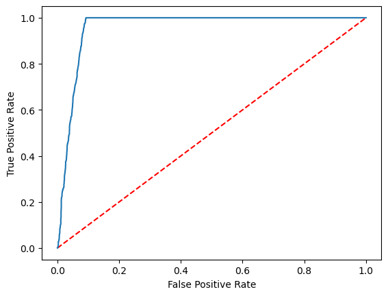

# Build a machine learning model with Apache Spark MLlib


In this article, you'll learn how to use Apache Spark [MLlib](https://spark.apache.org/mllib/) to create a machine learning application that does simple predictive analysis on an Azure open dataset. Spark provides built-in machine learning libraries. This example uses *classification* through logistic regression.

SparkML and MLlib are core Spark libraries that provide many utilities that are useful for machine learning tasks, including utilities that are suitable for:

- Classification
- Regression
- Clustering
- Topic modeling
- Singular value decomposition (SVD) and principal component analysis (PCA)
- Hypothesis testing and calculating sample statistics

## Understand classification and logistic regression

*Classification*, a popular machine learning task, is the process of sorting input data into categories. It's the job of a classification algorithm to figure out how to assign *labels* to input data that you provide. For example, you can think of a machine learning algorithm that accepts stock information as input and divide the stock into two categories: stocks that you should sell and stocks that you should keep.

*Logistic regression* is an algorithm that you can use for classification. Spark's logistic regression API is useful for *binary classification*, or classifying input data into one of two groups. For more information about logistic regression, see [Wikipedia](https://en.wikipedia.org/wiki/Logistic_regression).

In summary, the process of logistic regression produces a *logistic function* that you can use to predict the probability that an input vector belongs in one group or the other.

## Predictive analysis example on NYC taxi data

To get started, install ```azureml-opendatasets```. The data is available through [Azure Open Datasets](https://azure.microsoft.com/services/open-datasets/catalog/nyc-taxi-limousine-commission-yellow-taxi-trip-records/). This subset of the dataset contains information about yellow taxi trips, including the start and end time and locations, the cost, and other attributes.

```python
%pip install azureml-opendatasets
```

In the rest of this article, we'll use Apache Spark to perform some analysis on the NYC taxi-trip tip data and then develop a model to predict whether a particular trip includes a tip or not.

## Create an Apache Spark machine learning model

1. Create a PySpark notebook. For instructions, see [Create a notebook](../data-engineering/how-to-use-notebook.md).
2. Import the types required for this notebook.

    ```python
    import matplotlib.pyplot as plt
    from datetime import datetime
    from dateutil import parser
    from pyspark.sql.functions import unix_timestamp, date_format, col, when
    from pyspark.ml import Pipeline
    from pyspark.ml import PipelineModel
    from pyspark.ml.feature import RFormula
    from pyspark.ml.feature import OneHotEncoder, StringIndexer, VectorIndexer
    from pyspark.ml.classification import LogisticRegression
    from pyspark.mllib.evaluation import BinaryClassificationMetrics
    from pyspark.ml.evaluation import BinaryClassificationEvaluator
    ```

3. We will use [MLflow](https://mlflow.org/) to track our machine learning experiments and corresponding runs. If [!INCLUDE [product-name](../includes/product-name.md)] Autologging is enabled, the corresponding metrics and parameters are automatically captured.

    ```python
    import mlflow
    ```

## Construct the input DataFrame

In this example, we will load the data into a Pandas dataframe and then convert it into an Apache Spark dataframe. Using this format, we can apply other Apache Spark operations to clean and filter the dataset.

1. Run the following lines to create a Spark DataFrame by pasting the code into a new cell. This step retrieves the data via the Open Datasets API. We can filter this data down to look at a specific window of data. The following code example uses `start_date` and `end_date` to apply a filter that returns a single month of data.

    ```python
    from azureml.opendatasets import NycTlcYellow
    
    end_date = parser.parse('2018-06-06')
    start_date = parser.parse('2018-05-01')
    nyc_tlc = NycTlcYellow(start_date=start_date, end_date=end_date)
    nyc_tlc_pd = nyc_tlc.to_pandas_dataframe()

    nyc_tlc_df = spark.createDataFrame(nyc_tlc_pd).repartition(20)

    ```

2. The following code reduces the dataset to about 10,000 rows. To speed up the development and training, we will sample down our dataset for now.

    ```python
    # To make development easier, faster, and less expensive, sample down for now
    sampled_taxi_df = nyc_tlc_df.sample(True, 0.001, seed=1234)
    ```

3. Next, we want to take a look at our data using the built-in ```display()``` command. This allows us to easily view a sample of the data or explore the trends in the data graphically.

    ```python
    #sampled_taxi_df.show(10)
    display(sampled_taxi_df.limit(10))    
    ```

## Prepare the data

Data preparation is a crucial step in the machine learning process. It involves cleaning, transforming, and organizing raw data to make it suitable for analysis and modeling. In the following code, you perform several data preparation steps:

- Remove outliers and incorrect values by filtering the dataset
- Remove columns which are not needed for model training
- Create new columns from the raw data
- Generate a label to determine if there will be a tip or not for the given Taxi trip

```python
taxi_df = sampled_taxi_df.select('totalAmount', 'fareAmount', 'tipAmount', 'paymentType', 'rateCodeId', 'passengerCount'\
                        , 'tripDistance', 'tpepPickupDateTime', 'tpepDropoffDateTime'\
                        , date_format('tpepPickupDateTime', 'hh').alias('pickupHour')\
                        , date_format('tpepPickupDateTime', 'EEEE').alias('weekdayString')\
                        , (unix_timestamp(col('tpepDropoffDateTime')) - unix_timestamp(col('tpepPickupDateTime'))).alias('tripTimeSecs')\
                        , (when(col('tipAmount') > 0, 1).otherwise(0)).alias('tipped')
                        )\
                .filter((sampled_taxi_df.passengerCount > 0) & (sampled_taxi_df.passengerCount < 8)\
                        & (sampled_taxi_df.tipAmount >= 0) & (sampled_taxi_df.tipAmount <= 25)\
                        & (sampled_taxi_df.fareAmount >= 1) & (sampled_taxi_df.fareAmount <= 250)\
                        & (sampled_taxi_df.tipAmount < sampled_taxi_df.fareAmount)\
                        & (sampled_taxi_df.tripDistance > 0) & (sampled_taxi_df.tripDistance <= 100)\
                        & (sampled_taxi_df.rateCodeId <= 5)
                        & (sampled_taxi_df.paymentType.isin({"1", "2"}))
                        )
```

We will then make a second pass over the data to add the final features.

```Python
taxi_featurised_df = taxi_df.select('totalAmount', 'fareAmount', 'tipAmount', 'paymentType', 'passengerCount'\
                                                , 'tripDistance', 'weekdayString', 'pickupHour','tripTimeSecs','tipped'\
                                                , when((taxi_df.pickupHour <= 6) | (taxi_df.pickupHour >= 20),"Night")\
                                                .when((taxi_df.pickupHour >= 7) & (taxi_df.pickupHour <= 10), "AMRush")\
                                                .when((taxi_df.pickupHour >= 11) & (taxi_df.pickupHour <= 15), "Afternoon")\
                                                .when((taxi_df.pickupHour >= 16) & (taxi_df.pickupHour <= 19), "PMRush")\
                                                .otherwise(0).alias('trafficTimeBins')
                                              )\
                                       .filter((taxi_df.tripTimeSecs >= 30) & (taxi_df.tripTimeSecs <= 7200))
```

## Create a logistic regression model

The final task is to convert the labeled data into a format that can be analyzed through logistic regression. The input to a logistic regression algorithm needs to be a set of *label/feature vector pairs*, where the *feature vector* is a vector of numbers that represent the input point.

So, you need to convert the categorical columns into numbers. Specifically, you need to convert the `trafficTimeBins` and `weekdayString` columns into integer representations. There are multiple approaches to performing the conversion. The following example takes the `OneHotEncoder` approach.

```python
# Because the sample uses an algorithm that works only with numeric features, convert them so they can be consumed
sI1 = StringIndexer(inputCol="trafficTimeBins", outputCol="trafficTimeBinsIndex")
en1 = OneHotEncoder(dropLast=False, inputCol="trafficTimeBinsIndex", outputCol="trafficTimeBinsVec")
sI2 = StringIndexer(inputCol="weekdayString", outputCol="weekdayIndex")
en2 = OneHotEncoder(dropLast=False, inputCol="weekdayIndex", outputCol="weekdayVec")

# Create a new DataFrame that has had the encodings applied
encoded_final_df = Pipeline(stages=[sI1, en1, sI2, en2]).fit(taxi_featurised_df).transform(taxi_featurised_df)
```

This action results in a new DataFrame with all columns in the right format to train a model.

## Train a logistic regression model

The first task is to split the dataset into a training set and a testing or validation set.

```python
# Decide on the split between training and testing data from the DataFrame
trainingFraction = 0.7
testingFraction = (1-trainingFraction)
seed = 1234

# Split the DataFrame into test and training DataFrames
train_data_df, test_data_df = encoded_final_df.randomSplit([trainingFraction, testingFraction], seed=seed)
```

Now that there are two DataFrames, the next task is to create the model formula and run it against the training DataFrame. Then you can validate against the testing DataFrame. Experiment with different versions of the model formula to see the impact of different combinations.

```python
## Create a new logistic regression object for the model
logReg = LogisticRegression(maxIter=10, regParam=0.3, labelCol = 'tipped')

## The formula for the model
classFormula = RFormula(formula="tipped ~ pickupHour + weekdayVec + passengerCount + tripTimeSecs + tripDistance + fareAmount + paymentType+ trafficTimeBinsVec")

## Undertake training and create a logistic regression model
lrModel = Pipeline(stages=[classFormula, logReg]).fit(train_data_df)

## Predict tip 1/0 (yes/no) on the test dataset; evaluation using area under ROC
predictions = lrModel.transform(test_data_df)
predictionAndLabels = predictions.select("label","prediction").rdd
metrics = BinaryClassificationMetrics(predictionAndLabels)
print("Area under ROC = %s" % metrics.areaUnderROC)
```

The output from this cell is:

```shell
Area under ROC = 0.9749430523917996
```

## Create a visual representation of the prediction

You can now construct a final visualization to interpret the model results. A [ROC curve](https://en.wikipedia.org/wiki/Receiver_operating_characteristic) is one way to review the result.

```python
## Plot the ROC curve; no need for pandas, because this uses the modelSummary object
modelSummary = lrModel.stages[-1].summary

plt.plot([0, 1], [0, 1], 'r--')
plt.plot(modelSummary.roc.select('FPR').collect(),
         modelSummary.roc.select('TPR').collect())
plt.xlabel('False Positive Rate')
plt.ylabel('True Positive Rate')
plt.show()
```



## Related content

- Use AI samples to build machine learning models: [Use AI samples](use-ai-samples.md)
- Track machine learning runs using Experiments: [Machine learning experiments](machine-learning-experiment.md)
