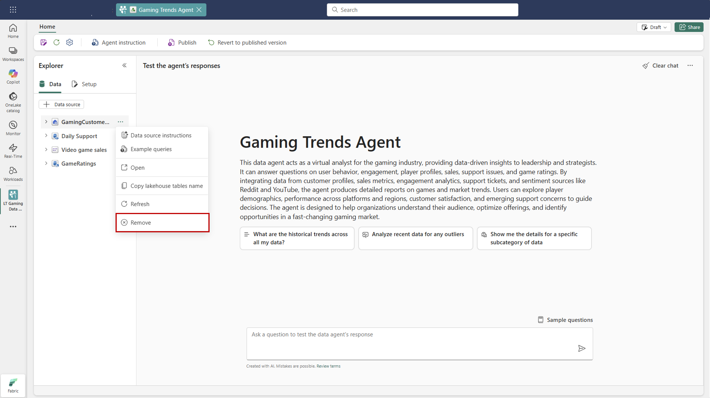

# Create a Fabric data agent (preview)

With a data agent in Microsoft Fabric, you can create conversational AI experiences that answer questions about data stored in lakehouses, warehouses, Power BI semantic models, and KQL databases in Fabric. Your data insights become accessible. Your colleagues can ask questions in plain English and receive data-driven answers, even if they aren't AI experts or deeply familiar with the data.

[!INCLUDE [feature-preview](../includes/feature-preview-note.md)]

[!INCLUDE [data-agent-prerequisites](./includes/data-agent-prerequisites.md)]

## Authentication and tokens

You don't need to create or supply an Azure OpenAI key or an access token to use a Fabric data agent. Fabric uses a Microsoft-managed Azure OpenAI Assistant and handles authentication for you.

- Data access runs under your Microsoft Entra ID user identity and your workspace/data permissions. The agent reads schemas and runs SQL/DAX/KQL only if you have access.
- To add a Power BI semantic model as a data source, you need read/write permission on that model (see note below). View-only access is sufficient to ask questions against sources you can read.
- If your organization uses a Power BI Premium per capacity (P1 or higher) capacity instead of an F SKU, make sure [Microsoft Fabric is enabled](../admin/fabric-switch.md) on that capacity.
- Service principals and API tokens aren't required for the in-product chat experience. Any automation with service principals is a separate scenario and isn't covered here.

## End-to-End Flow for creating and consuming Fabric data agents

This section outlines the key steps to create, validate, and share a Fabric data agent in Fabric, making it accessible for consumption.

The process is straightforward and you can begin testing the Fabric data agent resources in minutes.

## Create a new Fabric data agent

To create a new Fabric data agent, first navigate to your workspace, and then select the **+ New Item** button. In the All items tab, search for **Fabric data agent** to locate the appropriate option, as shown in this screenshot:

:::image type="content" source="./media/how-to-create-data-agent/create-data-agent.png" alt-text="Screenshot showing creation of a Fabric data agent." lightbox="./media/how-to-create-data-agent/create-data-agent.png":::

Once selected, you're prompted to provide a name for your Fabric data agent, as shown in this screenshot:

:::image type="content" source="./media/how-to-create-data-agent/name-data-agent.png" alt-text="Screenshot showing how to provide name for the Fabric data agent." lightbox="./media/how-to-create-data-agent/name-data-agent.png":::

Refer to the provided screenshot for a visual guide on naming the Fabric data agent. After entering the name, proceed with the configuration to align the Fabric data agent with your specific requirements.

## Select your data

After you create a Fabric data agent, you can add up to five data sources, including lakehouses, warehouses, Power BI semantic models, and KQL databases in any combination. For example, you could add five Power BI semantic models, or two Power BI semantic models, one lakehouse, and one KQL database.

When you create a Fabric data agent for the first time, and provide a name, the OneLake catalog automatically appears, allowing you to add data sources. To add a data source, select it from the catalog as shown on the next screen, then select **Add**. Each data source must be added individually. For example, you can add a lakehouse, select **Add**, and then proceed to add another data source. To filter the data source types, select the filter icon and then select the desired type. You can view only the data sources of the selected type, making it easier to locate and connect the appropriate sources for your Fabric data agent.

Once you add the data source, the **Explorer** on the left pane of the Fabric data agent page populates with the available tables in each selected data source, where you can use the checkboxes to make tables available or unavailable to the AI as shown in the following screenshot:

:::image type="content" source="./media/how-to-create-data-agent/change-datasource.png" alt-text="Screenshot showing how to add data sources." lightbox="./media/how-to-create-data-agent/change-datasource.png":::

> [!NOTE]
> You need read/write permission to add a Power BI semantic model as a data source to the Fabric data agent.

For subsequent additions of data sources, navigate to the **Explorer** on the left pane of the Fabric data agent page, and select **+ Data source**, as shown in this screenshot:

:::image type="content" source="./media/how-to-create-data-agent/add-datasource-onelake-explorer.png" alt-text="Screenshot that shows how to add more data sources." lightbox="./media/how-to-create-data-agent/add-datasource-onelake-explorer.png":::

The OneLake catalog opens again, and you can seamlessly add more data sources as needed.

> [!TIP]
> Make sure to use descriptive names for both tables and columns. A table named `SalesData` is more meaningful than `TableA`, and column names like `ActiveCustomer` or `IsCustomerActive` are clearer than `C1` or `ActCu`. Descriptive names help the AI generate more accurate and reliable queries.

## Ask questions

After you add the data sources and select the relevant tables for each data source, you can start asking questions. The system handles questions as shown in this screenshot:

:::image type="content" source="./media/how-to-create-data-agent/ask.png" alt-text="Screenshot showing a question for a Fabric data agent." lightbox="./media/how-to-create-data-agent/ask.png":::

Questions similar to these examples should also work:

- "What were our total sales in California in 2023?"
- "What are the top 5 products with the highest list prices, and what are their categories?"
- "What are the most expensive items that have never been sold?"

Questions like this are suitable because the system can translate them into structured queries (T-SQL, DAX, or KQL), execute them against databases, and then return concrete answers based on stored data.

However, questions like these are out of scope:

- "Why is our factory productivity lower in Q2 2024?"
- "What is the root cause of our sales spike?"

These questions are currently out of scope because they require complex reasoning, correlation analysis, or external factors not directly available in the database. The Fabric data agent currently doesn't perform advanced analytics, machine learning, or causal inference. It simply retrieves and processes structured data based on the user's query.

When you ask a question, the Fabric data agent uses the Azure OpenAI Assistant API to process the request. The flow operates this way:

### Schema access with user credentials

The system first uses the credentials of the user to access the schema of the data source (for example, lakehouse, warehouse, PBI semantic model, or KQL databases). This ensures that the system fetches data structure information that the user has permission to view.

### Constructing the prompt

To interpret the user's question, the system combines:

1. User Query: The natural language question provided by the user.
1. Schema Information: Metadata and structural details of the data source retrieved in the previous step.
1. Examples and Instructions: Any predefined examples (for example, sample questions and answers) or specific instructions provided when setting up the Fabric data agent. These examples and instructions help refine the AI's understanding of the question, and guide how the AI interacts with the data.

All this information is used to construct a prompt. This prompt serves as an input to the Azure OpenAI Assistant API, which behaves as an agent underlying the Fabric data agent. This essentially instructs the Fabric data agent about how to process the query, and the type of answer to produce.

### Tool invocation based on query needs

The agent analyzes the constructed prompt, and decides which tool to invoke to retrieve the answer:

- Natural Language to SQL (NL2SQL): Used to generate SQL queries when the data resides in a lakehouse or warehouse
- Natural Language to DAX (NL2DAX): Used to create DAX queries to interact with semantic models in Power BI data sources
- Natural Language to KQL (NL2KQL): Used to construct KQL queries to query data in KQL databases

The selected tool generates a query using the schema, metadata, and context that the agent underlying the Fabric data agent provides. Then the tool validates the query, to ensure proper formatting and compliance with its security protocols, and its own Responsible AI (RAI) policies.

### Response construction

The agent underlying the Fabric data agent executes the query and ensures that the response is structured and formatted appropriately. The agent often includes extra context to make the answer user-friendly. Finally, the answer is displayed to the user in a conversational interface, as shown in the following screenshot:

:::image type="content" source="./media/how-to-create-data-agent/answer.png" alt-text="Screenshot showing the answer to the question by a Fabric data agent." lightbox="./media/how-to-create-data-agent/answer.png":::

The agent presents both the result and the intermediate steps that it took to retrieve the final answer. This approach enhances transparency and allows validation of those steps, if necessary. Users can expand the dropdown for the steps to view all the steps the Fabric data agent took to retrieve the answer, as shown in the following screenshot:

:::image type="content" source="./media/how-to-create-data-agent/answer-steps.png" alt-text="Screenshot showing the steps taken by a Fabric data agent." lightbox="./media/how-to-create-data-agent/answer-steps.png":::

Additionally, the Fabric data agent provides the generated code used to query the corresponding data source, offering further insight into how the response was constructed.

These queries are designed exclusively for querying data. Operations that involve data creation, data updates, data deletions, any type of data change aren't allowed, to protect the integrity of your data.

At any point, you can select the **Clear chat** button to clear the chat, as shown in the following screenshot:

:::image type="content" source="./media/how-to-create-data-agent/clear-chat.png" alt-text="Screenshot highlighting the Clear chat feature." lightbox="./media/how-to-create-data-agent/clear-chat.png":::

The Clear chat feature erases all chat history and starts a new session. Once you delete your chat history, you can't retrieve it.

## Change the data source

To remove a data source, hover over the data source name in the **Explorer** on the left pane of the Fabric data agent page until the three-dot menu appears. Select the three dots to reveal the options, then select **Remove** to delete the data source as shown in the following screenshot:

<!-- -->

:::image type="content" source="./media/how-to-create-data-agent/delete-datasource.png" alt-text="Screenshot showing how to delete or refresh data sources." lightbox="./media/how-to-create-data-agent/delete-datasource.png":::

Alternatively, if your data source changed, you can select **Refresh** within the same menu, as shown in the following screenshot:

<!--  -->

:::image type="content" source="./media/how-to-create-data-agent/refresh-datasource.png" alt-text="Screenshot showing how to refresh a data source." lightbox="./media/how-to-create-data-agent/refresh-datasource.png":::

This ensures that any data source updates are both reflected and correctly populated in the explorer, to keep your Fabric data agent in sync with the latest data.

## Fabric data agent configuration

The Fabric data agent offers several configuration options that allow users to customize Fabric data agent behavior, to better match the needs of your organization. As the Fabric data agent processes and presents data, these configurations offer flexibility that enables more control over the outcomes.

### Provide instructions

You can provide specific instructions to guide the AI's behavior. To add them in the Fabric data agent instructions pane, select **Data agent instructions** as shown in the following screenshot:

<!--  -->

:::image type="content" source="./media/how-to-create-data-agent/select-adding-instructions.png" alt-text="Screenshot showing selection of the Data agent instructions button." lightbox="./media/how-to-create-data-agent/select-adding-instructions.png":::

Here, you can write up to 15,000 characters in plain English-language text, to instruct the AI about how to handle queries.

For example, you can specify the exact data source to use for certain types of questions. Examples of data source choices could involve directing the AI to use

- Power BI semantic models for financial queries
- a lakehouse for sales data
- a KQL database for operational metrics

These instructions ensure that the AI generates appropriate queries, whether SQL, DAX, or KQL, based on your guidance and the context of the questions.

If your AI resource consistently misinterprets certain words, acronyms, or terms, you can try to provide clear definitions in this section, to ensure that the AI understands and processes them correctly. This becomes especially useful for domain-specific terminology or unique business jargon.

By tailoring these instructions and defining terms, you enhance the AI's ability to deliver precise and relevant insights, in full alignment with your data strategy and business requirements.

### Provide example queries

You can enhance the accuracy of the Fabric data agent responses when you provide example queries tailored to each data source, such as lakehouse, warehouse, and KQL databases. This approach, known as **Few-Shot Learning** in generative AI, helps guide the Fabric data agent to generate responses that better align with your expectations.

When you provide the AI with sample query/question pairs, it references these examples when it answers future questions. Matching new queries to the most relevant examples helps the AI incorporate business-specific logic, and respond effectively to commonly asked questions. This functionality enables fine-tuning for individual data sources, and ensures generation of more accurate SQL or KQL queries.

Power BI semantic model data don't support adding sample query/question pairs at this time. However, for supported data sources such as lakehouse, warehouse, and KQL databases, providing more examples can significantly improve the AI's ability to generate precise queries when its default performance needs adjustment.

> [!TIP]
> A diverse set of example queries enhances the ability of a Fabric data agent to generate accurate and relevant SQL/KQL queries.

To add or edit example queries, select the **Example queries** button to open the example queries pane, as shown in the following screenshot:

:::image type="content" source="./media/how-to-create-data-agent/data-agent-adding-examples.png" alt-text="Screenshot showing where you can edit the examples you provide to the AI." lightbox="./media/how-to-create-data-agent/data-agent-adding-examples.png":::

This pane provides options to add or edit example queries for all supported data sources except Power BI semantic models. For each data source, you can select **Add or Edit Example Queries** to input the relevant examples, as shown in the following screenshot:

:::image type="content" source="./media/how-to-create-data-agent/data-agent-adding-examples-sql.png" alt-text="Screenshot showing the SQL examples you provide to the AI." lightbox="./media/how-to-create-data-agent/data-agent-adding-examples-sql.png":::

> [!NOTE]
> The Fabric data agent only refers to queries that contain valid SQL/KQL syntax and that match the schema of the selected tables. The Fabric data agent doesn't use queries that haven't completed their validation. Make sure that all example queries are valid and correctly aligned with the schema to ensure that the Fabric data agent utilizes them effectively.

## Publish and share a Fabric data agent

After you test the performance of your Fabric data agent across various questions, and you confirm that it generates accurate SQL, DAX, OR KQL queries, you can share it with your colleagues. At that point, select **Publish**, as shown in the following screenshot:

:::image type="content" source="./media/how-to-create-data-agent/publish-data-agent.png" alt-text="Screenshot showing publication of a Fabric data agent." lightbox="./media/how-to-create-data-agent/publish-data-agent.png":::

This step opens a window that asks for a description of the Fabric data agent. Here, provide a detailed description of what the Fabric data agent does. These details guide your colleagues about the functionality of the Fabric data agent, and assist other AI systems/orchestrators to effectively invoke the Fabric data agent.

After you publish the Fabric data agent, you'll have two versions of it. One version is the current draft version, which you can continue to refine and improve. The second version is the published version, which you can share with your colleagues who want to query the Fabric data agent to get answers to their questions. You can incorporate feedback from your colleagues into your current draft version as you develop it, to further enhance the Fabric data agent's performance.

## Related content

- [Data agent concept](concept-data-agent.md)
- [Data agent end-to-end tutorial](data-agent-end-to-end-tutorial.md)

