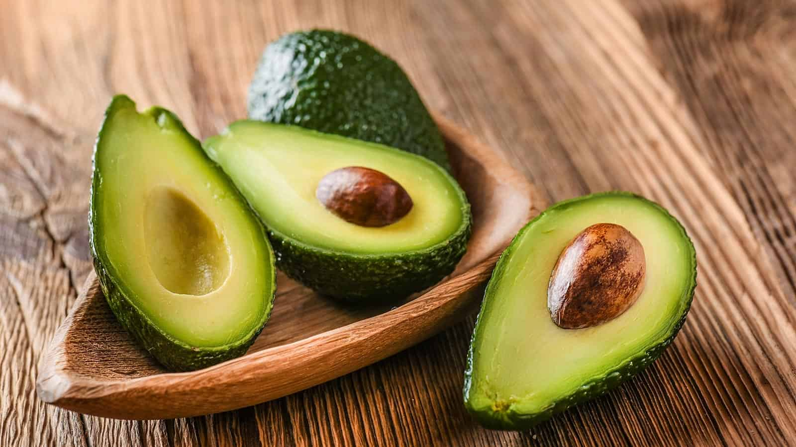
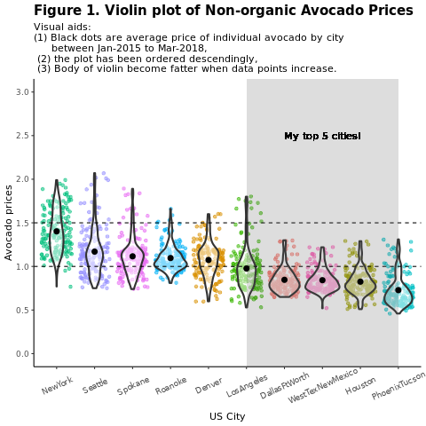
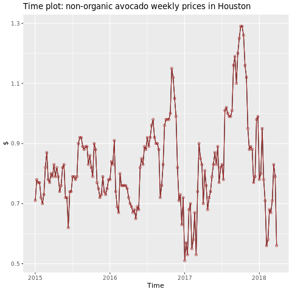
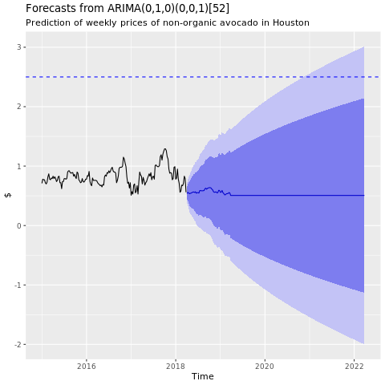

# Avocado price prediction

[!INCLUDE [preview-note](../includes/preview-note.md)]

In this notebook, we demonstrate an end to end example of using R to analyze, visualize the avocado prices in the US and predict which city has the cheapest Avocado.


## Prerequisites

Attach your notebook to a lakehouse. On the left side, select **Add** to add an existing lakehouse or create a lakehouse.

## Load libraries

Use libraries from the default R runtime.

```R
library(tidyverse)
library(lubridate)
library(hms)
```

## Load the data

```R
df <- read.csv('https://synapseaisolutionsa.blob.core.windows.net/public/AvocadoPrice/avocado.csv', header = TRUE)
head(df,5)
```
## Manipulate the data

```R
# to lower case
names(df) <- tolower(names(df))

# to snake case
avocado <- df %>% 
  rename("av_index" = "x",
         "average_price" = "averageprice",
         "total_volume" = "total.volume",
         "total_bags" = "total.bags",
         "amount_from_small_bags" = "small.bags",
         "amount_from_large_bags" = "large.bags",
         "amount_from_xlarge_bags" = "xlarge.bags")

# Rename codes
avocado2 <- avocado %>% 
  rename("PLU4046" = "x4046",
         "PLU4225" = "x4225",
         "PLU4770" = "x4770")

head(avocado2,5)
```

```R
# Convert data
avocado2$year = as.factor(avocado2$year)
avocado2$date = as.Date(avocado2$date)
avocado2$month  = factor(months(avocado2$date), levels = month.name)
avocado2$average_price =as.numeric(avocado2$average_price)
avocado2$PLU4046 = as.double(avocado2$PLU4046)
avocado2$PLU4225 = as.double(avocado2$PLU4225)
avocado2$PLU4770 = as.double(avocado2$PLU4770)
avocado2$amount_from_small_bags = as.numeric(avocado2$amount_from_small_bags)
avocado2$amount_from_large_bags = as.numeric(avocado2$amount_from_large_bags)
avocado2$amount_from_xlarge_bags = as.numeric(avocado2$amount_from_xlarge_bags)


# # Remove unwanted columns
avocado2 <- avocado2 %>% 
  select(-av_index,-total_volume, -total_bags)

# Calculate total consumption 
avocado2 <- avocado2 %>% 
  mutate(total_consumption = PLU4046 + PLU4225 + PLU4770 + amount_from_small_bags + amount_from_large_bags + amount_from_xlarge_bags)
```

## Install new package
Use the inline package installation to add new packages to the session

```R
install.packages(c("repr","gridExtra","fpp2"))
```

```R
library(tidyverse) 
library(knitr)
library(repr)
library(gridExtra)
library(data.table)
```

## Analyze and visualize the data
Comparison of Conventional (nonorganic) Avocado Prices

```R
options(repr.plot.width = 10, repr.plot.height =10)
# filter(mydata, gear %in% c(4,5))
avocado2 %>% 
  filter(region %in% c("PhoenixTucson","Houston","WestTexNewMexico","DallasFtWorth","LosAngeles","Denver","Roanoke","Seattle","Spokane","NewYork")) %>%  
  filter(type == "conventional") %>%           
  select(date, region, average_price) %>% 
  ggplot(aes(x = reorder(region, -average_price, na.rm = T), y = average_price)) +
  geom_jitter(aes(colour = region, alpha = 0.5)) +
  geom_violin(outlier.shape = NA, alpha = 0.5, size = 1) +
  geom_hline(yintercept = 1.5, linetype = 2) +
  geom_hline(yintercept = 1, linetype = 2) +
  annotate("rect", xmin = "LosAngeles", xmax = "PhoenixTucson", ymin = -Inf, ymax = Inf, alpha = 0.2) +
  geom_text(x = "WestTexNewMexico", y = 2.5, label = "My top 5 cities!", hjust = 0.5) +
  stat_summary(fun = "mean") +
  labs(x = "US City",
       y = "Avocado prices", 
       title = "Figure 1. Violin plot of Non-organic Avocado Prices",
       subtitle = "Visual aids: \n(1) Black dots are average price of individual avocado by city \n     between Jan-2015 to Mar-2018, \n (2) the plot has been ordered descendingly,\n (3) Body of violin become fatter when data points increase.") +
  theme_classic() + 
  theme(legend.position = "none", 
        axis.text.x = element_text(angle = 25, vjust = 0.65),
        plot.title = element_text(face = "bold", size = 15)) +
  scale_y_continuous(lim = c(0, 3), breaks = seq(0, 3, 0.5))
```




```R
library(fpp2)
conv_houston <- avocado2 %>% 
  filter(region == "Houston",
         type == "conventional") %>% 
  group_by(date) %>% 
  summarise(average_price = mean(average_price))
  
# set up ts   

conv_houston_ts <- ts(conv_houston$average_price,
                 start = c(2015, 1),
                 frequency = 52) 
# plot

autoplot(conv_houston_ts) +
  labs(title = "Time plot: non-organic avocado weekly prices in Houston",
       y = "$") +
  geom_point(colour = "brown", shape = 21) +
  geom_path(colour = "brown")
```




## Train a machine learning model
Forecast Nonorganic Avocado Prices in US.

```R
conv_houston_ts_arima <- auto.arima(conv_houston_ts,
                                    d = 1,
                                    approximation = F,
                                    stepwise = F,
                                    trace = T)
```

```R
checkresiduals(conv_houston_ts_arima)
```


```R
conv_houston_ts_arima_fc <- forecast(conv_houston_ts_arima, h = 208)

autoplot(conv_houston_ts_arima_fc) + labs(subtitle = "Prediction of weekly prices of non-organic avocado in Houston",
       y = "$") +
  geom_hline(yintercept = 2.5, linetype = 2, colour = "blue")
```



## Next steps

- [How to use SparkR](./r-use-sparkr.md)
- [How to use sparklyr](./r-use-sparklyr.md)
- [How to use Tidyverse](./r-use-tidyverse.md)
- [R library management](./r-library-management.md)
- [Visualize data in R](r-visualization.md)
- [Tutorial: avocado price prediction](./r-avocado.md)
