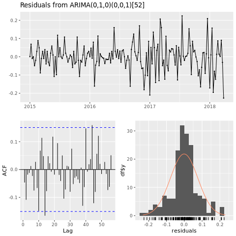

# Tutorial: use R to predict avocado prices

This tutorial presents an end-to-end example of a [!INCLUDE [fabric-ds-name](includes/fabric-ds-name.md)] workflow in [!INCLUDE [product-name](../includes/product-name.md)]. It uses R to analyze and visualize avocado prices in the United States, to build a machine learning model that predicts future avocado prices.

This tutorial covers these steps:

> [!div class="checklist"]
> - Load default libraries
> - Load the data
> - Customize the data
> - Add new packages to the session
> - Analyze and visualize the data
> - Train the model

:::image type="content" source="media/r-avocado/avocado.png" alt-text="Screenshot of avocados.":::

## Prerequisites

[!INCLUDE [prerequisites](./includes/prerequisites.md)]
[!INCLUDE [r-prerequisites](./includes/r-notebook-prerequisites.md)]

## Load libraries

Use libraries from the default R runtime:

```r
library(tidyverse)
library(lubridate)
library(hms)
```

## Load the data

Read avocado prices from a .CSV file, downloaded from the internet:

```r
df <- read.csv('https://synapseaisolutionsa.blob.core.windows.net/public/AvocadoPrice/avocado.csv', header = TRUE)
head(df,5)
```

## Manipulate the data

First, give the columns friendlier names.

```r
# To use lowercase
names(df) <- tolower(names(df))

# To use snake case
avocado <- df %>% 
  rename("av_index" = "x",
         "average_price" = "averageprice",
         "total_volume" = "total.volume",
         "total_bags" = "total.bags",
         "amount_from_small_bags" = "small.bags",
         "amount_from_large_bags" = "large.bags",
         "amount_from_xlarge_bags" = "xlarge.bags")

# Rename codes
avocado2 <- avocado %>% 
  rename("PLU4046" = "x4046",
         "PLU4225" = "x4225",
         "PLU4770" = "x4770")

head(avocado2,5)
```

Change the data types, remove unwanted columns, and add total consumption:

```r
# Convert data
avocado2$year = as.factor(avocado2$year)
avocado2$date = as.Date(avocado2$date)
avocado2$month  = factor(months(avocado2$date), levels = month.name)
avocado2$average_price =as.numeric(avocado2$average_price)
avocado2$PLU4046 = as.double(avocado2$PLU4046)
avocado2$PLU4225 = as.double(avocado2$PLU4225)
avocado2$PLU4770 = as.double(avocado2$PLU4770)
avocado2$amount_from_small_bags = as.numeric(avocado2$amount_from_small_bags)
avocado2$amount_from_large_bags = as.numeric(avocado2$amount_from_large_bags)
avocado2$amount_from_xlarge_bags = as.numeric(avocado2$amount_from_xlarge_bags)


# Remove unwanted columns
avocado2 <- avocado2 %>% 
  select(-av_index,-total_volume, -total_bags)

# Calculate total consumption 
avocado2 <- avocado2 %>% 
  mutate(total_consumption = PLU4046 + PLU4225 + PLU4770 + amount_from_small_bags + amount_from_large_bags + amount_from_xlarge_bags)
```

## Install new packages

Use the inline package installation to add new packages to the session:

```r
install.packages(c("repr","gridExtra","fpp2"))
```

Load the needed libraries.

```r
library(tidyverse) 
library(knitr)
library(repr)
library(gridExtra)
library(data.table)
```

## Analyze and visualize the data

Compare conventional (nonorganic) avocado prices by region:

```r
options(repr.plot.width = 10, repr.plot.height =10)
# filter(mydata, gear %in% c(4,5))
avocado2 %>% 
  filter(region %in% c("PhoenixTucson","Houston","WestTexNewMexico","DallasFtWorth","LosAngeles","Denver","Roanoke","Seattle","Spokane","NewYork")) %>%  
  filter(type == "conventional") %>%           
  select(date, region, average_price) %>% 
  ggplot(aes(x = reorder(region, -average_price, na.rm = T), y = average_price)) +
  geom_jitter(aes(colour = region, alpha = 0.5)) +
  geom_violin(outlier.shape = NA, alpha = 0.5, size = 1) +
  geom_hline(yintercept = 1.5, linetype = 2) +
  geom_hline(yintercept = 1, linetype = 2) +
  annotate("rect", xmin = "LosAngeles", xmax = "PhoenixTucson", ymin = -Inf, ymax = Inf, alpha = 0.2) +
  geom_text(x = "WestTexNewMexico", y = 2.5, label = "My top 5 cities!", hjust = 0.5) +
  stat_summary(fun = "mean") +
  labs(x = "US city",
       y = "Avocado prices", 
       title = "Figure 1. Violin plot of nonorganic avocado prices",
       subtitle = "Visual aids: \n(1) Black dots are average prices of individual avocados by city \n     between January 2015 and March 2018. \n(2) The plot is ordered descendingly.\n(3) The body of the violin becomes fatter when data points increase.") +
  theme_classic() + 
  theme(legend.position = "none", 
        axis.text.x = element_text(angle = 25, vjust = 0.65),
        plot.title = element_text(face = "bold", size = 15)) +
  scale_y_continuous(lim = c(0, 3), breaks = seq(0, 3, 0.5))
```

:::image type="content" source="media/r-avocado/non-organic-avocado.png" alt-text="Screenshot that shows a graph of nonorganic prices.":::

Focus on the Houston region.

```r
library(fpp2)
conv_houston <- avocado2 %>% 
  filter(region == "Houston",
         type == "conventional") %>% 
  group_by(date) %>% 
  summarise(average_price = mean(average_price))
  
# Set up ts   

conv_houston_ts <- ts(conv_houston$average_price,
                 start = c(2015, 1),
                 frequency = 52) 
# Plot

autoplot(conv_houston_ts) +
  labs(title = "Time plot: nonorganic avocado weekly prices in Houston",
       y = "$") +
  geom_point(colour = "brown", shape = 21) +
  geom_path(colour = "brown")
```

:::image type="content" source="media/r-avocado/non-organic-avocado-houston.png" alt-text="Screenshot of a graph of avocado prices in Houston.":::

## Train a machine learning model

Build a price prediction model for the Houston area, based on AutoRegressive Integrated Moving Average (ARIMA):

```r
conv_houston_ts_arima <- auto.arima(conv_houston_ts,
                                    d = 1,
                                    approximation = F,
                                    stepwise = F,
                                    trace = T)
```

```r
checkresiduals(conv_houston_ts_arima)
```



Show a graph of forecasts from the Houston ARIMA model:

```r
conv_houston_ts_arima_fc <- forecast(conv_houston_ts_arima, h = 208)

autoplot(conv_houston_ts_arima_fc) + labs(subtitle = "Prediction of weekly prices of nonorganic avocados in Houston",
       y = "$") +
  geom_hline(yintercept = 2.5, linetype = 2, colour = "blue")
```

:::image type="content" source="media/r-avocado/forecast.png" alt-text="Screenshot that shows a graph of forecasts from the ARIMA model.":::

## Related content

- [How to use SparkR](./r-use-sparkr.md)
- [How to use sparklyr](./r-use-sparklyr.md)
- [How to use Tidyverse](./r-use-tidyverse.md)
- [R library management](./r-library-management.md)
- [Visualize data in R](./r-visualization.md)
- [Tutorial: Use R to predict flight delay](./r-flight-delay.md)