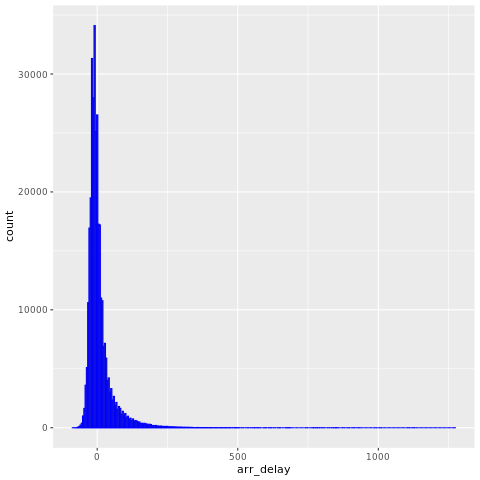
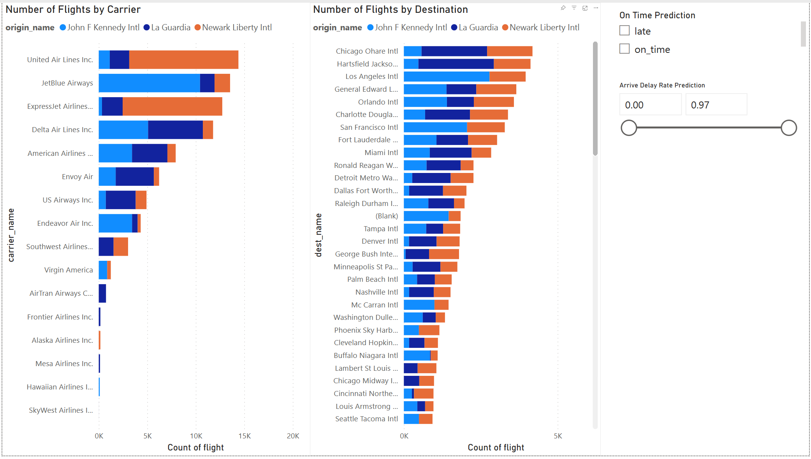
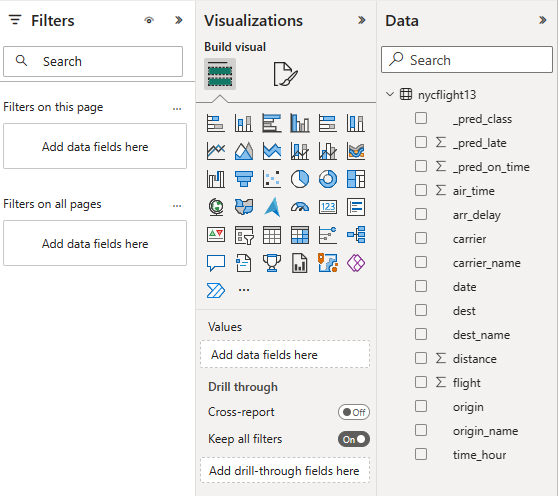

# Flight delay prediction

[!INCLUDE [preview-note](../includes/preview-note.md)]

The idea of this project is to use the [nycflights13](https://github.com/hadley/nycflights13) data to predict whether a plane arrives more than 30 minutes late. We then use the prediction results to build an interactive Power BI dashboard. 

In this tutorial, you can see how to 
- Use [tidymodels](https://www.tidymodels.org/) packages, such as [recipes](https://recipes.tidymodels.org/), [parsnip](https://parsnip.tidymodels.org/), [rsample](https://rsample.tidymodels.org/) ,[workflows](https://workflows.tidymodels.org/) to process data and train a machine learning model. 
- Write the output data to lakehouse as delta table.
- Build a Power BI visual report via See Through mode directly access data on your lakehouse.


## Prerequisites
- Attach your notebook to a lakehouse. On the left side, select **Add** to add an existing lakehouse or create a lakehouse.

## Install package
To use code in this article, you need to install the nycflights13 package.

```R
install.packages("nycflights13")
```

```R
# load the packages
library(tidymodels)      # for tidymodels packages
library(nycflights13)    # for flight data
```

## Data exploration
The `nycflights13` data contains information on 325,819 flights departing near New York City in 2013. Let's first take a look at the flight delay distribution. The figure below shows that the distribution of the arrive delay is right skewed, it has long tail in the high values.

```R
ggplot(flights, aes(arr_delay)) + geom_histogram(color="blue", bins = 300)
```




Let’s load the data and make a few changes to the variables:

```R
set.seed(123)

flight_data <- 
  flights %>% 
  mutate(
    # convert the arrival delay to a factor
    arr_delay = ifelse(arr_delay >= 30, "late", "on_time"),
    arr_delay = factor(arr_delay),
    # we will use the date (not date-time) in the recipe below
    date = lubridate::as_date(time_hour)
  ) %>% 
  # include the weather data
  inner_join(weather, by = c("origin", "time_hour")) %>% 
  # only retain the specific columns we will use
  select(dep_time, flight, origin, dest, air_time, distance, 
         carrier, date, arr_delay, time_hour) %>% 
  # exclude missing data
  na.omit() %>% 
  # for creating models, it is better to have qualitative columns
  # encoded as factors (instead of character strings)
  mutate_if(is.character, as.factor)
```

Before we start building up our model, let’s take a quick look at a few specific variables that are important for both preprocessing and modeling. 
Notice that the variable we created called `arr_delay` is a factor variable; it's important that our outcome variable for training a logistic regression model is a factor.

```R
glimpse(flight_data)
```

We can see that about 16% of the flights in this data set arrived more than 30 minutes late.

```R
flight_data %>% 
  count(arr_delay) %>% 
  mutate(prop = n/sum(n))
```
There are 104 flight destinations contained in `dest`.

```R
unique(flight_data$dest)
```
There are 16 distinct carriers.

```R
unique(flight_data$carrier)
```

## Data splitting

To get started, let’s split this single dataset into two: a _training_ set and a _testing_ set. We keep most of the rows in the original dataset (subset chosen randomly) in the training set. The _training_ data is used to fit the model, and the _testing_ set is used to measure model performance.

We can use the `rsample` package to create an object that contains the information on how to split the data, and then two more `rsample` functions to create data frames for the training and testing sets:

```R
set.seed(123)
# keep most of the data into the training set 
data_split <- initial_split(flight_data, prop = 0.75)

# create data frames for the two sets:
train_data <- training(data_split)
test_data  <- testing(data_split)
```

## Create recipe and roles

Let’s create a recipe for a simple logistic regression model. Before training the model, we can use a recipe to create a few new predictors and conduct some preprocessing required by the model.


We use the `update_role() `function to let recipes know that `flight` and `time_hour` are variables with a custom role that we called "ID" (a role can have any character value). Whereas our formula included all variables in the training set other than `arr_delay` as predictors. The recipe keeps these two variables but not use them as either outcomes or predictors.

```R
flights_rec <- 
  recipe(arr_delay ~ ., data = train_data) %>% 
  update_role(flight, time_hour, new_role = "ID") 
```

To get the current set of variables and roles, use the `summary()` function:

```R
summary(flights_rec)
```

## Create features
Now we can do some feature engineering to improve our model. Perhaps it's reasonable for the date of the flight to have an effect on the likelihood of a late arrival. 

```R
flight_data %>% 
  distinct(date) %>% 
  mutate(numeric_date = as.numeric(date)) 
```

It might be better to add model terms derived from the date that have a better potential to be important to the model, we could derive the following meaningful features from the single date variable:

 - the day of the week,
 - the month, and
 - whether or not the date corresponds to a holiday.

Let’s do all three by adding steps to our recipe:

```R
flights_rec <- 
  recipe(arr_delay ~ ., data = train_data) %>% 
  update_role(flight, time_hour, new_role = "ID") %>% 
  step_date(date, features = c("dow", "month")) %>%               
  step_holiday(date, 
               holidays = timeDate::listHolidays("US"), 
               keep_original_cols = FALSE) %>% 
  step_dummy(all_nominal_predictors()) %>% 
  step_zv(all_predictors())
```

## Fit a model with a recipe
Let's use logistic regression to model the flight data. We start by building model specification using the `parsnip` package:

```R
lr_mod <- 
  logistic_reg() %>% 
  set_engine("glm")
```

Then use the `workflows` package to bundle our `parsnip` model (`lr_mod`) with our recipe (`flights_rec`).

```R
flights_wflow <- 
  workflow() %>% 
  add_model(lr_mod) %>% 
  add_recipe(flights_rec)

flights_wflow
```

## Train the model
Here's a single function that can be used to prepare the recipe and train the model from the resulting predictors:

```R
flights_fit <- 
  flights_wflow %>% 
  fit(data = train_data)
```

You can use the helper functions `xtract_fit_parsnip()` and `extract_recipe()` to extract the model or recipe objects from the workflow. For example, here we pull the fitted model object then use the `broom::tidy()` function to get a tidy tibble of model coefficients:

```R
flights_fit %>% 
  extract_fit_parsnip() %>% 
  tidy()
```

## Predict results

We then use the trained workflow (`flights_fit`) to predict with the unseen test data, which we can do with a single call to `predict()`. The `predict()` method applies the recipe to the new data, then passes them to the fitted model.

```R
predict(flights_fit, test_data)
```

Now we get the output from `predict()` returns the predicted class: `late` versus `on_time`. If we want the predicted class probabilities for each flight instead, we can use `augment()` with the model plus test data to save them together:

```R
flights_aug <- 
  augment(flights_fit, test_data)
```

The data looks like:

```R
glimpse(flights_aug)
```

## Evaluate the model

Now that we have a tibble with our predicted class probabilities. We can see from these first few rows that our model predicted 5 on time flights correctly because the values of `.pred_on_time` are p > 0.50. But we also know that we have 81,455 rows total to predict. We would like to calculate a metric that tells how well our model predicted late arrivals, compared to the true stat`us of our outcome variable, `arr_delay`.

Let’s use the area under the ROC curve as our metric, computed using `roc_curve()` and `roc_auc()` from the `yardstick` package.

```R
flights_aug %>% 
  roc_curve(truth = arr_delay, .pred_late) %>% 
  autoplot()
```

## Build a Power BI report
The model result isn't too bad! Let's use the flight delay prediction results to build an interactive Power BI dashboard, which shows the number of flights by carrier, number of flights by destination, and able to filter by the delay prediction results.  



Let's first include the carrier name and airport name to the prediction result dataset. 

```R
  fligths_clean <- flights_aug %>% 
  # include the airline data
  left_join(airlines, c("carrier"="carrier"))%>% 
  rename("carrier_name"="name") %>%
  # include the airports data for origin
  left_join(airports, c("origin"="faa")) %>%
  rename("origin_name"="name") %>%
  # include the airports data for destination
  left_join(airports, c("dest"="faa")) %>%
  rename("dest_name"="name") %>%
  # only retain the specific columns we will use
  select(flight, origin, origin_name, dest,dest_name, air_time,distance, carrier, carrier_name, date, arr_delay, time_hour, .pred_class, .pred_late, .pred_on_time)
```
The data looks like:

```R
glimpse(fligths_clean)
```

Convert the data to Spark dataframe:

```R
sparkdf <- as.DataFrame(fligths_clean)
display(sparkdf)
```

Write the data into a delta table on your lakehouse:

```R
# write data into delta table
temp_delta<-"Tables/nycflight13"
write.df(sparkdf, temp_delta ,source="delta", mode = "overwrite", header = "true")
```

Once the delta table is created, [!INCLUDE [product-name](../includes/product-name.md)] creates a dataset automatically. When we switch to the Power BI landing page and create a new report, we can see the delta table `nycflight13` show up on the data list automatically! It's super easy to build a Power BI visual report via See Through mode directly access data on the LakeHouse.




## Next steps

- [How to use SparkR](./r-use-sparkr.md)
- [How to use sparklyr](./r-use-sparklyr.md)
- [How to use Tidyverse](./r-use-tidyverse.md)
- [R library management](./r-library-management.md)
- [Visualize data in R](r-visualization.md)
- [Tutorial: Avocado price prediction](./r-avocado.md)