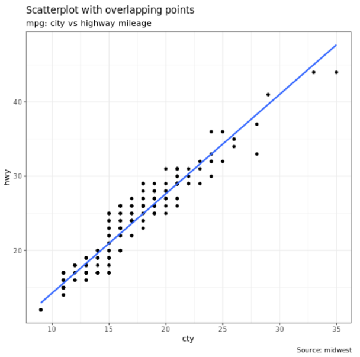
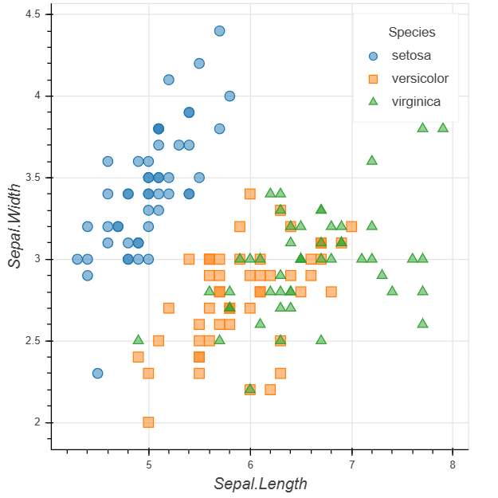
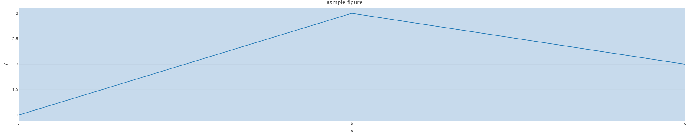
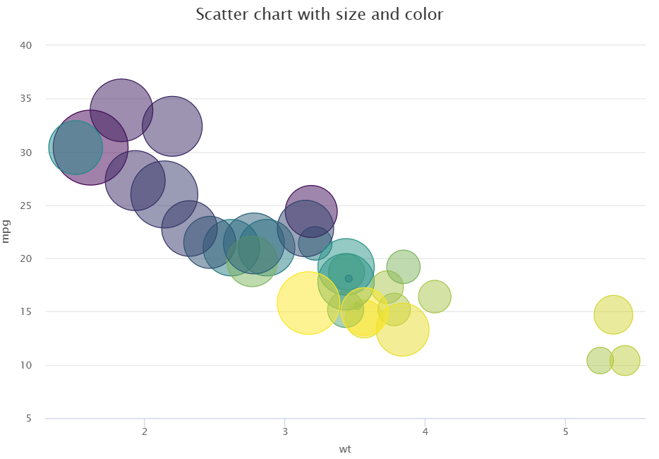

# Visualize data in R

[!INCLUDE [preview-note](../includes/preview-note.md)]

The R ecosystem offers multiple graphing libraries that come packed with many different features. By default, every Apache Spark Pool in [!INCLUDE [product-name](../includes/product-name.md)] contains a set of curated and popular open-source libraries. You can also add or manage extra libraries or versions by using the [!INCLUDE [product-name](../includes/product-name.md)]  library management capabilities.

## ggplot2
The [ggplot2](https://ggplot2.tidyverse.org/) library is popular for data visualization and exploratory data analysis.



```R
%%sparkr
library(ggplot2)
data(mpg, package="ggplot2") 
theme_set(theme_bw()) 

g <- ggplot(mpg, aes(cty, hwy))

# Scatterplot
g + geom_point() + 
  geom_smooth(method="lm", se=F) +
  labs(subtitle="mpg: city vs highway mileage", 
       y="hwy", 
       x="cty", 
       title="Scatterplot with overlapping points", 
       caption="Source: midwest")
```

## rbokeh

[rbokeh](https://hafen.github.io/rbokeh/) is a native R plotting library for creating interactive graphics.


```R
library(rbokeh)
p <- figure() %>%
  ly_points(Sepal.Length, Sepal.Width, data = iris,
    color = Species, glyph = Species,
    hover = list(Sepal.Length, Sepal.Width))
p
```

## R Plotly

[Plotly](https://plotly.com/r/) is an R graphing library that makes interactive, publication-quality graphs.


```R
library(plotly) 

fig <- plot_ly() %>% 
  add_lines(x = c("a","b","c"), y = c(1,3,2))%>% 
  layout(title="sample figure", xaxis = list(title = 'x'), yaxis = list(title = 'y'), plot_bgcolor = "#c7daec") 

fig
```

## Highcharter

[Highcharter](https://jkunst.com/highcharter/) is an R wrapper for Highcharts JavaScript library and its modules.


```R
library(magrittr)
library(highcharter)
hchart(mtcars, "scatter", hcaes(wt, mpg, z = drat, color = hp)) %>%
  hc_title(text = "Scatter chart with size and color")
```

## Next steps
- [How to use SparkR](./r-use-sparkr.md)
- [How to use sparklyr](./r-use-sparklyr.md)
- [R library management](./r-library-management.md)