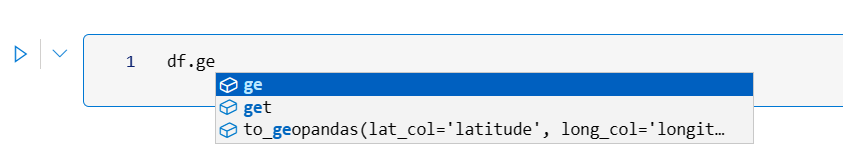

# Semantic Functions

Semantic functions are a productivity tool for data scientists and data engineers to discover relevant functions based on the data they're working.

[!INCLUDE [preview-note](../includes/preview-note.md)]

[FabricDataFrames](TODO link) dynamically expose semantic functions based on logic defined by each function.
For example, the `is_holiday` function is listed in the autocomplete when working with a datetime column and a country column.
Each semantic function can use data types, metadata such as PowerBI data categories and the data itself to determine if it is applicable to the current FabricDataFrame or FabricSeries.

Semantic functions are automatically discovered when annotated with the `@semantic_function` decorator.

In more technical terms, semantic functions are similar to [C# extension methods](https://learn.microsoft.com/en-us/dotnet/csharp/programming-guide/classes-and-structs/extension-methods) applied to the popular dataframe concept.

## How to use Semantic Functions

Semantic functions are available in the autocomplete when working with a FabricDataFrame or FabricSeries (use ctrl-space to trigger autocomplete).



In this example the metadata is manually specified, but it is autopopulated when reading data from PowerBI dataset.

```Python
from sempy.fabric import FabricDataFrame

df = FabricDataFrame(
    {"country": ["US", "AT"],
        "lat": [40.7128, 47.8095],
        "long": [-74.0060, 13.0550]},
    column_metadata={"lat": {"data_category": "Latitude"}, "long": {"data_category": "Longitude"}},
)

df_geo = df.to_geopandas(lat_col="lat", long_col="long")
```

Note that semantic functions might have additional dependencies that need to be installed. For example the `to_geopandas` function requires the `geopandas` package to be installed.

## Built-in Semantic Functions

We provide a set of built-in semantic functions that are available out of the box. A few examples are

- `is_holiday(...)` - returns true if the date is a holiday in the given country using the [holidays](https://pypi.org/project/holidays/) python package.
- `to_geopandas(...)` - converts a FabricDataFrame to a [GeoPandas](https://geopandas.org/en/stable/) dataframe.
- `parse_phonenumber(...)` - parses a phone number into its components using the [phonenumbers](https://pypi.org/project/phonenumbers/) python package.
- `validators` - a set of validators for common data types such as email, credit card numbers, etc. using the [validators](https://pypi.org/project/validators/) python package.

## How to define your own Custom Semantic Functions

Semantic functions are built for extensibility. You can define your own semantic functions within your notebook or as a separate python module.
If used outside of a notebook, the semantic function needs to be declared within the `sempy.functions` module.

This sample shows how to define a semantic function that returns true if the city is a capital of the country. Note that the `col_country` and `col_city` parameters are annotated with `PowerBICountryMatcher` and `PowerBICityMatcher` respectively. This allows the semantic function to be automatically discovered when working with a FabricDataFrame that has the corresponding metadata.

One call also supply standard data types such as `str`, `int`, `float` and `datetime` to define required input columns.

The type annotation of the first parameter are used to distinguish it's applicability between FabricDataFrame and FabricSeries. In this case, the function is applicable to FabricDataFrame.

```Python
from sempy.fabric import FabricDataFrame, PowerBICountryMatcher, PowerBICityMatcher
from sempy.functions import semantic_function, semantic_paramters

@semantic_function("is_capital")
@semantic_parameters(col_country=PowerBICountryMatcher, col_city=PowerBICityMatcher)
def _is_captial(df: FabricDataFrame, col_country: str, col_city: str) -> FabricSeries:
    """Returns true if the city is a capital of the country"""
    capitals = {
        "US": ["Washington"],
        "AT": ["Vienna"],
        # ...
    }

    return df[[col_country, col_city]] \
        .apply(lambda row: row[1] in capitals[row[0]], axis=1)
```


## Next steps
Learn more about how to connect to PowerBI and semantic propagation

- [How to connect to Power BI datasets](semantic-link-connect-powerbi.md)
- [How does semantic propagation work](semantic-link-propagate-semantic.md)