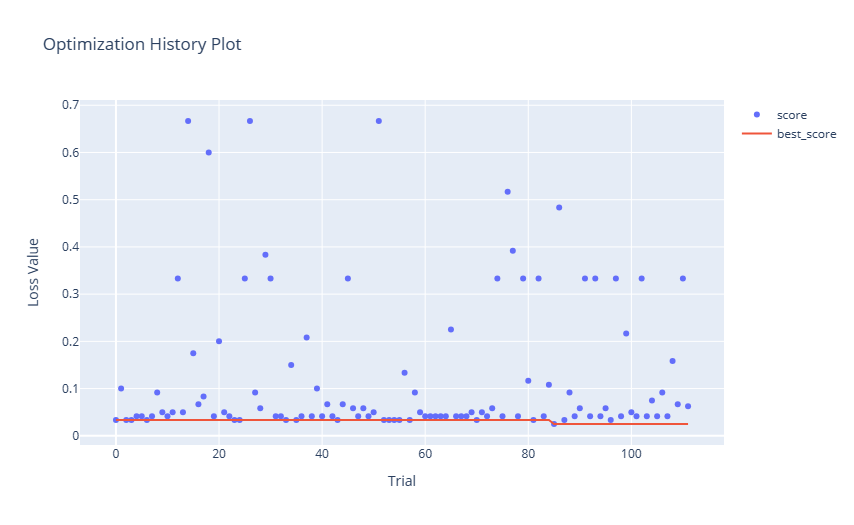
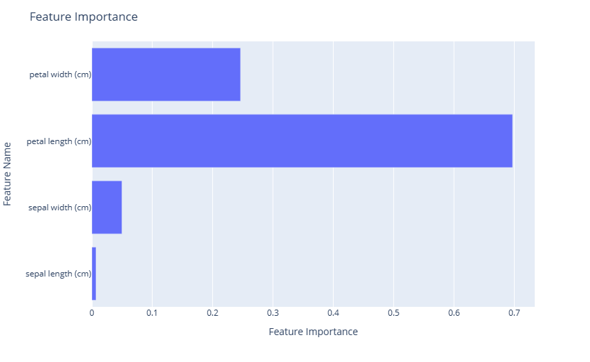
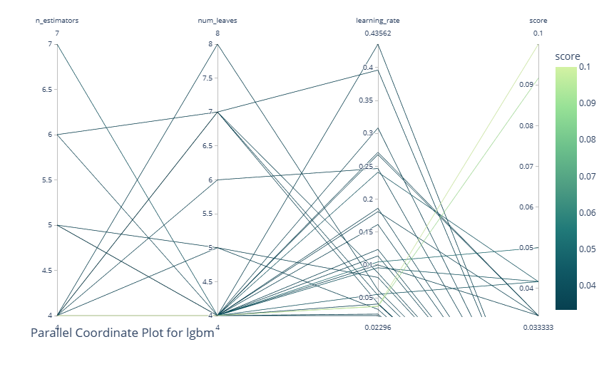
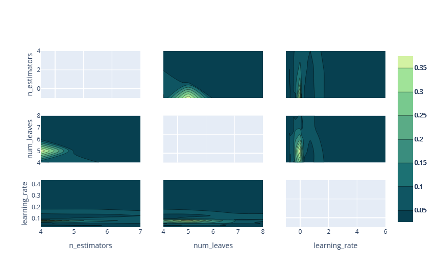
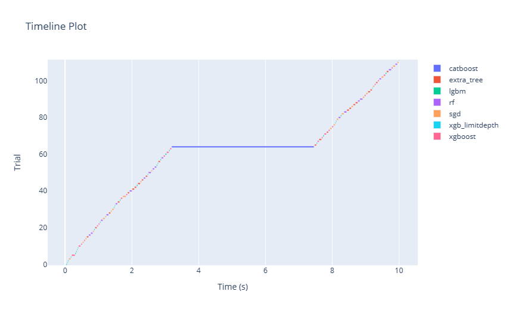
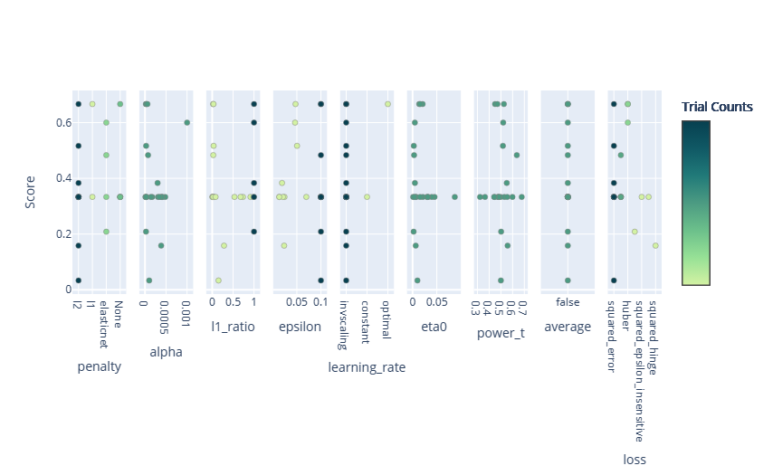
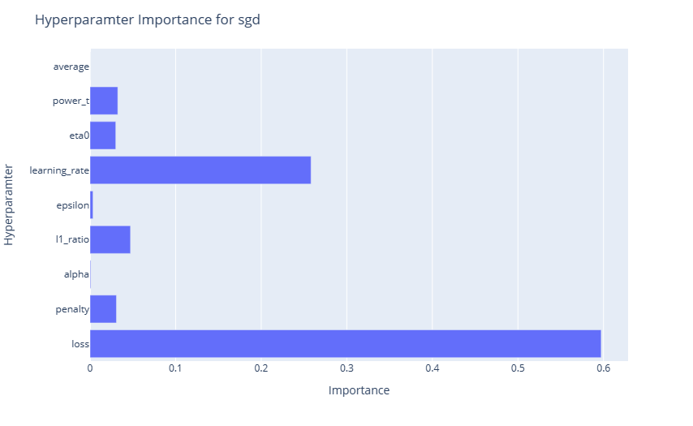

# Training visualizations (preview)

A hyperparameter trial or AutoML trial searches for the optimal parameters for a machine learning model. Each trial consists of multiple runs, where each run evaluates a specific parameter combination. Users can monitor these runs using ML experiment items in Fabric.

The ```flaml.visualization``` module offers functions to plot and compare the runs in FLAML. Users can use Plotly to interact with their AutoML experiment plots. To use these functions, users need to input their optimized ```flaml.AutoML``` or ```flaml.tune.tune.ExperimentAnalysis``` object.

This article teaches you how to use the ```flaml.visualization``` module to analyze and explore your AutoML trial results. You can follow the same steps for your hyperparameter trial as well.

[!INCLUDE [feature-preview](../includes/feature-preview-note.md)]

## Create an AutoML trial

AutoML offers a suite of automated processes that can identify the best machine learning pipeline for your dataset, making the entire modeling process more straightforward and often more accurate. In essence, it saves you the trouble of hand-tuning different models and hyperparameters.

In the code cell below, we will:

   1. Load the Iris dataset.
   1. Split the data into training and test sets.
   1. Initiate an AutoML trial to fit our training data.
   1. Explore the results of our AutoML trial with the visualizations from ```flaml.visualization```.

```python
from sklearn.datasets import load_iris
from sklearn.model_selection import train_test_split
from flaml import AutoML

# Load the Iris data and split it into train and test sets
x, y = load_iris(return_X_y=True, as_frame=True)
x_train, x_test, y_train, y_test = train_test_split(x, y, test_size=0.2, random_state=7654321)

# Create an AutoML instance and set the parameters
automl = AutoML()
automl_settings = {
    "time_budget": 10, # Time limit in seconds
    "task": "classification", # Type of machine learning task
    "log_file_name": "aml_iris.log", # Name of the log file
    "metric": "accuracy", # Evaluation metric
    "log_type": "all", # Level of logging
}
# Fit the AutoML instance on the training data
automl.fit(X_train=x_train, y_train=y_train, **automl_settings)

```

## Visualize the experiment results

Once you run an AutoML trial, you need to visualize the outcomes to analyze how well the models performed and how they behaved. In this part of our documentation, we show you how to use the built-in utilities in the FLAML library for this purpose.

### Import visualization module

To access these visualization utilities, we run the following import command:

```python
import flaml.visualization as fviz

```

### Optimization history

An optimization history plot typically has the number of trials/iterations on the x-axis and a performance metric (like accuracy, RMSE, etc.) on the y-axis. As the number of trials increases, you would see a line or scatter plot indicating the performance of each trial.

```python
fig = fviz.plot_optimization_history(automl)
# or
fig = fviz.plot(automl, "optimization_history")
fig.show()

```

Here is the resulting plot:

[](./media/model-training/optimization-history.png#light-box)

### Feature importance

A feature importance plot is a powerful visualization tool that allows you to understand the significance of different input features in determining the predictions of a model.

```python
fig = fviz.plot_feature_importance(automl)
# or
fig = fviz.plot(automl, "feature_importance")
fig.show()
```
Here is the resulting plot:

[](./media/model-training/feature-importance.png#light-box)

### Parallel coordinate plot

A parallel coordinate plot is a visualization tool that represents multi-dimensional data by drawing multiple vertical lines (axes) corresponding to variables or hyperparameters, with data points plotted as connected lines across these axes. In the context of an AutoML or tuning experiment, it's instrumental in visualizing and analyzing the performance of different hyperparameter combinations. By tracing the paths of high-performing configurations, one can discern patterns or trends in hyperparameter choices and their interactions. This plot aids in understanding which combinations lead to optimal performance, pinpointing potential areas for further exploration, and identifying any trade-offs between different hyperparameters.

This utility takes the following other arguments:

* ```learner```: Specify the learner you intend to study in the experiment. This parameter is only applicable for AutoML experiment results. By leaving this blank, the system chooses the best learner in the whole experiment.

* ```params```: A list to specify which hyperparameter to display. By leaving this blank, the system displays all the available hyperparameters.

```python
fig = fviz.plot_parallel_coordinate(automl, learner="lgbm", params=["n_estimators", "num_leaves", "learning_rate"])
# or
fig = fviz.plot(automl, "parallel_coordinate", learner="lgbm", params=["n_estimators", "num_leaves", "learning_rate"])
fig.show()
```

Here is the resulting plot:

[](./media/model-training/parallel-coordinate-plot.png#light-box)

### Contour plot

A contour plot visualizes three-dimensional data in two dimensions, where the x and y axes represent two hyperparameters, and the contour lines or filled contours depict levels of a performance metric (for example, accuracy or loss). In the context of an AutoML or tuning experiment, a contour plot is beneficial for understanding the relationship between two hyperparameters and their combined effect on model performance.

By examining the density and positioning of the contour lines, one can identify regions of hyperparameter space where performance is optimized, ascertain potential trade-offs between hyperparameters, and gain insights into their interactions. This visualization helps refine the search space and tuning process.

This utility also takes the following arguments:

* ```learner```: Specify the learner you intend to study in the experiment. This parameter is only applicable for AutoML experiment results. By leaving this blank, the system chooses the best learner in the whole experiment.

* ```params```: A list to specify which hyperparameter to display. By leaving this blank, the system displays all the available hyperparameters.

```python
fig = fviz.plot_contour(automl, learner="lgbm", params=["n_estimators", "num_leaves", "learning_rate"])
# or
fig = fviz.plot(automl, "contour", learner="lgbm", params=["n_estimators", "num_leaves", "learning_rate"])
fig.show()

```

Here is the resulting plot:

[](./media/model-training/contour-plot.png#light-box)

### Empirical  distribution function

An empirical distribution function (EDF) plot, often visualized as a step function, represents the cumulative probability of data points being less than or equal to a particular value. Within an AutoML or tuning experiment, an EDF plot can be employed to visualize the distribution of model performances across different hyperparameter configurations.

By observing the steepness or flatness of the curve at various points, one can understand the concentration of good or poor model performances, respectively. This visualization offers insights into the overall efficacy of the tuning process, highlighting whether most of the attempted configurations are yielding satisfactory results or if only a few configurations stand out.

>[!NOTE]
> For AutoML experiments, multiple models will be applied during training. The trials of each learner are represented as an optimization series.
> For hyperparameter tuning experiments, there will be only a single learner that is evaluated. However, you can provide additional tuning experiments to see the trends across each learner.
>

```python
fig = fviz.plot_edf(automl)
# or
fig = fviz.plot(automl, "edf")
fig.show()
```

Here is the resulting plot:

[](./media/model-training/edf-plot.png#light-box)

### Timeline plot

A timeline plot, often represented as a Gantt chart or a sequence of bars, visualizes the start, duration, and completion of tasks over time. In the context of an AutoML or tuning experiment, a timeline plot can showcase the progression of various model evaluations and their respective durations, plotted against time. By observing this plot, users can grasp the efficiency of the search process, identify any potential bottlenecks or idle periods, and understand the temporal dynamics of different hyperparameter evaluations.

```python
fig = fviz.plot_timeline(automl)
# or
fig = fviz.plot(automl, "timeline")
fig.show()
```

Here is the resulting plot:

[](./media/model-training/timeline-plot.png#light-box)

### Slice plot

Plot the parameter relationship as slice plot in a study.

This utility also takes the following arguments:

* ```learner```: Specify the learner you intend to study in the experiment. This parameter is only applicable for AutoML experiment results. By leaving this blank, the system chooses the best learner in the whole experiment.

* ```params```: A list to specify which hyperparameter to display. By leaving this blank, the system displays all the available hyperparameters.

```python
fig = fviz.plot_slice(automl, learner="sgd")
# or
fig = fviz.plot(automl, "slice", learner="sgd")
fig.show()
```

Here is the resulting plot:

[](./media/model-training/slice-plot.png#light-box)

### Hyperparameter importance

A hyperparameter importance plot visually ranks hyperparameters based on their influence on model performance in an AutoML or tuning experiment. Displayed typically as a bar chart, it quantifies the impact of each hyperparameter on the target metric. By examining this plot, practitioners can discern which hyperparameters are pivotal in determining model outcomes and which ones have minimal effect.

This utility also takes the following arguments:

* ```learner```: Specify the learner you intend to study in the experiment. This parameter is only applicable for AutoML experiment results. By leaving this blank, the system chooses the best learner in the whole experiment.

* ```params```: A list to specify which hyperparameter to display. By leaving this blank, the system displays all the available hyperparameters.

```python
fig = fviz.plot_param_importance(automl, learner="sgd")
# or
fig = fviz.plot(automl, "param_importance", learner="sgd")
fig.show()
```

Here is the resulting plot:

[](./media/model-training/hyperparameter-importance-plot.png#light-box)

## Next steps

* [Tune a SynapseML Spark LightGBM model](../data-science/how-to-tune-lightgbm-flaml.md)
