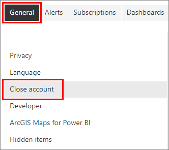
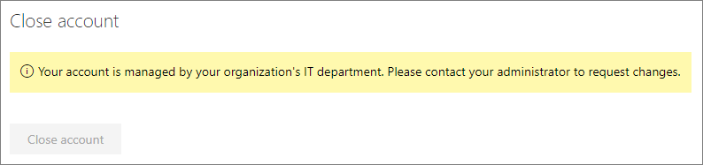

# Close your account, cancel your subscription, end your trial

You always have the option to close your account, cancel your subscription, or end your trial. Each of these actions has a different set of procedures and considerations. 

#### [Fabric](#tab/fabric)

## Fabric: close, cancel, end

With Microsoft Fabric, you can end a Fabric trial, cancel a capacity subscription, and close a Fabric account. 

### End a Fabric trial

The Fabric trial lasts 60 days. [End a Fabric trial](../get-started/fabric-trial.md#end-a-fabric-trial) explains what happens when a trial ends, expires, or is canceled. Use this article to find helpful information on how to save your data whether you upgrade or not.  

### Cancel a capacity subscription

Cancel a Fabric subscription in the Microsoft 365 admin portal. If you're within your grace period, use **Cancel subscription.** If you're outside the grace period, turn off recurring billing. See [Cancel your subscription in the Microsoft 365 admin center.](/microsoft-365/commerce/subscriptions/cancel-your-subscription)

### Disable Fabric

Certain administrators can turn off Fabric for an entire organization or for a specific capacity. See [Can I disable Microsoft Fabric?](../admin/fabric-switch.md#can-i-disable-microsoft-fabric)

### Delete a Fabric capacity and Fabric trial capacity

The Capacity admin can delete Fabric capacities using the Fabric admin portal. Fabric items in workspaces assigned to the capacity become unusable unless the workspaces are assigned to a different capacity within seven days. To learn more, see [Delete a capacity](../admin/capacity-settings.md#delete-a-capacity) and 
[Fabric capacity deletion.](../admin/service-admin-portal-capacity-settings.md#fabric-capacity-deletion)

### Close your Fabric account

Administrators can use the Microsoft 365 admin portal to remove a user's Fabric (Free) license. The steps are the same as [Close your Power BI account.](#close-your-power-bi-account)

#### [Power BI](#tab/powerbi)

## Power BI service: close, cancel, end

With the Power BI service, you can end a trial of a paid license, cancel a subscription, or close your account. 

### End a trial of Power BI Pro or PPU (Premium Per User)

To opt out of a trial, select **Cancel trial** from the **Me** icon.

:::image type="content" source="media/fabric-close-end-cancel/power-bi-cancel-trials-new.png" alt-text="Screenshot of the Account drop down showing the Cancel trial option.":::

To cancel a free trial for your organization, [turn off recurring billing](/microsoft-365/commerce/subscriptions/renew-your-subscription). You must be a Global or Billing administrator to manage billing. 

### Cancel your Power BI subscription

[Cancel your Power BI subscription](/microsoft-365/commerce/subscriptions/cancel-your-subscription) by turning off recurring billing in the Microsoft 365 admin center. The subscription remains active until it expires. Only the Global or someone with Billing permissions can cancel the subscription. Remember to ask users to save their data. 

### Manage an expired Power BI license

When a paid license passes its expiration date, you have a grace period for repurchasing the license. To learn more about expired licenses, see [Power BI license expiration.](/power-bi/enterprise/service-admin-licensing-organization#power-bi-license-expiration)

### Close your Power BI account

If you don't want to use Power BI any longer, close your Power BI account. After you close your account, you can't sign in to Power BI. Also, as it states in the data retention policy in the [Power BI Service Agreement](https://azure.microsoft.com/support/legal/subscription-agreement/), Power BI deletes any customer data you uploaded or created.

If you signed up for Power BI as an individual, you can close your account from the **Settings** screen.

1. In Power BI, select the gear icon in the upper right, then select **Settings**.

1. On the **General** tab, select **Close Account**.

    

1. Select a reason for closing the account. You can also provide further information. Then select **Close account**.

1. Confirm that you want to close your account.

    You should see a confirmation that Power BI closed your account. You can reopen your account from here if necessary.

If your organization signed you up for Power BI, contact your admin. Ask them to unassign the license from your account.

---