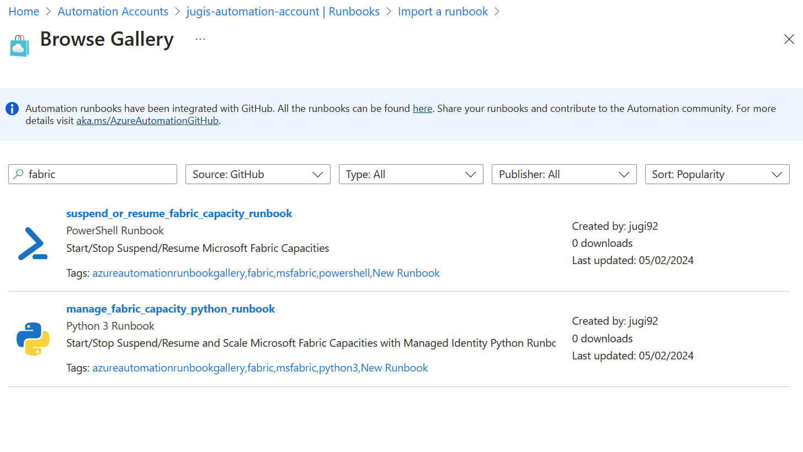

# Pause and resume your capacity

Microsoft Fabric lets you pause and resume your capacity. When your capacity isn't operational, you can pause it to enable cost savings for your organization. Later, when you want to resume work on your capacity, you can reactivate it.

When you pause your capacity, the remaining [cumulative overages and smoothed operations](../enterprise/throttling.md#balance-between-performance-and-reliability) on your capacity are summed, and added to your Azure bill. You can [monitor a paused capacity](monitor-paused-capacity.md) using the [Microsoft Fabric Capacity Metrics app](metrics-app.md).  

> [!IMPORTANT]
> Pausing a capacity can prevent Microsoft Fabric content from being available. Before you pause your capacity, make sure the capacity is not being used.

## Prerequisites

To pause your capacity, you need:

* An [F SKU capacity](buy-subscription.md#azure-skus)

* To be a [Fabric administrator](../admin/microsoft-fabric-admin.md#power-platform-and-fabric-admin-roles)

## Pause your capacity

To pause your capacity:

1. Sign into the [Azure portal](https://portal.azure.com/).

2. Select the **Microsoft Fabric** service to see your capacities. You can search for *Microsoft Fabric* in the search menu.

3. Select the capacity you want to pause.

4. Select **Pause**.

5. Select **Yes** to confirm you want to pause the capacity.

## Resume your capacity

Restart usage by resuming your capacity. Resuming your capacity also resumes billing. Content assigned to this capacity becomes available once the capacity is resumed.

1. Sign into the [Azure portal](https://portal.azure.com/).

2. Select the **Microsoft Fabric** service to see your capacities. You can search for *Microsoft Fabric* in the search menu.

3. Select the capacity you want to resume.

4. Select **Resume**.

5. Select **Yes** to confirm you want to resume the capacity.

## Schedule your Pause, Resume or Scale Operation via Azure Runbook

You can schedule scaling of your Pay as You Go Capacities via Azure Runbook.
You can find a description on how to use Runbooks in Automation Accounts from the Runbook gallery here: https://learn.microsoft.com/en-gb/azure/automation/automation-runbook-gallery#import-a-module-from-the-modules-gallery-in-the-azure-portal
In the gallery your can search for "Fabric" and choose the Notebook you want to schedule:

## Related content

* [Scale your capacity](scale-capacity.md)

* [Understand the metrics app compute page](metrics-app-compute-page.md)
