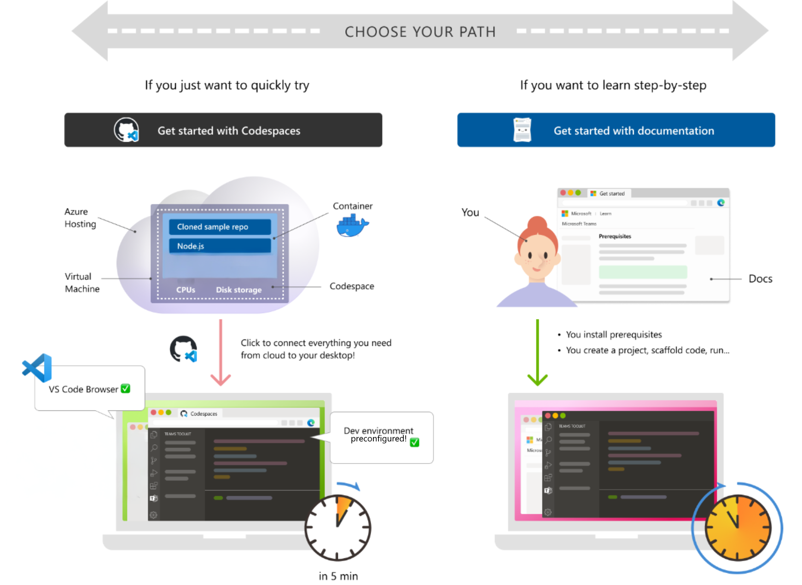

# Build your workload

Use this guide to get started building a Microsoft Fabric workload with the Extensibility Toolkit. You set up your environment, run the Starter-Kit in GitHub Codespaces or locally, and learn the basics you need to build and publish.

## What you build

You run the [Starter-Kit](https://aka.ms/fabric-extensibility-starter-kit) inside Fabric, explore its manifest and host API usage, make a small UI change, and understand how items your workload creates behave like native Fabric artifacts.

## Prerequisites

- Access to a Fabric tenant and a workspace where you can create items
- A GitHub account (required for Codespaces)
- If developing locally: a recent Node.js LTS and a package manager (see the README for exact tooling)
- Access to create an [Microsoft Entra Application](https://entra.microsoft.com/)
- Optional: an Azure subscription if you plan to host your web app in Azure

> [!TIP]
> Local development is supported natively on Windows, macOS, and Linux. Before running setup scripts or starting the dev server, review and satisfy the prerequisites in the [Starter-Kit](https://aka.ms/fabric-extensibility-starter-kit).

> [!NOTE]
> You don’t need to deploy anything to your tenant to try the [Starter-Kit](https://aka.ms/fabric-extensibility-starter-kit). Use the DevGateway during development to emulate the Fabric host.

## Choose your path

To get started quickly, pick one of the following options:

### Option 1: Start in GitHub Codespaces

1. Open the [Starter-Kit Repository](https://aka.ms/fabric-extensibility-starter-kit).
2. Use GitHub Codespaces to create a new codespace for your fork or branch.
3. Start the [DevServer](./tools-register-local-web-server.md) and [DevGateway](./tools-register-local-workload.md) per the instructions in the repository.
4. Make sure Fabric development mode is enabled
5. Open your Fabric and navigate to the workload hub where you can now see the Hello World Item.

### Option 2: Clone and run locally

1. Open the [Starter-Kit Repository](https://aka.ms/fabric-extensibility-starter-kit).
2. Fork the repository and clone it to your machine.
3. Install dependencies and
4. Start the [DevServer](./tools-register-local-web-server.md) and [DevGateway](./tools-register-local-workload.md) per the instructions in the repository.
5. Make sure Fabric development mode is enabled
6. Open your Fabric and navigate to the workload hub where you can now see the Hello World Item.

## Next steps

- Learn the [architecture](architecture.md) and how the host, your app, and Fabric services interact
- Follow the [implementation guide](implementation-guide.md) to build your own workload
- Read the [Manifest Overview](manifest-overview.md) for schema and best practices
- Develop with the [DevGateway](tools-register-local-workload.md)
- [Publish your workload](publish-workload-flow.md) when you’re ready to share it broadly
