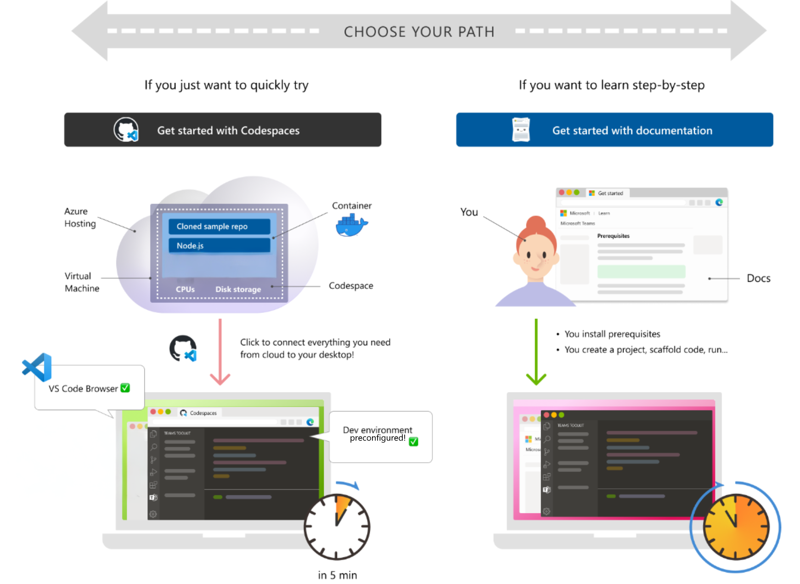

# Tutorial: Getting Started with Fabric Extensibility Toolkit

Use this guide to get started building a Microsoft Fabric workload with the Extensibility Toolkit. You set up your environment, run the Starter-Kit in GitHub Codespaces or locally, and learn the basics you need to build and publish.

## What you build

You run the [Starter-Kit](https://aka.ms/fabric-extensibility-starter-kit) inside Fabric, explore its manifest and host API usage, make a small UI change, and understand how items your workload creates behave like native Fabric artifacts.

## Prerequisites

- Access to a Fabric tenant and a workspace where you can create items
- A GitHub account (required for Codespaces)
- If developing locally: a recent Node.js LTS and a package manager (see the README for exact tooling)
- Access to create an [Microsoft Entra Application](https://entra.microsoft.com/)
- Optional: an Azure subscription if you plan to host your web app in Azure

> [!TIP]
> Local development is supported natively on Windows, macOS, and Linux. Before running setup scripts or starting the dev server, review and satisfy the prerequisites in the [Starter-Kit](https://aka.ms/fabric-extensibility-starter-kit).

> [!NOTE]
> You don't need to deploy anything to your tenant to try the [Starter-Kit](https://aka.ms/fabric-extensibility-starter-kit). Use the DevGateway during development to emulate the Fabric host.

> [!IMPORTANT]
> Ensure you have access to a Fabric workspace and your tenant allows developer features. You enable Fabric Developer Mode before testing.

## Choose your path

[](./media/getting-started/codespaces-vs-manual.png)

To get started quickly, pick one of the following options to access the code:

### Option 1: Start in GitHub Codespaces

1. Fork the [Starter-Kit Repository](https://aka.ms/fabric-extensibility-starter-kit) to your GitHub account.
2. Create a GitHub Codespace on your fork to get started with a cloud-based development environment.

For more information about GitHub Codespaces, see [GitHub Codespaces documentation](https://docs.github.com/en/codespaces).

### Option 2: Clone and run locally

1. Fork the [Starter-Kit Repository](https://aka.ms/fabric-extensibility-starter-kit) to your GitHub account.
2. Clone your fork to your local machine:

```pwsh
git clone https://github.com/<your-account>/fabric-extensibility-toolkit.git
cd fabric-extensibility-toolkit
```

3. Install the required prerequisites for local development:

**Required tools:**
- **Node.js LTS**: [Download Node.js](https://nodejs.org/en/download)
- **PowerShell 7** (pwsh on macOS/Linux): [Install PowerShell](/powershell/scripting/install/installing-powershell)
- **.NET SDK** (for macOS use the x64 build): [Download .NET](https://dotnet.microsoft.com/download)
- **VS Code** or similar editor: [Download VS Code](https://code.visualstudio.com/download)
- **Azure CLI** (used only for Microsoft Entra app creation): [Install Azure CLI](/cli/azure/install-azure-cli)

## AI-assisted development

This repository works well with AI pair-programming tools. Whether you develop locally or in GitHub Codespaces, you can use GitHub Copilot or other AI assistants to accelerate tasks like editing React components, update routes, or generate test scaffolding.

> [!TIP]
> The Starter-Kit repository is AI-enabled and includes GitHub Copilot instructions that guide you through adapting the Hello World item to your needs. Other AI tools (for example, Anthropic Claude) can follow the same guidance, but must be configured to read the repository's guidance files or docs.

- Use AI to draft item editor/view components and then adapt to the host API patterns used in the Starter-Kit.
- Ask AI to summarize the workload manifest and propose minimal permission sets.
- In Codespaces, Copilot is available in the browser or VS Code desktop; keep the dev server running to see changes instantly.

> [!TIP]
> If you're interested to see what others build open the [Extensibility Samples](https://aka.ms/fabric-extensibility-toolkit-samples) and deploy it to your environment. There you can find rich item types that help you get started.

## Best practices

- **Fork the repository**: Fork the [Starter-Kit](https://aka.ms/fabric-extensibility-starter-kit) repository and use your fork as the base of your project.
- **Keep in sync**: Keep your fork in sync with upstream to pick up improvements.
- **Maintain project structure consistency**: Preserve the Starter-Kit's project structure and organization patterns to ensure compatibility with future updates and maintain code clarity.
- **Regular Starter-Kit integration**: Regularly integrate code changes from the Starter-Kit into your project to benefit from bug fixes, new features, and security updates. Set up a process to review and merge upstream changes on a regular basis (monthly or quarterly).
- **Validate manifests early**: Validate your workload manifest early and follow least-privilege permissions.
- **Use dev containers**: Use a dev container or Codespaces for a consistent, disposable environment.
- **Use provided scripts**: Use the provided scripts (Setup, StartDevServer, StartDevGateway) to automate setup and daily workflow.


## Next steps

Once you have access to the code (either in Codespaces or locally), continue with the [Detailed Setup Guide](setup-guide.md) for step-by-step instructions on:

- Running the setup script
- Starting the development environment
- Enabling Fabric developer features
- Testing your first HelloWorld item
- Getting started with coding
- AI-assisted development tips
- Troubleshooting common issues

## Additional resources

- Learn the [architecture](architecture.md) and how the host, your app, and Fabric services interact
- Read the [Manifest Overview](manifest-overview.md) for schema and best practices
- Understand the [Workload manifest](manifest-workload.md) structure and configuration
- Develop with the [DevGateway](tools-register-local-workload.md) for local testing
- [Publish your workload](publishing-overview.md) when you're ready to share it broadly