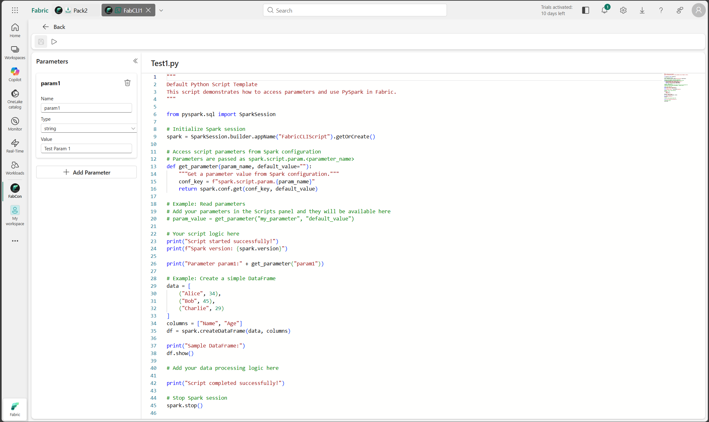

# Fabric CLI Item

The Fabric CLI Item provides an interactive terminal interface for executing Fabric CLI commands and Python scripts through Spark Livy sessions within Microsoft Fabric. It enables developers and data engineers to interact with Fabric resources directly from the browser with full command history and script management capabilities.

## Overview

The Fabric CLI Item enables users to:

* **Execute Fabric CLI commands** through an integrated terminal interface
* **Create and manage Python scripts** with parameter support
* **Run scripts as batch jobs** with Spark configuration
* **Manage Spark sessions** with automatic reuse and validation
* **Select lakehouse and environment** for command execution context
* **Track command history** with arrow key navigation

**Advanced Features** (optional):

* **Switch execution modes** to run native Python code or shell commands
* **Execute Python directly** in Spark sessions for data processing
* **Run shell commands** with subprocess support
* **Parameterized scripts** with type-safe parameter injection

## Reference

For detailed documentation, see the [Fabric CLI Item documentation on GitHub](https://github.com/microsoft/Microsoft-Fabric-tools-workload/tree/main/Workload/app/items/FabricCLIItem).
