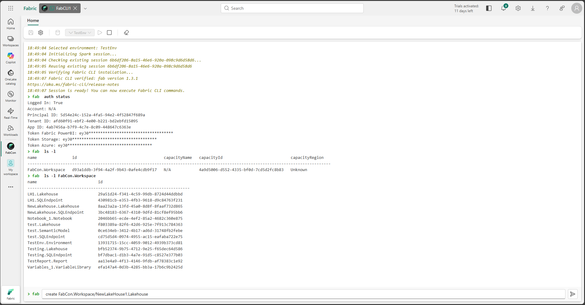

# Fabric CLI Item

The Fabric CLI Item sample demonstrates how to build a Fabric workload item that provides an interactive terminal interface for executing Fabric CLI commands. It enables developers and data engineers to interact with Fabric resources directly from the browser through Spark Livy sessions, with full command history and real-time output.

## Overview

The Fabric CLI Item showcases advanced capabilities of the Fabric Extensibility Toolkit:

* **Interactive Terminal Interface**: Provides a browser-based terminal experience for executing Fabric CLI commands.
* **Spark Livy Integration**: Executes commands through Spark Livy sessions within Microsoft Fabric.
* **Command History**: Maintains a complete history of executed commands for easy recall and reuse.
* **Real-Time Output**: Displays command output in real time as commands execute.
* **Session Management**: Manages Spark Livy session lifecycle, including creation, execution, and cleanup.
* **Resource Interaction**: Enables direct interaction with Fabric resources such as workspaces, lakehouses, and data pipelines.

## Reference

For detailed documentation, see the [Fabric CLI Item documentation on GitHub](https://github.com/microsoft/Microsoft-Fabric-tools-workload/tree/main/Workload/app/items/FabricCLIItem).
