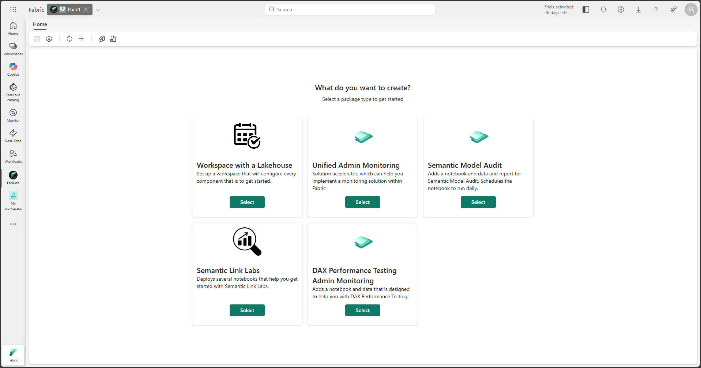

# Package Installer Item

The Package Installer sample item demonstrates how to build a Fabric workload item that manages the packaging and deployment of items. It allows users to define, configure, and execute deployments of various preconfigured Fabric items (like Notebooks, Lakehouses, etc.), define schedules, add data or create shortcuts. The deployment can happen into a newly created workspace or a folder within an existing workspace and is configurable. 

## Overview

The Package Installer item showcases advanced capabilities of the Fabric Extensibility Toolkit:

* **Package Management**: Defines packages containing multiple Fabric items and data assets.
* **Package Orchestration**: Manages the packaging process of existing items.
* **Deployment Orchestration**: Manages the deployment process, including creating workspaces, folders, and items.
* **Wizard-Based Interface**: Provides a user-friendly wizard for configuring and initiating deployments.
* **Status Tracking**: Tracks the progress and status of deployments.
* **Post-Deployment Actions**: Supports executing jobs (like Spark jobs) after a successful deployment.

## Reference

For detailed documentation, see the [Package Installer Item documentation on GitHub](https://github.com/microsoft/Microsoft-Fabric-tools-workload/tree/main/Workload/app/items/PackageInstallerItem).
